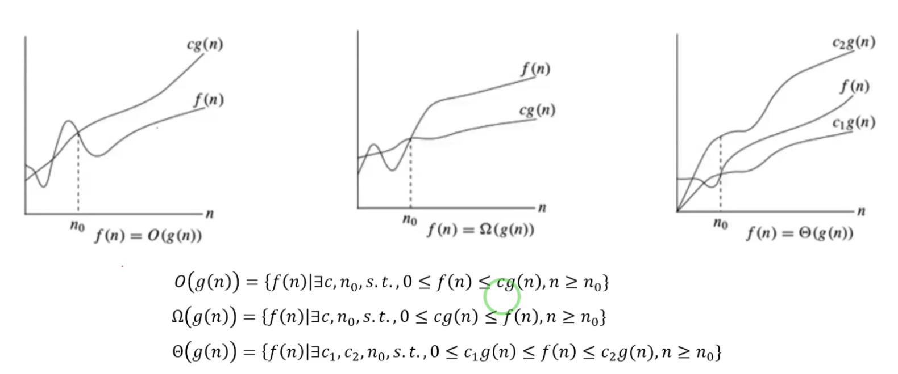

### 1、简介
 算法复杂度，我们在机器学习中一般分为3类:
 类型1：迭代算法复杂度：(比如从A中找出一个x)
   
 我们发现其算法复杂度是O(n),n是代表A的大小。
 在平时中我们主要考虑的是时间复杂度跟空间复杂度，当然时间复杂度主要是根据输入的长度大小来计算的时间效率。
 空间复杂度：指代程序运行过程中，所占用的内存。
 时间复杂度跟空间复杂度是依赖于很多因素，比如：硬件、操作系统、处理器。
 
###### 算法复杂度 的记法
   
 大O经常用来量化算法时间的复杂度，算法的执行时间很多时候跟算法输入的序列长度成关系。
 比如第一个图f(n)-执行时间是线性的跟我们的执行序列长度成线性关系。
 第一幅图：是一个上界表示。g(n)代表的是一个函数，比如:g(n)=n
 第二幅图：是一个下界表示。
 第三幅图：是一个中间的表示。
 
 注意：上面s.t->代表的是subject to(使得)
 但是我们在刷题的时候，一般都会只看到大O的表示，很少看到其他两种方式的表示。因为这个给出了
 我们算法执行的上界-最坏的情况。
 
