### 1、简介
 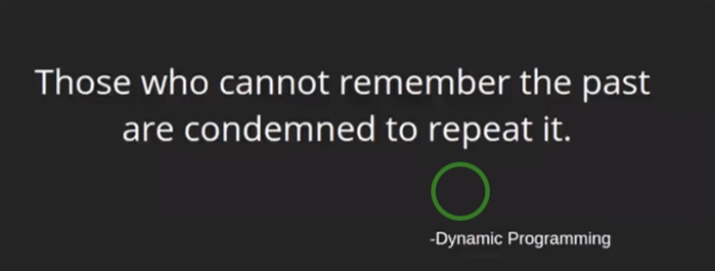  
 动态规划的理念：你如果不能记录过去的状态，你就只能将他重新做一遍。
 动态规划算法一般做法：我们如何去设计状态并且记录补充状态的结果。根据之前的状态得到新的状态的结果。
 动态规划解决的问题：动态规划就是将大的问题拆分成一系列重叠小的子问题。然后为越来越大的问题建立解决方案。
  
 动态规划问题只要能够找出其状态如何设计 那么其问题就解决掉了。
   

### 2、斐波拉契数列的
 比如我们计算斐波拉契数列的时候，我们计算f(6)的时候，我们需要先计算f(4)+f(5)；  
 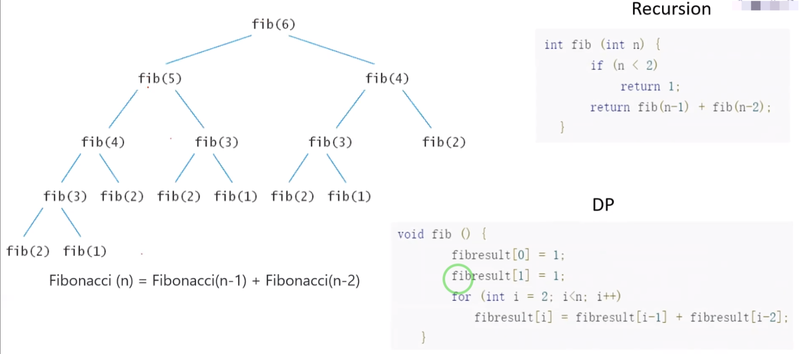
 
### 3、背包问题
 给出一批物品，其都有相关的重量。
 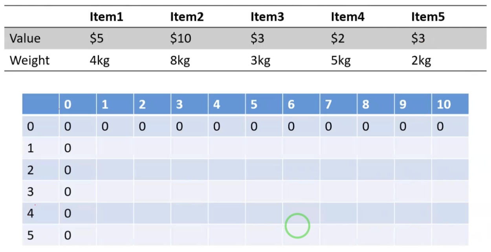  
 假如你现在有一个背包，背包的重量是10kg,如何在上面限定的情况下，你拿到的物品的价值最多。
 我们设计的时候，可以按照动态规划的下面的思路去做，我们设置其有5行，我们的背包的数量一共是10，我们当成10列。  
 里面每一个数据就是：横轴:6 纵轴:3--->代表的是:我们给出的重量是6的时候，前面的前3个物品。
 
 (6,1)->代表的是我的背包重量是6kg，我选择第一个物品是5$
 (6,2)->代表的是我背包重量是6kg,我可以选择1,2物品；但是同时装不下2件物品，所以是1物品，5$。
  我们为了得到(6,3)的结果，其实可以使用(6,2)的结果，然后做一些运算。
  最后得到如下结果:
  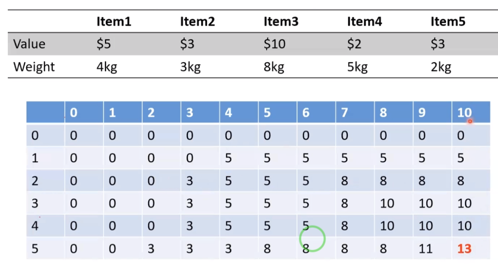 
  注意:上面(3,1)->代表的是我们现在有一个3kg的背包，然后我们只能看到第一个物品:item1,此时装不下，因为
  我们的(3,1)结果为0；
 
 
### 4、动态规划在机器学习中比较常见的应用
  动态规划在机器学习中比较常见的应用，计算两个字符串中最小的边距问题。
  最小编辑距离(MED):指代的是我们对一个字符串进行操作：删除、插入、修改等操作达到我们目标字符串的最小代价。
  比如:"ABC"<-->"BC"；我们只需要将我们的A给删除即可，所以就能得到其编剧距离是1；
  如下字符串的编辑距离：
   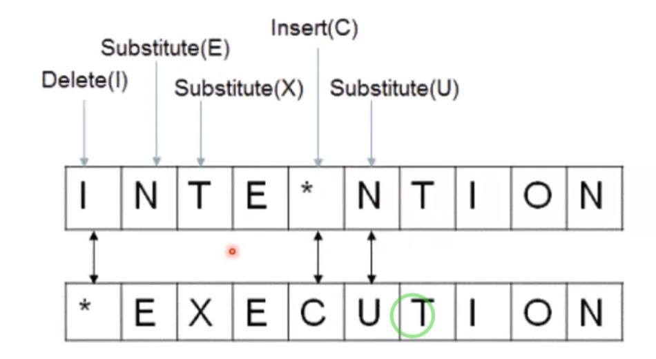 
   
  计算编辑距离有什么用呢？我们可以评价机器翻译、语音识别的正确性。
  
  我们知道最小编辑距离可以通过如下的式子计算。
  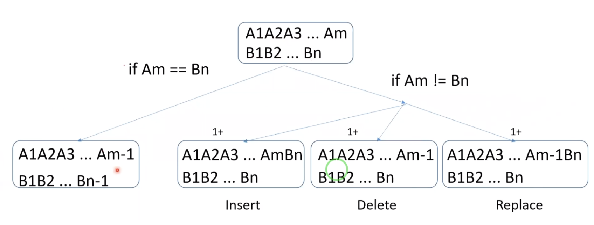 
  
  如果:Am == Bn;我们此时只需要计算A1A2A3...Am-1 跟 B1B2...Bn-1的最小编辑距离即可。
  如果：Am != Bn; 我们对A1A2...Am子序列做插入、删除、替换操作   然后再与B1B2...Bn计算即可。
  
   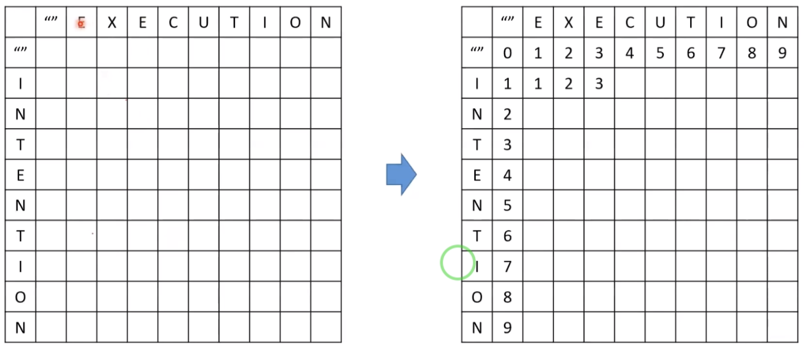 
   我们通过如上的操作：
   我们会记录上面的状态表格。
   计算前面的字符串到第二个字符串的编辑距离。 我们在前面补充一个空的字符串。
   比如:第一行,就是指代我们的空字符串跟我们的横向字符串的编辑距离。
   
   距离:比如:横轴:EXEC跟I的最小编辑距离，基于前面计算的I跟EXE的最小编辑距离为:3。  
   我们计算EXEC跟I的最小编辑距离：
   删除:EXEC删除C得到EXE，EXE跟I的最小编辑距离就是3，然后加上删除，就是4；
   插入:I跟EXE的最小编辑距离为:3,在我们再添加一个C，则相对应为4；
   
   所以我们计算最小编辑距离的时候，主要都是依据上一次的最小编辑距离，然后我们通过：插入、
   删除、替换操作将计算我们的最小编辑距离。 最后得到我们的最小编辑距离的表格为:
  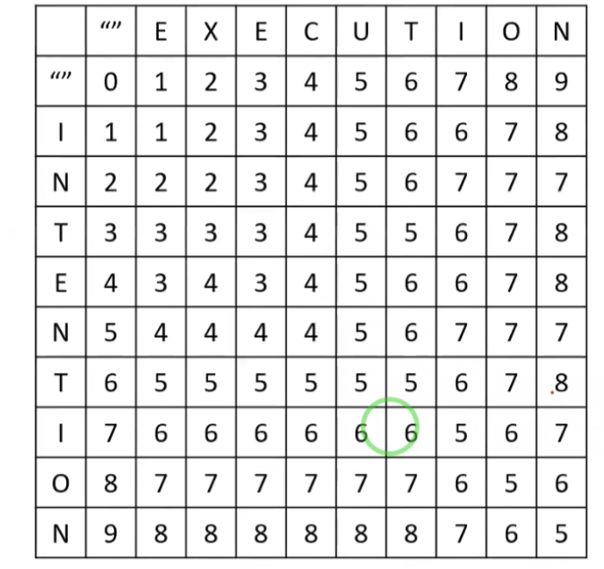 
  
  
### 5、Dynamic Time Warping(DTW)
  Dynamic Time Warping(DTW)-动态时间调整，这个算法需要解决的问题跟我们最小编辑距离需要解决的问题其实是一样的。
  这个算法用于视图比较两个序列的区别。
  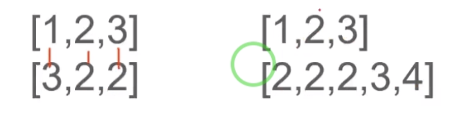 
  
  比如：我们比较两个相等序列的DTW的时候;
  [1,2,3]
  [3,2,2]
  我们只需要每一项比较即可:1+0+1=2
  但是针对于长度不相等的情况:
  [1,2,3]
  [2,2,2,3,4]
  这个时候有一个DTW的算法，帮我们把上面两个序列做一个对齐。然后计算这两个序列的距离即可。
  这个算法主要用在股票知识图里面：
  比如我们需要计算我们的趋势图跟我们的里面实线表示的耦合度如何？这个时候我们可以根据我们的DTW来计算。
  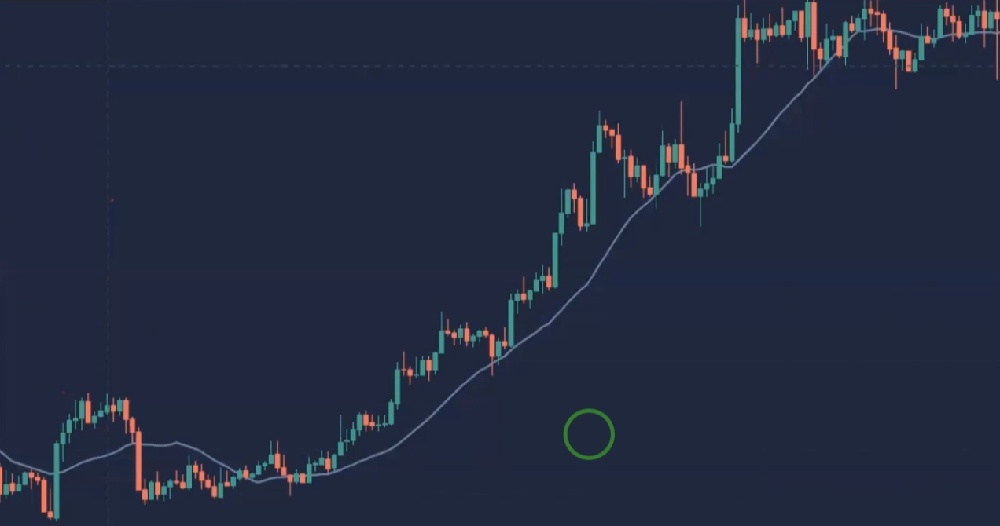  
  当然DTW主要应用于我们的语音领域。
  
  
  
  动态时间规整是测试两个时间相似性的一个算法，他们会把两个不等长的时间序列中间进行对齐关系。从而找出最好的对齐关系。
  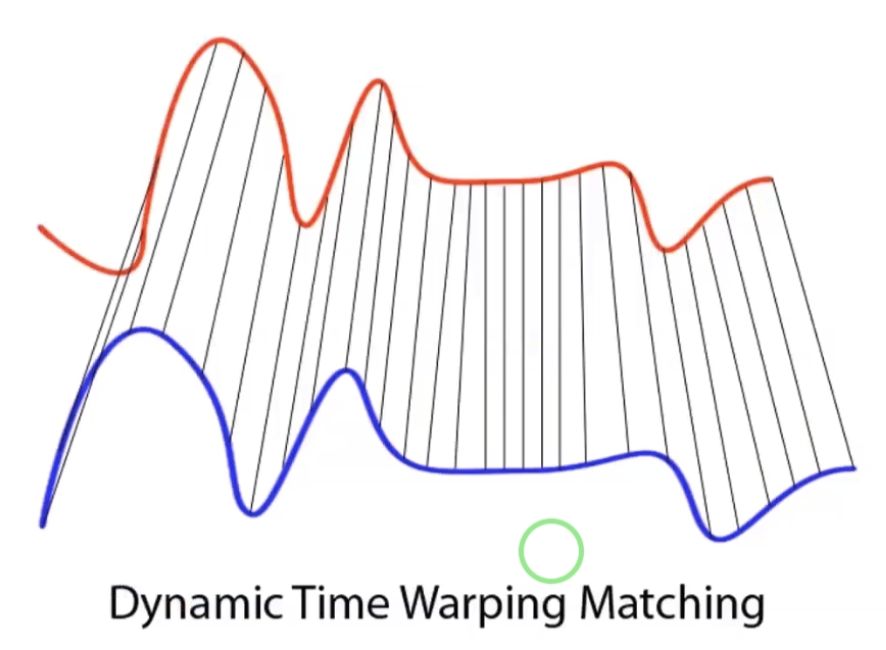  
  如上，假如我们有两组不同的数组，比如红色跟蓝色。现在我们需要匹配中间的蓝色跟红色数据是否是一样的？
  我们的DTW会给我我们的一个映射关系，这个映射关系就会把我们的蓝色对应的特征映射到我们的红色上面。当然这个映射也不是随便的映射，这个映射是存在一定的
 关系的。
 
   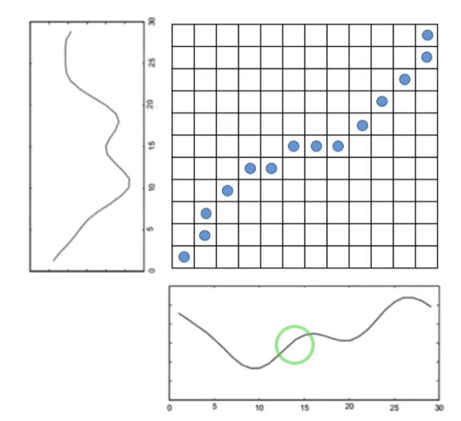  
   如上所示:比如我们需要根据上面的图示来计算下面2个图形的对齐关系。  我们需要构建一个nxm的矩阵，
   也就是我们需要构建一个我们的状态，比如上面：我们图标中的点就是我们设计出来的状态。
   其中某一个点代表的是：
   x->代表横轴的序列从0开始到x位置，y->代表纵轴的序列从0开始到y位置的最短相似距离。其中：
   x,y轴的开始点必须是对齐的。不然出现x=0跟y=100算对齐。
   其中需要考虑：边距条件、连续性、单调性。
   
  
  
  
  
  
   
  
  
   
  
  
  
  
  
  
  
  
  
  
  
  
  
  
  
  
  
  
  
  
  
  
  
  
  
  
  
  
  
  
  
