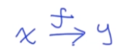
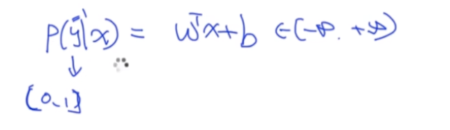
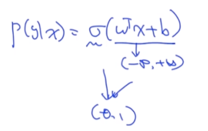
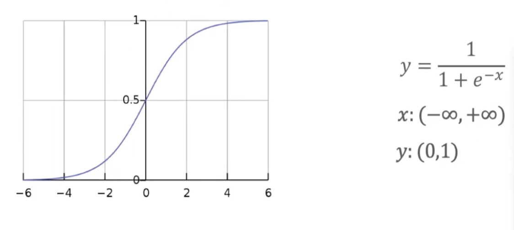
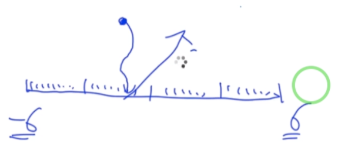

### 1. 简介
  我们主要讲解下我们常用的数据模型以及算法
  本节我们主要讲述以下章节内容。
     

### 2. 内容

#### 2.1 (Generative Model vs Discriminative Model)生成与判别模型 

###### 生成模型与判别模型的比较
  两个关键词:生成、判别。  
  生成模型：他用来生成数据。
  判别模型：用来做分类。  
  
  1、从字面上来看:
  生成模型：根据我们的data(数据) 来训练出一个模型，这个模型会根据我们输入的数据来生成新的数据(New Data)；这个模型反映了Data的分布。
  判别模型: 我们输入数据，然后根据我们的model(模型)来判断这个数据的问题。
  生成模型常见的有：Naive Bayesian、HMM、VAE、GAN。
  判别模型：逻辑回归，CRF。
   
  2、训练模型上：
  训练模型需要Object。
  生成模型是:Maxim P(x,y)-->计算的是x,y的相似度
  判别模型：Maxim P(y|x) --> 根据x判别y  
  
  3、公式上
  生成公式：是一个联合概率 可以写成:P(x,y)=P(x|y)*P(y)；其中我们主要看前面一项:P(x|y) 代表的是:y给定的情况下 x的概率。
          所以P(x|y) 会越来越接近 Data Distribution
  判别公式:  P(y|x)
  
  4、生成模型：P(x,y) = P(y|x)*P(x)
     其中P(y|x)代表的是一个判别模型，说明我们的生成模型也可以做判别模型。
     判别模型：P(y|x)
  
     
   
###### 举例  
   比如,我去识别猫和狗；假设给力50张猫的图片跟50张狗的图片。
   生成模型：
   因为根据P(x,y)=P(x|y)*P(y)是有条件概率的，我们首先收集50张猫的图片，然后我要学习成:
   P(x|y=猫)的分布--->在 y=猫 的情况下 的概率，也就是学习猫长得是如何的？
   
   学习狗的过程是:
   P(x|y=狗)的分布--->在 y=狗 的情况下的 概率，也就是狗的分布。
   
   判别的时候，假如来了一张图片，我们将其作为输入，判断其更像狗还是更像猫呢？
   
   生成模型；讲究的是每一个模型其概率分布。
   
   
   判别模型：假如我们需要判别猫和狗的时候，我们这个时候只需要简单区分猫跟狗的区别即可。  
   比如听声音：叫声等不一样，图像等。  
   
   
#### 2.2 (Logistic Regression And Maximum Likelihood)-逻辑回归
##### 逻辑回归
   逻辑回归是一个经典的判别模型；
   我们定义的是一个条件概率，
   我们需要做的是根据x找到y；即:  
   
   逻辑回归是一个判别模型，所以其可以用条件概率来表示:P(y|x)。
   逻辑回归如何定义呢？他是一个线性回归，所以我们可以使用线性回归的方式去定义。
   
    
   右边其定义域是在负无穷到正无穷，所以线性回归的值域也是负无穷到正无穷。左边由于是概率，所以其值是在[0,1]；
   发现左边跟右边不想等，所以上面的公式不成立。
   
   这个时候我们添加一个σ符号：如下就是一个比较完整的概率统计分布。
       

##### 逻辑函数(Logistic Function)  
   逻辑函数如下所示:
      
   
   其表现形式入右边图形所示：其定义域是（-oo,+oo) 值域是：(0,1)  
   左边图形:当x>6的时候，其概率是无限接近于1的，当x<-6的时候其概率是无限接近与0的。  
   
   注意：我们计算e(-x)比较麻烦，所以我们不能用这种直观的方式计算，我们需要换一种方式去计算
   比如:我们将[-6,6]分为100等份，然后计算出100等份中各个值对应的概率值，然后放我们来了
   一个新的x的时候，我们计算我们的x属于哪一个位置。
     
   
   P12分钟
   
      
   
   
   
   
   
   
   
   
   
   
   
   
   
   
   
   
   
   
   
