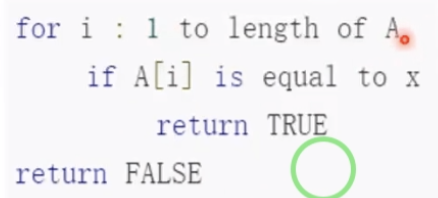
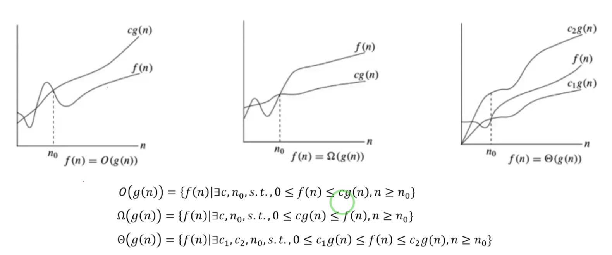
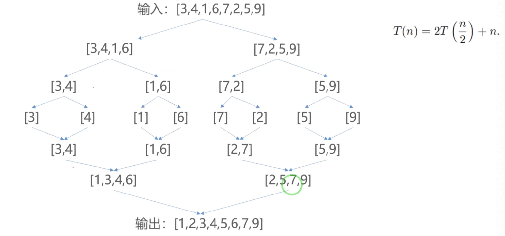
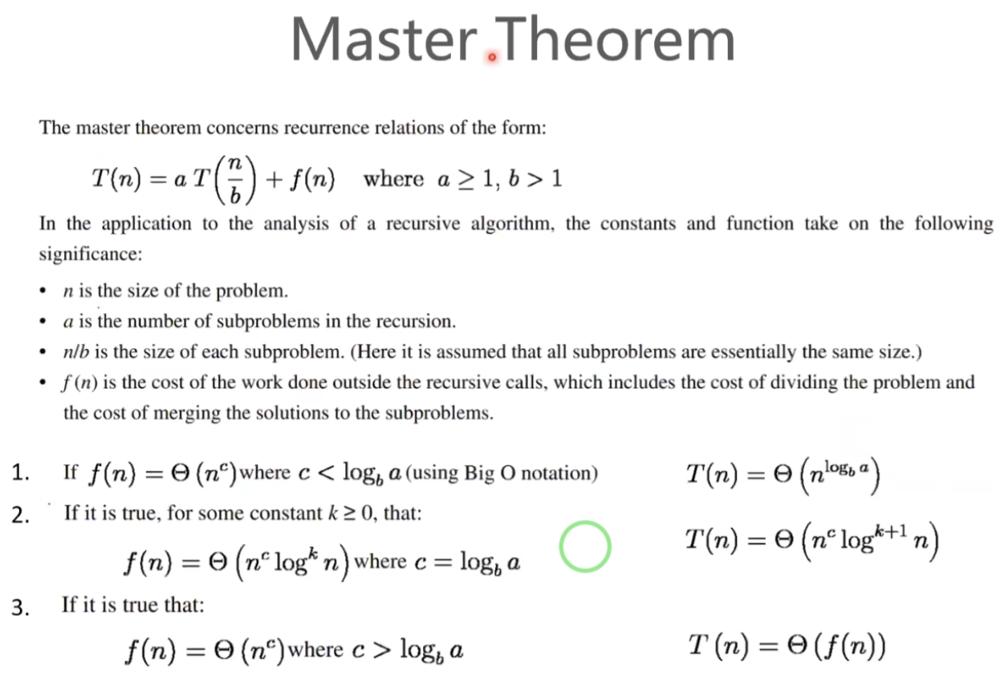
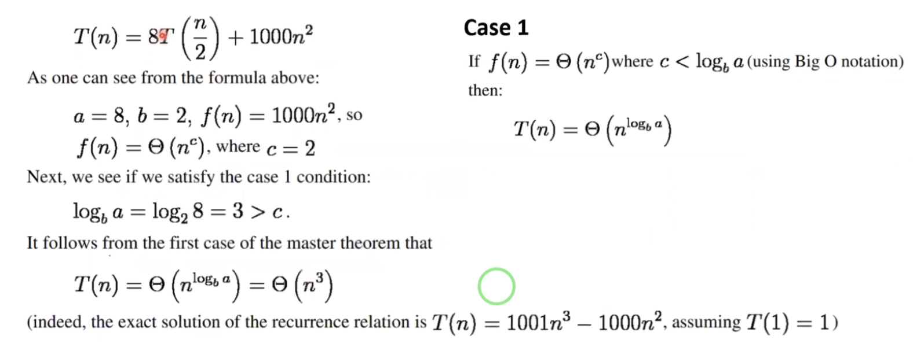
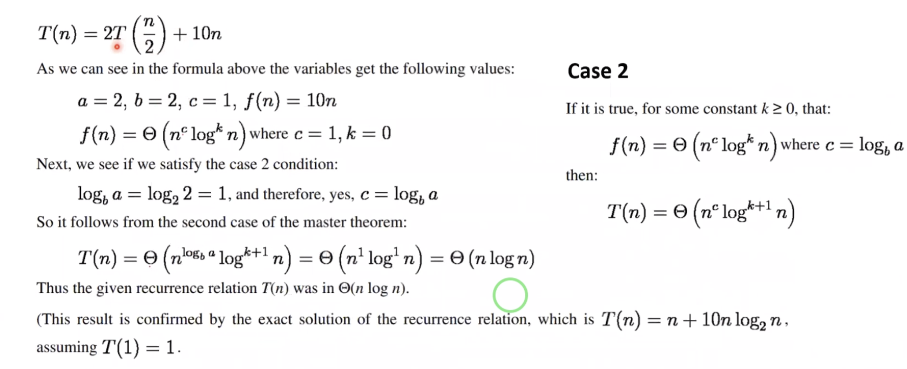
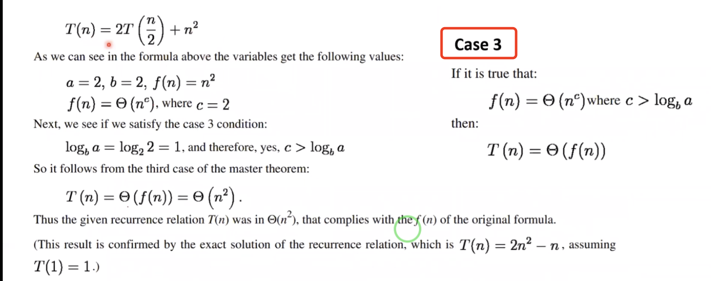
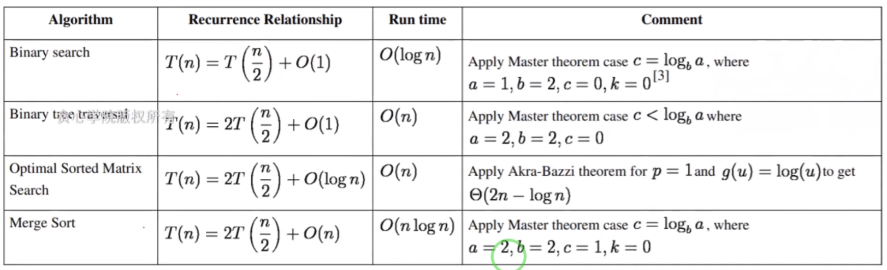
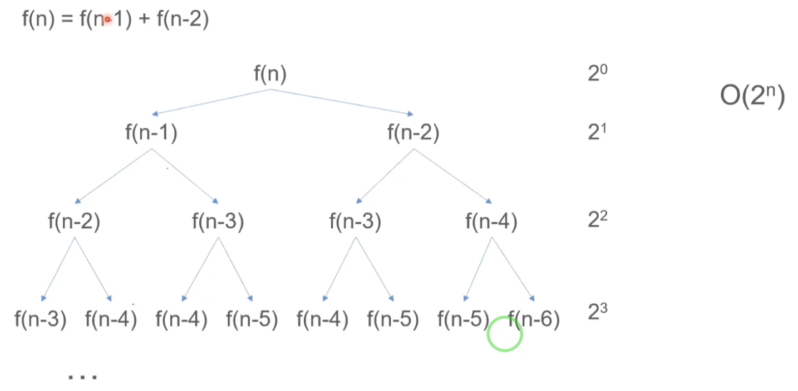
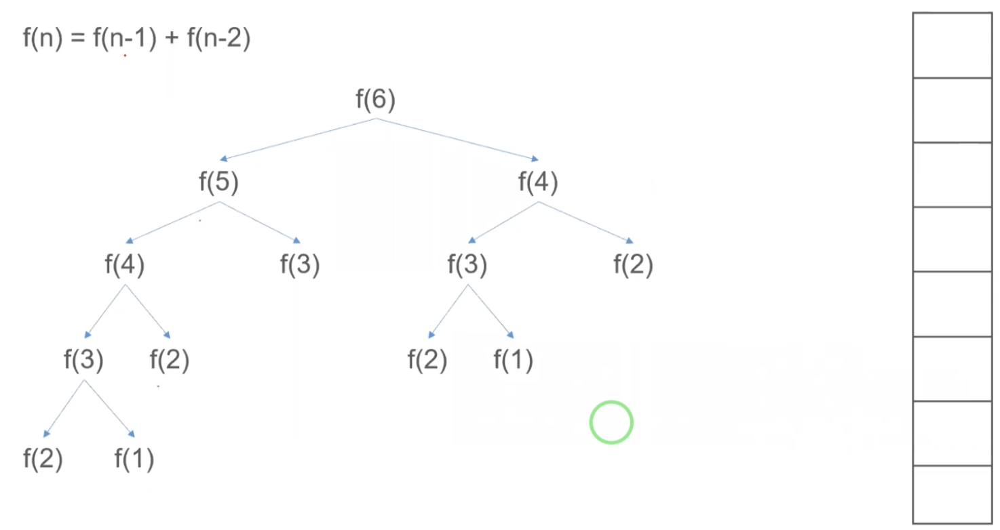

## 1、简介
 算法复杂度，我们在机器学习中一般分为3类:

## 时间复杂度
### 2.类型1：迭代算法复杂度
 类型1：迭代算法复杂度：(比如从A中找出一个x)
   
 我们发现其算法复杂度是O(n),n是代表A的大小。
 在平时中我们主要考虑的是时间复杂度跟空间复杂度，当然时间复杂度主要是根据输入的长度大小来计算的时间效率。
 空间复杂度：指代程序运行过程中，所占用的内存。
 时间复杂度跟空间复杂度是依赖于很多因素，比如：硬件、操作系统、处理器。
 
###### 算法复杂度 的记法
   
 大O经常用来量化算法时间的复杂度，算法的执行时间很多时候跟算法输入的序列长度成关系。
 比如第一个图f(n)-执行时间是线性的跟我们的执行序列长度成线性关系。
 第一幅图：是一个上界表示。g(n)代表的是一个函数，比如:g(n)=n
 第二幅图：是一个下界表示。
 第三幅图：是一个中间的表示。
 
 注意：上面s.t->代表的是subject to(使得)
 但是我们在刷题的时候，一般都会只看到大O的表示，很少看到其他两种方式的表示。因为这个给出了
 我们算法执行的上界-最坏的情况。
 
### 3.类型2：递归类算法复杂度  
  比如我们的归并排序，如下:  
    
  我们需要对输入：[3,4,1,6,7,2,5,9] 进行排序输出为:[1,2,3,4,5,6,7,9]
  我们先对以上数据分成2半。然后进行我们对得到各个排好序的子列表：然后遍历各个子列表，最后得到最终结果。  
  算法复杂度分析如下：我们会对输入的数据n进行调用自己:T(n)；对每一次的数据n,我们每次会切成2个一半的数据进行操作:n/2;然后对其进行最终的排序。
  所以公式如下:T(n)=2T(n/2)+n;
  我们基于之上的递推公式，如何具体求出其时间复杂度呢？
  我们需要根据主定理求出其公式:  
   
  有以下三种情况:
  1、如果f(n)是满足n的c次方的增长方式；并且c<log(b)a；说明我后面的f(n)基本就没有占用时间,整体的时间
  都花到前面:aT(n/b)；则结果为:T(n)=θ(n^log(b)a)；
  --此时说明我们进行数据拆分的时间更多，而把各个数据合并起来的时间更少。此时时间复杂度主要是由我们的前面部分决定的，f(n)可以忽略不计。
  对于归并排序来说:T(n) = 2T(n/2) + n;f(n)=n=θ(n^c);此时c=1；
  2、如果前面跟后面数据整合的时间差不多，这个时候:c=log(a)b；此时我们会检查更低阶的项；如果能找出如下的定理方式:
  f(n) = θ(n^clog^kn)的话，我们复杂度可以根据:T(n)=θ(n^clog^(k+1)n)表示。
  如果找不到这个方法的时候，我们的主定理的缺陷，此时无法用主定理去分析的。
  
  3、如果c大于log(b)a；此时算法复杂度主要由我们的合并数据f(n)来决定的，所以T(n)主要是由f(n)主导，此时:T(n)=θ(f(n))。  

#### 3.1 举例一
  
a=8 b=2 f(n)=1000n^2=θ(n^c);log(b)a=3;c=2;
c=2<3;则大部分时间都在前面，则:T(n)=θ(n^3)

此时我们需要根据我们的递推公式(T(n)=8T(n/2))+1000n^2;计算出我们的通限公式(T(n)=1001n^3-1000n^2);
这个在组合数学中,有一套递推公式可以帮我们推导出这个公式。
 
  
#### 3.2 举例二
 
如上图所示:a=2 b=2 f(n)=10n;log(b)a=1 c=1
此时c=1=1; 
最后推导出:T(n)=n+10nlog(2)n;

   
#### 3.3 举例三
  
如上图所示: 
a=2,b=2 log(b)a=1 c=2;此时c>log(b)a=1;
此时f(n)=θ(n^2)  则此时复杂度主要在f(n) 得到:T(n)=θ(f(n))  
最后根据最终结果得到:T(n) = 2n^2-n;

Ω/θ
#### 归并排序的结果
现在我们根据归并排序公式:T(n)=2T(n/2)+n;
然后根据主定理：
a=2 b=2 log(b)a=1 c=1
此时c=log(b)a=1,此时复杂度由两个共同决定：
 如果f(n) = θ(n^clog^kn)的话，我们复杂度可以根据:T(n)=θ(n^clog^(k+1)n)表示。
 当c=1 k=0的时候:n=n^clog^kn;所以T(n)=θ(n^c(logn)(k+1))=θ(nlogn)
T(n)=O(nlongn);

#### 将例子应用到其他算法  
  

###### Binary search
   Binary search(二分查找法):将已经排好序的序列里面找到某一个值x是否在里面，我们是将序列切分成一半,然后
从中间比较数据大小，如果查找的数在某一个段落里面，所以我们就保留这一段内容，其他的内容就去掉。

对应的关系是上边所示:T(n)=T(n/2)+O(1);运用主定理之后,c=0,log(b)a=0;相等情况：f(n)=θ(n^c(logn)^k);
1=n^0*logn)^k;则k=0时候满足，则T(n)=θ(n^c*(logn)^(k+1))=θ(logn)=O(logn)

###### Binary tree traversal
   Binary tree traversal(二叉树遍历)：我们先遍历做边二叉树，看对应的f(n)的值，然后再遍历右边二叉树，再去看
 二叉树的值，此时我们知道是T(n/2)的两倍，可以写为:T(n)=2*T(n/2)+O(1);此时c<log(b)a,所以时间复杂度由
 左边遍历二叉树的为主导。  
 
###### Optimal Sorted Matrix Search
 对于排好序的矩阵，我们怎么去查找某个数x在里面存在。我们用二分查找方法，我们通过二分法查找，先从中间查找，
 最终会将咱们的矩阵切分成2/4的情况。 
 
###### Merge Sort
   Merge Sort(归并排序):
 

### 4、不满足大定律的时间复杂度计算
   如果我们的数据不满足大定律，那么我们只能自己手动去计算了。比如:我们的斐波拉切序列。
其不满足大定律，我们
    

## 空间复杂度
  我们如何去计算我们的空间复杂度呢?
   
  比如计算我们的斐波拉切序列的空间复杂度的话，我们比如计算f(6)的空间复杂度。
我们进行数据调用的时候，就会进入f(6)时候，会拆分成f(6)=f(5)+f(4);此时我们会把f(6)的上下文放到我们的栈里面去，然
后以此类推，我们计算f(5)=f(3)+f(4)的时候,我们会把f(5)放到我们的栈里面去。
空间复杂度大概为:O(n)。
