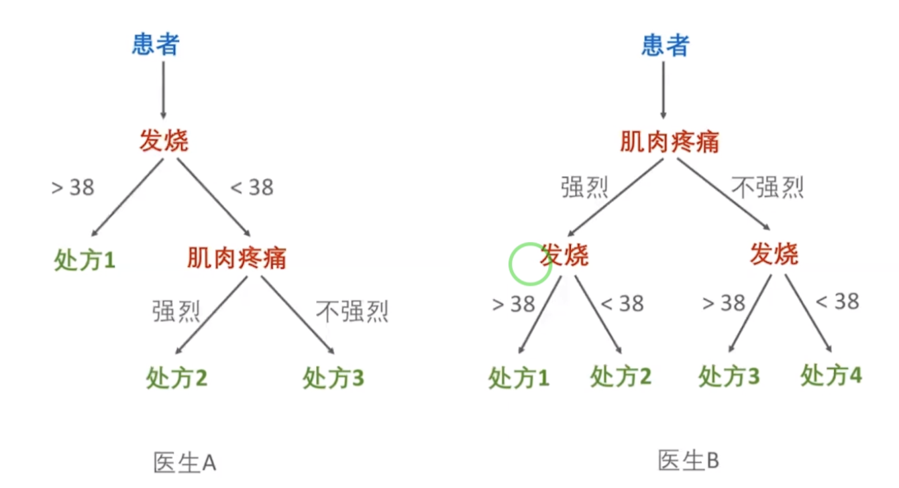
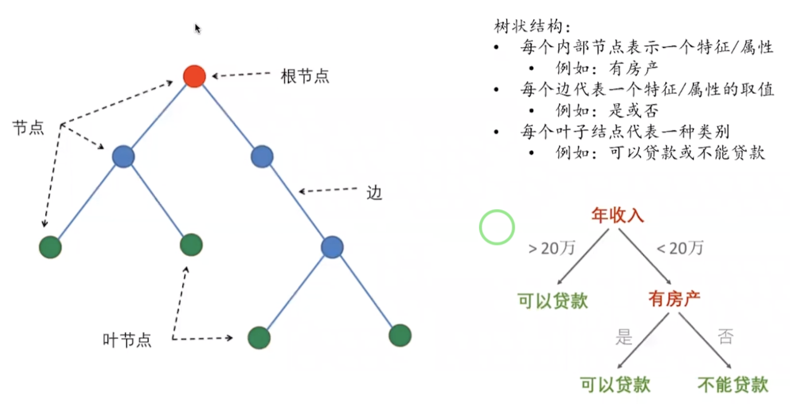
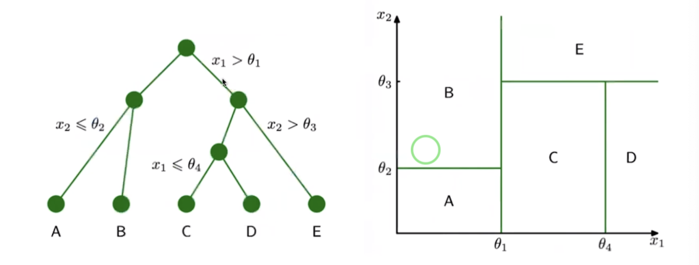
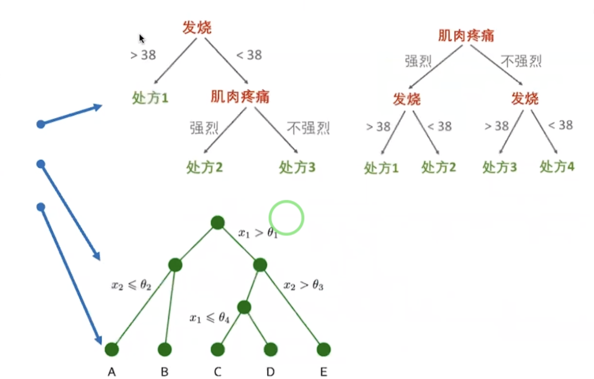
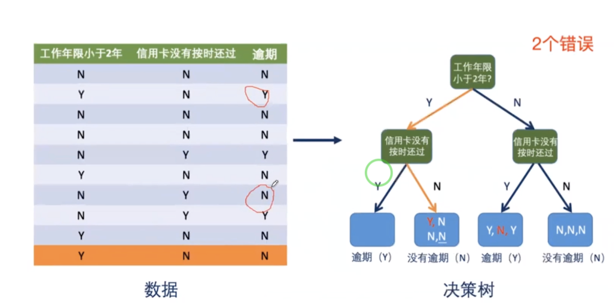
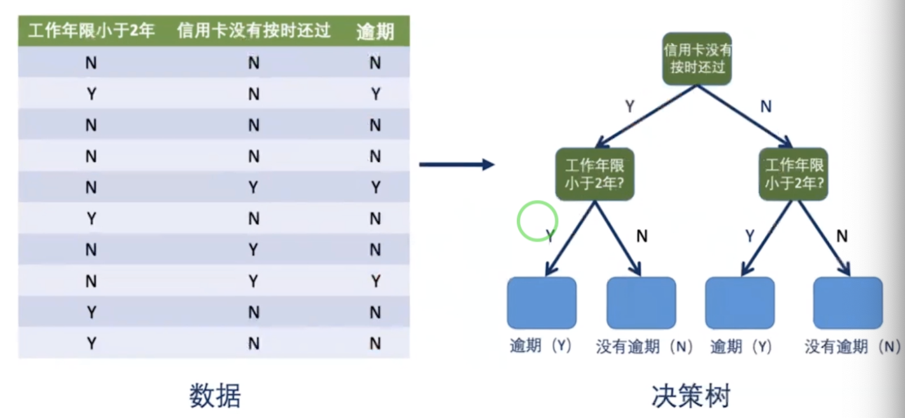
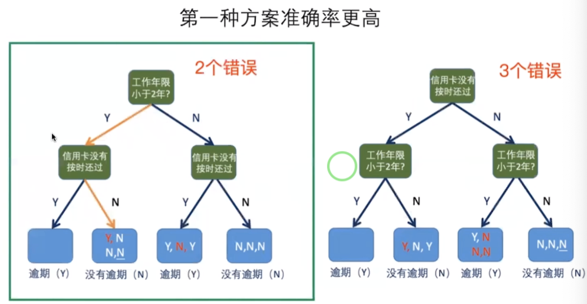
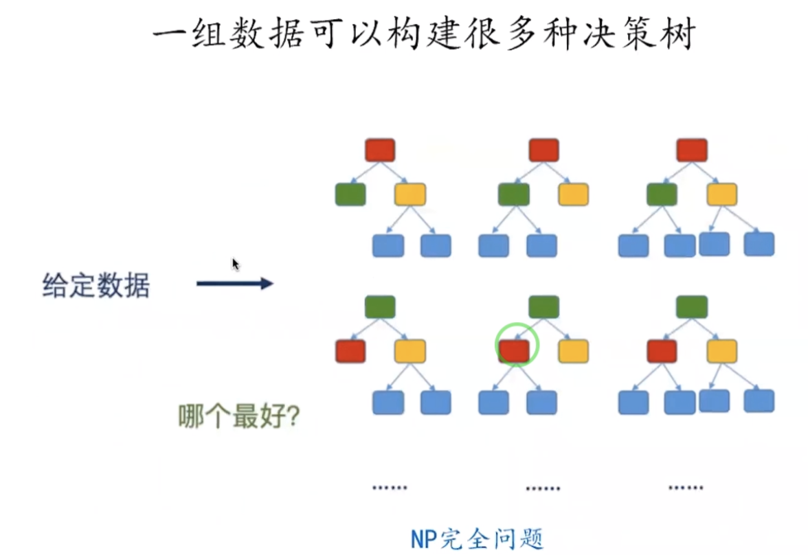
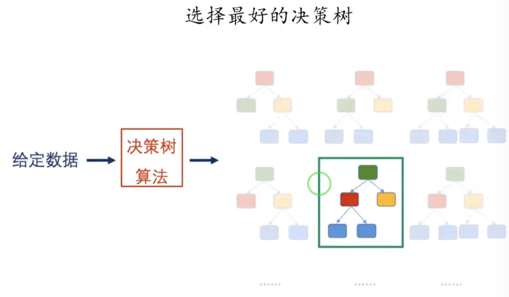

## 摘要
基本的目录结构如下：  
`决策树`   
* 决策树介绍
* 三种特征选择准则  
* 决策树生成算法  
* 处理连续值方法
* 处理回归问题方法  
* 决策树剪枝  
* 决策树小结  

`随机森林`  
* 随机森林介绍  
* 提高随机森林中决策树Diversity的方法  
* Ensemble methods  
* Bagging vs. Boosting  

## 内容

### 1.决策树
#### 1.1 决策树简介
  我们介绍决策树，主要是最终目的是boosting算法 跟GBDT算法。其是在深度学习中非常流行的算法。  
决策树是一个比较常见的机器学习方法。 能处理我们分类跟回归的问题。 
  

  上面是我们现实生活中常见的例子:比如我们去看病的时候,有些医生会根据我们发烧程度去判断我们
病因，比如被判断为肌肉疼痛、然后给出一些处方。
  第二个医生的话，首先可能会根据我们肌肉疼痛角度去判断发烧，然后再去开处方。

#### 1.2 决策树构成  
  决策树由节点和边构成。
   
  以上
     红色--代表根节点。
     蓝色--代表内部节点
     绿色--代表叶子节点
  之间节点之间的连线代表边
 

#### 1.3 决策树与对应的决策边界  
  
上面是决策树与其对应的决策边界。左边决策树中涉及到的特征是:x1,x2；是一个两维的特征；所以其对应的
决策边界是一个平面；通过θ1,θ4将横轴切分成了多个等份。 树往下扩展的话，其叶子节点越来越多，并且对应的
决策边界划分的就越来越仔细。  
  
#### 1.4 决策树学习内容
   需要学习的三个内容:  
* 树的形状  
* 每个决策的阈值θi  
* 叶节点的值  

  

#### 1.5 例子  

  基于给定数据如何构造一个决策树。  
###### 第一种方案
  
 如上图：我们的数据样本就是10个；
 左边图：  
   前两列代表的是我们的输入(1、工作年限小于2年 2、信用卡没有按时还过)  第3列代表的是output；代表的是是否逾期。  
  
根据左边的图，我们可以构造一颗决策树，其对应的样子 如右图所示：
将"工作年限小于2年"作为跟节点，然后"信用卡没有按时还过"作为内部节点，

###### 第二种方案  
 
根节点为:信用卡没有按时还过  内部节点为:工作年限小于2年  
我们发现有3个错误：如上图。  

###### 比较两种方案  
  比较两种方案之后，我们发现如下效果：  
 
 我们发现第一种方案数据是最高的。
 
###### 总结
  
  总结如上：我们可以知道对于给定的数据，我们是会有很多右边的决策树的。这个决策树
可能是指数级别的，因为要从所有可能的决策树之中去选取一个全局最优的决策树；这个其实
是一个NP完全问题。我们需要选择哪个最好？在分类问题中就是哪个准确率最高。这个是一个NP问题。

所以现实中我们采用启发式方法，去找一个局部最优的树。
  

 
### 2.决策树构建过程  
   既然决策树有分类等好的问题，那么我们如何去构建一个决策树呢？
决策树构建过程其实就是一个自顶向下的过程。

* 采用自顶向下的递归方法：
1、将所有训练数据都放在根节点；
2、选择一个最优特征，并按照这一特征将训练数据集分割成子集；
3、根据这些子集的分类内容来判断是否分裂停止，如果需要停止分裂子集的话:进入步骤4(也就是构造叶节点)   如果不需要停止分裂子集的话:进入步骤2(从剩下的子集中再选择一个特征) 
4、构建叶节点，并将这些子集分到所对应的叶节点中；  

针对于以上递归问题的返回条件主要是以下3个:  
1、当前节点包含的样本全属于同一类别，无需划分。
2、当前特征集为空，或是所有样本在所有特征上取值相同，无法划分。
3、当前节点包含的样本集合为空，不能划分。  

P11；

