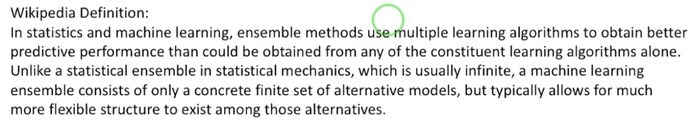
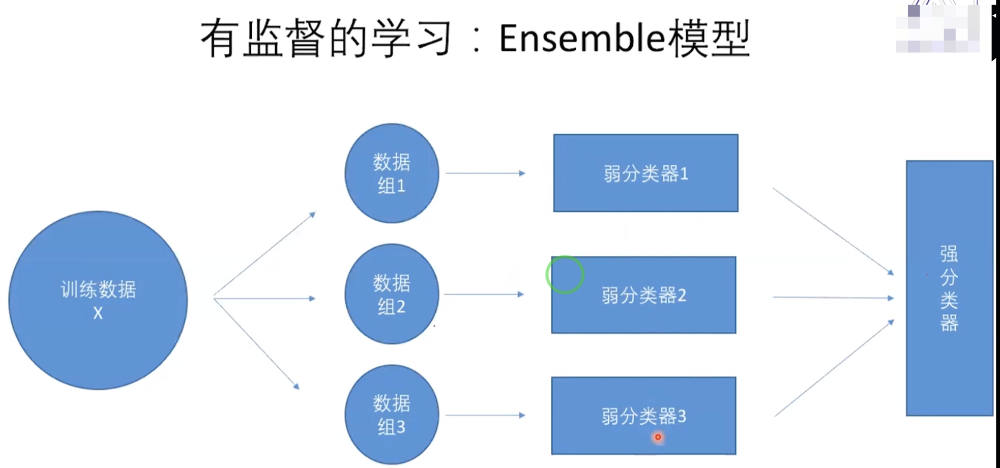

### 1、什么是Ensemble模型
百度定义：
集成学习，也叫分类器集成，通过构建并结合多个学习器来完成学习任务。一般结构是：先产生一组 "个体学习器"，再用某种策略将他们结合起来。
结合策略主要有平均法、投票法和学习法等。  
  

#### 弱分类器与强分类器
   三个臭皮匠顶一个诸葛亮
"弱分类器" 的分类能力不强，但它又比随机选的效果稍微好点，类似于 "臭皮匠"。
"强分类器" 具有很强的分类能力，也就是把特征扔给它，他能分的比较准确，算是 "诸葛亮" 一类的。  
  
  如上图所示：我们把训练数据X 分成多个组:组1、组2、组3；然后每一个组都使用一个弱分类器。最终把弱分类器
合并成一个强分类器。  
  
 

### 集成学习总结
1、介绍了集成学习以及集成学习的几种基本策略，包括max voting,averaging voting
和weighted averaging voting。
2、介绍了集成学习几种高级策略，包括bagging,boosting和stacking
3、引入Loan Predict Problem以及Boston Housing Data作为实战例子，比较了
集成学习的几种方法。 

