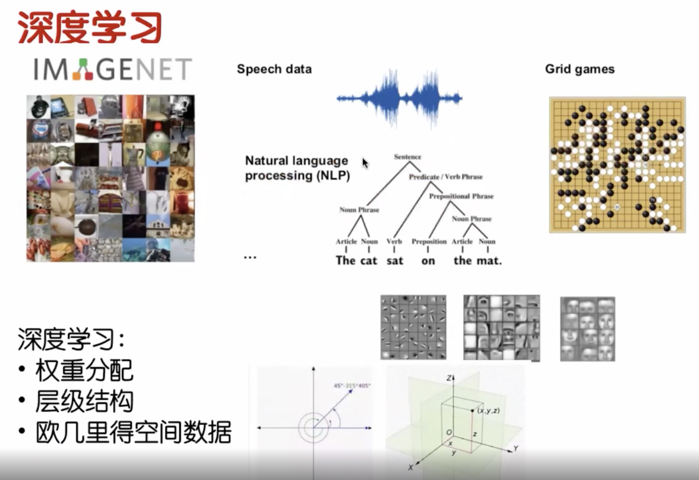
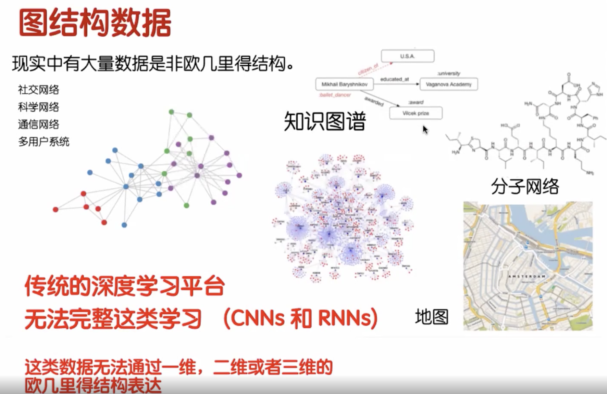
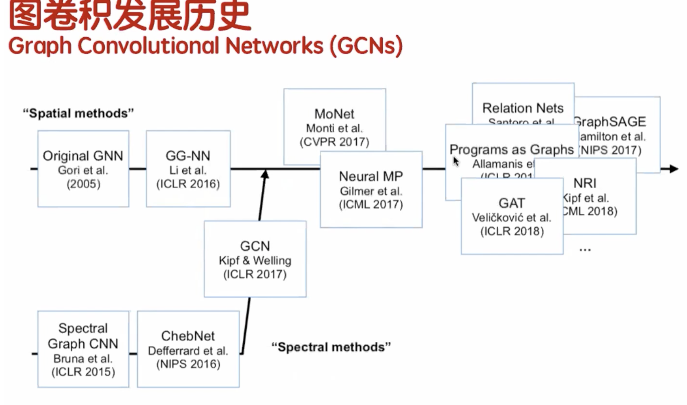
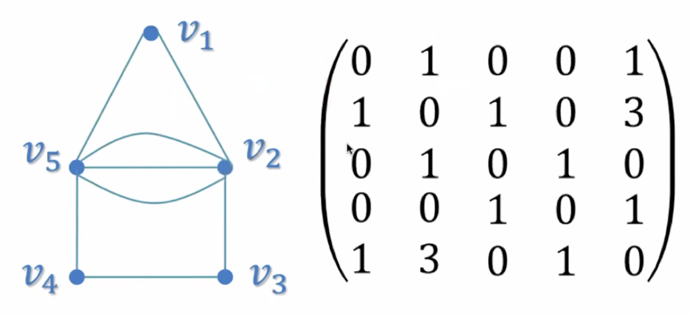
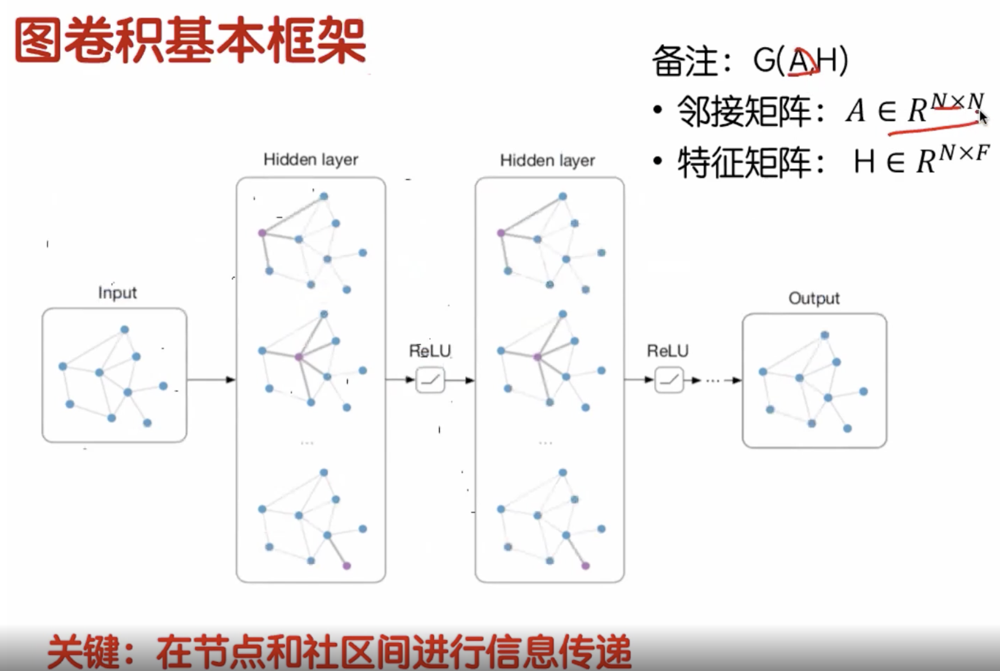

### 1、为什么会有图卷积这个东西?
  深度学习在以下领域都做出了重要贡献。
  

图像领域：
Speech data：语音领域。
NLP: 文字领域。
游戏：Grid games。
人脸识别领域。

   深度学习这门工具里面主要有3个特点：
1、权重分配：在训练过程中有一个权重矩阵，直接根据训练模型调参用的。
2、层级结构：他的每一层训练的结果都是依赖于上一层，一层一层进行数据传递。
3、欧几里得空间数据：我们在学习数学过程中经常会使用1维坐标，2纬坐标，3维坐标，甚至是多唯独坐标表示数据的位置。这个就是欧几里得空间数据。

  上面图像是一个二维坐标，通过x,y即可表示。语音信号：他是一个时间数据，随着时间，他有相应的信息。文字处理:nlp:他也是一个二维坐标数据。所以深度学习里面
数据处理的时候大部分都是可以通过欧几里得空间数据进行表示。

  
  但是实际生活中，很多数据是不能通过简单的欧几里得数据进行表示的。比如我们在社交网络过程中，我们都会使用微信：微信中加好友，我们会形成一个关系，进而形成
一个图。图：就是由节点跟边组成的数据结构。每个节点之间有关系的话就会形成一个边。这样的话，我们把每个用户当作一个节点，用户关系当作一个边，这样的话会形成一个图
但是这个图的话里面没有任何距离信息 也没有任何空间信息，这是一种非欧几里得的非空间信息，那么如何对这种数据进行训练呢？在传统深度学习中没法提供这类数据的表示，所以就出现了
图卷积的概念。  
  现实中非欧几里得的数据有哪些呢？主要有如下几种:
  1、社交网络：我们常见的社交网络信息。
  2、科学网络：科学家写的论文、论文里面有哪些作者？作者之间互相引用会形成怎样的关系。
  3、通信网络：所有的无线通信网络设备、物联网网络设备。
  4、多用户信息：多用户的系统。
  还有就是大家熟悉的知识图谱、分子网络结构、地图信息。他不是随便页面就往不同的地方发展，他是在我们机器学习的过程，人工智能发展的过程中遇到的问题的
一个解决跟突破--才会有的技术。  

### 2、图卷积讲解的东西
   讲解图卷积，我们主要从以下方面考虑这几个东西？目录如下：
1、图卷积背景和基本框架。
2、基于知识图谱的图卷积。
3、研究方向。
4、场景应用。
5、总结。  
#### 1、图卷积背景和基本框架。
##### 1.1、图卷积的发展历史
   
  图卷积的发展，我们从两个方面来讲解:
  1、空间域:Spatial methods根时域(频率)；你可以理解为时域跟频率是可以通过傅立叶变换转换的。
  2、2005年时候提出了GNN的概念(那个时候这个概念是很火的)，经过10年的发展:科学家们提出了:CNN 概念;直到2016年科学家
提出了理论支持；2017年提出来GCN;后期都是基于GCN提出了自然语言处理。

##### 1.2、图基本框架

###### 1、图引入
邻接矩阵：
    
  什么叫图？图里面有哪些基本的性质？
  如上，图形有5个节点：v1、v2、v3、v4、v5；由这些节点连接然后扩展成了一个个边，就形成了我们的图。
我们在进行计算的时候，我们不可能把这个图输入到电脑里面，而是将图转换成对应的数学表示然后输入。这个东西
就是叫做邻接矩阵。有5个点就形成了5x5的邻接矩阵。
  以横纵坐标的方式表示了一个图形，第一个点：表示的是：v1跟自己有没有对应的边联系。  
  从左到右的第一行 第二列的1：代表v1跟v2节点有没有自己的边；上面是有自己的边的，所以我们将其设置为1。  
  第二行第5列的3代表:v2节点跟v5节点有3个边，所以值为3。 
  并且是一个对称矩阵，但是我们可以看一半即可。

###### 2、图卷积基本框架  
  
  如上所示：图卷积的核心框架里面就是包括2个矩阵：邻接矩阵跟特征矩阵；
  邻接矩阵:A  有多少个节点就是NxN。表示为如上。
  特征矩阵:H  
   
  
  
  
   

#### 2、基于知识图谱的图卷积。
#### 3、研究方向。
#### 4、场景应用。
#### 5、总结。  

  
