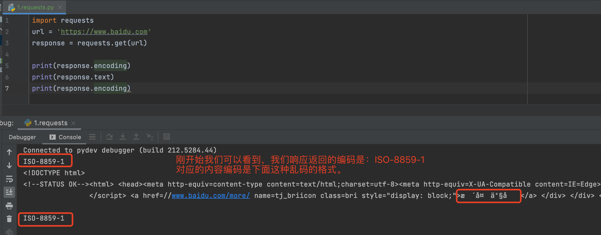

## 摘要
  主要学习requests这个http模块，该模块主要用于发送请求获取响应，该模块有很多的替代模块，比如说urllib模块，
但是在工作中用的最多的还是requests模块，requests的代码简洁易懂，相对于臃肿的urllib模块，使用requests编写的爬虫代码将会更少，
而且实现某一功能将会简单。因此建议大家掌握该模块的使用。  

知识点：
* 掌握 headers参数的使用
* 掌握 发送带参数的请求
* 掌握 headers中携带cookie
* 掌握 cookies参数的使用
* 掌握 cookieJar的转换方法
* 掌握 超时参数timeout的使用
* 掌握 代理ip参数proxies的使用
* 掌握 使用verify参数忽略CA证书
* 掌握 requests模块发送post请求
* 掌握 利用requests.session进行状态保持

## 内容  

### 1. requests模块介绍
```renderscript
requests文档: http://docs.python-requests.org/zh_CN/latest/index.html

* requests文档:https://requests.readthedocs.io/en/latest/
```

  其中的快速上手跟高级用法需要仔细阅读一遍。爬虫开发中，我们用到的主要是快速上手。高阶用法用的比较少一些。  
  
  

#### 1.1 requests模块的作用
* 发送http请求，获取响应数据。  

#### 1.2 requests模块是一个第三方模块，需要在你的python(虚拟)环境中额外安装

```renderscript
pip/pip3 install requests
```

#### 1.3 requests模块发送get请求
```renderscript
需求：通过requests向百度首页发送请求，获取该页面的源码
运行下面的代码，观察打印输出的结果
```

代码块如下：

```renderscript
# 1.2.1-简单的代码实现
import requests 
# 目标url
url = 'https://www.baidu.com' 
# 向目标url发送get请求
response = requests.get(url)
# 打印响应内容
print(response.text)
```

### 2. response响应对象

```renderscript
* 观察上边代码运行结果发现，有好多乱码；这是因为编解码使用的字符集不同早造成的；我们尝试使用下边的办法来解决中文乱码问题
```

代码如下:
```renderscript
# 1.2.2-response.content
import requests 
# 目标url
url = 'https://www.baidu.com' 
# 向目标url发送get请求
response = requests.get(url)
# 打印响应内容
# print(response.text)
print(response.content.decode()) # 注意这里！
```  

   

然后我们在响应的时候设置下其对应的编码：
```renderscript
import requests

url = 'https://www.baidu.com'
response = requests.get(url)

print(response.encoding)
response.encoding = 'utf8'
print(response.text)
print(response.encoding)
```

   

我们设置其响应编码之后，我们发现对应的响应结果为正常显示了。  

1. response.text是requests模块按照chardet模块推测出的编码字符集进行解码的结果
2. 网络传输的字符串都是bytes类型的，所以response.text = response.content.decode('推测出的编码字符集')
3. 我们可以在网页源码中搜索charset，尝试参考该编码字符集，注意存在不准确的情况


#### 2.1 response.text 和response.content的区别
* response.text
  * 类型：str
  * 解码类型： requests模块自动根据HTTP 头部对响应的编码作出有根据的推测，推测的文本编码

* response.content
  * 类型：bytes
  * 解码类型： 没有指定

#### 2.2 通过对response.content进行decode，来解决中文乱码
* response.content.decode() 默认utf-8
* response.content.decode("GBK")
* 常见的编码字符集
  * utf-8
  * gbk
  * gb2312
  * ascii （读音：阿斯克码）
  * iso-8859-1
  
#### 2.3 response响应对象的其它常用属性或方法
```renderscript
response = requests.get(url)中response是发送请求获取的响应对象；
response响应对象中除了text、content获取响应内容以外还有其它常用的属性或方法：
```  

* response.url响应的url；有时候响应的url和请求的url并不一致
* response.status_code 响应状态码
* response.request.headers 响应对应的请求头
* response.headers 响应头
* response.request._cookies 响应对应请求的cookie；返回cookieJar类型
* response.cookies 响应的cookie（经过了set-cookie动作；返回cookieJar类型
* response.json()自动将json字符串类型的响应内容转换为python对象（dict or list）

知识点：掌握 response响应对象的其它常用属性。

### 3. requests模块发送请求
#### 3.1 发送带header的请求
###### 爬虫获取数据大小
  首先，我们使用如下代码:
  
```renderscript
import requests

url = 'https://www.baidu.com'
response = requests.get(url)

# 第一种模式
print(len(response.content.decode()))
```

程序输出的结果为:2349  

```renderscript
<!DOCTYPE html>
<!--STATUS OK--><html> <head><meta http-equiv=content-type content=text/html;charset=utf-8><meta http-equiv=X-UA-Compatible content=IE=Edge><meta content=always name=referrer><link rel=stylesheet type=text/css href=https://ss1.bdstatic.com/5eN1bjq8AAUYm2zgoY3K/r/www/cache/bdorz/baidu.min.css><title>百度一下，你就知道</title></head> <body link=#0000cc> <div id=wrapper> <div id=head> <div class=head_wrapper> <div class=s_form> <div class=s_form_wrapper> <div id=lg>  </div> <form id=form name=f action=//www.baidu.com/s class=fm> <input type=hidden name=bdorz_come value=1> <input type=hidden name=ie value=utf-8> <input type=hidden name=f value=8> <input type=hidden name=rsv_bp value=1> <input type=hidden name=rsv_idx value=1> <input type=hidden name=tn value=baidu><span class="bg s_ipt_wr"><input id=kw name=wd class=s_ipt value maxlength=255 autocomplete=off autofocus=autofocus></span><span class="bg s_btn_wr"><input type=submit id=su value=百度一下 class="bg s_btn" autofocus></span> </form> </div> </div> <div id=u1> <a href=http://news.baidu.com name=tj_trnews class=mnav>新闻</a> <a href=https://www.hao123.com name=tj_trhao123 class=mnav>hao123</a> <a href=http://map.baidu.com name=tj_trmap class=mnav>地图</a> <a href=http://v.baidu.com name=tj_trvideo class=mnav>视频</a> <a href=http://tieba.baidu.com name=tj_trtieba class=mnav>贴吧</a> <noscript> <a href=http://www.baidu.com/bdorz/login.gif?login&amp;tpl=mn&amp;u=http%3A%2F%2Fwww.baidu.com%2f%3fbdorz_come%3d1 name=tj_login class=lb>登录</a> </noscript> <script>document.write('<a href="http://www.baidu.com/bdorz/login.gif?login&tpl=mn&u='+ encodeURIComponent(window.location.href+ (window.location.search === "" ? "?" : "&")+ "bdorz_come=1")+ '" name="tj_login" class="lb">登录</a>');
                </script> <a href=//www.baidu.com/more/ name=tj_briicon class=bri style="display: block;">更多产品</a> </div> </div> </div> <div id=ftCon> <div id=ftConw> <p id=lh> <a href=http://home.baidu.com>关于百度</a> <a href=http://ir.baidu.com>About Baidu</a> </p> <p id=cp>&copy;2017&nbsp;Baidu&nbsp;<a href=http://www.baidu.com/duty/>使用百度前必读</a>&nbsp; <a href=http://jianyi.baidu.com/ class=cp-feedback>意见反馈</a>&nbsp;京ICP证030173号&nbsp;  </p> </div> </div> </div> </body> </html>

```

###### 网页获取数据大小  
  
  发现大小为大于5000;发现其响应的结果除了上面的代码之外，还出现了css等样式。
这里面的区别到底在哪里？你不是模拟的浏览器吗？在发送请求的时候，我们可以预先设置一些请求头模拟浏览器。我们可以看到我们的浏览器请求baidu的时候带上
我们之前说的三大剑客：User-Agent、Referer、Cookie即可。  
由于目前我们访问baidu的时候是不需要用户保持的，所以是不需要使用cookie的。并且我们也没有从哪里来的情况，所以我们只需要
使用:User-Agent。

```renderscript
import requests
url = 'https://www.baidu.com'
# 构建请求头字典
headers = {
    "User-Agent": "Mozilla/5.0 (Macintosh; Intel Mac OS X 10_15_7) AppleWebKit/537.36 (KHTML, like Gecko) Chrome/105.0.0.0 Safari/537.36"
}

# 发送请求
res = requests.get(url, headers=headers)
print(res.content.decode())
print(len(res.content.decode()))
```

上面输出的结果就是:365023;
上面就是告诉浏览器，我们使用了浏览器的代理了。  

##### 3.1.1 思考
  

##### 3.1.2 携带请求头发送请求的方法
```renderscript
requests.get(url, headers=headers)
```

* headers参数接收字典形式的请求头
* 请求头字段名作为key，字段对应的值作为value

#### 3.2 发送带参数的请求
```renderscript
我们在使用百度搜索的时候经常发现url地址中会有一个 ?，那么该问号后边的就是请求参数，又叫做查询字符串.
```
##### 3.2.1 在url携带参数
  直接对含有参数的url发起请求。
  
```renderscript
import requests

headers = {
    "User-Agent": "Mozilla/5.0 (Macintosh; Intel Mac OS X 10_15_7) AppleWebKit/537.36 (KHTML, like Gecko) Chrome/105.0.0.0 Safari/537.36"
}

url = "https://www.baidu.com?wd=python"

res = requests.get(url, headers=headers)
print(res.content.decode())
print(len(res.content.decode()))  # 365085
```

##### 3.2.2 通过params携带参数字典
​1. 构建请求参数字典  
​2. 向接口发送请求的时候带上参数字典，参数字典设置给params  

```renderscript
import requests
headers = {
    "User-Agent": "Mozilla/5.0 (Macintosh; Intel Mac OS X 10_15_7) AppleWebKit/537.36 (KHTML, like Gecko) Chrome/105.0.0.0 Safari/537.36"
}
data = {
    "wd": "python"
}

# 带上请求参数发起请求，获取响应
res2 = requests.get(url, headers=headers, params=data)
print(res2.url)
```

#### 3.3 在headers参数中携带cookie

```renderscript
网站经常利用请求头中的Cookie字段来做用户访问状态的保持，那么我们可以在headers参数中添加Cookie，模拟普通用户的请求。
我们以github登陆为例：
```

##### 3.3.1 github登陆抓包分析
1. 打开浏览器，右键-检查，点击Net work，勾选Preserve log。
2. 访问github登陆的url地址 https://github.com/login。
3. 输入账号密码点击登陆后，访问一个需要登陆后才能获取正确内容的url，比如点击右上角的Your profile访问https://github.com/USER_NAME。
4. 确定url之后，再确定发送该请求所需要的请求头信息中的User-Agent和Cookie。

   
然后我们查看登录后的cookie如下：
   

###### 如何判断我们的账号是否已经登录成功呢？
  如下图是登录成功的图：
    
  无痕上网模式下(不携带cookie)，我们会出现其对应的Edit profile丢失。 
     
  我们可以知道有两个地方不一致：1、Edit profile   2、文章的title不一致；无痕上网是:startshineye (startshineye) · GitHub  

##### 3.3.2 代码实现
不携带cookie:

```renderscript
import requests
headers = {
    "User-Agent": "Mozilla/5.0 (Macintosh; Intel Mac OS X 10_15_7) AppleWebKit/537.36 (KHTML, like Gecko) Chrome/105.0.0.0 Safari/537.36"
}

url = "https://github.com/startshineye"

res = requests.get(url, headers=headers)

with open("headers_without_cookie.html", "wb") as f:
    f.write(res.content)
```

 
携带cookie如下：

```renderscript
import requests
headers = {
    "User-Agent": "Mozilla/5.0 (Macintosh; Intel Mac OS X 10_15_7) AppleWebKit/537.36 (KHTML, like Gecko) Chrome/105.0.0.0 Safari/537.36",
    "cookie": "_ga=GA1.2.150843220.1593087436; _octo=GH1.1.1661912861.1656428524; _device_id=8655e7a2207006161e4c236120b39e84; color_mode=%7B%22color_mode%22%3A%22auto%22%2C%22light_theme%22%3A%7B%22name%22%3A%22light%22%2C%22color_mode%22%3A%22light%22%7D%2C%22dark_theme%22%3A%7B%22name%22%3A%22dark%22%2C%22color_mode%22%3A%22dark%22%7D%7D; preferred_color_mode=light; tz=Asia%2FShanghai; user_session=4hLXjFwJvyMeNKw09K1g-tQ1TKUL5IXxjAVw-EOhi9QVyh0U; __Host-user_session_same_site=4hLXjFwJvyMeNKw09K1g-tQ1TKUL5IXxjAVw-EOhi9QVyh0U; tz=Asia%2FShanghai; logged_in=yes; dotcom_user=startshineye; has_recent_activity=1; _gh_sess=GP3Xf%2BGsjP0hFpI%2B5FhW%2BpWu28%2BvIOgqvXOMAPgHx8NpEc%2FRMVlobIu%2FwZ3GzD7vNPXB67vWkckQll9ers3jGu2OmJlR2qtUVRhsuQmzPRF7dF0QQf2Pa0Q%2FO4HcRwg2yY06M3G%2B%2FM2CyI%2FY8kJWAjHqpi0PkouTmwl1aWgSI693iKYhG9%2FM4iWT3pNnVLA2wRbnt6HVwmOPKqdmWazmQTqQDc5jBQNoptemv2UbimWLG%2FWorAgIpQ0%2FELIoZKmcWCFd07vbeKzScI1Tkz9TcHILreg%2BDG2mx%2BrOwEqqZNV4glHvaRL%2Bes4u%2BJLzi4o8UDDL5u1UPg07rgcgcCpPYIQlA%2FkS4dLD7sSFPGeGHvmOx4t8sm9pz%2BOWE6JBhL%2FJ7o3fAEcXOrl9QQ%2F1IIsGY2yyt%2FwXSVnN7HvE98SOCPKvDGNZK2tyNSov077VD%2BhUPUGVKbbYBeA3BELUeeqtl7U3QNU%2BUP1wctnwb9Q7ao6nNit289eLfahTExuz%2FwyLwoPmmMNVCNpc0GWrxyKE6p%2B8laPS63gLdtxZTPs5pHV6Zya%2B0r3emhwcNlqFGTkUb5xkSNC2ueYNILutuaGHI7tkZ0aLy1ykrlUkk76DowdmvEMlMHzHn5%2FAod3Van09pxJ1jwjrL9qF2q%2BFmV8DFd8EpjGksglQH%2BHWrjaqkWRhDe9zq99DOoRPO4PbzUwPMVysSN0I9dM%2B2KTQI1ihwGMbeMwnUIEAHKm1bbMn9VXA5%2BPfcP%2BB%2BD9lxgWU0xSpEgw12NMSQTN3MyGI9Bf5K12iTo2iXQLs1Rp%2FZKrNnFvJwEgBwkz8SMzPrqroFdrbIsL%2BjA6zXEKc8tuQnVFrUXWmm5UyWebmoRm04SI%2B4dYIl0VUBYIZCLIkGYNGKfy6alvIz20qfmswKbnIEBNX46OLXFr0BXnA8BDgwqU%2BjvTjtHnUVa1x7doFWtJD2W15p4hXfBprUfHwUuRNkx4arl0zG%2BKcH4Eur085Y%2BMP6zcEWJ%2FbecYTAwezS7Wb0jOlvZVYmsmIyJ6LQXl8kB3yhgm5%2FJHQHtGwnN09Yo7W4zyijR7dAlG5wAU%2B%2BJZWfMIFodIUEukNXF1nRXHJ2u8TXrOvhua14PIJ6cQCZwTRWpFwbY9z--To4%2Bn6fmogIVXjJV--Ju9kJHbmu11GsQ7mkE2gnw%3D%3D"
}
url = "https://github.com/startshineye"
res = requests.get(url, headers=headers)
with open("headers_with_cookie.html", "wb") as f:
    f.write(res.content)
```

##### 3.3.3 运行代码验证结果

```renderscript
在打印的输出结果中搜索title，html中的标题文本内容如果是你的github账号，则成功利用headers参数携带cookie，
获取登陆后才能访问的页面
```
  
#### 3.4 cookies参数的使用
```renderscript
headers参数中携带cookie，也可以使用专门的cookies参数
```  
1. cookies参数的形式：字典
  cookies = {"cookie的name":"cookie的value"}

  * 该字典对应请求头中Cookie字符串，以分号、空格分割每一对字典键值对
  * 等号左边的是一个cookie的name，对应cookies字典的key
  * 等号右边对应cookies字典的value
  
2. cookies参数的使用方法
  response = requests.get(url, cookies)

3. 将cookie字符串转换为cookies参数所需的字典：
cookies_dict = {cookie.split('=')[0]:cookie.split('=')[-1] for cookie in cookies_str.split('; ')}

4. 注意：cookie一般是有过期时间的，一旦过期需要重新获取

代码如下:

```renderscript
import requests

headers = {
    "User-Agent": "Mozilla/5.0 (Macintosh; Intel Mac OS X 10_15_7) AppleWebKit/537.36 (KHTML, like Gecko) Chrome/105.0.0.0 Safari/537.36",
}

url = "https://github.com/startshineye"

# cookie_str
cookies_str = "_ga=GA1.2.150843220.1593087436; _octo=GH1.1.1661912861.1656428524; _device_id=8655e7a2207006161e4c236120b39e84; color_mode=%7B%22color_mode%22%3A%22auto%22%2C%22light_theme%22%3A%7B%22name%22%3A%22light%22%2C%22color_mode%22%3A%22light%22%7D%2C%22dark_theme%22%3A%7B%22name%22%3A%22dark%22%2C%22color_mode%22%3A%22dark%22%7D%7D; preferred_color_mode=light; tz=Asia%2FShanghai; user_session=4hLXjFwJvyMeNKw09K1g-tQ1TKUL5IXxjAVw-EOhi9QVyh0U; __Host-user_session_same_site=4hLXjFwJvyMeNKw09K1g-tQ1TKUL5IXxjAVw-EOhi9QVyh0U; tz=Asia%2FShanghai; logged_in=yes; dotcom_user=startshineye; has_recent_activity=1; _gh_sess=GP3Xf%2BGsjP0hFpI%2B5FhW%2BpWu28%2BvIOgqvXOMAPgHx8NpEc%2FRMVlobIu%2FwZ3GzD7vNPXB67vWkckQll9ers3jGu2OmJlR2qtUVRhsuQmzPRF7dF0QQf2Pa0Q%2FO4HcRwg2yY06M3G%2B%2FM2CyI%2FY8kJWAjHqpi0PkouTmwl1aWgSI693iKYhG9%2FM4iWT3pNnVLA2wRbnt6HVwmOPKqdmWazmQTqQDc5jBQNoptemv2UbimWLG%2FWorAgIpQ0%2FELIoZKmcWCFd07vbeKzScI1Tkz9TcHILreg%2BDG2mx%2BrOwEqqZNV4glHvaRL%2Bes4u%2BJLzi4o8UDDL5u1UPg07rgcgcCpPYIQlA%2FkS4dLD7sSFPGeGHvmOx4t8sm9pz%2BOWE6JBhL%2FJ7o3fAEcXOrl9QQ%2F1IIsGY2yyt%2FwXSVnN7HvE98SOCPKvDGNZK2tyNSov077VD%2BhUPUGVKbbYBeA3BELUeeqtl7U3QNU%2BUP1wctnwb9Q7ao6nNit289eLfahTExuz%2FwyLwoPmmMNVCNpc0GWrxyKE6p%2B8laPS63gLdtxZTPs5pHV6Zya%2B0r3emhwcNlqFGTkUb5xkSNC2ueYNILutuaGHI7tkZ0aLy1ykrlUkk76DowdmvEMlMHzHn5%2FAod3Van09pxJ1jwjrL9qF2q%2BFmV8DFd8EpjGksglQH%2BHWrjaqkWRhDe9zq99DOoRPO4PbzUwPMVysSN0I9dM%2B2KTQI1ihwGMbeMwnUIEAHKm1bbMn9VXA5%2BPfcP%2BB%2BD9lxgWU0xSpEgw12NMSQTN3MyGI9Bf5K12iTo2iXQLs1Rp%2FZKrNnFvJwEgBwkz8SMzPrqroFdrbIsL%2BjA6zXEKc8tuQnVFrUXWmm5UyWebmoRm04SI%2B4dYIl0VUBYIZCLIkGYNGKfy6alvIz20qfmswKbnIEBNX46OLXFr0BXnA8BDgwqU%2BjvTjtHnUVa1x7doFWtJD2W15p4hXfBprUfHwUuRNkx4arl0zG%2BKcH4Eur085Y%2BMP6zcEWJ%2FbecYTAwezS7Wb0jOlvZVYmsmIyJ6LQXl8kB3yhgm5%2FJHQHtGwnN09Yo7W4zyijR7dAlG5wAU%2B%2BJZWfMIFodIUEukNXF1nRXHJ2u8TXrOvhua14PIJ6cQCZwTRWpFwbY9z--To4%2Bn6fmogIVXjJV--Ju9kJHbmu11GsQ7mkE2gnw%3D%3D"

# 构造cookies字典
cookies_dict = {}

cookies_list = cookies_str.split('; ')

cookies_dict = {cookie.split("=")[0]: cookie.split("=")[-1] for cookie in cookies_list}

'''
for cookie in cookies_list:
    # _ga=GA1.2.150843220.1593087436
    cookies_dict[cookie.split("=")[0]] = cookie.split("=")[-1]
'''

print(cookies_dict)
res = requests.get(url, headers=headers, cookies=cookies_dict)

with open("cookies.html", "wb") as f:
    f.write(res.content)
```

#### 3.5 cookieJar对象转换为cookies字典的方法
```renderscript
使用requests获取的resposne对象，具有cookies属性。该属性值是一个cookieJar类型，包含了对方服务器设置在本地的cookie。我们如何将其转换为cookies字典呢？
```

1. 转换方法
  cookies_dict = requests.utils.dict_from_cookiejar(response.cookies)
2. 其中response.cookies返回的就是cookieJar类型的对象。
3. requests.utils.dict_from_cookiejar函数返回cookies字典。

代码:

```renderscript
import requests
import requests.utils

url = "https://www.baidu.com"
res = requests.get(url)

# cookieJar对象
print(res.cookies)

# cookieJar对象转换成cookies对象
cookies_dict = requests.utils.dict_from_cookiejar(res.cookies)
print(cookies_dict)

# cookies对象转换成cookieJar
cookieJar = requests.utils.cookiejar_from_dict(cookies_dict)
print(cookieJar)
```

输出结果:

```renderscript
<RequestsCookieJar[<Cookie BDORZ=27315 for .baidu.com/>]>
{'BDORZ': '27315'}
<RequestsCookieJar[<Cookie BDORZ=27315 for />]>
```

#### 3.6 超时参数timeout的使用
```renderscript
1. 在平时网上冲浪的过程中，我们经常会遇到网络波动，这个时候，一个请求等了很久可能任然没有结果。
2. 在爬虫中，一个请求很久没有结果，就会让整个项目的效率变得非常低，这个时候我们就需要对请求进行强制要求，让他必须在特定的时间内返回结果，否则就报错。
```

1. 超时参数timeout的使用方法
   * response = requests.get(url, timeout=3)
2. timeout=3表示：发送请求后，3秒钟内返回响应，否则就抛出异常

代码如下:  

```renderscript
import requests
url = "https://twitter.com"
res = requests.get(url, timeout=3)
```

#### 3.7 了解代理以及proxy代理参数的使用

```renderscript
  proxy代理参数通过指定代理ip，
让代理ip对应的正向代理服务器转发我们发送的请求，那么我们首先来了解一下代理ip以及代理服务器。
```

##### 3.7.1 理解使用代理的过程
1. 代理ip是一个ip，指向的是一个代理服务器。
2. 代理服务器能够帮我们向目标服务器转发请求。  

  

##### 3.7.2 正向代理和反向代理的区别

```renderscript
前边提到proxy参数指定的代理ip指向的是正向的代理服务器，那么相应的就有反向服务器；
现在来了解一下正向代理服务器和反向代理服务器的区别
```

正向代理：浏览器知道将请求转发给谁；正向代理就类似于我们的vpn，翻墙软件。
反向代理：浏览器不知道请求最终交给了谁(哪台机器)？;比如我们搭建的nginx,浏览器请求nginx之后，nginx将请求转发给了
其他服务器，此时浏览器是不知道我们的请求最终发给了谁？

1. 从发送请求的一方的角度，来区分正向或反向代理
2. 为浏览器或客户端（发送请求的一方）转发请求的，叫做正向代理
   * 浏览器知道最终处理请求的服务器的真实ip地址，例如VPN
3. 不为浏览器或客户端（发送请求的一方）转发请求、而是为最终处理请求的服务器转发请求的，叫做反向代理
   * 浏览器不知道服务器的真实地址，例如nginx
  
  
##### 3.7.3 代理ip(代理服务器)的分类  
1. 根据代理ip的匿名程度，代理IP可以分为下面三类：

      * 透明代理(Transparent Proxy)：透明代理虽然可以直接“隐藏”你的IP地址，但是还是可以查到你是谁。目标服务器接收到的请求头如下：
      ```renderscript
      REMOTE_ADDR = Proxy IP
      HTTP_VIA = Proxy IP
      HTTP_X_FORWARDED_FOR = Your IP
   
      Proxy IP-指代的是代理的ip地址。
      Your IP-指代的是你本机的ip地址
      ```
    
      * 匿名代理(Anonymous Proxy)：使用匿名代理，别人只能知道你用了代理，无法知道你是谁。目标服务器接收到的请求头如下：
      ```renderscript
      REMOTE_ADDR = proxy IP
      HTTP_VIA = proxy IP
      HTTP_X_FORWARDED_FOR = proxy IP
   
      proxy IP：指代的是代理服务器的地址
      ```
    
      * 高匿代理(Elite proxy或High Anonymity Proxy)：高匿代理让别人根本无法发现你是在用代理，所以是最好的选择。毫无疑问使用高匿代理效果最好。目标服务器接收到的请求头如下：
      ```renderscript
      REMOTE_ADDR = Proxy IP
      HTTP_VIA = not determined
      HTTP_X_FORWARDED_FOR = not determined
   
      Proxy IP-指代的是代理的ip地址。
      HTTP_VIA/HTTP_X_FORWARDED_FOR是不设置的。
      ```

2. 根据网站所使用的协议不同，需要使用相应协议的代理服务。从代理服务请求使用的协议可以分为：
     * http代理：目标url为http协议
     * https代理：目标url为https协议
     * socks隧道代理（例如socks5代理）等：
       i.socks 代理只是简单地传递数据包，不关心是何种应用协议（FTP、HTTP和HTTPS等）。
       ii.socks 代理比http、https代理耗时少。
       iii.socks 代理可以转发http和https的请求。
       
 
##### 3.7.4 proxies代理参数的使用
```renderscript
为了让服务器以为不是同一个客户端在请求；
为了防止频繁向一个域名发送请求被封ip，所以我们需要使用代理ip；
那么我们接下来要学习requests模块是如何使用代理ip的。
```

* 用法：

```renderscript
response = requests.get(url, proxies=proxies)
```

* proxies的形式：字典.

* 例如：

```renderscript
proxies = { 
    "http": "http://12.34.56.79:9527", 
    "https": "https://12.34.56.79:9527", 
}
```

注意：
1.如果proxies字典中包含有多个键值对，发送请求时将按照url地址的协议来选择使用相应的代理ip。
2.代理使用成功不会有任何报错，能成功获取响应；如果失败，要么卡滞，要么报错。

使用代理：网上有很多免费的代理ip，比如:https://www.kuaidaili.com/free/
  

```renderscript
import requests

url = "https://www.baidu.com"
#response = requests.get(url)

proxies = {
    "http": "http://120.194.55.139:6969",
    "https": "https://120.194.55.139:6969"
}

response = requests.get(url, proxies=proxies, timeout=10)
print(response.text)
```

  
发现我们的请求报错了，原因很可能是我们的卡滞了，或者是我们代理ip只支持http；

那么我们去除https的，如下：

```renderscript
import requests

url = "https://www.baidu.com"
#response = requests.get(url)

proxies = {
    "http": "http://120.194.55.139:6969",
    #"https": "https://120.194.55.139:6969"
}

response = requests.get(url, proxies=proxies, timeout=10)
print(response.text)
```

  
我们即可得到我们的结果。  


#### 3.8 使用verify参数忽略CA证书

```renderscript
   verify参数常用于我们的浏览器忽略CA证书认证；CA证书是什么呢？其实他是我们的https中一个非常重要的认证证书；
   它主要让我们被认证的网站能够被正确的识别。但是往往有一些互联网上的软件，自身使用的证书并不是由官方下发的，通常我们也是从官方去认证；而
这些私自下发的证书在官方并没有记录。我们的浏览器请求时候如果在官方没有认证就会出现我们如下的图：
在使用浏览器上网的时候，有时能够看到下面的提示（2018年10月之前的12306网站）：
```

我们的浏览器请求时候如果在官方没有认证就会出现我们如下的图：
 

如何避免上面的情况呢？这个时候我们就需要用到：verify参数。

* 原因：该网站的CA证书没有经过【受信任的根证书颁发机构】的认证
* 关于CA证书以及受信任的根证书颁发机构点击了解更多，课上我们不做展开


比如我们下面的网站请求的时候：
https://sam.huat.edu.cn:8443/selfservice/
会出现：   
这个时候我们直接爬取代码的话，会出现下面的情况：

```renderscript
import requests
url = "https://sam.huat.edu.cn:8443/selfservice/"
response = requests.get(url)

出现错误:运行下面的代码将会抛出包含ssl.CertificateError ...字样的异常
```

  我们如何解决呢？
  为了在代码中能够正常的请求，我们使用verify=False参数，此时requests模块发送请求将不做CA证书的验证：verify参数能够忽略CA证书的认证。
     
```renderscript
import requests
url = "https://sam.huat.edu.cn:8443/selfservice/" 
response = requests.get(url,verify=False)

此时会报一个警告，但是这个警告是可以不用管的。
```


### 4.requests模块发送post请求

```renderscript
思考：哪些地方我们会用到POST请求？
  1.登录注册（ 在web工程师看来POST 比 GET 更安全，url地址中不会暴露用户的账号密码等信息）
  2.需要传输大文本内容的时候（ POST 请求对数据长度没有要求）

所以同样的，我们的爬虫也需要在这两个地方回去模拟浏览器发送post请求
```

#### 4.1 requests发送post请求的方法
* response = requests.post(url, data)
* data参数接收一个字典
* requests模块发送post请求函数的其它参数和发送get请求的参数完全一致


#### 4.2 POST请求练习

##### 4.2.1 POST请求步骤
下面面我们通过金山翻译的例子看看post请求如何使用：

地址：
```renderscript
http://www.iciba.com/fy
```

思路分析:
1.抓包确定请求的url地址:  
  
```renderscript
http://ifanyi.iciba.com/index.php?c=trans&m=fy&client=6&auth_user=key_web_fanyi&sign=a2f1f482479337c4
```

2.确定请求的参数
  

3.确定返回数据的位置
  

4.模拟浏览器获取数据
##### 4.2.2 POST请求数据来源
数据来源主要为以下几种：
1. 固定值   --抓包比较不变值
2. 输入值   --抓包比较根据自身变化值
3. 预设值-静态文件  --需要提前从惊天html中获取
4. 预设值-发请求   --需要对指定地址发送请求
5. 在客户端生成的   --分析js,模拟生成数据

##### 4.2.3 POST请求练习

```renderscript
'''
实现将输入的中英文句子：进行中英互译
'''
import json
import requests


def parse_data(data):
    # 将json数据转换成python字典
    dict = json.loads(data)
    # 从json中获取结果
    print(dict['content']['out'])


class Translator(object):
    def __init__(self, word):
        self.url = "http://ifanyi.iciba.com/index.php?c=trans&m=fy&client=6&auth_user=key_web_fanyi&sign=2ad53c323affb5ad"
        self.headers = {
            "User-Agent": "Mozilla/5.0 (Macintosh; Intel Mac OS X 10_15_7) AppleWebKit/537.36 (KHTML, like Gecko) Chrome/105.0.0.0 Safari/537.36"
        }
        self.data = {
            "from": "zh",
            "to": "en",
            "q": word
        }

    def get_data(self):
        response = requests.post(self.url, self.data, headers=self.headers)
        # 默认返回bytes类型，除非确定外部调用使用str才进行解码操作
        print(response.content)
        return response.content

    def run(self):
        # url
        # headers
        # post——data
        # requests请求
        # 解析
        content = self.get_data()
        parse_data(content)


if __name__ == "__main__":
    # 一次性使用
    # translator = Translator("中国")
    # translator.run()

    # input 输入
    s = input("请输入需要翻译的文字:")
    translator = Translator(s)
    translator.run()
```

### 5.利用requests.session进行状态保持
```renderscript
requests模块中的Session类能够自动处理发送请求获取响应过程中产生的cookie，进而达到状态保持的目的。接下来我们就来学习它
```

#### 5.1 requests.session的作用以及应用场景
   requests.session主要用于保持会话；前面我们学习cookie的时候,cookie有什么不好的地方呢？不好的地方是每发送一次请求，你都需要设置一次。
而如果我们掌握了requests.session之后不用每次都设置了，会自动帮我们保持会话。requests模块中的Session类能够自动处理发送请求获取响应过程中产生的cookie，
进而达到状态保持的目的。

* requests.session的作用
   * 自动处理cookie，即下一次请求会带上前一次的cookie
* requests.session的应用场景
   * 如果你是发一次请求，只需要带一次cookie;如果你需要做多次连续请求的时候(比如说：先做登录，登录之后再做获取数据)；自动处理 "连续的多次请求过程中产生的cookie"


#### 5.2 requests.session使用方法
```renderscript
session实例在请求了一个网站后，对方服务器设置在本地的cookie会保存在session中，下一次再使用session请求对方服务器的时候，会带上前一次的cookie
```

代码示例:

```renderscript
session = requests.session() # 实例化session对象
response = session.get(url, headers, ...)
response = session.post(url, data, ...)
```

* session对象发送get或post请求的参数，与requests模块发送请求的参数完全一致

#### 5.3 课堂测试
```renderscript
使用requests.session来完成github登陆，并获取需要登陆后才能访问的页面
```

步骤：
###### 1、url
  首先我们发送一个登录的请求，发送登录请求的时候，我们需要防止登录跳转之后的url请求地址被清空，这个时候我们需要在：开发者工具中:Preserve log(保持日志)
来进行连续抓包。  
  我们也可以看到我们登录的表单数据为:
 
  我们可以看到我们的请求需要输入的数据。
  
###### 2、headers
###### 3、data
  我们通过发送数据包之后，我们可以看到
 

第一次请求:

```renderscript
commit: Sign in
authenticity_token: KUPaOymYe1CQ0X7D49sI_Px1FSB8Ne2mI7mxRS1Z5F2zf7HUIvD57m2WtwICZyhuZmcWEsXpnosbiHBIHmR_qQ
login: startshineye
password: xxxxxxxx
webauthn-support: supported
webauthn-iuvpaa-support: supported
return_to: https://github.com/login
allow_signup: 
client_id: 
integration: 
required_field_3f46: 
timestamp: 1665562183016
timestamp_secret: 3c1031e63333c45acf5347ad0f344254f8a90abcc47487d6af6aec7580773db1
```

  然后我们去验证，我们的登录是否成功，这个时候就是进入Your profile。
  
  出现上面的内容即代表正常访问。  
  
  
  有时候为了判断data的数据是否相同，需要我们发送多次请求，然后判断data的参数值:  
第二次请求:

```renderscript
commit: Sign in
authenticity_token: f2S_TILQ4AwEzhxSieQjSQw253_Q7q5Eqr0N5lOQqkdDWqoOjlz_tY0EQ-UaMJKhQxnft-1zPYWemGDKCyGkJQ
login: startshineye
password: xxxxxxxx
webauthn-support: supported
webauthn-iuvpaa-support: supported
return_to: https://github.com/login
allow_signup: 
client_id: 
integration: 
required_field_e9c5: 
timestamp: 1665562309148
timestamp_secret: 8771f4d8aa56e05c92854948c536e548eb926f5cbff4bc2729185c4ac51cccf2
```

   我们知道变动的数据为:
```renderscript
authenticity_token
required_field_3f46
timestamp
timestamp_secret
```
  
  然后我们根据data的来源分析:
数据来源主要为以下几种：
1. 固定值   --抓包比较不变值
2. 输入值   --抓包比较根据自身变化值
3. 预设值-静态文件  --需要提前从惊天html中获取
4. 预设值-发请求   --需要对指定地址发送请求
5. 在客户端生成的   --分析js,模拟生成数据

  我们知道我们的变化数据不是输入值，所以我们看下预设值，预设值分为两类；我们从我们的静态文件中去找下:
```renderscript
<input type="hidden" name="authenticity_token" value="3H2LYU9mnM2vk3sgYtyfUN-JeJXzH1QBG9BOGwAT7O-CcfoffKufGCRxflUFDF-3YJrkWKX5UWX4a42PEru_ig">
```

我们从
```renderscript
https://github.com/login
```
请求中获取我们的数据，然后根据正则表达式获取authenticity_token的值。  

```renderscript
'''
模拟github的数据登录;因为是会连续发送多次请求进行数据爬取，所以，我们需要使用requests的session
'''

import requests
import re
import time


def login():
    # session
    session = requests.session()
    # headers
    headers = {
        "user-agent": "Mozilla/5.0 (Macintosh; Intel Mac OS X 10_15_7) AppleWebKit/537.36 (KHTML, like Gecko) Chrome/105.0.0.0 Safari/537.36"
    }
    # url1-获取token
    url1 = "https://github.com/login"
    # 发送请求获取响应
    res1 = session.get(url1, headers=headers)
    print(res1.text)
    # 正则获取token里面的值
    token = re.findall('name="authenticity_token" value="(.*?)" />', res1.text)
    print(token)

    # url2-登录
    url2 = "https://github.com/session"
    # 构建表单数据
    tm = int(round(time.time() * 1000))
    data = {
        "commit": "Sign in",
        "authenticity_token": token,
        "login": "startshineye",
        "password": "xxxxx",
        "webauthn-support": "supported",
        "webauthn-iuvpaa-support": "supported",
        "return_to": "https://github.com/login",
        "allow_signup": "",
        "client_id": "",
        "integration": "",
        "required_field_e9c5": "",
        "timestamp": tm
    }
    # 发送请求登录
    res2 = session.post(url2, headers=headers, data=data)


    # url3-验证
    res3 = session.get("https://github.com/startshineye", headers=headers)
    print(res3.text)


if __name__ == "__main__":
    login()
```


