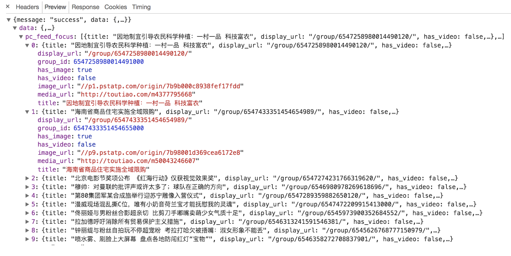
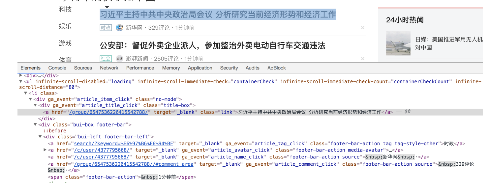
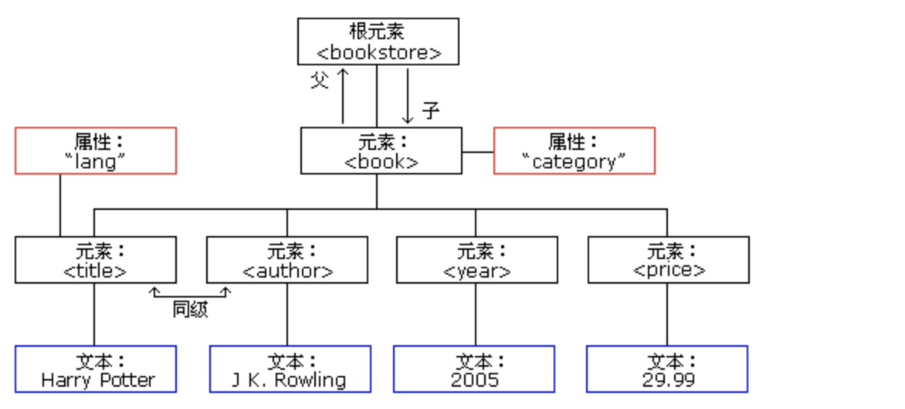
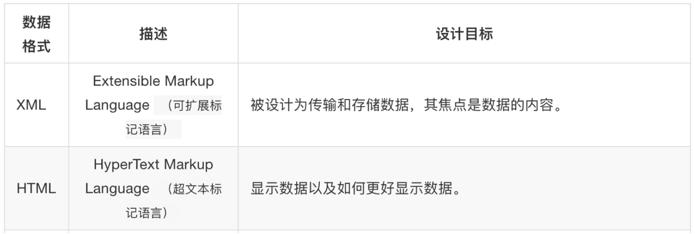
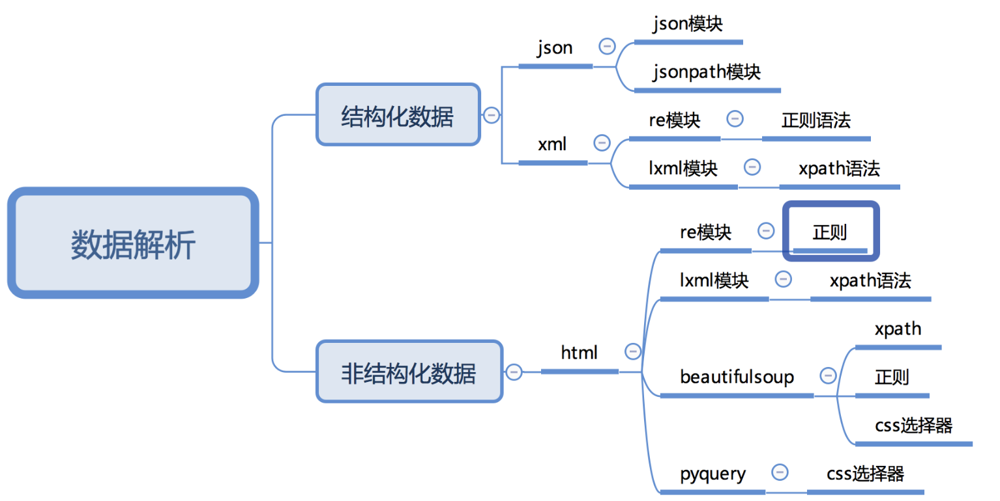

## 数据获取概要
内容:
* 了解响应内容的分类
* 了解xml和html的区别

### 1. 了解响应内容的分类
```renderscript
在发送请求获取响应之后，可能存在多种不同类型的响应内容,因为我们发送的请求都是超文本的内容；
而且很多时候，我们只需要响应内容中的一部分数据；
```

  响应内容的分类为：结构化响应内容与非结构化响应内容。  
#### 1.1 结构化响应内容
   我们响应的数据是按照层次来的，你只需要按照层级进行提取，他就会提取到相同的数据，通常来讲，咱们的结构化数据分为:
json数据与xml数据。
###### json字符串
* 可以使用re、json等模块来提取特定数据
* json字符串的例子如下图


#### 1.2 非结构化响应内容
  爬虫时候最常见的就是返回的咱们html的字符串，此是非结构化的数据。
  * html字符串
    * 可以使用re、lxml等模块来提取特定数据
    * html字符串的例子如下图
    

### 2. 了解xml和html的区别
```renderscript
要搞清楚html和xml的区别，首先需要我们来认识xml
```

#### 2.1 认识xml
```renderscript
xml是一种可扩展标记语言，样子和html很像，功能更专注于对传输和存储数据

xml标签可以自定义
```

```renderscript
<bookstore>
<book category="COOKING">
  <title lang="en">Everyday Italian</title> 
  <author>Giada De Laurentiis</author> 
  <year>2005</year> 
  <price>30.00</price> 
</book>
<book category="CHILDREN">
  <title lang="en">Harry Potter</title> 
  <author>J K. Rowling</author> 
  <year>2005</year> 
  <price>29.99</price> 
</book>
<book category="WEB">
  <title lang="en">Learning XML</title> 
  <author>Erik T. Ray</author> 
  <year>2003</year> 
  <price>39.95</price> 
</book>
</bookstore>
```


上面的xml内容可以表示为下面的树结构:
  

#### 2.2 xml和html的区别

```renderscript
二者区别如下图
```
  

* html：
  * 超文本标记语言
  * 为了更好的显示数据，侧重点是为了显示
* xml：
  * 可扩展标记语言
  * 为了传输和存储数据，侧重点是在于数据内容本身
  

#### 2.3 常用数据解析方法
   

性能方面：正则模块>lxml>beautifulsoup
