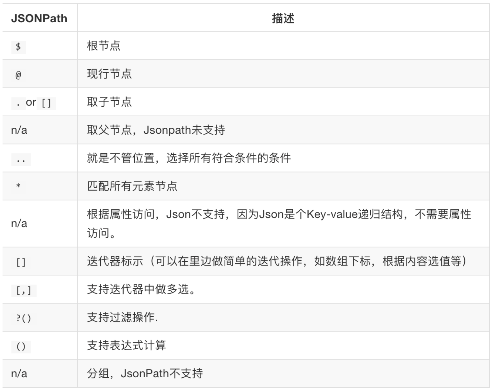
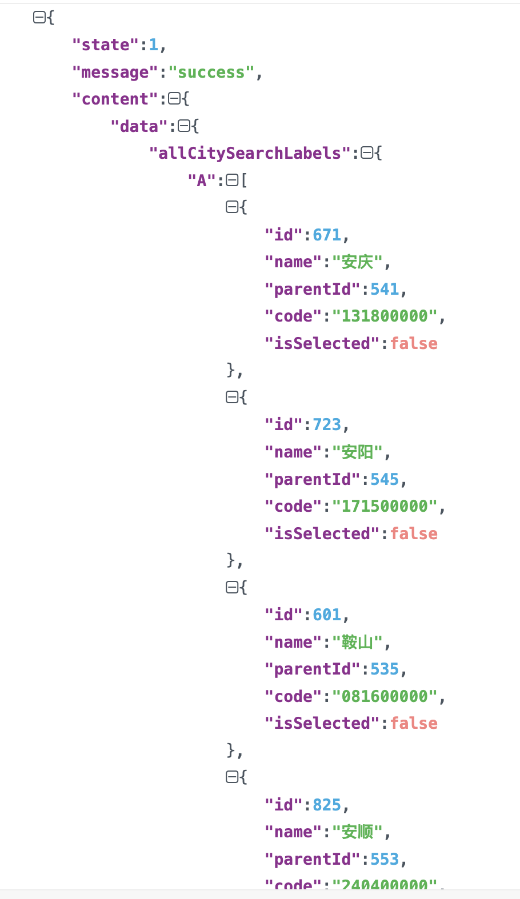

## 数据提取jsonpath模块
知识点
* 了解jsonpath模块的使用场景
* 掌握jsonpath模块的使用

### 1. jsonpath模块的使用场景
```renderscript
如果有一个多层嵌套的复杂字典，想要根据key和下标来批量提取value，这是比较困难的。jsonpath模块就能解决这个痛点，接下来我们就来学习jsonpath模块
```


### 2. 掌握jsonpath模块的使用
#### 2.1 jsonpath模块的安装
```renderscript
jsonpath是第三方模块，需要额外安装
```  

安装指令

```renderscript
pip install jsonpath
```

#### 2.2 jsonpath模块提取数据的方法

```renderscript
from jsonpath import jsonpath
ret = jsonpath('需要解析的字典', 'jsonpath语法规则字符串')
```

#### 2.3 jsonpath的语法  
 jsonpath的语法规则如下：
    
 但是我们在实际工作中主要是运用到3个语法：
 ```renderscript
 $  根节点(最外层的大括号)
 .  子节点
 .. 内部任意位置（子孙节点）
```

简单举例:

```renderscript
'''
多层嵌套的字典，我们如何获取最里面的值
'''

from jsonpath import jsonpath

data = {'key1': {'key2': {'key3': {'key4': {'key5': {'key6': 'python'}}}}}}

# 一: 使用最原始的字典获取方案
print(f'使用最原始的字典获取方案: {data["key1"]["key2"]["key3"]["key4"]["key5"]["key6"]}')

# 二: 使用jsonpath的子节点获取
print(f'使用jsonpath的子节点获取:{jsonpath(data,("$.key1.key2.key3.key4.key5.key6"))[0]}')

# 三：使用jsonpath的任意节点获取
print(f'使用jsonpath的任意节点获取:{jsonpath(data,("$..key6"))[0]}')
```

#### 2.4 jsonpath使用示例
解析book_dict并获取里面的各个书籍的价格：price。
获取自行车的颜色。  

```renderscript
from jsonpath import jsonpath
import json
'''
解析获取：
1、解析book_dict并获取里面的各个书籍的价格：price。
2、获取自行车的颜色。
'''

book_str = '''{
  "store": {
    "book": [
      { "category": "reference",
        "author": "Nigel Rees",
        "title": "Sayings of the Century",
        "price": 8.95
      },
      { "category": "fiction",
        "author": "Evelyn Waugh",
        "title": "Sword of Honour",
        "price": 12.99
      },
      { "category": "fiction",
        "author": "Herman Melville",
        "title": "Moby Dick",
        "isbn": "0-553-21311-3",
        "price": 8.99
      },
      { "category": "fiction",
        "author": "J. R. R. Tolkien",
        "title": "The Lord of the Rings",
        "isbn": "0-395-19395-8",
        "price": 22.99
      }
    ],
    "bicycle": {
      "color": "red",
      "price": 19.95
    }
  }
}'''

book_dict = json.loads(book_str)
# 1、解析book_dict并获取里面的各个书籍的价格：price。

print(f'解析book_dict并获取里面的各个书籍的价格:{jsonpath(book_dict,"$..price")}')
# 2、获取自行车的颜色,由于颜色color是单一的属性
print(f'获取自行车的颜色:{jsonpath(book_dict,"$..color")}')
```

  输出的结果为：
```renderscript
解析book_dict并获取里面的各个书籍的价格:[8.95, 12.99, 8.99, 22.99, 19.95]
获取自行车的颜色:['red']
```

#### 2.5、jsonpath练习

```renderscript
我们以拉勾网城市JSON文件 http://www.lagou.com/lbs/getAllCitySearchLabels.json 为例，获取所有城市的名字的列表，并写入文件。
```
 
 其中json格式如下:
   

代码如下所示：
```renderscript
'''
获取requests请求返回的数据，然后解析获取里面的以A开头的城市名跟所有城市名
'''

import requests
import json
from jsonpath import jsonpath

headers = {
    'User-Agent': 'Mozilla/5.0 (Macintosh; Intel Mac OS X 10_15_7) AppleWebKit/537.36 (KHTML, like Gecko) Chrome/106.0.0.0 Safari/537.36'
}

response = requests.get('https://www.lagou.com/lbs/getAllCitySearchLabels.json', headers=headers)
# 返回的response是字符串形式，json在python3时候会直接将response.content解析成字符串

dict = json.loads(response.content)
# 1.然后解析获取里面的以A开头的城市名
print(jsonpath(dict, '$..A..name'))
# 2.然后解析获取里面的所有城市名
print(jsonpath(dict, '$..name'))
```

输出结果为:
```renderscript
['安庆', '安阳', '鞍山', '安顺', '阿拉善盟', '安康', '阿拉尔', '澳门', '阿克苏', '阿里地区']
['安庆', '安阳', '鞍山', '安顺', '阿拉善盟', '安康', '阿拉尔', '澳门', '阿克苏', '阿里地区', '北京', '保定', '包头', '蚌埠', '北海', '滨州', '宝鸡', '百色', '亳州', '毕节', '白银', '保山', '本溪', '巴音郭楞', '巴中', '巴彦淖尔', '成都', '重庆', '长沙', '长春', '常州', '沧州', '郴州', '滁州', '澄迈', '常德', '潮州', '池州', '承德', '赤峰', '昌吉', '楚雄', '朝阳', '东莞', '大连', '德州', '德阳', '达州', '大理', '大同', '东营', '大庆', '丹东', '德宏', '迪庆', '儋州', '大兴安岭', '鄂尔多斯', '鄂州', '恩施', '佛山', '福州', '阜阳', '抚州', '抚顺', '阜新', '广州', '贵阳', '赣州', '桂林', '贵港', '广安', '广元', '甘孜藏族自治州', '甘南', '杭州', '合肥', '惠州', '哈尔滨', '湖州', '海口', '呼和浩特', '邯郸', '淮安', '菏泽', '衡水', '衡阳', '海外', '黄石', '河源', '鹤壁', '淮南', '葫芦岛', '黄冈', '汉中', '怀化', '红河', '淮北', '黄山', '呼伦贝尔', '哈密', '贺州', '河池', '黑河', '济南', '嘉兴', '金华', '江门', '九江', '济宁', '揭阳', '晋中', '吉林', '焦作', '吉安', '锦州', '景德镇', '荆门', '荆州', '佳木斯', '晋城', '酒泉', '济源', '金昌', '昆明', '开封', '克拉玛依', '廊坊', '兰州', '临沂', '洛阳', '柳州', '聊城', '连云港', '乐山', '丽水', '拉萨', '六安', '临汾', '泸州', '漯河', '龙岩', '凉山彝族自治州', '吕梁', '娄底', '丽江', '临沧', '六盘水', '辽源', '陵水黎族自治县', '来宾', '绵阳', '马鞍山', '眉山', '梅州', '茂名', '牡丹江', '南京', '宁波', '南昌', '南宁', '南通', '宁德', '南阳', '南充', '内江', '南平', '莆田', '濮阳', '萍乡', '平顶山', '盘锦', '普洱', '平凉', '攀枝花', '青岛', '泉州', '清远', '曲靖', '秦皇岛', '衢州', '庆阳', '齐齐哈尔', '琼海', '黔南', '七台河', '黔东南', '黔西南', '潜江', '日照', '上海', '深圳', '苏州', '沈阳', '石家庄', '绍兴', '汕头', '宿迁', '上饶', '商丘', '三亚', '韶关', '汕尾', '十堰', '邵阳', '遂宁', '三门峡', '随州', '宿州', '绥化', '四平', '商洛', '三明', '石河子', '朔州', '山南', '双鸭山', '松原', '天津', '太原', '台州', '唐山', '泰州', '泰安', '铜仁', '铜陵', '通化', '通辽', '天水', '铁岭', '铜川', '天门', '武汉', '无锡', '温州', '潍坊', '芜湖', '乌鲁木齐', '威海', '渭南', '梧州', '文山', '武威', '万宁', '文昌', '乌海', '乌兰察布', '西安', '厦门', '徐州', '新乡', '邢台', '咸阳', '襄阳', '西宁', '香港', '信阳', '许昌', '湘潭', '孝感', '咸宁', '仙桃', '新余', '宣城', '兴安盟', '西双版纳', '锡林郭勒盟', '湘西土家族苗族自治州', '忻州', '烟台', '银川', '扬州', '宜宾', '盐城', '宜昌', '运城', '宜春', '岳阳', '榆林', '阳江', '玉林', '延边', '营口', '玉溪', '雅安', '阳泉', '益阳', '延安', '永州', '鹰潭', '伊犁', '云浮', '郑州', '珠海', '中山', '淄博', '肇庆', '漳州', '镇江', '湛江', '遵义', '株洲', '驻马店', '张家口', '周口', '资阳', '长治', '舟山', '枣庄', '自贡', '张掖', '昭通', '中卫', '张家界']
```


 
