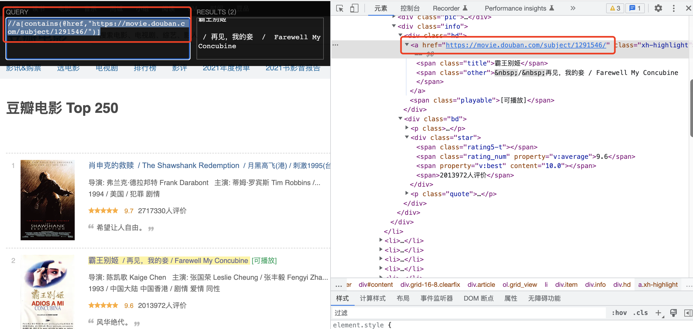

## 数据提取-lxml模块
知识点
* 了解 lxml模块和xpath语法的关系
* 了解 lxml模块的使用场景
* 了解 lxml模块的安装
* 了解 谷歌浏览器xpath helper插件的安装和使用
* 掌握 xpath语法-基础节点选择语法
* 掌握 xpath语法-节点修饰语法
* 掌握 xpath语法-其他常用语法
* 掌握 lxml模块中使用xpath语法定位元素提取属性值或文本内容
* 掌握 lxml模块中etree.tostring函数的使用

### 1. 了解 lxml模块和xpath语法
```renderscript
当响应场景是：html或xml形式的文本提取特定的内容，就需要我们掌握lxml模块的使用和xpath语法。
```

* lxml模块可以利用XPath规则语法，来快速的定位HTML\XML 文档中特定元素以及获取节点信息（文本内容、属性值）。
* XPath (XML Path Language) 是一门在 HTML\XML 文档中查找信息的语言，可用来在 HTML\XML 文档中对元素和属性进行遍历。
  * W3School官方文档:http://www.w3school.com.cn/xpath/index.asp。
* 提取xml、html中的数据需要lxml模块和xpath语法配合使用。

### 2. 谷歌浏览器xpath helper插件的安装和使用
```renderscript
要想利用lxml模块提取数据，需要我们掌握xpath语法规则。接下来我们就来了解一下xpath helper插件，它可以帮助我们练习xpath语法,验证我们的xpath语法是否正确。
```

#### 2.1 谷歌浏览器xpath helper插件的作用
```renderscript
在谷歌浏览器中对当前页面测试xpath语法规则(当前页面的xpath语法规则校验)
```

#### 2.2 谷歌浏览器xpath helper插件的安装和使用
```renderscript
我们以windos为例进行xpath helper的安装
```
###### xpath helper插件的安装
1. 下载Chrome插件 XPath Helper
      * 可以在chrome应用商城进行下载，如果无法下载，也可以从下面的链接进行下载
      * 下载地址：https://pan.baidu.com/s/1UM94dcwgus4SgECuoJ-Jcg 密码:337b

2. 在window系统下把文件的后缀名crx改为rar，然后解压到同名文件夹中，在mac系统下是不需要修改文件后缀名的。
3. 把解压后的文件夹拖入到已经开启开发者模式的chrome浏览器扩展程序界面。
  
4. 重启浏览器后，访问url之后在页面中点击xpath图标，就可以使用了
 
  左侧是查询，右侧是校验的结果。
  
### 3. xpath的节点关系
```renderscript
学习xpath语法需要先了解xpath中的节点关系
```  
#### 3.1 xpath中的节点是什么
```renderscript
每个html、xml的标签我们都称之为节点，其中最顶层的节点称为根节点。我们以xml为例，html也是一样的
```

   

#### 3.2 xpath中节点的关系
   

### 4. xpath语法-基础节点选择语法
```renderscript
1. XPath 使用路径表达式来选取 XML 文档中的节点或者节点集。
2. 这些路径表达式和我们在常规的电脑文件系统中看到的表达式非常相似。
3. 使用chrome插件选择标签时候，选中时，选中的标签会添加属性class="xh-highlight"
```

  比如: 简单使用xpath helper;我们在没有使用xpath helper的时候，html会出现下面这种
  
  然后我们在xpath helper中使用html选择的时候会出现如下效果：  
  

#### 4.1 xpath定位节点以及提取属性或文本内容的语法
  
  其中，如上的nodename就是我们之前说的标签名。  

#### 4.2 语法练习

```
/	从根节点选取、或者是元素和元素间的过渡---代表的是绝对路径。
```

   比如如上我们获取html下的head的时候，会出现:
 

```
//	从匹配选择的当前节点选择文档中的节点，而不考虑它们的位置---代表的是相对路径。
```

  我们通过:html/title是找不到title的
   
  但是我们通过  是可以找到我们的title的
   
  当然我们使用：//title的时候，其实就是相对于整个html文档的，其实也是可以获取到我们的title的
     
  
  
```renderscript
.	选取当前节点。
..	选取当前节点的父节点。
```
  比如我们根据//title获取到我们的head节点，我们可以通过://title/..
    
  
  我们发现上面/隔开的就是一个节点(标签)。
  
```renderscript
@	选取属性。
text()	选取文本。
```    

  上面2个标签永远添加到最后节点的末尾，用于作数据提取。  
      
    
   如果我们需要提取链接:href
      
    
### 5. xpath语法-节点修饰语法(特定节点的语法)  
   4中我们讲解了xpath语法中获取基础节点的语法，现在我们主要讲解下获取特定节点的语法，也就是我们的
节点修饰语法。  
   上一节我们讲解了根据相对路径或者绝对路径去找数据，但是我们想又不能写的那么长。
   
   比如我们现在需要找如下div；
      
     针对于上种情况，我们就需要使用节点修饰语法，我们已经找到了所有的div,此时我们需要修饰我们
   我们要找的div,以此来找到这个节点。此时我们就需要用节点修饰语法：方括号[]； 
   
#### 5.1 节点修饰语法
   节点修饰语法我们主要分为如下4类：
   1、通过索引修饰节点
      
   last()---选取属于 bookstore 子元素的最后一个 book 元素。
   last()-1--选取属于 bookstore 子元素的倒数第二个 book 元素。
   position()--指代的是所有，用于区间选择；指代的是位置。
   position()>10 -- 指代的所有标签中位置大于10的
   
   2、通过属性值来修饰一个节点  
    
   凡事出现在方括号[]中是修饰，凡事在/后就是取值。
   
   3、通过子节点的值来修饰
    book[price>35.00]--比如我们定义一个节点，要求其价格是大于35的。  
     
    比如如上所示，我们的豆瓣电影是top250，但是我们还需要更加深入的获取电影信息，这个时候
    我们需要获取电影评分达到一定分数的。  
     
    我们可以看到span评分中大于等于9.6的有5部作品。  

    //div[span[2]>=9.6]-->获取一个div，我们修饰它，我们使用span[2]>=9.6来修饰它，
    是使用span来修饰div，所以我们最终获取到的数值就是div标签。  
    
    
   4、通过包含修饰  
   比如：//div[@id="s_top_wrap"]/@class；我们是通过id="s_top_wrap"来修饰div;修饰
   的div假如我们的id变化了：id="s_top_wrapr";
   
   ```renderscript
   //a[contains(@href,"https://movie.douban.com/subject/1291546/")]
    解释：我们获取a标签，然后需要修饰它，则使用[];假如我们的a属性的href的后缀id可能变化
    所以我们需要使用contains，左边的标签href,由于是属性值，则需要使用@,由于包含是只要有一个即可；
    部门包含也可以，所以我们使用：a[contains(@href,"https://movie.douban.com/")]也可以。
   ```
      
   
   因此我们可以获取到：
     
   
  总结如下：
   
  
### 6. xpath语法-其他常用节点选择语法(通配语法)
```renderscript
可以通过通配符来选取未知的html、xml的元素
```

#### 6.1 选取未知节点的语法
  

```renderscript
1、*	匹配任何元素节点。
```

比如我们现在需要找到所有节点文本内容包含"下一页"的。  
 

```renderscript
2、node()	匹配任何类型的节点。
```

```renderscript
3、| 或者
```
比如我们现在的从58租房页面里面获取租房信息的时候，由于里面的程序员可能换了很多批，这个时候
我们通过：//td/a 可以获取到出租页面的元素
 

但是我们在另一个页面如下不管用的时候。
 

这个时候我们就需要使用
 
我们就可以获取到两套页面的数据元素了。  

### 7. lxml模块的安装与使用示例
```renderscript
lxml模块是一个第三方模块，安装之后使用
```  

#### 7.1 lxml模块的安装
对发送请求获取的xml或html形式的响应内容进行提取
```renderscript
pip/pip3 install lxml
```

#### 7.2 爬虫对html提取的内容
* 提取标签中的文本内容
* 提取标签中的属性的值
  * 比如，提取a标签中href属性的值，获取url，进而继续发起请求
  
#### 7.3 lxml模块的使用
1. 导入lxml 的 etree 库
   ```renderscript
   from lxml import etree
   ```
2. 利用etree.HTML，将html字符串（bytes类型或str类型）转化为Element对象，Element对象具有xpath的方法，返回结果的列表
   ```renderscript
   html = etree.HTML(text) 
   ret_list = html.xpath("xpath语法规则字符串")
   ```
3. xpath方法返回列表的三种情况
   * 返回空列表：根据xpath语法规则字符串，没有定位到任何元素
   * 返回由字符串构成的列表：xpath字符串规则匹配的一定是文本内容或某属性的值
   * 返回由Element对象构成的列表：xpath规则字符串匹配的是标签，列表中的Element对象可以继续进行xpath
  
   
#### 7.4 lxml模块使用示例  
  案例如下所示：

```renderscript
from lxml import etree

text = ''' 
<div> 
  <ul> 
    <li class="item-1">
      <a href="link1.html">first item</a>
    </li> 
    <li class="item-1">
      <a href="link2.html">second item</a>
    </li> 
    <li class="item-inactive">
      <a href="link3.html">third item</a>
    </li> 
    <li class="item-1">
      <a href="link4.html">fourth item</a>
    </li> 
    <li class="item-0">
      a href="link5.html">fifth item</a>
  </ul> 
</div>
'''

# 创建element对象
html = etree.HTML(text)

# 1. 获取link1.html的a的内容:我们用修饰语句，修饰a标签，其属性href为link1.html,然后获取标签的文本内容；返回的是一个数组
link1_text = html.xpath('//a[@href="link1.html"]/text()')
print(link1_text)  # 输出:['first item']
print(link1_text[0])  # 输出:first item

# 2. 获取所有a标签的内容:text
link_text = html.xpath('//a/text()')
print(link_text)  # 输出:['first item', 'second item', 'third item', 'fourth item']

# 3. 获取所有a标签的属性href的内容
link_href = html.xpath('//a/@href')
print(link_href)  # 输出:['link1.html', 'link2.html', 'link3.html', 'link4.html']

# 4.如何将上面两个数据的对应数组匹配呢? 比如:link1.html对应的是first item
# 思路：将link_text数组遍历 获取其数组下标，然后根据下标从link_href获取数据即可

for text in link_text:
    inx = link_text.index(text)
    print(link_href[inx], text)

print("-----------------------------")
# 4.上面这种做法比较low；用zip方法：代表以相同的索引遍历多个列表；但是这种方法的话，如果有一个a的text缺失时候会混乱
for text, href in zip(link_text, link_href):
    print(href, text)

# 4.还有一种方法是：先获取所有的a，然后我们遍历所有的a；
print("-----------------------------")
a_list = html.xpath('//a')
# print(a_list)
for a in a_list:
    print(a.xpath('./@href')[0], a.xpath('./text()')[0]) # 输出:link1.html first item
    print(a.xpath('.//@href')[0], a.xpath('.//text()')[0])  # 输出:link1.html first item
    print(a.xpath('.//@href')[0], a.xpath('text()')[0])  # 输出:link1.html first item
```
      
      
### 10. lxml模块中etree.tostring函数的使用
  etree.tostring将我们的Element对象转换成byte类型的字符串。

```renderscript
运行下边的代码，观察对比html的原字符串和打印输出的结果

from lxml import etree

text = ''' 
<div> 
  <ul> 
    <li class="item-1">
      <a href="link1.html">first item</a>
    </li> 
    <li class="item-1">
      <a href="link2.html">second item</a>
    </li> 
    <li class="item-inactive">
      <a href="link3.html">third item</a>
    </li> 
    <li class="item-1">
      <a href="link4.html">fourth item</a>
    </li> 
    <li class="item-0">
      a href="link5.html">fifth item</a>
  </ul> 
</div>
'''

html = etree.HTML(text)
etree_tostring = etree.tostring(html)
print(etree_tostring)

```

数据的结果为:

```renderscript
b'<html><body><div> \n  <ul> \n    <li class="item-1">\n      <a href="link1.html">first item</a>\n    </li> \n    <li class="item-1">\n      <a href="link2.html">second item</a>\n    </li> \n    <li class="item-inactive">\n      <a href="link3.html">third item</a>\n    </li> \n    <li class="item-1">\n      <a href="link4.html">fourth item</a>\n    </li> \n    <li class="item-0">\n      a href="link5.html"&gt;fifth item\n  </li></ul> \n</div>\n</body></html>'
```

```renderscript
比如：我们使用:print(etree_tostring.decode())
输出的结果为:
<html><body><div> 
  <ul> 
    <li class="item-1">
      <a href="link1.html">first item</a>
    </li> 
    <li class="item-1">
      <a href="link2.html">second item</a>
    </li> 
    <li class="item-inactive">
      <a href="link3.html">third item</a>
    </li> 
    <li class="item-1">
      <a href="link4.html">fourth item</a>
    </li> 
    <li class="item-0">
      a href="link5.html"&gt;fifth item
  </li></ul> 
</div>
</body></html>
```

#### 10.1 结论
打印结果和原来相比：
1. 自动补全原本缺失的li标签;比如补全了li标签。
2. 自动补全html等标签;比如补全了:html跟body标签。
3. lxml.etree.HTML(html_str)可以自动补全标签。
4. lxml.etree.tostring函数可以将转换为Element对象再转换回html字符串。
5. 爬虫如果使用lxml来提取数据，应该以lxml.etree.tostring的返回结果作为提取数据的依据。


  
    
  
  
  


  
  
 

 


