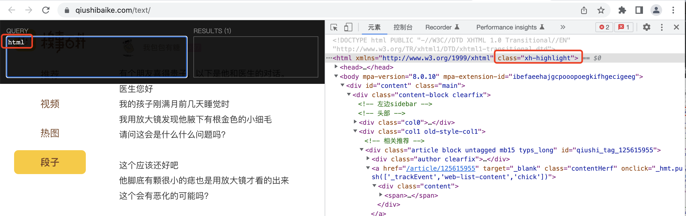

## 数据提取-lxml模块
知识点
* 了解 lxml模块和xpath语法的关系
* 了解 lxml模块的使用场景
* 了解 lxml模块的安装
* 了解 谷歌浏览器xpath helper插件的安装和使用
* 掌握 xpath语法-基础节点选择语法
* 掌握 xpath语法-节点修饰语法
* 掌握 xpath语法-其他常用语法
* 掌握 lxml模块中使用xpath语法定位元素提取属性值或文本内容
* 掌握 lxml模块中etree.tostring函数的使用

### 1. 了解 lxml模块和xpath语法
```renderscript
当响应场景是：html或xml形式的文本提取特定的内容，就需要我们掌握lxml模块的使用和xpath语法。
```

* lxml模块可以利用XPath规则语法，来快速的定位HTML\XML 文档中特定元素以及获取节点信息（文本内容、属性值）。
* XPath (XML Path Language) 是一门在 HTML\XML 文档中查找信息的语言，可用来在 HTML\XML 文档中对元素和属性进行遍历。
  * W3School官方文档:http://www.w3school.com.cn/xpath/index.asp。
* 提取xml、html中的数据需要lxml模块和xpath语法配合使用。

### 2. 谷歌浏览器xpath helper插件的安装和使用
```renderscript
要想利用lxml模块提取数据，需要我们掌握xpath语法规则。接下来我们就来了解一下xpath helper插件，它可以帮助我们练习xpath语法,验证我们的xpath语法是否正确。
```

#### 2.1 谷歌浏览器xpath helper插件的作用
```renderscript
在谷歌浏览器中对当前页面测试xpath语法规则(当前页面的xpath语法规则校验)
```

#### 2.2 谷歌浏览器xpath helper插件的安装和使用
```renderscript
我们以windos为例进行xpath helper的安装
```
###### xpath helper插件的安装
1. 下载Chrome插件 XPath Helper
      * 可以在chrome应用商城进行下载，如果无法下载，也可以从下面的链接进行下载
      * 下载地址：https://pan.baidu.com/s/1UM94dcwgus4SgECuoJ-Jcg 密码:337b

2. 在window系统下把文件的后缀名crx改为rar，然后解压到同名文件夹中，在mac系统下是不需要修改文件后缀名的。
3. 把解压后的文件夹拖入到已经开启开发者模式的chrome浏览器扩展程序界面。
  
4. 重启浏览器后，访问url之后在页面中点击xpath图标，就可以使用了
 
  左侧是查询，右侧是校验的结果。
  
### 3. xpath的节点关系
```renderscript
学习xpath语法需要先了解xpath中的节点关系
```  
#### 3.1 xpath中的节点是什么
```renderscript
每个html、xml的标签我们都称之为节点，其中最顶层的节点称为根节点。我们以xml为例，html也是一样的
```

   

#### 3.2 xpath中节点的关系
   

### 4. xpath语法-基础节点选择语法
```renderscript
1. XPath 使用路径表达式来选取 XML 文档中的节点或者节点集。
2. 这些路径表达式和我们在常规的电脑文件系统中看到的表达式非常相似。
3. 使用chrome插件选择标签时候，选中时，选中的标签会添加属性class="xh-highlight"
```

  比如: 简单使用xpath helper;我们在没有使用xpath helper的时候，html会出现下面这种
  
  然后我们在xpath helper中使用html选择的时候会出现如下效果：  
  

#### 4.1 xpath定位节点以及提取属性或文本内容的语法
  
  其中，如上的nodename就是我们之前说的标签名。  

```
/	从根节点选取、或者是元素和元素间的过渡---代表的是绝对路径。
```

   比如如上我们获取html下的head的时候，会出现:
 

```
//	从匹配选择的当前节点选择文档中的节点，而不考虑它们的位置---代表的是相对路径。
```

  我们通过:html/title是找不到title的
   
  但是我们通过  是可以找到我们的title的
   
  当然我们使用：//title的时候，其实就是相对于整个html文档的，其实也是可以获取到我们的title的
     
  
  
```renderscript
.	选取当前节点。
..	选取当前节点的父节点。
```
  比如我们根据//title获取到我们的head节点，我们可以通过://title/..
    
  
  我们发现上面/隔开的就是一个节点(标签)。
  
```renderscript
@	选取属性。
text()	选取文本。
```    

  上面2个标签永远添加到最后节点的末尾，用于作数据提取。  
      
    
   如果我们需要提取链接:href
      
  
  
  


  
  
 

 


