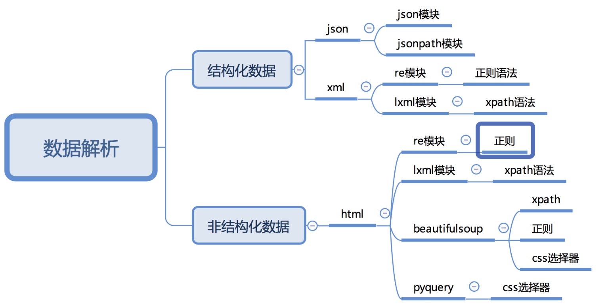

## 1、selenium的介绍
selenium自动化测试框架在爬虫中的应用，selenium能够大幅降低爬虫的编写难度，但是也同样会大幅降低爬虫的爬取速度。
在逼不得已的情况下我们可以使用selenium进行爬虫的编写。

知识点：
* 了解 selenium的工作原理
* 了解 selenium以及chromedriver的安装
* 掌握 标签对象click点击以及send_keys输入

### 1. selenium运行效果展示
```renderscript
1. Selenium是一个Web的自动化测试工具，最初是为网站自动化测试而开发的，
2. Selenium可以直接调用浏览器，它支持所有主流的浏览器（包括PhantomJS这些无界面的浏览器），可以接收指令，让浏览器自动加载页面，获取需要的数据，甚至页面截屏等。
3. 我们可以使用selenium很容易完成之前编写的爬虫，只是性能会差一些，接下来我们就来看一下selenium的运行效果
```

#### 1.1 chrome浏览器的运行效果
```renderscript
在下载好chromedriver以及安装好selenium模块后，执行下列代码并观察运行的过程。
```

chromedriver下载地址：
http://chromedriver.storage.googleapis.com/index.html
http://npm.taobao.org/mirrors/chromedriver/
两个地址都可以下载，根据自己的chrome浏览器的版本选择下载即可。  

mac下安装参考:http://t.zoukankan.com/jasmine0112-p-12745493.html  

```renderscript
from selenium import webdriver 

# 如果driver没有添加到了环境变量，则需要将driver的绝对路径赋值给executable_path参数
# driver = webdriver.Chrome(executable_path='/home/worker/Desktop/driver/chromedriver')

# 如果driver添加了环境变量则不需要设置executable_path
driver = webdriver.Chrome()

# 向一个url发起请求
driver.get("http://www.baidu.cn/")

# 把网页保存为图片，69版本以上的谷歌浏览器将无法使用截图功能
# driver.save_screenshot("baidu.png")

print(driver.title) # 打印页面的标题

# 退出模拟浏览器
driver.quit() # 一定要退出！不退出会有残留进程！
```

运行之后的效果为:  
代码自动打开了以下浏览器：

然后马上推出了，并且打印出了baidu网址的title:百度一下，你就知道  

因为需要打开一个浏览器，然后又需要将打开的浏览器文章中的内容title标题给打印出来，所以就性能来说，缺失要低一些。  


#### 1.2 phantomjs无界面浏览器的运行效果
```renderscript
PhantomJS 是一个基于Webkit的“无界面”(headless)浏览器，它会把网站加载到内存并执行页面上的 JavaScript。下载地址：http://phantomjs.org/download.html
```
###### Download PhantomJS
```renderscript
Mac OS X
Download phantomjs-2.1.1-macosx.zip (16.4 MB) and extract (unzip) the content.
Note: For this static build, the binary is self-contained with no external dependency. It will run on a fresh install of OS X 10.7 (Lion) or later versions. There is no requirement to install Qt or any other libraries.
```

###### 运行代码
```renderscript
from selenium import webdriver 
# 指定driver的绝对路径
driver = webdriver.PhantomJS(executable_path='/Users/xiexinming/software/phantomjs-2.1.1-macosx/bin/phantomjs') 
# driver = webdriver.Chrome(executable_path='/home/worker/Desktop/driver/chromedriver')

# 向一个url发起请求
driver.get("http://www.itcast.cn/")

# 把网页保存为图片
driver.save_screenshot("itcast.png")

# 退出模拟浏览器
driver.quit() # 一定要退出！不退出会有残留进程！
```

最后得出的结果为如下：
   


#### 1.3 无头浏览器与有头浏览器的使用场景
* 通常在开发过程中我们需要查看运行过程中的各种情况所以通常使用有头浏览器(能打开界面的浏览器)
* 在项目完成进行部署的时候，通常平台采用的系统都是服务器版的操作系统，服务器版的操作系统必须使用无头浏览器才能正常运行(phantomjs)

