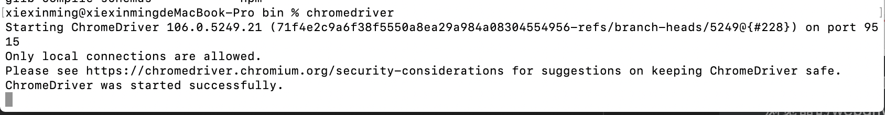

## 1、selenium的介绍
selenium自动化测试框架在爬虫中的应用，selenium能够大幅降低爬虫的编写难度，但是也同样会大幅降低爬虫的爬取速度。
在逼不得已的情况下我们可以使用selenium进行爬虫的编写。

知识点：
* 了解 selenium的工作原理
* 了解 selenium以及chromedriver的安装
* 掌握 标签对象click点击以及send_keys输入

### 1. selenium运行效果展示
```renderscript
1. Selenium是一个Web的自动化测试工具，最初是为网站自动化测试而开发的，
2. Selenium可以直接调用浏览器，它支持所有主流的浏览器（包括PhantomJS这些无界面的浏览器），可以接收指令，让浏览器自动加载页面，获取需要的数据，甚至页面截屏等。
3. 我们可以使用selenium很容易完成之前编写的爬虫，只是性能会差一些，接下来我们就来看一下selenium的运行效果
```

#### 1.1 chrome浏览器的运行效果
```renderscript
在下载好chromedriver以及安装好selenium模块后，执行下列代码并观察运行的过程。
```

chromedriver下载地址：
http://chromedriver.storage.googleapis.com/index.html
http://npm.taobao.org/mirrors/chromedriver/
两个地址都可以下载，根据自己的chrome浏览器的版本选择下载即可。  

mac下安装参考:http://t.zoukankan.com/jasmine0112-p-12745493.html  

```renderscript
from selenium import webdriver 

# 如果driver没有添加到了环境变量，则需要将driver的绝对路径赋值给executable_path参数
# driver = webdriver.Chrome(executable_path='/home/worker/Desktop/driver/chromedriver')

# 如果driver添加了环境变量则不需要设置executable_path
driver = webdriver.Chrome()

# 向一个url发起请求
driver.get("http://www.baidu.cn/")

# 把网页保存为图片，69版本以上的谷歌浏览器将无法使用截图功能
# driver.save_screenshot("baidu.png")

print(driver.title) # 打印页面的标题

# 退出模拟浏览器
driver.quit() # 一定要退出！不退出会有残留进程！
```

运行之后的效果为:  
代码自动打开了以下浏览器：

然后马上推出了，并且打印出了baidu网址的title:百度一下，你就知道  

因为需要打开一个浏览器，然后又需要将打开的浏览器文章中的内容title标题给打印出来，所以就性能来说，缺失要低一些。  


#### 1.2 phantomjs无界面浏览器的运行效果
```renderscript
PhantomJS 是一个基于Webkit的“无界面”(headless)浏览器，它会把网站加载到内存并执行页面上的 JavaScript。下载地址：http://phantomjs.org/download.html
```
###### Download PhantomJS
```renderscript
Mac OS X
Download phantomjs-2.1.1-macosx.zip (16.4 MB) and extract (unzip) the content.
Note: For this static build, the binary is self-contained with no external dependency. It will run on a fresh install of OS X 10.7 (Lion) or later versions. There is no requirement to install Qt or any other libraries.
```

###### 运行代码
```renderscript
from selenium import webdriver 
# 指定driver的绝对路径
driver = webdriver.PhantomJS(executable_path='/Users/xiexinming/software/phantomjs-2.1.1-macosx/bin/phantomjs') 
# driver = webdriver.Chrome(executable_path='/home/worker/Desktop/driver/chromedriver')

# 向一个url发起请求
driver.get("http://www.itcast.cn/")

# 把网页保存为图片
driver.save_screenshot("itcast.png")

# 退出模拟浏览器
driver.quit() # 一定要退出！不退出会有残留进程！
```

最后得出的结果为如下：
   


#### 1.3 无头浏览器与有头浏览器的使用场景
* 通常在开发过程中我们需要查看运行过程中的各种情况所以通常使用有头浏览器(能打开界面的浏览器)
* 在项目完成进行部署的时候，通常平台采用的系统都是服务器版的操作系统，服务器版的操作系统必须使用无头浏览器才能正常运行(phantomjs)

### 2. selenium的作用和工作原理
   我们一般用js或者html/css等语法可以操作我们的浏览器，
  

注意：
1. webdriver本质是一个web-server，对外提供webapi，其中封装了浏览器的各种功能。
2. 不同的浏览器使用各自不同的webdriver,所以针对于不同的浏览器，我们需要下载不同的webdriver。

### 3. selenium的安装以及简单使用
```renderscript
我们以谷歌浏览器的chromedriver为例
```

#### 3.1 在python虚拟环境中安装selenium模块
```renderscript
pip/pip3 install selenium
```

#### 3.2 下载版本符合的webdriver
```renderscript
以chrome谷歌浏览器为例
```

1. 查看谷歌浏览器的版本
    
    
  
2. 访问https://npm.taobao.org/mirrors/chromedriver，如果前面时效就用这个:http://www.npmmirror.com/ 点击进入不同版本的chromedriver下载页面
    
  
3. 点击notes.txt进入版本说明页面 
    
  
4. 查看chrome和chromedriver匹配的版本
    
  
5. 根据操作系统下载正确版本的chromedriver
    
  
6. 解压压缩包后获取python代码可以调用的谷歌浏览器的webdriver可执行文件
  * windows为chromedriver.exe
  * linux和macos为chromedriver

7. chromedriver环境的配置
  * windows环境下需要将 chromedriver.exe 所在的目录设置为path环境变量中的路径
  * linux/mac环境下，将 chromedriver 所在的目录设置到系统的PATH环境值中
  我们在cmd终端输入:echo $PATH
  查看结果为:/usr/local/bin:/usr/local/sbin:/usr/local/bin:/usr/bin:/bin:/usr/sbin:/sbin
  我们知道系统的环境变量是含有:/usr/local/bin 所以系统运行指令的时候，会首先从各个环境变量下去寻找对应的指令。
  然后执行 cp chromedriver /usr/local/bin/
  chromedriver:
    
  发现我们的chromedriver安装成功了。
  
### 4.selenium的简单使用
```renderscript
接下来我们就通过代码来模拟百度搜索
```  

```renderscript
import time
from selenium import webdriver

# 通过指定chromedriver的路径来实例化driver对象，chromedriver放在当前目录。
# driver = webdriver.Chrome(executable_path='./chromedriver')
# chromedriver已经添加环境变量
driver = webdriver.Chrome()
# 控制浏览器访问url地址
driver.get("https://www.baidu.com/")

# 在百度搜索框中搜索'python'
# 我们通过元素定位，定位到我们需要在baidu浏览器里面需要输入的字体：driver.find_element_by_id('kw')
# 然后在浏览器中输入:python；send_keys('python')
driver.find_element_by_id('kw').send_keys('python')
# 点击'百度搜索'
# 定位到su的点击按钮。然后执行点击操作：click()
driver.find_element_by_id('su').click()

time.sleep(6)
# 退出浏览器
driver.quit()
```

   
  
1. webdriver.Chrome(executable_path='./chromedriver')中executable参数指定的是下载好的chromedriver文件的路径
2. driver.find_element_by_id('kw').send_keys('python')定位id属性值是'kw'的标签，并向其中输入字符串'python'
3.driver.find_element_by_id('su').click()定位id属性值是su的标签，并点击
   * click函数作用是：触发标签的js的click事件

