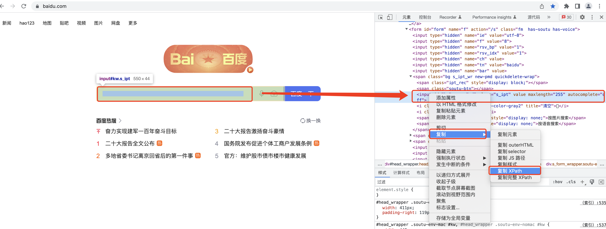
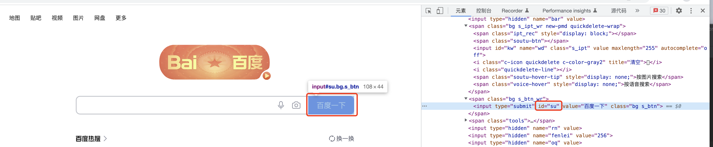
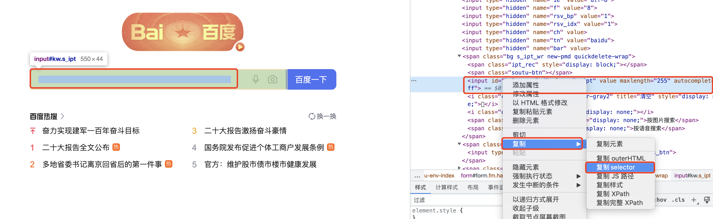
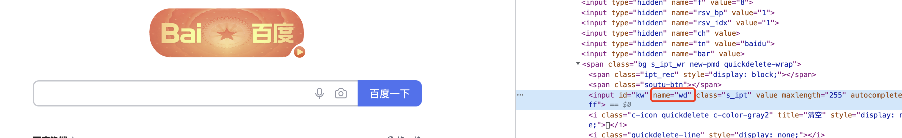
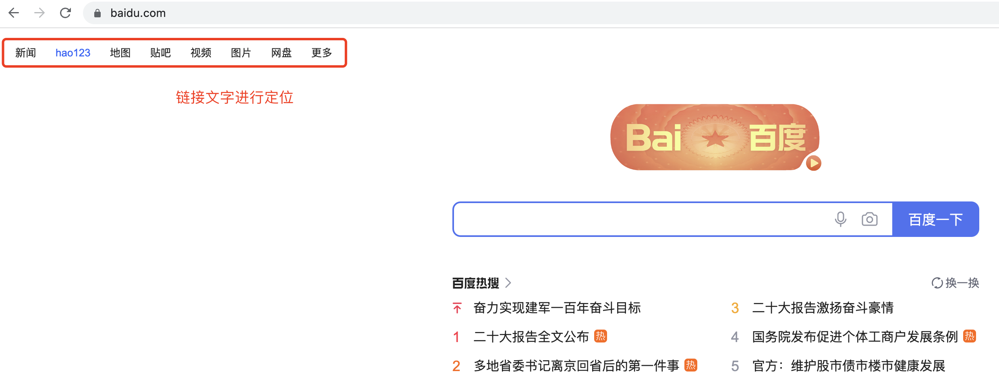

## selenium提取数据
知识点：
 * 了解driver对象的常用属性和方法。
 * 掌握driver对象定位标签元素获取标签对象的方法。
 * 掌握标签对象提取文本和属性值的方法。

### 1. driver对象的常用属性和方法
```renderscript
在使用selenium过程中，实例化driver对象后，driver对象有一些常用的属性和方法
```

1. driver.page_source：当前标签页浏览器渲染之后的网页源代码。
2. driver.current_url：当前标签页的url。
3. driver.close()：关闭当前标签页，如果只有一个标签页则关闭整个浏览器。
4. driver.quit()：关闭浏览器。
5. driver.forward()：页面前进。
6. driver.back()：页面后退。
7. driver.screen_shot(img_name)：页面截图；场景：1）这个可以用于验证码截图，然后抠图。2）用于记录访问历史。

### 2. driver对象定位标签元素获取标签对象的方法

#### 2.1 系统理论
```renderscript
在selenium中可以通过多种方式来定位标签，返回标签元素对象
```

```renderscript
find_element_by_id                         (返回一个元素)
find_element(s)_by_class_name             (根据类名获取元素列表)
find_element(s)_by_name                 (根据标签的name属性值返回包含标签对象元素的列表)
find_element(s)_by_xpath                 (返回一个包含元素的列表)
find_element(s)_by_link_text             (根据连接文本获取元素列表)
find_element(s)_by_partial_link_text     (根据链接包含的文本获取元素列表)
find_element(s)_by_tag_name             (根据标签名获取元素列表)
find_element(s)_by_css_selector         (根据css选择器来获取元素列表)
```

* 注意：
  * find_element和find_elements的区别：
    * 多了个s就返回列表，没有s就返回匹配到的第一个标签对象
    * find_element匹配不到就抛出异常，find_elements匹配不到就返回空列表
  * by_link_text和by_partial_link_tex的区别：全部文本和包含某个文本
  * 以上函数的使用方法
    * driver.find_element_by_id('id_str')
    
#### 2.2 系统演示  
   我们以baidu.com为准来演示我们的以上获取获取元素的方法，我们退出baidu.com的登录模式。
   然后我们通过浏览器的开发者工具 定位到我们的浏览器元素，然后提取其xpath：
   
###### xpath获取元素
     
  ```renderscript
    其拷贝出来的xpath语法为: //*[@id="kw"]
    # 根据xpath获取元素对象 ，获取百度的搜索栏的输入框
    driver.find_element_by_xpath('//*[@id="kw"]').send_keys("python")
    # 以上我们只管获取元素，不尽兴数据提取，因为数据提取在selenium中有专门的语法实现
  ```
 
###### id获取元素
    
  找到我们的浏览器点击的图标id，并发送点击的操作
    ```
    driver.find_element_by_id("su").click()
    ```

###### css获取元素  
    
  ```renderscript
  # 通过css选择器进行元素定位
  driver.find_element_by_css_selector("#kw").send_keys("python")
  ```

###### name属性获取值
  
```renderscript
# 通过name属性进行元素定位
driver.find_element_by_name("wd")
```

###### 通过class属性进行元素定位

```renderscript
# 通过class属性进行元素定位
driver.find_element_by_class_name("s_ipt").send_keys("python")
```

###### 通过链接文本进行元素定位  
  

```renderscript
# 通过link_text进行元素定位
driver.find_element_by_link_text("hao123").click()

# 通过link_text进行元素定位:部分链接文本
driver.find_element_by_partial_link_text("hao").click()
```
  
### 3. 标签对象提取文本内容和属性值
  上面我们已经获取到了我们的标签对象，现在我们需要根据我们获取到的标签然后做进一步处理。标签对象提取文本内容和属性值。
```renderscript
find_element仅仅能够获取元素，不能够直接获取其中的数据，如果需要获取数据需要使用以下方法。
```

* 对元素执行点击操作element.click()
  * 对定位到的标签对象进行点击操作
* 向输入框输入数据element.send_keys(data)
  * 对定位到的标签对象输入数据
* 获取文本element.text
  * 通过定位获取的标签对象的text属性，获取文本内容
* 获取属性值element.get_attribute("属性名")
  * 通过定位获取的标签对象的get_attribute函数，传入属性名，来获取属性的值
  

案例如下：
```renderscript
from selenium import webdriver

url = "http://www.baidu.com"
driver = webdriver.Chrome()
driver.get(url)

# 获取标签对象
w = driver.find_element_by_xpath('//*[@id="kw"]')
# 获取标签对象的文本跟属性
print(w.text, w.get_attribute("class"))

w.click() # 要求我们的标签支持点击
w.send_keys()  # 支持的是text input这类标签
w.clear()  # 对输入框做清空操作
```
    
    
    

