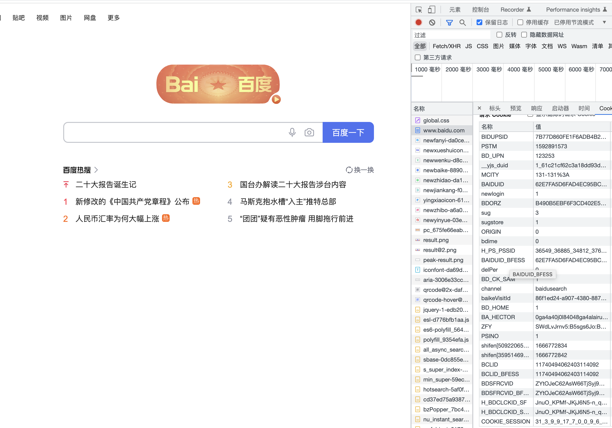
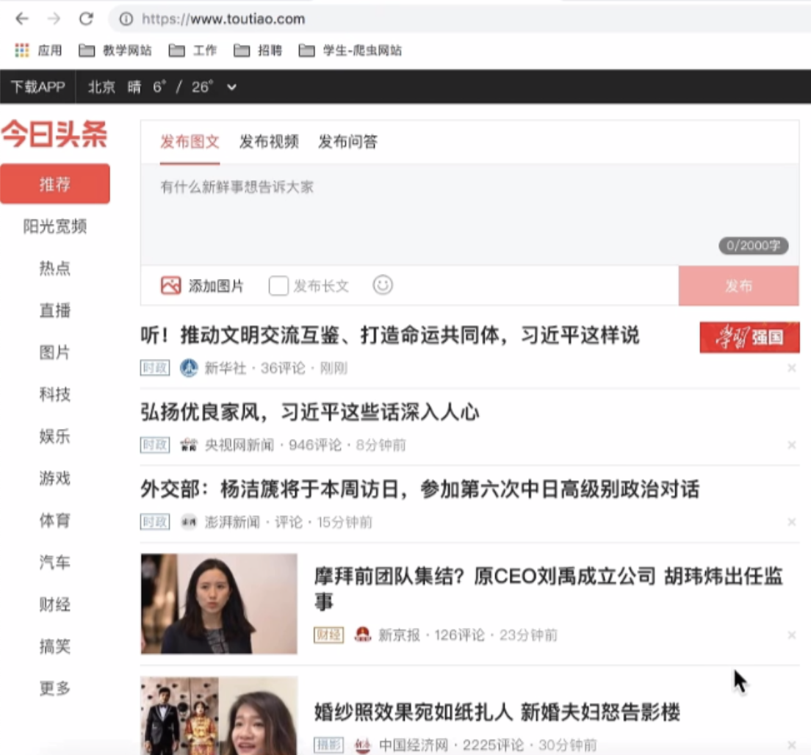
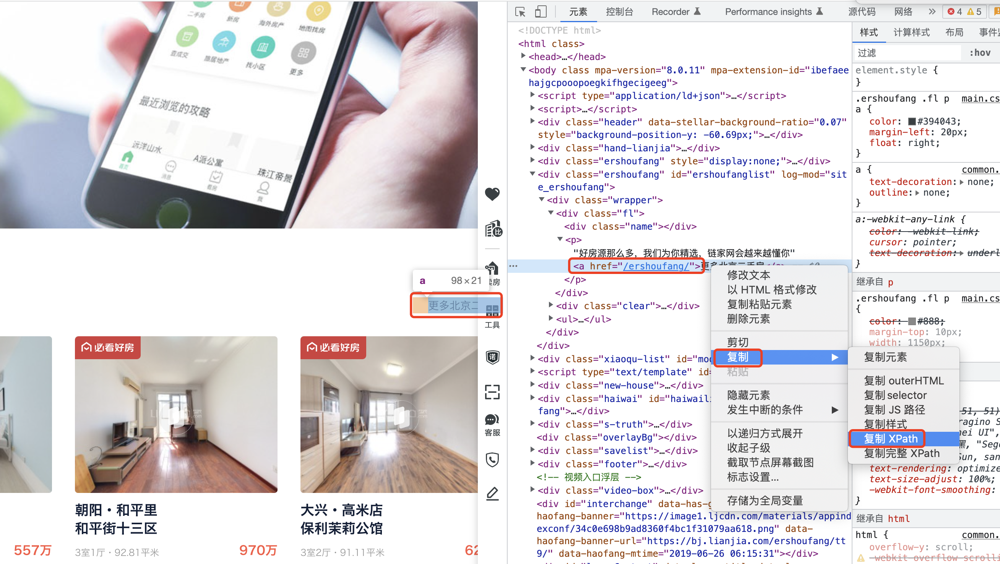
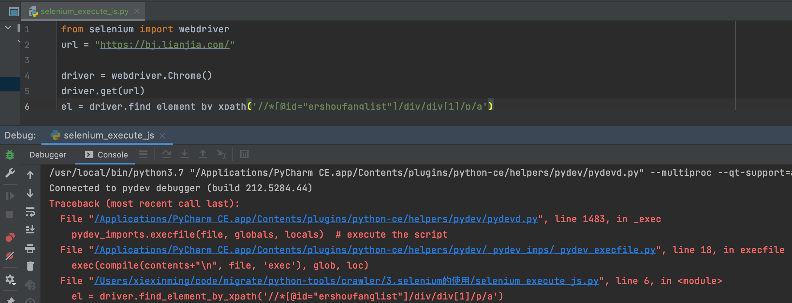
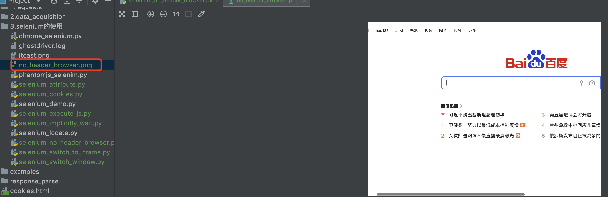

## selenium的其它使用方法
知识点：
  * 掌握 selenium控制标签页的切换
  * 掌握 selenium控制iframe的切换
  * 掌握 利用selenium获取cookie的方法
  * 掌握 手动实现页面等待
  * 掌握 selenium控制浏览器执行js代码的方法
  * 掌握 selenium开启无界面模式
  * 了解 selenium使用代理ip
  * 了解 selenium替换user-agent

### 1. selenium标签页的切换
  当selenium控制浏览器打开多个标签页时，如何控制浏览器在不同的标签页中进行切换呢？需要我们做以下两步:
* 获取所有标签页的窗口句柄
* 利用窗口句柄字切换到句柄指向的标签页
  * 这里的窗口句柄是指：指向标签页对象的标识

* 具体的方法
    ```renderscript
    # 1. 获取当前所有的标签页的句柄构成的列表
    current_windows = driver.window_handles
    
    # 2. 根据标签页句柄列表索引下标进行切换
    driver.switch_to.window(current_windows[0])
    ```
  
* 参考代码示例：

  ```renderscript
  import time
  from selenium import webdriver
  
  driver = webdriver.Chrome()
  driver.get("https://www.baidu.com")
  
  time.sleep(1)
  driver.find_element_by_id('kw').send_keys('python')
  time.sleep(1)
  driver.find_element_by_id('su').click()
  time.sleep(1)
  
  # 通过执行一个js来新开一个标签页
  js = 'window.open("https://www.sogou.com");'
  driver.execute_script(js)
  time.sleep(1)
  
  # 1. 获取当前所有窗口
  windows = driver.window_handles
  
  time.sleep(2)
  
  # 2.根据窗口索引进行切换
  driver.switch_to.window(windows[0])
  time.sleep(2)
  driver.switch_to.window(windows[1])
  
  time.sleep(6)
  driver.quit()
  ```
  
### 2. switch_to切换frame标签
```renderscript
iframe是html中常用的一种技术，即一个页面中嵌套了另一个网页，selenium默认是访问不了frame中的内容的，对应的解决思路是driver.switch_to.frame(frame_element)。接下来我们通过qq邮箱模拟登陆来学习这个知识点
```

代码示例如下:

```renderscript
import time
from selenium import webdriver

driver = webdriver.Chrome()

url = 'https://mail.qq.com/cgi-bin/loginpage'
driver.get(url)
time.sleep(2)

login_frame = driver.find_element_by_id('login_frame') # 根据id定位 frame元素
driver.switch_to.frame(login_frame) # 转向到该frame中

driver.find_element_by_xpath('//*[@id="u"]').send_keys('1596930226@qq.com')
time.sleep(2)

driver.find_element_by_xpath('//*[@id="p"]').send_keys('hahamimashicuode')
time.sleep(2)

driver.find_element_by_xpath('//*[@id="login_button"]').click()
time.sleep(2)

"""操作frame外边的元素需要切换出去"""
windows = driver.window_handles
driver.switch_to.window(windows[0])

content = driver.find_element_by_class_name('login_pictures_title').text
print(content)

driver.quit()
```

* 总结：
  * 切换到定位的frame标签嵌套的页面中
    * driver.switch_to.frame(通过find_element_by函数定位的frame、iframe标签对象)
  * 利用切换标签页的方式切出frame标签
     ```renderscript
     windows = driver.window_handles
     driver.switch_to.window(windows[0])
    ```
    
### 3. selenium对cookie的处理
```renderscript
selenium能够帮助我们处理页面中的cookie，比如获取、删除，接下来我们就学习这部分知识
```

#### 3.1 获取cookie
  driver.get_cookies()返回列表，其中包含的是完整的cookie信息！不光有name、value，
还有domain等cookie其他维度的信息。所以如果想要把获取的cookie信息和requests模块配合使用的话，
需要转换为name、value作为键值对的cookie字典。
  
```renderscript
from selenium import webdriver
driver = webdriver.Chrome()
url = "http://www.baidu.com"
driver.get(url)
# 获取当前标签页的全部cookie信息
print(driver.get_cookies())
# 输出结果:[{'domain': '.baidu.com', 'expiry': 1698368772, 'httpOnly': False, 'name': 'ZFY', 'path': '/', 'sameSite': 'None', 'secure': True, 'value': 'WFw76VDrym:Buzb5qmvypGL3hKQjc0qWVJjeiqBtBYyo:C'}, {'domain': '.baidu.com', 'expiry': 1698368772, 'httpOnly': False, 'name': 'BAIDUID_BFESS', 'path': '/', 'sameSite': 'None', 'secure': True, 'value': '0699727CEBFD3C94CD5680FD818B4367:FG=1'}, {'domain': '.baidu.com', 'expiry': 1666919172, 'httpOnly': False, 'name': 'BA_HECTOR', 'path': '/', 'secure': False, 'value': '0s0g0h8n0g2g8gck0h2k6rdk1hljmc41a'}, {'domain': '.baidu.com', 'httpOnly': False, 'name': 'H_PS_PSSID', 'path': '/', 'secure': False, 'value': '37543_36552_36884_34813_36786_37534_37499_26350'}, {'domain': 'www.baidu.com', 'expiry': 1666832773, 'httpOnly': False, 'name': 'BD_LAST_QID', 'path': '/', 'secure': False, 'value': '10428543901677237867'}, {'domain': '.baidu.com', 'expiry': 1698368772, 'httpOnly': False, 'name': 'BAIDUID', 'path': '/', 'secure': False, 'value': '0699727CEBFD3C94CD5680FD818B4367:FG=1'}, {'domain': '.baidu.com', 'expiry': 1701392772, 'httpOnly': False, 'name': 'BIDUPSID', 'path': '/', 'secure': False, 'value': '0699727CEBFD3C941DA791DDD4FDCDF6'}, {'domain': '.baidu.com', 'expiry': 1701392772, 'httpOnly': False, 'name': 'PSTM', 'path': '/', 'secure': False, 'value': '1666832772'}, {'domain': 'www.baidu.com', 'expiry': 1667696772, 'httpOnly': False, 'name': 'BD_UPN', 'path': '/', 'secure': False, 'value': '123253'}, {'domain': 'www.baidu.com', 'httpOnly': False, 'name': 'BD_HOME', 'path': '/', 'secure': False, 'value': '1'}]
# 把cookie转化为字典
cookies_dict = {cookie[‘name’]: cookie[‘value’] for cookie in driver.get_cookies()}
```

  
我们可以看到数出的cookies其实就是我们在访问baidu的时候打印出的cookies。  

##### selenium获取cookies的使用场景  
  1. 我们之前在系统登录之后 需要访问系统的其他功能的时候 需要拿到系统的cookie 然后进行系统访问。
   现在我们通过selenium的功能 拿到了cookie字典；我们可以把拿到的cookies转换成cookie字典，然后
   通过我们的requests模块进行数据采集了。
  
  2. 有些网站比较复杂，你登录不进去了，你需要先试用selenium进行登录，登录之后selenium就记录了这些cookies;可以将其转换成字典，剩下部门就是可以使用request模块了。
   requests模块要比selenium模块快一些。 如何将其转换成字典。  
 
```renderscript
# 将我们的driver获取的cookies转换成我们的字典
cookies = {}
'''
for data in driver.get_cookies():
    print(data)
    cookies[data['name']] = data['value']
'''
# 上面转换成：字典推导式/列表推导式
cookies = {data['name']: data['value'] for data in driver.get_cookies()}
print(cookies)
```

#### 3.2 删除cookie
```renderscript
#删除一条cookie
driver.delete_cookie("CookieName")

# 删除所有的cookie
driver.delete_all_cookies()
```

### 4. selenium控制浏览器执行js代码
```
selenium可以让浏览器执行我们规定的js代码，运行下列代码查看运行效果；
爬虫过程中，我们什么时候需要通过selenium控制浏览器执行js代码呢？
如果我们爬取数据的过程中需要用到滑动、滚动条的时候。
```  

比如我们采集获取头条数据的时候:
  
在这里我们不是以抓包的形式获取新闻数据，而是采用获取新闻的标题，然后获取里面的内容，但是我们这
一页的数据比较多，我们需要执行拖到下面来获取标题从而获取新闻数据。我们如果想继续获取数据的话。
需要下拉功能。所以我们需要执行js代码来。

案例：我们通过访问链家的官网，然后点击"更多二手房"来获取二手房信息
 
首先我们的主页面是没有:"更多二手房"信息的，所以我们通过xpath获取"更多二手房"点击的时候会报错。
所以我们需要通过srollTo(x,y)方法来拖动浏览器到下部，然后执行点击操作才可以：

```renderscript
from selenium import webdriver
url = "https://bj.lianjia.com/"

driver = webdriver.Chrome()
driver.get(url)
el = driver.find_element_by_xpath('//*[@id="ershoufanglist"]/div/div[1]/p/a')
```
我们发现输出的效果如下:
 
 

### 5. 页面等待
```renderscript
页面在加载的过程中需要花费时间等待网站服务器的响应，在这个过程中标签元素有可能还没有加载出来，是不可见的，如何处理这种情况呢？
```

页面等待分类  
1. 强制等待
2. 隐式等待
3. 显式等待
#### 5.1. 强制等待
* 其实就是time.sleep()
* 缺点是不智能，设置的时间太短，元素还没有加载出来；设置的时间太长，则会浪费时间
#### 5.2. 隐式等待
* 隐式等待针对的是元素定位，隐式等待设置了一个时间，在一段时间内判断元素是否定位成功，如果完成了，就进行下一步
* 在设置的时间内没有定位成功，则会报超时加载
* 示例代码

1、首先我们会执行如下代码：执行代码的时候，我们可以通过xpath获取到baidu图片。

```renderscript
from selenium import webdriver
url = "http://www.baidu.com"

driver = webdriver.Chrome()
driver.get(url)

el = driver.find_element_by_xpath('//*[@id="s_lg_img_aging"]')
print(el)
```

2、我们现在修改xpath会后发现我们找不到这个元素，然后会报错：
```renderscript
selenium.common.exceptions.NoSuchElementException: Message: no such element: Unable to locate element: {"method":"xpath","selector":"//*[@id="s_lg_img_aging11"]"}
  (Session info: chrome=107.0.5304.87)
```

此时我们通过如下代码发现我们先隐式等待10秒之后，才会触发获取xpath的元素，最后出现以下错误:
```renderscript
selenium.common.exceptions.NoSuchElementException: Message: no such element: Unable to locate element: {"method":"xpath","selector":"//*[@id="s_lg_img_aging11"]"}
  (Session info: chrome=107.0.5304.87)
```

代码如下:
```renderscript
from selenium import webdriver

url = "http://www.baidu.com"

driver = webdriver.Chrome()
driver.get(url)

driver.implicitly_wait(5)

el = driver.find_element_by_xpath('//*[@id="s_lg_img_aging11"]')
print(el)
```
#### 5.3. 显式等待(明确等待某一个元素，一般用于我们的软件测试)
* 每经过多少秒就查看一次等待条件是否达成，如果达成就停止等待，继续执行后续代码
* 如果没有达成就继续等待直到超过规定的时间后，报超时异常
* 示例代码

```renderscript
from selenium import webdriver  
from selenium.webdriver.support.wait import WebDriverWait  
from selenium.webdriver.support import expected_conditions as EC  
from selenium.webdriver.common.by import By 

driver = webdriver.Chrome()

driver.get('https://www.baidu.com')

# 显式等待
WebDriverWait(driver, 20, 0.5).until(
    EC.presence_of_element_located((By.LINK_TEXT, '好123')))  
# 参数20表示最长等待20秒
# 参数0.5表示0.5秒检查一次规定的标签是否存在
# EC.presence_of_element_located((By.LINK_TEXT, '好123')) 表示通过链接文本内容定位标签
# 每0.5秒一次检查，通过链接文本内容定位标签是否存在，如果存在就向下继续执行；如果不存在，直到20秒上限就抛出异常

print(driver.find_element_by_link_text('好123').get_attribute('href'))
driver.quit()
```

我们尽量使用隐式等待，然后实行强制等待。
#### 5.4 手动实现页面等待

在了解了隐式等待和显式等待以及强制等待后，我们发现并没有一种通用的方法来解决页面等待的问题，比如“页面需要滑动才能触发ajax异步加载”的场景，那么接下来我们就以淘宝网首页为例，手动实现页面等待.
实现代码如下:

```renderscript
import time
from selenium import webdriver
driver = webdriver.Chrome('/home/worker/Desktop/driver/chromedriver')

driver.get('https://www.taobao.com/')
time.sleep(1)

# i = 0
# while True:
for i in range(10):
    i += 1
    try:
        time.sleep(3)
        element = driver.find_element_by_xpath('//div[@class="shop-inner"]/h3[1]/a')
        print(element.get_attribute('href'))
        break
    except:
        js = 'window.scrollTo(0, {})'.format(i*500) # js语句
        driver.execute_script(js) # 执行js的方法
driver.quit()
```

### 6. selenium开启无界面模式
```renderscript
绝大多数服务器是没有界面的，selenium控制谷歌浏览器也是存在无界面模式的，这一小节我们就来学习如何开启无界面模式（又称之为无头模式）

我们之前说过我们的浏览器有2种，无头浏览器跟有头浏览器。
无头浏览器(场景：部署到服务器)
 driver = webdriver.PhantomJS();

有头浏览器(场景：开发过程中)
  driver = webdriver.Chrome();

问题:PhantomJS这种浏览器的形式有可能会被反，原因是因为大家都在用PhantomJS，有些网站可能会解析PhantomJS，可能有时候就不能用了。
但是咱们的chrome或者firefox在特定版本之后是支持无头的。
```

* 开启无界面模式的方法
  * 实例化配置对象
    * options = webdriver.ChromeOptions()
  * 配置对象添加开启无界面模式的命令
    * options.add_argument("--headless")
  * 配置对象添加禁用gpu的命令
    * options.add_argument("--disable-gpu")
  * 实例化带有配置对象的driver对象
    * driver = webdriver.Chrome(chrome_options=options)
* 注意：macos中chrome浏览器59+版本，Linux中57+版本才能使用无界面模式！
* 参考代码如下：

```renderscript
from selenium import webdriver

options = webdriver.ChromeOptions()
options.add_argument("--headless")
options.add_argument("--disable-gpu")

# options.set_headles() # 无界面模式的另外一种开启方式
driver = webdriver.Chrome(chrome_options=options)
driver.get("http://www.baidu.com")
driver.save_screenshot("no_header_browser.png")
driver.quit()
```

然后我们运行发现并没有打开浏览器，但是我们已经生成了对应的文件:
   

### 7. selenium使用代理ip

selenium控制浏览器也是可以使用代理ip的！

* 使用代理ip的方法
  * 实例化配置对象
    * options = webdriver.ChromeOptions()
  * 配置对象添加使用代理ip的命令
    * options.add_argument('--proxy-server=http://202.20.16.82:9527')
  * 实例化带有配置对象的driver对象
    * driver = webdriver.Chrome('./chromedriver', chrome_options=options)

* 参考代码如下：

```renderscript
from selenium import webdriver
options = webdriver.ChromeOptions() # 创建一个配置对象
options.add_argument('--proxy-server=http://202.20.16.82:9527') # 使用代理ip
driver = webdriver.Chrome(chrome_options=options) # 实例化带有配置的driver对象
driver.get('http://www.itcast.cn')
print(driver.title)
driver.quit()
```

1. 抓取的时候本来是本机去抓去网页，但是通过上面方式，类似于让202.20.16.82:9527去抓取代网页。  
2. 注意上面的代理设置是在咱们的创建浏览器之前，所以更换代理的时候，又必须重新启动浏览器-driver.quit()，

### 8. selenium替换user-agent
```renderscript
selenium控制谷歌浏览器时，User-Agent默认是谷歌浏览器的，这一小节我们就来学习使用不同的User-Agent
user-agent指代我们访问服务短的客户端是什么?
```

* 替换user-agent的方法
  * 实例化配置对象
    * options = webdriver.ChromeOptions()
  * 配置对象添加替换UA的命令
    * options.add_argument('--user-agent=Mozilla/5.0 HAHA')
  * 实例化带有配置对象的driver对象
    * driver = webdriver.Chrome('./chromedriver', chrome_options=options)

* 参考代码如下：

```renderscript
from selenium import webdriver

options = webdriver.ChromeOptions() # 创建一个配置对象
options.add_argument('--user-agent=Mozilla/5.0 HAHA') # 替换User-Agent

driver = webdriver.Chrome('./chromedriver', chrome_options=options)

driver.get('http://www.itcast.cn')
print(driver.title)
driver.quit()
```


  


