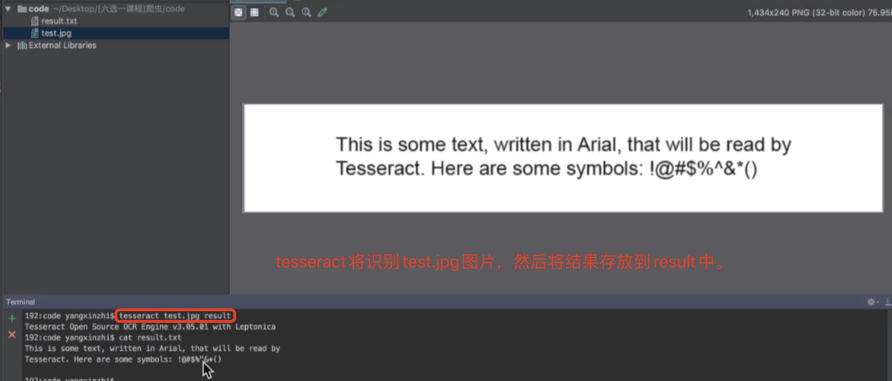

## 验证码的处理
知识：
1. 了解验证码的相关知识
2. 掌握图片识别引擎的使用
3. 了解常见的打码平台
4. 掌握通过打码平台处理验证码的方法

### 1.图片验证码
#### 1.1 什么是图片验证码
   验证码（CAPTCHA）是“Completely Automated Public Turing test to tell Computers and Humans Apart”（全自动区分计算机和人类的图灵测试）的缩写，是一种区分用户是计算机还是人的公共全自动程序。
#### 1.2 验证码的作用
   防止恶意破解密码、刷票、论坛灌水、刷页(我们的爬虫其实就是刷页)。
   有效防止某个黑客对某一个特定注册用户用特定程序暴力破解方式进行不断的登录尝试，实际上使用验证码是现在很多网站通行的方式（比如招商银行的网上个人银行，百度社区），
   我们利用比较简易的方式实现了这个功能。虽然登录麻烦一点，但是对网友的密码安全来说这个功能还是很有必要，也很重要。
#### 1.3 图片验证码在爬虫中的使用场景
* 注册
* 登录
* 频繁发送请求时，服务器弹出验证码进行验证
#### 1.4 图片验证码的处理方案
* 手动输入(input) 这种方法仅限于登录一次就可持续使用的情况
* 图像识别引擎解析：使用光学识别引擎处理图片中的数据（OCR库），目前常用于图片数据提取，较少用于验证码处理
* 打码平台：爬虫常用的验证码解决方案

### 2.图片识别引擎
```renderscript
OCR（Optical Character Recognition）是指使用扫描仪或数码相机对文本资料进行扫描成图像文件，然后对图像文件进行分析处理，自动识别获取文字信息及版面信息的软件。
```

  我们常用的图片识别引擎是tesseract
#### 2.1 什么是tesseract
* Tesseract，一款由HP实验室开发由Google维护的开源OCR引擎，特点是开源，免费，支持多语言，多平台。
* 项目地址：https://github.com/tesseract-ocr/tesseract  

#### 2.2 图片识别引擎环境的安装
  咱们的安装主要分为2块，第一块是引擎的安装，第二块是Python库的安装。
##### 1 引擎的安装
* mac环境下直接执行命令
  ```renderscript
  brew install --with-training-tools tesseract
  ```
* windows环境下的安装 可以通过exe安装包安装，下载地址可以从GitHub项目中的wiki找到。安装完成后记得将Tesseract 执行文件的目录加入到PATH中，方便后续调用。

* linux环境下的安装
  ```renderscript
  sudo apt-get install tesseract-ocr
  ```
  
##### 2 Python库的安装
  ```renderscript
  # PIL用于打开图片文件
  pip/pip3 install pillow
  
  # pytesseract模块用于从图片中解析数据
  pip/pip3 install pytesseract
  ```

#### 2.3 图片识别引擎的使用

##### 1、直接使用
   我们进入图片文件所在的路径下，对图片进行如下操作：
    


##### 2、代码使用
  通过pytesseract模块的 image_to_string 方法就能将打开的图片文件中的数据提取成字符串数据，具体方法如下:

```renderscript
# 安装的是pillow但是实际用的时候是:PIL
from PIL import Image
import pytesseract

im = Image.open()

result = pytesseract.image_to_string(im)

print(result)
```


#### 2.4 图片识别引擎的使用扩展
* tesseract简单使用与训练:tesseract主要识别英文的，对于中文识别不是很好，以下是几个对中文识别比较好的ocr产品。
* 其他ocr平台
  ```renderscript
    微软Azure 图像识别：https://azure.microsoft.com/zh-cn/services/cognitive-services/computer-vision/
    有道智云文字识别：http://aidemo.youdao.com/ocrdemo
    阿里云图文识别：https://www.aliyun.com/product/cdi/
    腾讯OCR文字识别：https://cloud.tencent.com/product/ocr
  ```

  


