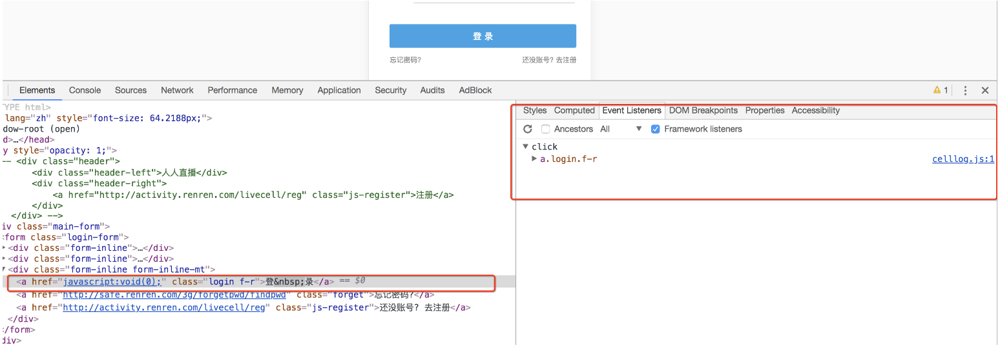

## JS的解析
学习目标：
1. 了解定位js的方法
2. 了解添加断点观察js的执行过程的方法
3. 应用js2py获取js的方法

#### 1、确定js的位置
 ```renderscript
  对于前面人人网的案例，我们知道了url地址中有部分参数，但是参数是如何生成的呢？
 ```
毫无疑问，参数肯定是js生成的，那么如何获取这些参数的规律呢？通过下面的学习来了解。
##### 1.1 观察按钮的绑定js事件
   
  通过点击按钮，然后点击Event Listener，部分网站可以找到绑定的事件，对应的，只需要点击即可跳转到js的位置  
