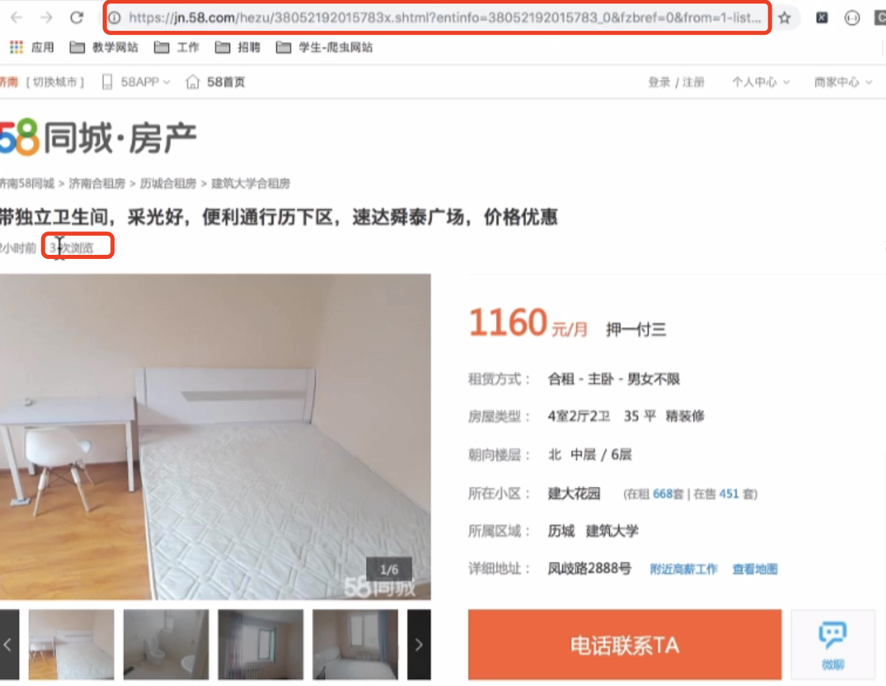
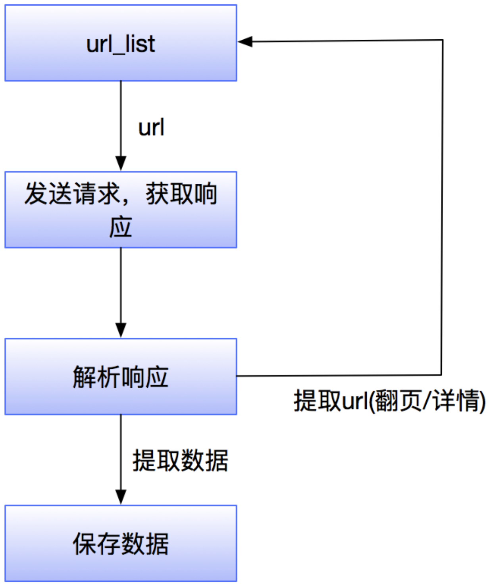

## 爬虫概要
内容:
* 了解爬虫的概念
* 了解爬虫的作用
* 了解爬虫的分类
* 掌握爬虫的流程

### 1. 爬虫的概念
  简单总结:模拟浏览器，发送请求，获取响应。
  网络爬虫（又被称为网页蜘蛛，网络机器人）就是模拟客户端(主要指浏览器)发送网络请求，接收请求响应，一种按照一定的规则，"自动地抓取" 互联网信息的"程序"。
  * 原则上,只要是客户端(浏览器)能做的事情，爬虫都能够做。
  * 爬虫也只能获取客户端(浏览器)所展示出来的数据。
### 2. 爬虫的作用

 数据采集、软件测试(自动化测试:https://www.cnblogs.com/fnng/)、12306抢票、网站上投票、网络安全。
 
### 3. 爬虫的分类
数量、
##### 3.1 根据被爬取网站的数量不同，可以分为：
* 通用爬虫(爬取目标网站没有上限)，如搜索引擎:百度、谷歌、搜狗搜索。也就是咱们的元搜索。
* 聚焦爬虫(网络爬虫工程师主要涉及的模块，他的目标网站是有上限的，比如某家公司需要做舆情监控等)，如12306抢票，或专门抓取某一个（某一类）网站数据
##### 3.2 根据是否以获取数据为目的，可以分为：
* 功能性爬虫(我只是实现某一种功能的爬虫，不获取数据)，比如：给你喜欢的明星投票、点赞；短信轰炸、web漏洞扫描等。
* 数据增量爬虫(以获取数据为目的，把数据拿下来，存储到某一个数据库)，比如招聘信息。
##### 3.3 根据url地址和对应的页面内容是否改变，数据增量爬虫可以分为：
* 基于url地址变化、内容也随之变化的数据增量爬虫
* url地址不变、内容变化的数据增量爬虫

以上内容都变化，但是一个是基于url地址变化，另一个是url地址不变，
比如下面的房产信息中，url不变化，但是对应的内容是一直变化的。

##### 3.4 上面爬虫对应的关系
  爬虫对应的关系图如下：


### 4. 爬虫的流程  
  爬虫的基本流程如图所下所示，其实也是原理图:  
  
  所有的爬虫都逃不出上面的原理，并且scrapy框架也是基于这样的原理。

1. 从一个url列表中获取一个url。
2. 向url发送请求，并获取响应（需要http协议），只要这个请求正确就会获取到正确的响应，如果知道是正确的响应呢?(我们只需要伪装成浏览器即可)。
3. 如果从响应中提取url，然后继续存放到url_list的列表中；则继续发送请求获取响应(因为有时候我们爬取的数据可能有很多，还需要进行数据翻页，所以需要点击下一页等)。
4. 如果从响应中提取数据，则将数据进行保存（保存可以写文件、写数据库、或者发送给远端）。

