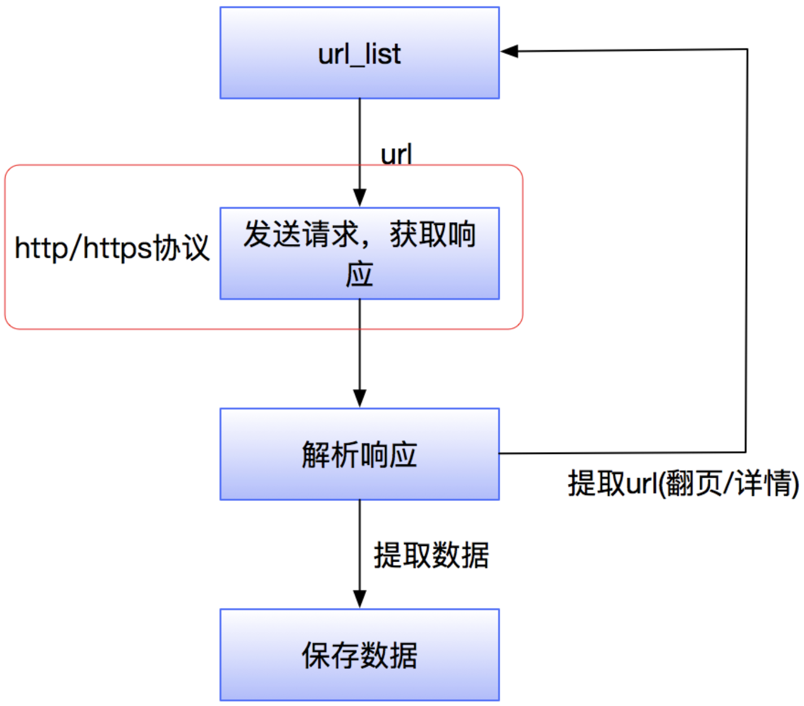
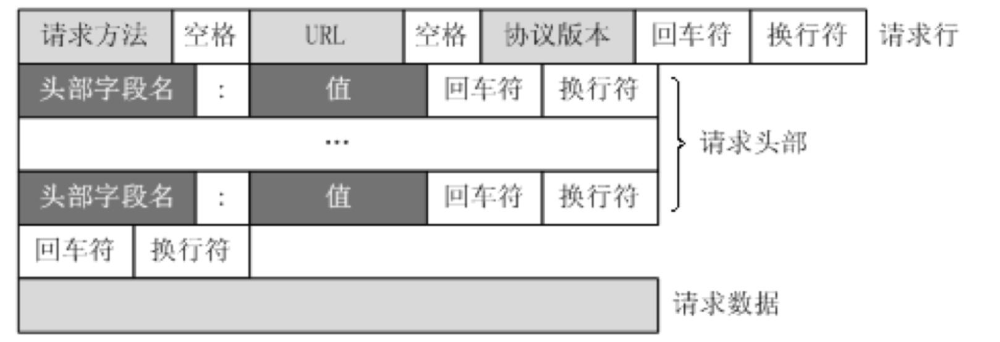
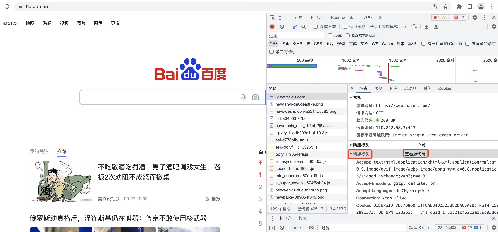
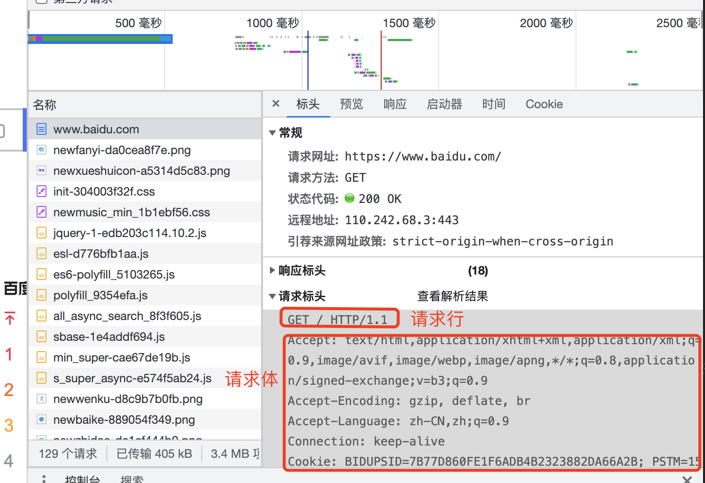
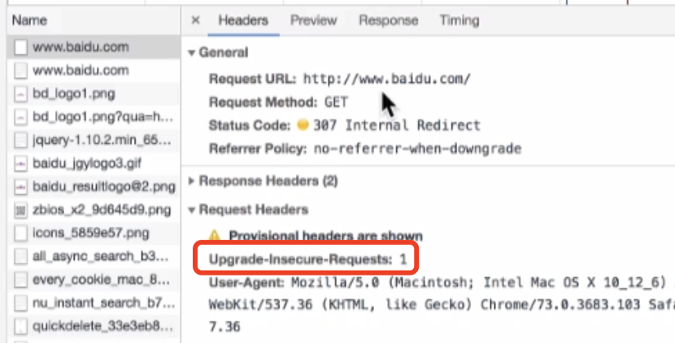
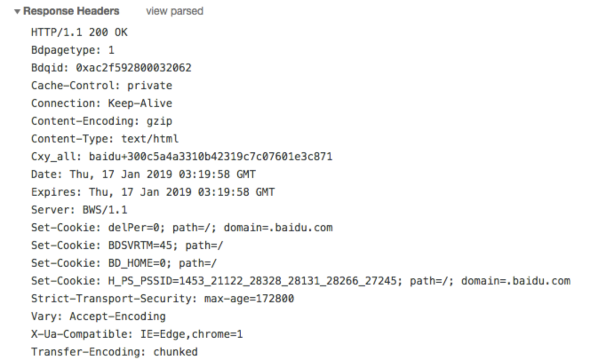

## http协议复习
内容:
* 掌握 http以及https的概念和默认端口
* 掌握 爬虫关注的请求头和响应头
* 了解 常见的响应状态码
* 理解 浏览器和爬虫爬取的区别

### 1. http协议跟爬虫
  一提起http协议，大家都会想起它是一个应用层协议，那么http协议跟爬虫有什么关系呢？请看下图：
  
### 2. http以及https的概念和区别

```renderscript
HTTPS比HTTP更安全，但是性能更低
```  

* HTTP(Hyper Text Transfer Protocol)：超文本传输协议，默认端口号是80
  * 超文本：是指超过文本，不仅限于文本；还包括图片、音频、视频等文件
  * 传输协议：是指使用共用约定的固定格式来传递转换成字符串的超文本内容
  * 缺点：明文传输：一旦人截获了这个请求包的话，就会很危险。为了加强安全性提出了https。
* HTTPS：HTTP + SSL(安全套接字层)，即带有安全套接字层的超本文传输协，默认端口号：443
  * SSL对传输的内容（超文本，也就是请求体或响应体）进行加密
  * 因为加密，所以在数据传输过程中对每一个数据包的加密会导致我们的传输缓慢一些。只是因为我们机器性能越来越好，所以大家没有感知到而已。
* 可以打开浏览器访问一个url，右键检查，点击net work，点选一个url，查看http协议的形式

### 3. 爬虫特别关注的请求头和响应头
#### 3.1 特别关注的请求头字段
  
  我们通过浏览器发送一个请求
  
  我们可以看到我们的请求的请求头、并且可以查看请求头里面的查看源代码。  
  我们点击查看源代码，可以看到我们的请求行、请求头部、请求体数据。  
    

```renderscript
  http请求的形式如上图所示，爬虫特别关注以下几个请求头字段
```
* Content-Type
* Host (主机和端口号)
* Connection (链接类型)：keep-alive(长链接：https/https协议是建立在tcp/ip协议上的，tcp/ip协议是底层socket的，
我们往一台服务器发送请求，首先是建立一个socket连接，然后再次发送http请求；这个长连接告诉我们:tcp/ip是一个长连接，而不是我们发送
一次请求，就3次握手，4次分手，这样效率很低下的)。
* Upgrade-Insecure-Requests (升级为HTTPS请求)：
  
  比如我们上面的请求，刚开始发送的是http的请求，然后由于百度是https的请求，所以我们发送了 Upgrade-Insecure-Requests：1 需要将其升级为https的请求。
* User-Agent (用户代理)：告诉浏览器我们发请求的机器以及浏览器的信息。
  比如：
```renderscript
Mozilla/5.0 (Macintosh; Intel Mac OS X 10_15_7) AppleWebKit/537.36 (KHTML, like Gecko) Chrome/105.0.0.0 Safari/537.36
```

  其中:Mozilla/5.0--几乎所有的浏览器都遵循Mozilla的需求。
  Macintosh; Intel Mac OS X 10_15_7----机器名称，系统版本。
  AppleWebKit/537.36---苹果核心
  Chrome/105.0.0.0----浏览器版本
  
  
* Referer (页面跳转处)：代表当前页面从哪一个页面过来的。Referer: https://www.baidu.com/；有些服务器会检查其从哪里过来的？
   防盗链(比如有些网站的图片的url在其他网站上就不能访问，原因就是检查了这个参数)。
* Cookie (Cookie)：主要用于保持会话，主要看这个请求保持权限。https协议是无状态的，所以用cookie保持状态，比如有些爬虫是需要登录的，所以
                  我们有时候是需要根据cookie保持登录状态的。cookie有一个实效性的。
* Authorization(用于表示HTTP协议中需要认证资源的认证信息，如前边web课程中用于jwt认证)

```renderscript
  以上用的最多的就是：User-Agent、Referer、Cookie；是不是一台机器，你从哪里来？你是哪一个用户？
  User-Agent、Referer、Cookie 请求头为常用请求头，在服务器被用来进行爬虫识别的频率最高，相较于其余的请求头更为重要，但是这里需要注意的是并不意味这其余的不重要，因为有的网站的运维或者开发人员可能剑走偏锋，会使用一些比较不常见的请求头来进行爬虫的甄别
```

#### 3.2 特别关注的响应头字段  

 

```renderscript
http响应的形式如上图所示，爬虫只关注一个响应头字段
```
* Set-Cookie （对方服务器设置cookie到用户浏览器的缓存）:是服务器返回的cookie,然后浏览器再次携带这个cookie,然后保持会话
 

浏览器-无痕上网模式：发送请求的时候不携带任何cookie
  
### 4. 常见的响应状态码

* 200：成功
* 302：跳转，新的url在响应的Location头中给出
* 303：浏览器对于POST的响应进行重定向至新的url
* 307：浏览器对于GET的响应重定向至新的url
* 403：资源不可用；服务器理解客户的请求，但拒绝处理它（没有权限）
* 404：找不到该页面
* 500：服务器内部错误
* 503：服务器由于维护或者负载过重未能应答，在响应中可能可能会携带Retry-After响应头；有可能是因为爬虫频繁访问url，使服务器忽视爬虫的请求，最终返回503响应状态码

  我们在学习web知识的时候就已经学过了状态码的相关知识，
我们知道这是服务器给我的相关反馈，我们在学习的时候就被教育说应该将真实情况反馈给客户端，
但是在爬虫中，可能该站点的开发人员或者运维人员为了阻止数据被爬虫轻易获取，可能在状态码上做手脚，
也就是说返回的状态码并不一定就是真实情况，比如:服务器已经识别出你是爬虫，但是为了让你疏忽大意，
所以照样返回状态码200，但是响应体重并没有数据。

```renderscript
注意： 所有的状态码都不可信，一切以是否从抓包得到的响应中获取到数据为准
```

  
  
  
  


