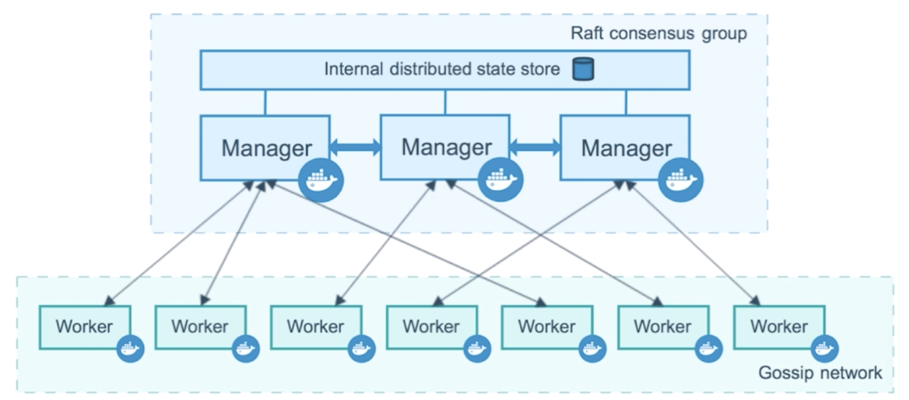
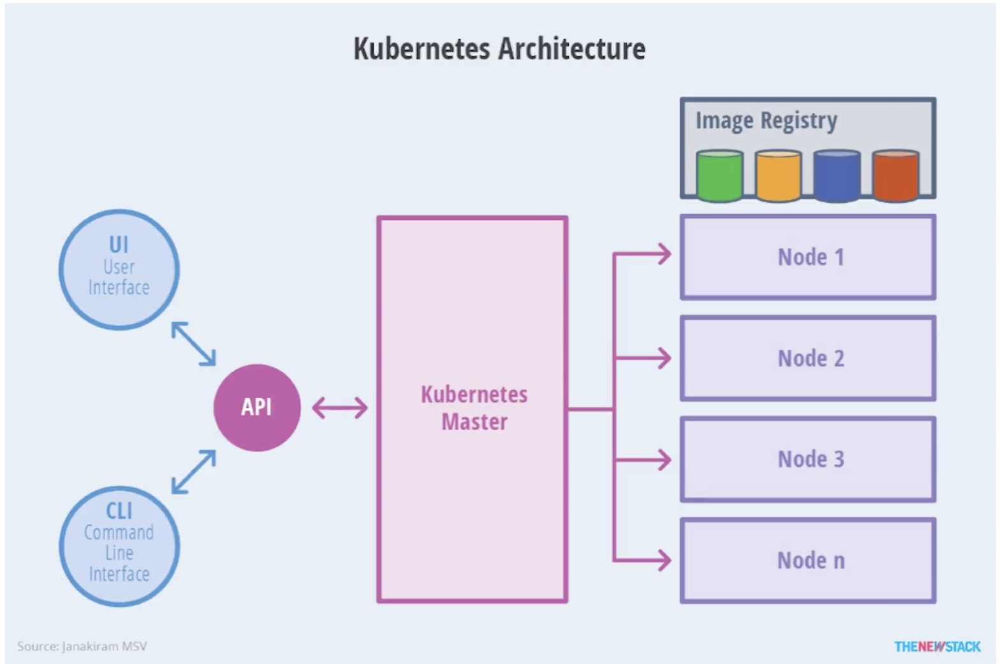
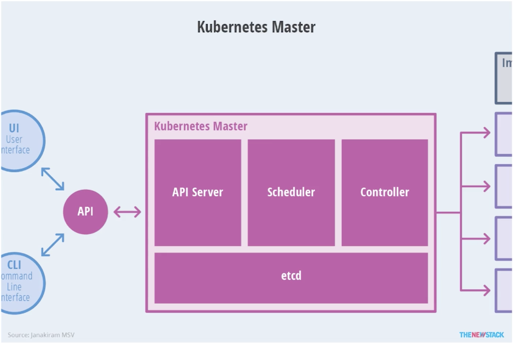
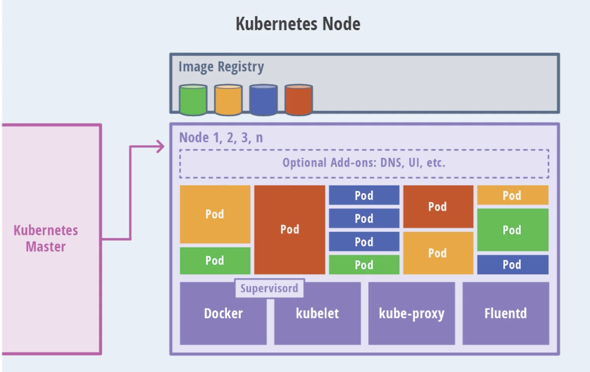
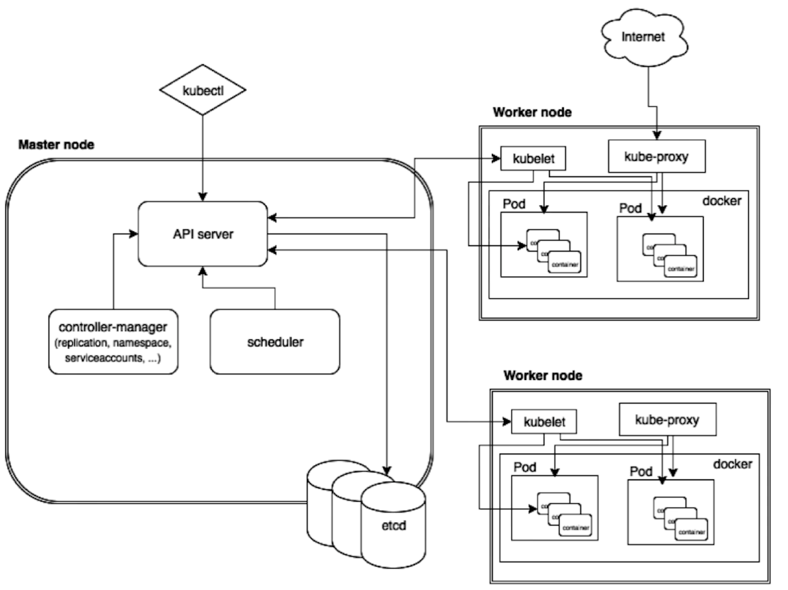

### 1、简介

###### Swarm架构  
   
 
###### k8s架构  
   
   k8s的架构跟docker swarm类似:都是有一个manager跟worker;只不过在k8s中，这个manager叫做master节点，
 worker叫做node节点。master节点会对外提供一些接口；可以通过这些接口对集群进行一些操作。
   
#### 1.1 Master节点
  
   master节点是k8s集群的大脑,他的主要功能，可以通过他的模块去看。
API Server:暴露给外界访问的，我们可以通过CLI或者UI来进行操作API Server来跟整个集群进行交互。
Scheduler：是一个调度模块，比如用户通过ui方式下达给API Server一个指令，我需要2个容器，但是这个容器最后需要
在哪个节点里面去，其实就是通过Scheduler里面算法决定容器运行在哪些机器上。 
Controller:控制器，控制容器做负载均衡，维持容器正常运行。
etcd:分布式k8s的store(分布式存储)

#### 1.3 Node节点  
  
  k8s里面有一个非常重要的概念：Pod；
Pod:是容器里面调用的最小单位。他是具有相同namespace的container的组合。这个namespace包括了所有的namespace。
比如：network的namespace；user namespace;具有相同network namespace组合，这个namespace里面的组合
容器可以是1个 也可以是多个。如果是多个的话 她们是共享一个network namespace。

Docker:我们需要需要一个容器的技术，这里是docker.
Kubelet:node节点受master节点的控制，master节点控制node节点去创建pod（pod里面container或者network）;这个是通过kubelet来进行控制的。
kube-proxy:k8s相关的网络问题。
Fluentd:日志的采集、存储、以及查询。

除了上面的模块，他其实还具备一些Optional模块:DNS,UI,etc等。  

   
  
