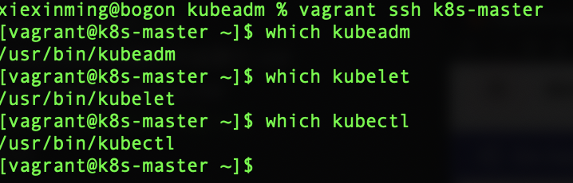
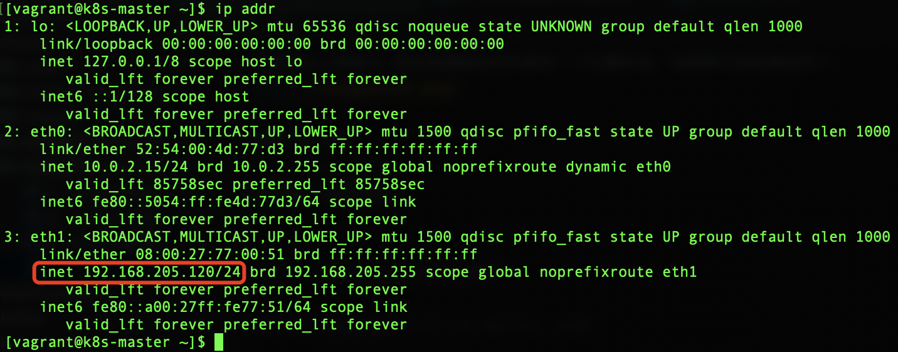
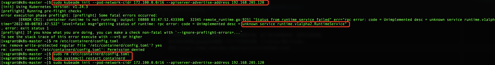
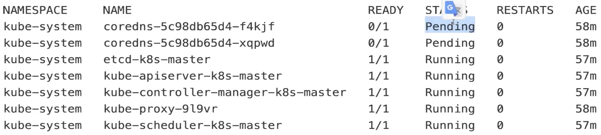
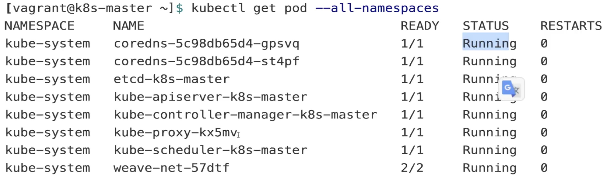
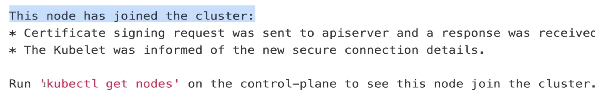

### 1、简介
  之前我们使用minikube搭建了一个k8s集群环境，这个是比较简单的，适合于初学者。
  我们现在使用kubeadm去搭建一个3个节点的环境，1个master跟2个node。  
  参考:https://www.cnblogs.com/Chary/p/15484092.html

### 2、准备3台机器
  首先需要安装vagrant跟virtual-box,然后基于virtual-box进行安装。
  为了方便的话，我们一般通过虚拟机去做，准备3台机器：
```renderscript
vagrant up
```

我们的vagrant的配置文件如下:

Vagrantfile:
```renderscript
# -*- mode: ruby -*-
# vi: set ft=ruby :

Vagrant.require_version ">= 1.6.0"

boxes = [
    {
        :name => "k8s-master",
        :eth1 => "192.168.205.120",
        :mem => "2048",
        :cpu => "2"
    },
    {
        :name => "k8s-node1",
        :eth1 => "192.168.205.121",
        :mem => "2048",
        :cpu => "1"
    },
    {
        :name => "k8s-node2",
        :eth1 => "192.168.205.122",
        :mem => "2048",
        :cpu => "1"
    }

]

Vagrant.configure(2) do |config|

  config.vm.box = "centos/7"
  boxes.each do |opts|
    config.vm.define opts[:name] do |config|
      config.vm.hostname = opts[:name]
      config.vm.provider "vmware_fusion" do |v|
        v.vmx["memsize"] = opts[:mem]
        v.vmx["numvcpus"] = opts[:cpu]
      end
      config.vm.provider "virtualbox" do |v|
        v.customize ["modifyvm", :id, "--memory", opts[:mem]]
        v.customize ["modifyvm", :id, "--cpus", opts[:cpu]]
      end
      config.vm.network :private_network, ip: opts[:eth1]
    end
  end
  config.vm.provision "shell", privileged: true, path: "./setup.sh"
end
```

注意:
1、我们的vagrant的master中的cpu需要大于等于2---k8s-master。
2、然后我们使用一个setup.sh的shell脚本来初始化安装容器里面的软件。 

脚本如下:
setup.sh

```renderscript
#/bin/sh

# install some tools
sudo yum install -y vim telnet bind-utils wget


# install docker
#curl -fsSL get.docker.com -o get-docker.sh
#sh get-docker.sh

## 安装docker


# step 1: 安装必要的一些系统工具
sudo yum install -y yum-utils device-mapper-persistent-data lvm2

# Step 2: 添加软件源信息
sudo yum-config-manager --add-repo http://mirrors.aliyun.com/docker-ce/linux/centos/docker-ce.repo
sudo yum-config-manager --disable docker-ce-edge
yum-config-manager --disable docker-ce-test

# Step 3: 更新并安装 Docker-CE
sudo yum makecache fast
sudo yum -y install docker-ce

# Step 4: 开启Docker服务
sudo service docker start

# Step 5: 更改cgroup driver
sudo bash -c ' cat > /etc/docker/daemon.json <<EOF
{
  "exec-opts": ["native.cgroupdriver=systemd"],
  "log-driver": "json-file",
  "log-opts": {
    "max-size": "100m"
  },
  "storage-driver": "overlay2",
  "storage-opts": [
    "overlay2.override_kernel_check=true"
  ]
}
EOF'


if [ ! $(getent group docker) ];
then
    sudo groupadd docker;
else
    echo "docker user group already exists"
fi

sudo gpasswd -a $USER docker


sudo systemctl  daemon-reload
sudo systemctl restart docker

#rm -rf get-docker.sh

# open password auth for backup if ssh key doesn't work, bydefault, username=vagrant password=vagrant
sudo sed -i 's/PasswordAuthentication no/PasswordAuthentication yes/g' /etc/ssh/sshd_config
sudo systemctl restart sshd
# Step 6: 拉取kubernetes镜像，注意其中baseurl为国内阿里云镜像
sudo bash -c 'cat <<EOF > /etc/yum.repos.d/kubernetes.repo
[kubernetes]
name=Kubernetes
baseurl=http://mirrors.aliyun.com/kubernetes/yum/repos/kubernetes-el7-x86_64
enabled=1
gpgcheck=0
repo_gpgcheck=0
gpgkey=http://mirrors.aliyun.com/kubernetes/yum/doc/yum-key.gpg
       http://mirrors.aliyun.com/kubernetes/yum/doc/rpm-package-key.gpg
EOF'

# 也可以尝试国内的源 http://ljchen.net/2018/10/23/%E5%9F%BA%E4%BA%8E%E9%98%BF%E9%87%8C%E4%BA%91%E9%95%9C%E5%83%8F%E7%AB%99%E5%AE%89%E8%A3%85kubernetes/

sudo setenforce 0

# Step 7: install kubeadm, kubectl, and kubelet.
#sudo yum install -y kubelet kubeadm kubectl

sudo yum install -y kubelet kubeadm kubectl --disableexcludes=kubernetes
sudo systemctl enable docker && systemctl start docker
sudo systemctl enable kubelet && systemctl start kubelet


sudo bash -c 'cat <<EOF >  /etc/sysctl.d/k8s.conf
net.bridge.bridge-nf-call-ip6tables = 1
net.bridge.bridge-nf-call-iptables = 1
net.ipv4.ip_forward=1
EOF'
sudo sysctl --system

sudo systemctl stop firewalld
sudo systemctl disable firewalld
sudo swapoff -a

sudo systemctl enable docker.service
sudo systemctl enable kubelet.service

sudo cat ./pull.sh
for i in \`kubeadm config images list\`; do
 imageName=${i#k8s.gcr.io/}
 sudo docker pull registry.aliyuncs.com/google_containers/$imageName
 sudo docker tag registry.aliyuncs.com/google_containers/$imageName k8s.gcr.io/$imageName
 sudo docker rmi registry.aliyuncs.com/google_containers/$imageName
done;
```

此脚本只适用于centos7,其主要逻辑是:


然后我们启动服务:

```renderscript
vagrant up
```

### 3、进入机器内部查看 

###### 进入对应k8s节点的内部:  
```renderscript
vagrant ssh k8s-master
```

###### 查看kubeadm、kubelet、kubectl是否安装
```renderscript
which xxx
```

如果通过上面指令,其在终端输出的时候有一个位置的话，说明其已经安装成功了。
 

查看:docker
```renderscript
docker version
```

### 4、使用kubeadm初始化集群  

###### kubeadm init on master node

```renderscript
sudo kubeadm init --pod-network-cidr 172.100.0.0/16 --apiserver-advertise-address 192.168.205.120
```

 
apiserver-advertise-address:这个比较重要，这个是因为我们的k8s-master有多个网络地址，但是我们希望使用的是:
eth1:192.168.205.120/24 这个地址。 这个是因为另外k8s的节点有的地址是另外一个地址:网断是:192.168.205。  
所以,apiserver-advertise-address地址作为api宣告的地址。否则的话:worker就没法添加了。


启动如下:
 


###### 然后主节点上运行:

```renderscript
mkdir -p $HOME/.kube
sudo cp -i /etc/kubernetes/admin.conf $HOME/.kube/config
sudo chown $(id -u):$(id -g) $HOME/.kube/config
```


###### 检查pod:
```renderscript
kubectl get pod --all-namespaces
```

运行完毕之后,我们可以看到,在机器上运行启动了很多pod,这些pod其实就是我们的
container容器。也就是k8s里面重要的组成部分。  
 
从上面可以看到我们的很多组件都是Running状态的，只有前两个是Pending状态。这个是
因为我们还没有来得及安装网络插件。  


###### 安装网络插件
我们直接安装了weave的网络插件即可。  

```renderscript
kubectl apply -f "https://cloud.weave.works/k8s/net?k8s-version=$(kubectl version | base64 | tr -d '\n')"
```
  
此时我们可以看到我们的前面2个pod已经从Pending变成了Running状态。  

 
###### 添加worker节点
之前在k8s安装的时候，会生成一串添加节点worker的指令串，我们将其粘贴。然后运行：
Please use sudo join

```renderscript
sudo kubeadm join 192.168.205.120:6443 --token tte278.145ozal6u6e26ypm --discovery-token-ca-cert-hash sha256:cbb168e0665fe1b14e96a87c2da5dc1eeda04c70932ac1913d989753703277bb

```

然后把我们出现如下状态就说明添加成功了:


###### 查看集群状态  
```renderscript
kubectl get nodes
```

  
###### 查看pod

```renderscript
kubectl get pod --all-namespaces
```  


我们发现更多的pod已经加入进来了。  


### 3、备注
搭建过程中参考: https://www.cnblogs.com/qiaoer1993/p/14504615.html


