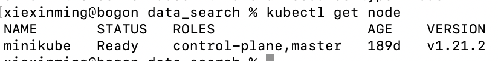
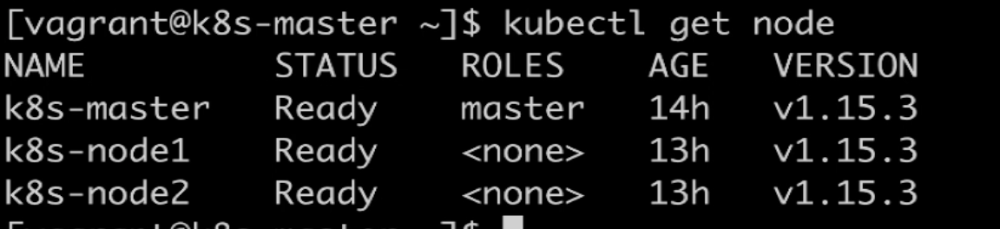
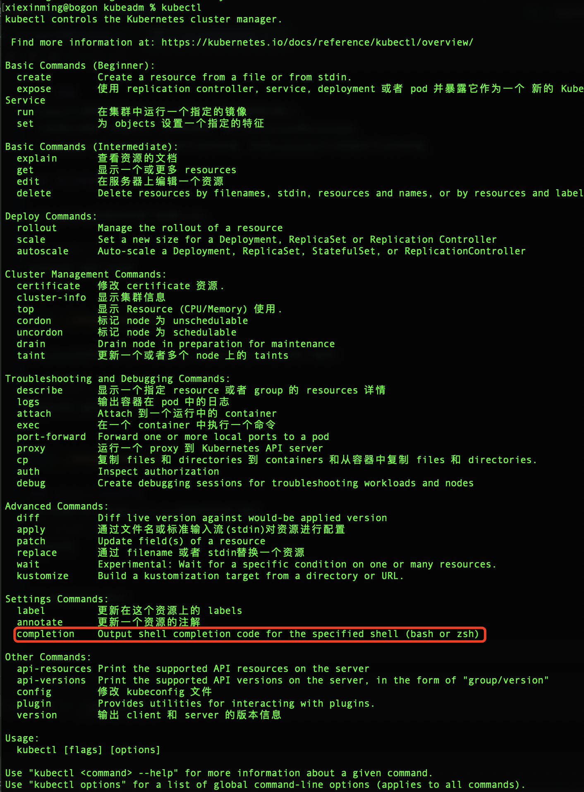
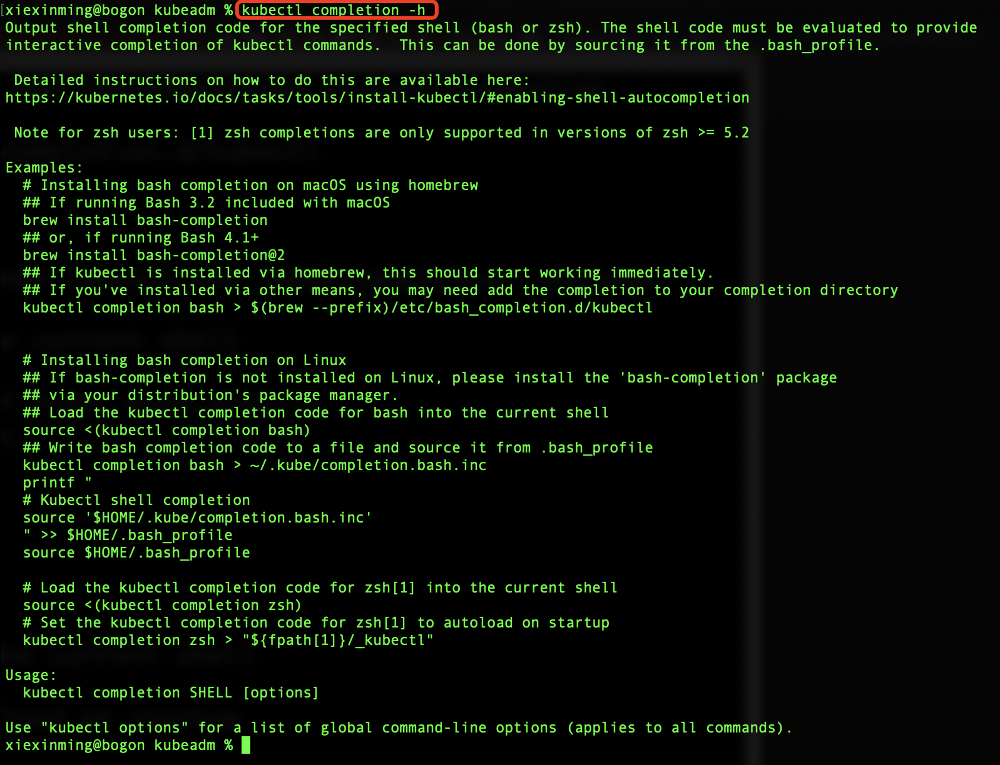
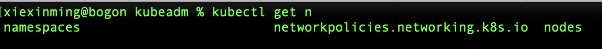
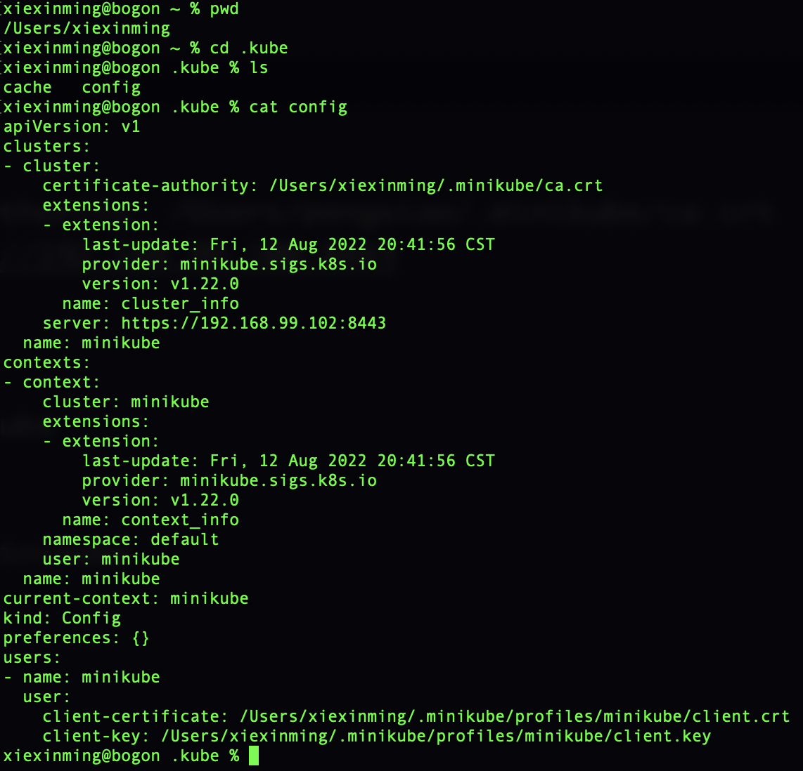

### 1、简要
 kubectl是我们通过命令行方式跟k8s进行通信的接口。
 之前我们讲解了搭建k8s;主要是两种，基于minikube跟kubeadm。
 minikube问题是他只能搭建单节点的环境，但是kubeadm可以搭建多节点的环境。  

### 2、多环境查看node

在minikube搭建的环境下查看node。

```renderscript
kubectl get node
```

  

在kubeadm搭建的环境下,我们进入对应的环境下,进行如下操作:

```renderscript
kubectl get node
```

  

### 3、kubectl自动不全
我们在我们自己本地minikube搭建的环境下输入
```renderscript
kubectl
```

可以看到我们的指令:


然后通过:
```renderscript
kubectl completion -h
```
看到在不同的平台上我们如何实现补全。
  

 我们现在是在mac上使用的是zsh,我们使用下面指令:
 
 ```renderscript
 # Load the kubectl completion code for zsh[1] into the current shell
  source <(kubectl completion zsh)
  # Set the kubectl completion code for zsh[1] to autoload on startup
  kubectl completion zsh > "${fpath[1]}/_kubectl"
```

  我们执行:
```renderscript
 source <(kubectl completion zsh)
```

然后我们继续输入以下内容:

```renderscript
kubectl get n
```

然后按键tab键的时候就会出现如下效果:  
   
 
### 4、kubuctl连接minikube集群
  我们的kubectl默认情况下会去寻找当前用户下

kubectl会连接cluster下server为:https://192.168.99.102:8443
并且使用证书为:/Users/xiexinming/.minikube/ca.crt

```renderscript
xiexinming@bogon .kube % kubectl config current-context 
minikube
```

通过上面命令，我们获取当前上下文的配置，发现我们获取的是minikube。  

当然我们也可以去设置当前的环境，通过如下配置
```renderscript
kubectl config set-context
```


   


