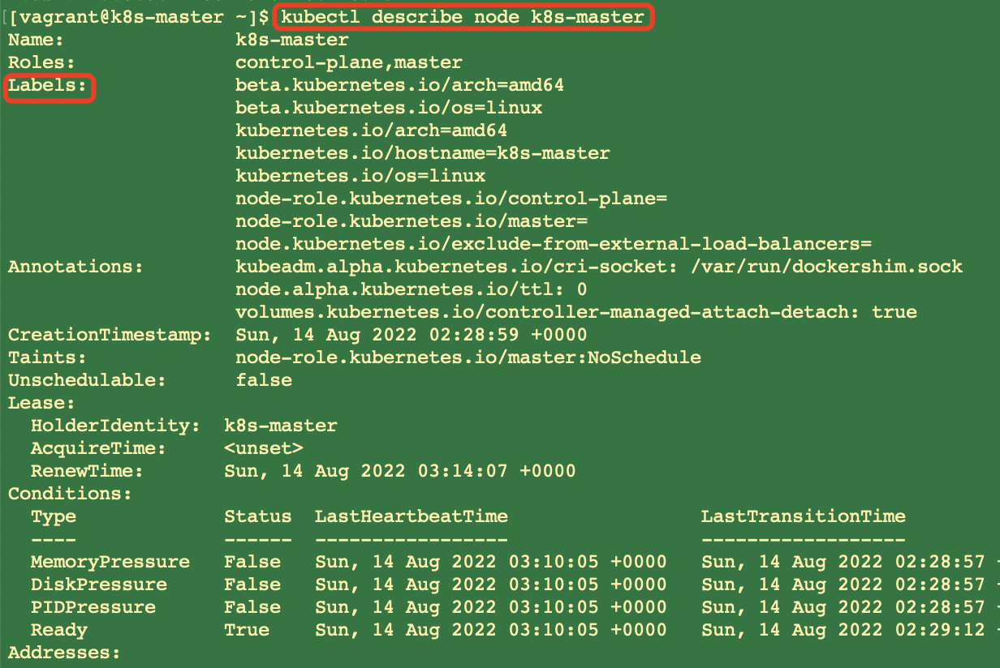
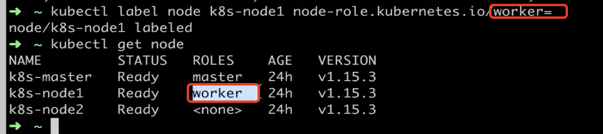

### 1、k8s的节点  
###### 获取k8s集群所有节点
我们通过以下指令:
```renderscript
kubectl get nodes
```

我们可以获取到k8s的所有节点。其中master节点下主要是运行的:
API Server、Scheduler、Controller、etcd。  
node节点就是我们每一个运行的pod。

###### 获取k8s集群中其中一个节点详细信息

```renderscript
kubectl describe node node-name
```

我们通过上面命令可以详细的看到我们的k8s节点的详细信息，包括分配的内存、cpu以及操作系统等信息。  

当然我们一般不用上面的指令，我们一般使用以下指令获取：

```renderscript
kubectl get node -o wide
```

注意: 1、其中-o代表的是输出的意思，wide代表我们输出的时候，输出更多的信息。  


当然我们也可以以yaml文件的格式，进行输出:  

```renderscript
kubectl get node -o yaml
```

或者 我们以json的格式输出:

```renderscript
kubectl get node -o json
```


### 1、k8s的标签
  我们的node里面有一个label。比如我们去描述一个k8s-master：
  
  labels是一个key-value的形式,这些labels有什么用呢？其实，这些labels就是
类似于网上网站上的过滤作用。具有相同标签的过滤出来。

###### 查看node并且显示label

```renderscript
kubectl get node --show-labels
```

 会把节点具备的标签给显示出来。
```renderscript
[vagrant@k8s-master ~]$ kubectl get node --show-labels
NAME         STATUS     ROLES                  AGE   VERSION   LABELS
k8s-master   Ready      control-plane,master   58m   v1.23.6   beta.kubernetes.io/arch=amd64,beta.kubernetes.io/os=linux,kubernetes.io/arch=amd64,kubernetes.io/hostname=k8s-master,kubernetes.io/os=linux,node-role.kubernetes.io/control-plane=,node-role.kubernetes.io/master=,node.kubernetes.io/exclude-from-external-load-balancers=
k8s-node1    NotReady   <none>                 25m   v1.23.6   beta.kubernetes.io/arch=amd64,beta.kubernetes.io/os=linux,kubernetes.io/arch=amd64,kubernetes.io/hostname=k8s-node1,kubernetes.io/os=linux
k8s-node2    NotReady   <none>                 17m   v1.23.6   beta.kubernetes.io/arch=amd64,beta.kubernetes.io/os=linux,kubernetes.io/arch=amd64,kubernetes.io/hostname=k8s-node2,kubernetes.io/os=linux
[vagrant@k8s-master ~]$ 
```  

###### 设置节点的label

```renderscript
kubectl label node k8s-master env=test
```

结果如下:
```renderscript
kubectl get node --show-labels
NAME         STATUS     ROLES                  AGE   VERSION   LABELS
k8s-master   Ready      control-plane,master   58m   v1.23.6   beta.kubernetes.io/arch=amd64,beta.kubernetes.io/os=linux,env=test,kubernetes.io/arch=amd64,kubernetes.io/hostname=k8s-master,kubernetes.io/os=linux,node-role.kubernetes.io/control-plane=,node-role.kubernetes.io/master=,node.kubernetes.io/exclude-from-external-load-balancers=
```

###### 删除节点的label

```renderscript
kubectl label node k8s-master env-
```

###### 设置节点的角色
```renderscript
[vagrant@k8s-master ~]$ kubectl label node k8s-node1 node-role.kubernetes.io/worker=
node/k8s-node1 labeled
[vagrant@k8s-master ~]$ kubectl get node --show-labels
NAME         STATUS     ROLES                  AGE   VERSION   LABELS
k8s-master   Ready      control-plane,master   65m   v1.23.6   beta.kubernetes.io/arch=amd64,beta.kubernetes.io/os=linux,kubernetes.io/arch=amd64,kubernetes.io/hostname=k8s-master,kubernetes.io/os=linux,node-role.kubernetes.io/control-plane=,node-role.kubernetes.io/master=,node.kubernetes.io/exclude-from-external-load-balancers=
k8s-node1    NotReady   worker                 32m   v1.23.6   beta.kubernetes.io/arch=amd64,beta.kubernetes.io/os=linux,kubernetes.io/arch=amd64,kubernetes.io/hostname=k8s-node1,kubernetes.io/os=linux,node-role.kubernetes.io/worker=
k8s-node2    NotReady   <none>                 24m   v1.23.6   beta.kubernetes.io/arch=amd64,beta.kubernetes.io/os=linux,kubernetes.io/arch=amd64,kubernetes.io/hostname=k8s-node2,kubernetes.io/os=linux
[vagrant@k8s-master ~]$ 
```

 


