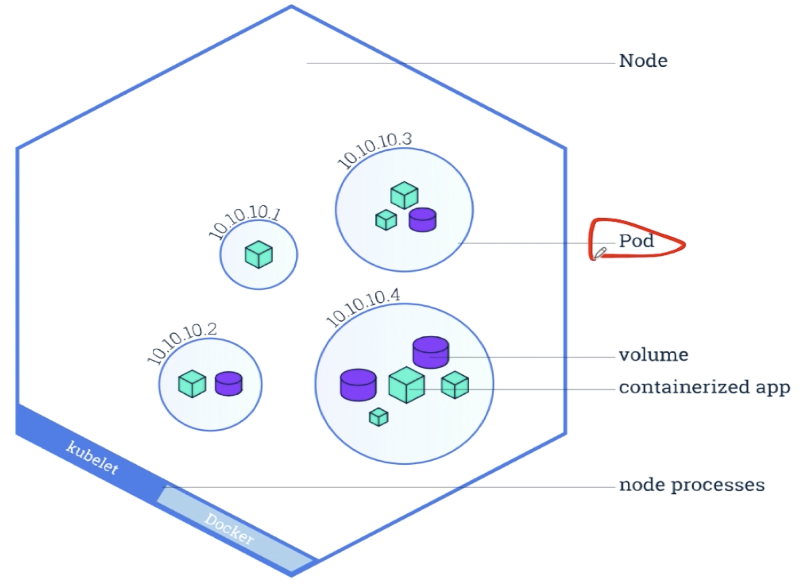

### 1、什么是pod
  
  如上所示:上面10.10.10.3就是一个pod。根据我们观察可以知道：
1、一个pod里面可能存在多个container(正方体-container)。
2、一个或者一组应用容器，它们分享资源（比如：volume）
3、分享相同命名空间namespace（如网络空间:具有相同的ip地址）的容器；比如上面10.10.10.3里面的容器就有相同的ip地址。
4、pod是k8s中最小的调度单位（调度：我们知道k8s里面有一个scheduler）。  

### 2、pod的定义
  如何定义一个pod呢？我们需要知道pod的yaml文件,如下所示:nginx_busybox.yml
  
```renderscript
apiVersion: v1
kind: Pod
metadata: 
  name: nginx-busybox
spec:
  containers:
  - name: nginx
    image: nginx
    ports:
    - containerPort: 80
  -name: busybox
   image: busybox
   command: ["/bin/sh"]
   args: ["-c","while true;do echo hello;sleep 10;done"]
```

kind-Pod:就是知道我们这个是一个pod
spec里面containers就是指代我们的容器:
这里面有两个容器：nginx/busybox；它们两个是可以直接通信的；
上面nginx跟busybox是在同一个pod里面，具有相同的网络命名空间，所以busybox可以通过:
127.0.0.1:80访问到我们的nginx。

### 3、pod的创建
  通过如下指令:
```renderscript
$ kubectl create -f nginx_busybox.yml
```

### 4、操作pod
###### 获取pods
```renderscript
kubectll get pods
```

###### 获取pod详细信息

```renderscript
kubectl describe pod nginx-busybox
```

###### 获取更多的详细信息

```renderscript
kubectl get pods nginx-busybox -o wide
```

###### 进入pod里面的某一个container

```renderscript
kubectl exec nginx-busybox -it sh
```

nginx-busybox里面有2个container;默认会进入第一个容器:nginx里面。
如何进入第二个容器里面呢？后面说

### 4、删除pod

```renderscript
kubectl delete -f nginx_busybox.yml
```


