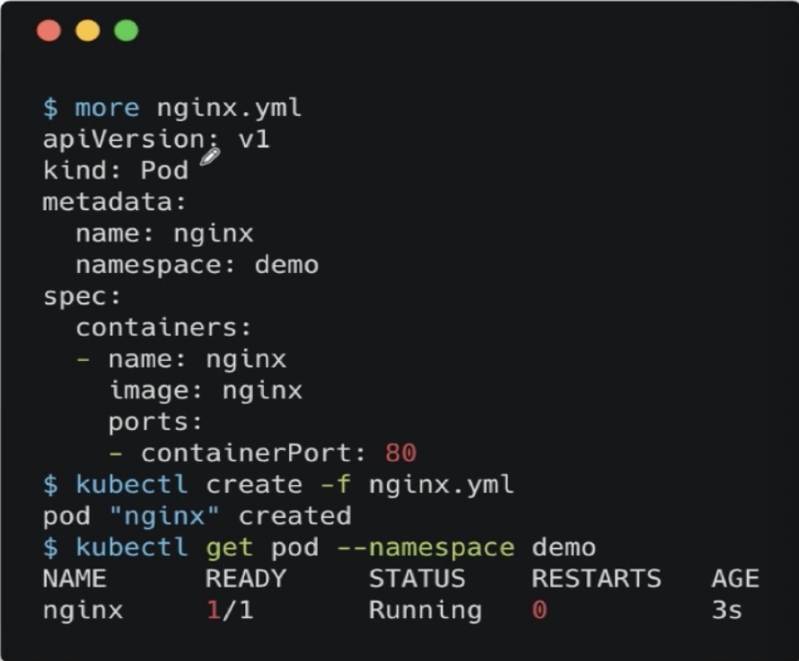
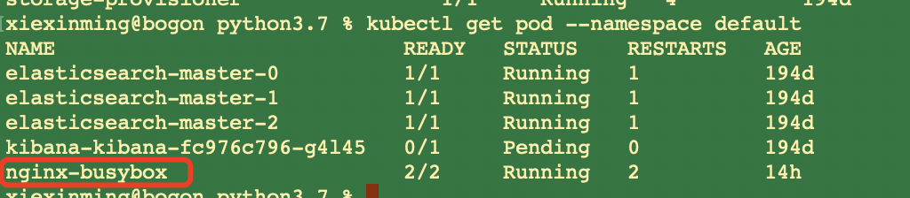
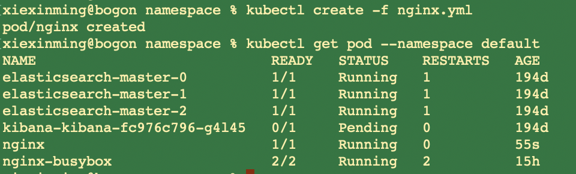
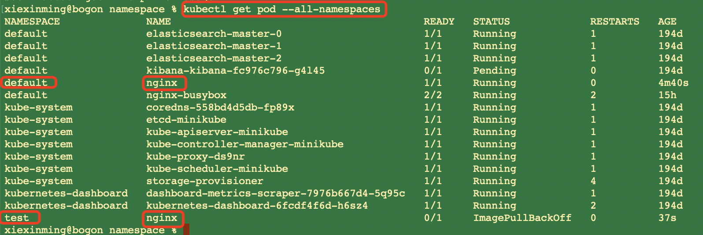

### 1、namespace引入以及定义
  假如我们很多团队都在使用同一套k8s集群服务作为容器编排工具的话，我们需要使用namespace进行数据隔离。  
假如我们一个团队需要创建一个名字叫做nginx的pod;另一个团队也需要创建一个名字叫做nginx的pod。这个时候
会出现什么问题呢？这个时候会出现名字冲突的问题。
1、这样的话，不同的项目跟不同团队之间需要很大的沟通成本。我们
最好是把不同的team,不同的project之间能够隔离开。
2、在不同的命名空间中，各种资源的名字相互独立，比如可以具有相同名称的pod存在。  

### 2、k8s中创建,获取Namespace  

###### 创建namespace

```renderscript
kubectl create namespace test
```

###### 查看namespace

```renderscript
kubectl get namespace
```

默认情况下,会有:default、kube-public、kube-system这3个namespace；


### 3、根据namespace过滤

###### 获取namespace下面的pod

```renderscript
kubectl get pod --namespace kube-system
```

###### 在namespace下创建pod  
    
 我们在metadata的name后的namespace下跟一个namespace名称。  
 上一节,我们创建pod的时候，没有指定namespace，这个时候，系统会
 默认将我们创建的pod存放到我们的default下。比如下面:
     
   
### 3、namespace实战
  我们通过演示创建一个nginx的pod,然后pod里面包含有一个container容器，一个不指定
namespace，一个指定namespace。  

###### 创建pod不设置namespace
对应的配置是:nginx.yml

```renderscript
apiVersion: v1
kind: Pod
metadata:
  name: nginx
spec:
  containers:
  - name: nginx
    image: nginx
    ports:
      - containerPort: 80
```

 

###### 创建pod设置namespace
对应的配置是:nginx_namespace.yml
```renderscript
apiVersion: v1
kind: Pod
metadata:
  name: nginx
  namespace: test
spec:
  containers:
  - name: nginx
    image: nginx
    ports:
      - containerPort: 80
```

我们先创建我们的namespace test;然后运行上面的文件来创建我们的pod

  
 


  
 

 


