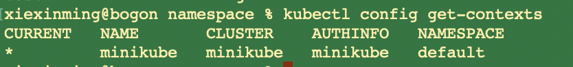
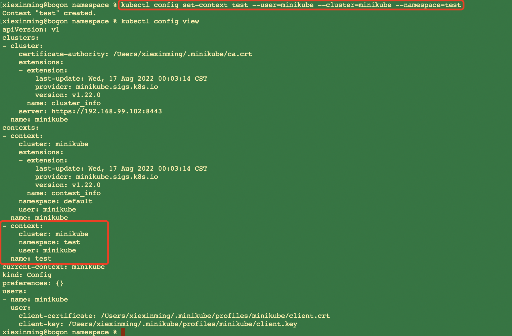
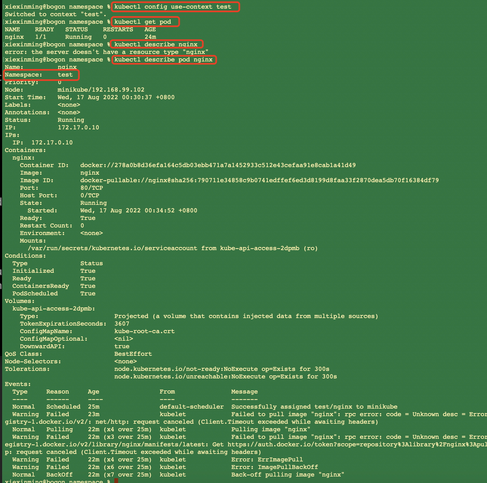
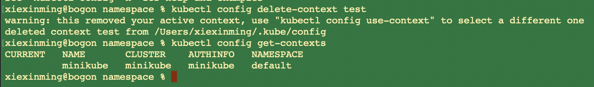

### 1、namespace引入以及定义
  我们假如在生产环境发布之前需要做一个测试环境的数据发布，这个时候就牵涉到我们需要在我们的
 test下namespace进行一些操作；但是假如我们每次在查看test的namespace下的pod等信息的时候
 如果每次都通过
 
 ```renderscript
kubectl get pod --namespace test
```

会比我们通过如下方式操作要简单很多:

```renderscript
kubectl get pod 
```

   其实我们可以通过一个设置，把我们当前的默认namespace设置为:从default设置为test;
 我们可以通过context去做。
 
### 2、设置context  
  我们通过以下指令去查看我们的context
 
```renderscript
kubectl config get-contexts
```  

  

###### 创建自己的context
 我们先查看下我们的配置

````renderscript
apiVersion: v1
clusters:
- cluster:
    certificate-authority: /Users/xiexinming/.minikube/ca.crt
    extensions:
    - extension:
        last-update: Wed, 17 Aug 2022 00:03:14 CST
        provider: minikube.sigs.k8s.io
        version: v1.22.0
      name: cluster_info
    server: https://192.168.99.102:8443
  name: minikube
contexts:
- context:
    cluster: minikube
    extensions:
    - extension:
        last-update: Wed, 17 Aug 2022 00:03:14 CST
        provider: minikube.sigs.k8s.io
        version: v1.22.0
      name: context_info
    namespace: default
    user: minikube
  name: minikube
current-context: minikube
kind: Config
preferences: {}
users:
- name: minikube
  user:
    client-certificate: /Users/xiexinming/.minikube/profiles/minikube/client.crt
    client-key: /Users/xiexinming/.minikube/profiles/minikube/client.key
````

  我们可以看到当前contexts，他的名字叫做：minikube；其使用的user跟cluster都是:minikube；
  我们现在创建一个context:其name:test namespace:test cluster:minikube  user:minikube。  
  
```renderscript
kubectl config set-context test --user=minikube --cluster=minikube --namespace=test
```

    


###### 使用指定的context
  我们通过如下指令:
```renderscript
kubectl config use-context test
```


   我们可以看到我们的nginx实在test下的 


### 3、删除context
首先先切换到其他的context
```renderscript
kubectl config use-context minikube
```  

删除

```renderscript
kubectl config delete-context test
```




