### 1、k8s的架构  
   我们从之前了解了我们的k8s架构，如下:
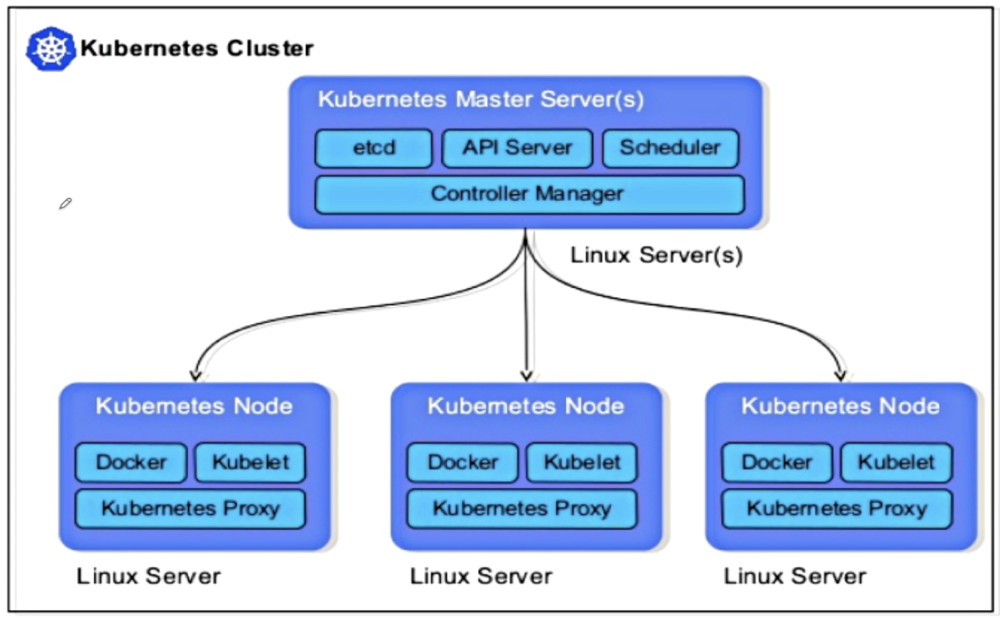  

注意:
1、k8s集群架构分为:Master节点跟普通的Node节点。
2、Master节点分为:etcd-用于存储  API Server-提供给对外通信:kubectl会连接这个API Server，然后控制整个集群。 Scheduler:比如说我们创建资源pod的时候,这个
集群决定这个pod放在哪个node上是由此组件进行调度的(调度时候会使用一些算法:比如分析哪台机器资源最优等)。以及Controller

### 2、Controller
   Controller到底是用于实现什么目的的呢？我们从程序的角度讲解，一个controller到底要做一些什么事？如下函数调用的脚本 分析功能：
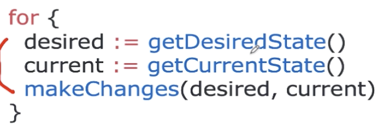  

注意：
1、我们定义了两个状态:desired--期望的状态  current-当前实际的状态；我们有可能期望他是:运行的状态，但是实际上可能是不运行的状态。
2、我们的controller主要是做：makeChanges的动作。让我们的服务从current状态达到期望状态。


### 3、Deployment
A Deployment provides declarative updates for Pods and ReplicaSets.  
You describe a desired state in a Deployment, and the Deployment Controller changes 
the actual state to the desired state at a controlled rate. 
You can define Deployments to create new ReplicaSets, 
or to remove existing Deployments and adopt all their resources with new Deployments.


```renderscript
Note: Do not manage ReplicaSets owned by a Deployment. 
Consider opening an issue in the main Kubernetes repository if your use case is not covered below.
```

 
场景描述:
   基于k8s的架构，比如我们通过了Scheduler调度器来创建了在以上第一个Node上；如果这个时候假如
第一个Node的linux server已经宕机了，那么这个机器上创建的Pod也随之死掉。所以Pod并不是一个稳定的存在。
如果不稳定，我们肯定不会用他，所以在实际中我们不会直接使用Pod,而是使用Deployment。
因为Deployment描述了一个期望的状态，然后我们的Controller会监听尽可能的使我们的状态等于我们的期望状态。

比如我们定义了一个状态，此状态下会有一个Pod，然后里面可能包含多个容器。假如我们的Pod所在的机器宕机了，Pod销毁
此时Controller就会启作用，在另一个地方启动这个Pod。  

### 4、Deployment演示
   我们准备3个Deployment的配置:
```renderscript
apiVersion: apps/v1 # for versions before 1.9.0 use apps/v1beta2
kind: Deployment
metadata:
  name: nginx-deployment # Deployment的名字
spec: # Deployment 里面定义的内容
  replicas: 2 # 是我们app: nginx的pod等于2个副本。
  selector: # selector会根据labels去匹配,比如如下,我们的template里面定义了一个spec：其实就是一个pod;这个pod里面有一个container，并且此template有一个labels叫做:app :nginx;
    # 此selector就会过滤掉:template中labels为:app: nginx的这个container;然后
    matchLabels:
      app: nginx
  template: # create pods using pod definition in this template
    metadata:
      # unlike pod-nginx.yml,the name is not included in the meta data as
      # generated from the deployment name
      labels:
        app: nginx
    spec:
      containers:
        - name: nginx
          image:  nginx:1.7.9
          ports:
            - containerPort: 80
```


   我们通过下面可以看到我们的形式:
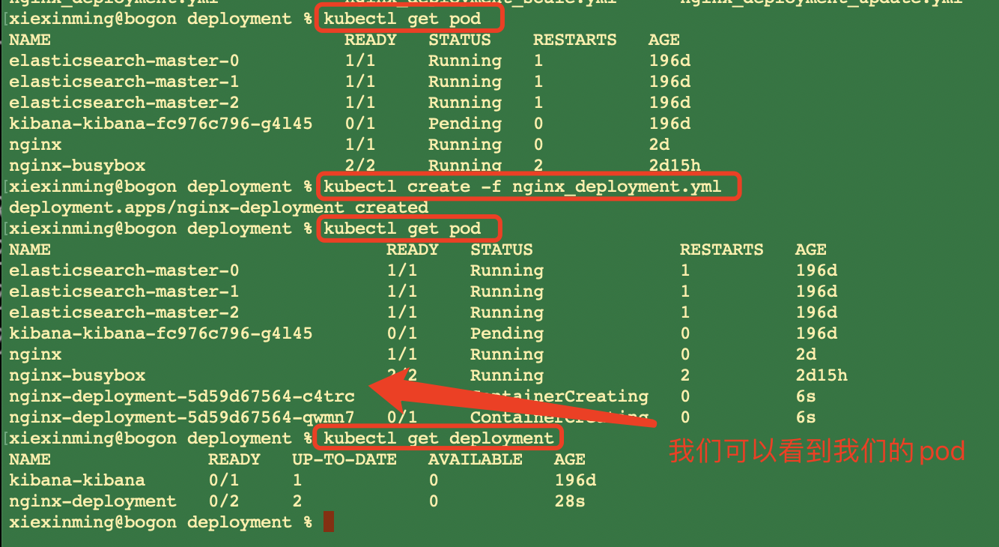 

###### 按照label进行过滤

```renderscript
kubectl get pod -l app=nginx
```
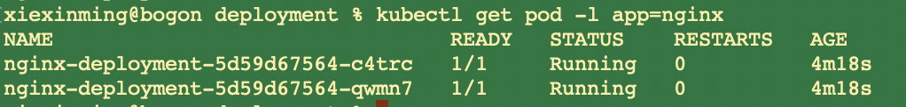


###### 查看Deployment的详细信息 

```renderscript
kubectl get deployment nginx-deployment -o wide
```

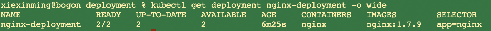


###### 查看Deployment的详细信息 

```renderscript
kubectl describe deployment nginx-deployment
```


### 5、Deployment维护desired状态演示  
 我们查看到app=nginx标签的pod有3个:
 
```renderscript
kubectl get pod -l app=nginx
```
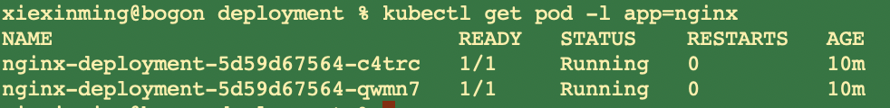

  然后我们删除其中一个pod:
```renderscript
kubectl delete pod nginx-deployment-5d59d67564-c4trc
```
然后发现其马上又起来了一个pod：

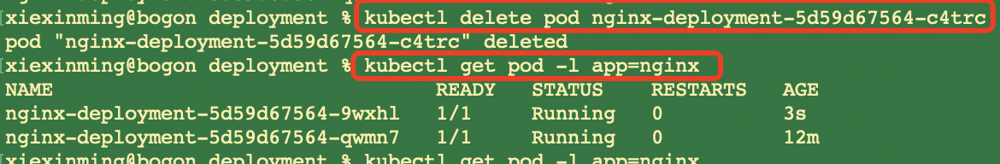


### 6、Deployment的更新(apply)

#### 6.1 方法一
  既然我们的Controller是宣告式的。我可以宣告说我想要一个什么样的状态？
我们之前看到我们的deployment的nginx版本是1.7.9

```renderscript
kubectl get deployment nginx-deployment -o wide
```


  如果说这个时候，我们需要更新以下nginx的image;

我们这个时候使用以下文件:nginx_deployment_update.yml

```renderscript
apiVersion: apps/v1 # for versions before 1.9.0 use apps/v1beta2
kind: Deployment
metadata:
  name: nginx-deployment
spec:
  replicas: 2
  selector:
    matchLabels:
      app: nginx
  template:
    metadata:
      labels:
        app: nginx
    spec:
      containers:
        - name: nginx
          image:  nginx:1.8 # Update the version of nginx from 1.7.9 to 1.8
          ports:
            - containerPort: 80
```

这里只是更改了一个image版本；这个时候我们如何做呢?难道还是使用create吗？  
使用apply;其实apply包括了create并且也包含了update。
create：代表的是从无到有，如果我们再运行一遍的话，他会告诉我们已经有了这个镜像。  

```renderscript
kubectl apply -f nginx_deployment_update.yml
```

此时查看我们的nginx_deployment时候会看到:
```renderscript
kubectl get deployment nginx_deployment -o wide
```
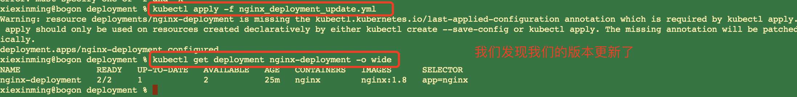

我们通过describe可以看到我们的pod的nginx版本也变成了1.8  

#### 6.2 方法二

  我们去使用如下方法:
```renderscript
kubectl edit deployment  nginx-deployment
```

会看到打开了vim；里面的内容就是我们文件的描述配置文件
然后我们将其:replicas: 3
 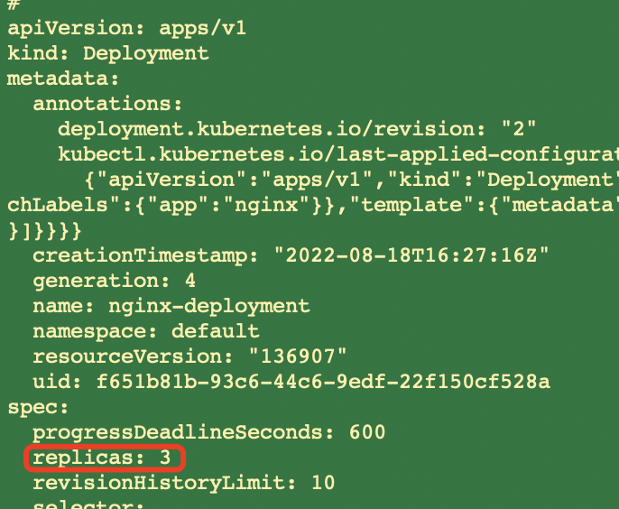
 
然后保存:
这个时候发现我们的deployment已经改变了。

发现我们副本变成了3份。
 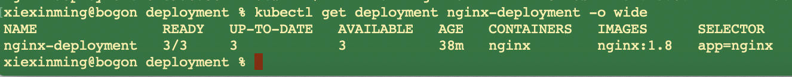

#### 6.3 方法三(scale)
   我们将副本从3变成4

```renderscript
kubectl scale --current-replicas=3 --replicas=4  deployment/nginx-deployment
```
 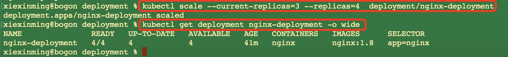
 
 
#### 6.4 方法三(set)

 通过如下指定:
 
```renderscript
kubectl set image deployment/nginx-deployment nginx=nginx:1.9.1
```


### 7、Deployment的扩容(apply)
我们的yml文件如下:

```renderscript
apiVersion: apps/v1 # for versions before 1.9.0 use apps/v1beta2
kind: Deployment
metadata:
  name: nginx-deployment
spec:
  replicas: 4 # Update the replicas from 2 to 4
  selector:
    matchLabels:
      app: nginx
  template:
    metadata:
      labels:
        app: nginx
    spec:
      containers:
        - name: nginx
          image:  nginx:1.8
          ports:
            - containerPort: 80
```

  这个时候,我们执行apply，发现我们的副本变成了4个:

```renderscript
 apply -f nginx_deployment_scale.yml  
```

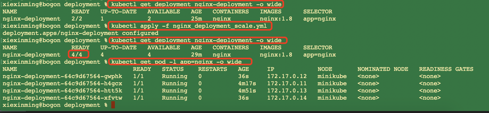

 我们此时删除一个pod的时候，系统会重新给我们创建一个pod。  

 


