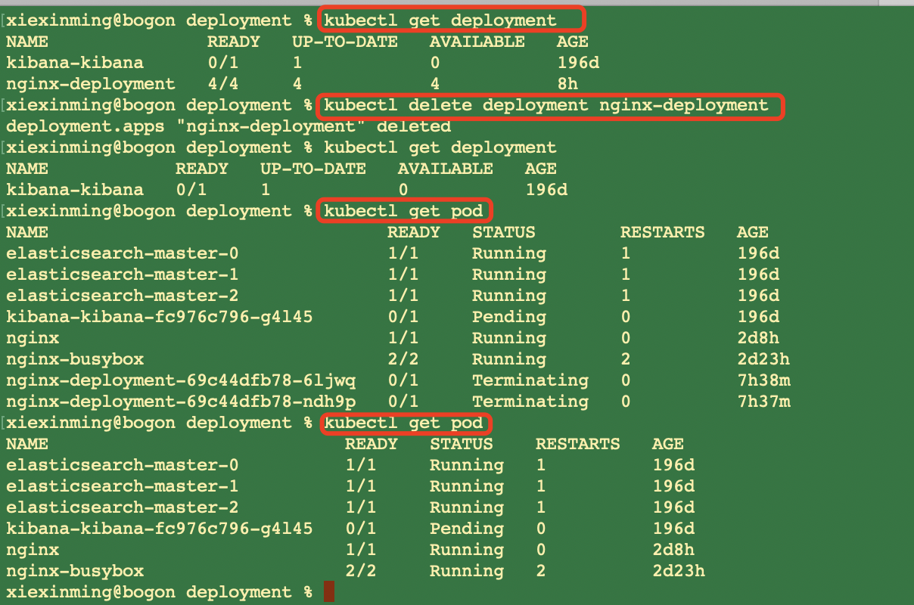
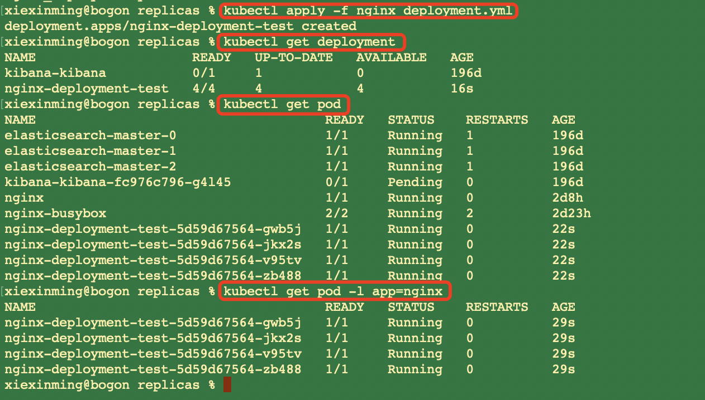

### 1、Replica set在deployment中的原理

   我们现在删除下我们的deployment：
```renderscript
kubectl delete deployment nginx-deployment
``` 

 
 
 我们设置我们的以下新的名为:nginx-deployment-test的nginx_deployment.yml配置
 
```renderscript
apiVersion: apps/v1 # for versions before 1.9.0 use apps/v1beta2
kind: Deployment
metadata:
  name: nginx-deployment-test # Deployment的名字
spec: # Deployment 里面定义的内容
  replicas: 4 # 是我们app: nginx的pod等于2个副本。
  selector: # selector会根据labels去匹配,比如如下,我们的template里面定义了一个spec：其实就是一个pod;这个pod里面有一个container，并且此template有一个labels叫做:app :nginx;
    # 此selector就会过滤掉:template中labels为:app: nginx的这个container;然后
    matchLabels:
      app: nginx
  template: # create pods using pod definition in this template
    metadata:
      # unlike pod-nginx.yml,the name is not included in the meta data as
      # generated from the deployment name
      labels:
        app: nginx
    spec:
      containers:
        - name: nginx
          image:  nginx:1.7.9
          ports:
            - containerPort: 80
```
 
 然后我们执行:
```renderscript
 kubectl apply -f nginx_deployment.yml 
```


   我们查看我们部署的deployment:nginx_deployment：
```renderscript
xiexinming@bogon replicas % kubectl describe deployment nginx-deployment-test 

Name:                   nginx-deployment-test
Namespace:              default
CreationTimestamp:      Fri, 19 Aug 2022 08:56:36 +0800
Labels:                 <none>
Annotations:            deployment.kubernetes.io/revision: 1
Selector:               app=nginx
Replicas:               4 desired | 4 updated | 4 total | 4 available | 0 unavailable
StrategyType:           RollingUpdate
MinReadySeconds:        0
RollingUpdateStrategy:  25% max unavailable, 25% max surge
Pod Template:
  Labels:  app=nginx
  Containers:
   nginx:
    Image:        nginx:1.7.9
    Port:         80/TCP
    Host Port:    0/TCP
    Environment:  <none>
    Mounts:       <none>
  Volumes:        <none>
Conditions:
  Type           Status  Reason
  ----           ------  ------
  Available      True    MinimumReplicasAvailable
  Progressing    True    NewReplicaSetAvailable
OldReplicaSets:  <none>
NewReplicaSet:   nginx-deployment-test-5d59d67564 (4/4 replicas created)
Events:
  Type    Reason             Age    From                   Message
  ----    ------             ----   ----                   -------
  Normal  ScalingReplicaSet  3m46s  deployment-controller  Scaled up replica set nginx-deployment-test-5d59d67564 to 4
```

我们可以看到其上面有一个NewReplicaSet；这个NewReplicaSet就是我们这一节课程需要讲解的重点。

### 2、实现Deployment的更新
  我们Deployment的更新的原理是什么呢？其实就是我们的NewReplicaSet的Controller；这个Controller专门用来维护我们这个整个
Deployment的Scale的。其实当我们创建完一个deployment的话,他就会帮我们去创建一个ReplicaSet的object；如下:

```renderscript
xiexinming@bogon replicas % kubectl get replicaset

NAME                               DESIRED   CURRENT   READY   AGE
kibana-kibana-fc976c796            1         1         0       196d
nginx-deployment-test-5d59d67564   4         4         4       9m42s
```
  
  我们可以看到我们这里有一个nginx-deployment-test-5d59d67564的replicaset；他实际上是维护我们整个deployment的数量。

我们从上面的Events-其实就是我们的deployment的日志中我们可以看到:

```renderscript
Events:
  Type    Reason             Age    From                   Message
  ----    ------             ----   ----                   -------
  Normal  ScalingReplicaSet  3m46s  deployment-controller  Scaled up replica set nginx-deployment-test-5d59d67564 to 4
```

  上面就是通过我们的replicaset：nginx-deployment-test-5d59d67564来设置副本为4。  


###### 设置replicas从4到6
  我们执行如下操作:
  
```renderscript
xiexinming@bogon replicas % kubectl scale --current-replicas=4 --replicas=6 deployment/nginx-deployment-test
deployment.apps/nginx-deployment-test scaled
xiexinming@bogon replicas % kubectl describe deployment nginx-deployment-test                               
Name:                   nginx-deployment-test
Namespace:              default
CreationTimestamp:      Fri, 19 Aug 2022 08:56:36 +0800
Labels:                 <none>
Annotations:            deployment.kubernetes.io/revision: 1
Selector:               app=nginx
Replicas:               6 desired | 6 updated | 6 total | 6 available | 0 unavailable
StrategyType:           RollingUpdate
MinReadySeconds:        0
RollingUpdateStrategy:  25% max unavailable, 25% max surge
Pod Template:
  Labels:  app=nginx
  Containers:
   nginx:
    Image:        nginx:1.7.9
    Port:         80/TCP
    Host Port:    0/TCP
    Environment:  <none>
    Mounts:       <none>
  Volumes:        <none>
Conditions:
  Type           Status  Reason
  ----           ------  ------
  Progressing    True    NewReplicaSetAvailable
  Available      True    MinimumReplicasAvailable
OldReplicaSets:  <none>
NewReplicaSet:   nginx-deployment-test-5d59d67564 (6/6 replicas created)
Events:
  Type    Reason             Age   From                   Message
  ----    ------             ----  ----                   -------
  Normal  ScalingReplicaSet  15m   deployment-controller  Scaled up replica set nginx-deployment-test-5d59d67564 to 4
  Normal  ScalingReplicaSet  8s    deployment-controller  Scaled up replica set nginx-deployment-test-5d59d67564 to 6
```  

然后我们看到又多了一条Events。

查看pod:发现为6个:

```renderscript
xiexinming@bogon replicas % kubectl get pod -l app=nginx

NAME                                     READY   STATUS    RESTARTS   AGE
nginx-deployment-test-5d59d67564-gwb5j   1/1     Running   0          17m
nginx-deployment-test-5d59d67564-jj6ks   1/1     Running   0          2m3s
nginx-deployment-test-5d59d67564-jkx2s   1/1     Running   0          17m
nginx-deployment-test-5d59d67564-sx45h   1/1     Running   0          2m3s
nginx-deployment-test-5d59d67564-v95tv   1/1     Running   0          17m
nginx-deployment-test-5d59d67564-zb488   1/1     Running   0          17m
```

查看replicaset发现其desired为6个:
```renderscript
xiexinming@bogon replicas % kubectl get replicaset  
    
NAME                               DESIRED   CURRENT   READY   AGE
kibana-kibana-fc976c796            1         1         0       196d
nginx-deployment-test-5d59d67564   6         6         6       18m
```


