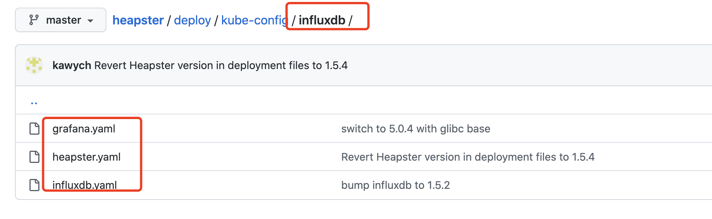
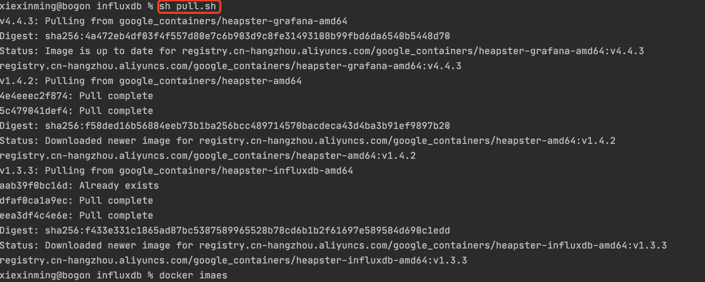
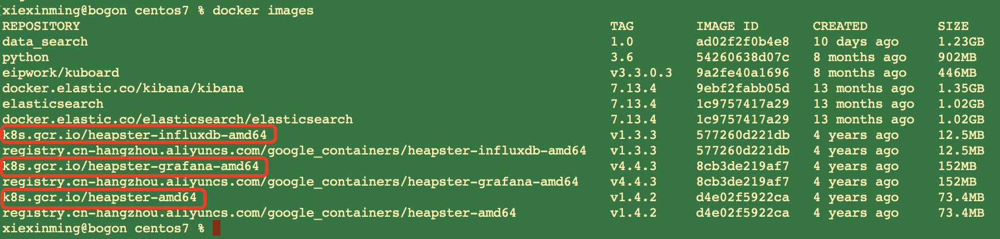
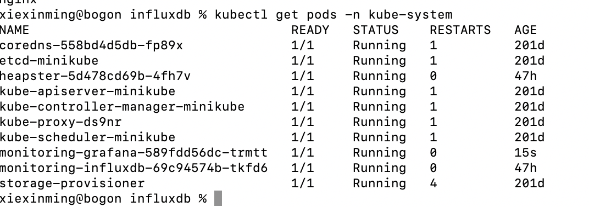
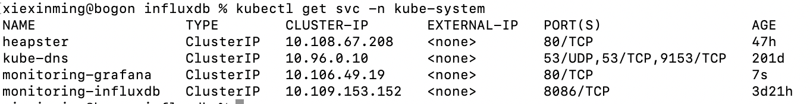
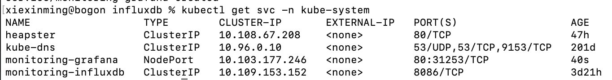
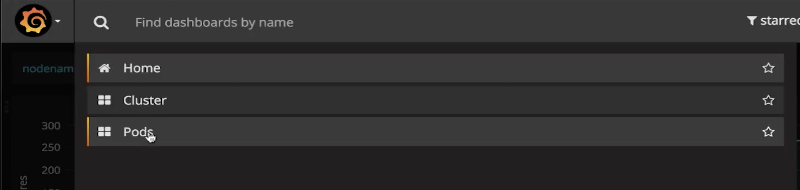
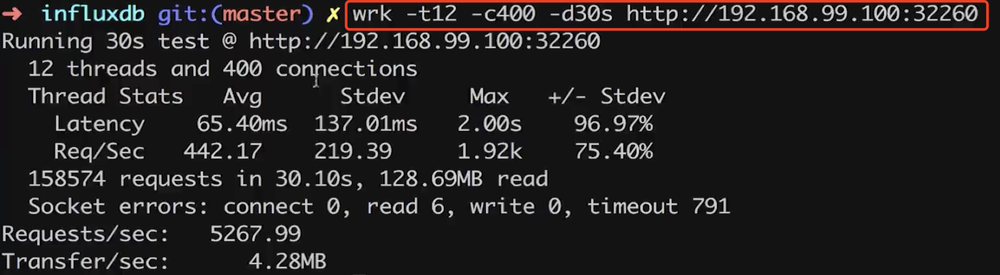

### 1. 摘要
  之前我们讲解了对docker容器宿主机的监控，现在我们看以下如何对我们的集群进行监控,在容器编排之中，我们使用的比较多的就是
k8s

### 2.集群监控
首先我们看一下最简单的监控模块：资源的监控：集群机器计算资源的使用情况(cpu、内存、运行着的容器计算资源)，我们今天使用的工具是
:heapster,其是k8s开源的一个工具。我们下载其master分支源代码:  


  然后我们看到其下的influxdb的配置。在配置文件里面都是定义了Deployment跟相应的Service。  
比如我们的influxdb.yaml:

```renderscript
apiVersion: extensions/v1beta1
kind: Deployment
metadata:
  name: monitoring-influxdb
  namespace: kube-system
spec:
  replicas: 1
  template:
    metadata:
      labels:
        task: monitoring
        k8s-app: influxdb
    spec:
      containers:
      - name: influxdb
        image: k8s.gcr.io/heapster-influxdb-amd64:v1.3.3
        volumeMounts:
        - mountPath: /data
          name: influxdb-storage
      volumes:
      - name: influxdb-storage
        emptyDir: {}
---
apiVersion: v1
kind: Service
metadata:
  labels:
    task: monitoring
    # For use as a Cluster add-on (https://github.com/kubernetes/kubernetes/tree/master/cluster/addons)
    # If you are NOT using this as an addon, you should comment out this line.
    # kubernetes.io/cluster-service: 'true'
    kubernetes.io/name: monitoring-influxdb
  name: monitoring-influxdb
  namespace: kube-system
spec:
  ports:
  - port: 8086
    targetPort: 8086
  selector:
    k8s-app: influxdb
```

 我们需要将上面3个配置文件中的:Service下面的metadata下的labels的kubernetes.io/cluster-service: 'true'，我们去掉add-on；
 为了保证我们能够安装成功，我们把每一个需要的images给pull下来。
 
#### 1.拉取镜像  
grafana:

```renderscript
docker pull k8s.gcr.io/heapster-grafana-amd64:v4.4.3
```

heapster:
```renderscript
docker pull k8s.gcr.io/heapster-amd64:v1.4.2
```

influxdb:

```renderscript
docker pull k8s.gcr.io/heapster-influxdb-amd64:v1.3.3
```

如果发现拉取镜像有问题的话,我们从阿里云拉取，然后修改其其tag即可：
https://blog.csdn.net/ibless/article/details/108438301

grafana:

```renderscript
docker pull k8s.gcr.io/heapster-grafana-amd64:v4.4.3

docker pull registry.cn-hangzhou.aliyuncs.com/google_containers/heapster-grafana-amd64:v4.4.3
docker tag  registry.cn-hangzhou.aliyuncs.com/google_containers/heapster-grafana-amd64:v4.4.3 k8s.gcr.io/heapster-grafana-amd64:v4.4.3
```

heapster:
```renderscript
docker pull k8s.gcr.io/heapster-amd64:v1.4.2
```

influxdb:

```renderscript
docker pull k8s.gcr.io/heapster-influxdb-amd64:v1.3.3
```

脚本:pull.sh
```renderscript
images=(
    heapster-grafana-amd64:v4.4.3
    heapster-amd64:v1.4.2
    heapster-influxdb-amd64:v1.3.3
)

for imageName in ${images[@]} ;do
    docker pull registry.cn-hangzhou.aliyuncs.com/google_containers/$imageName
    docker tag registry.cn-hangzhou.aliyuncs.com/google_containers/$imageName k8s.gcr.io/$imageName
done
```




#### 2.创建deployment

###### 创建deployment
```renderscript
 kubectl apply -f grafana.yaml
 kubectl apply -f influxdb.yaml
 kubectl apply -f heapster.yaml
```

###### 查看创建的pod


###### 查看创建的service  


 我们可以发现具有4个service。  

 我们创建的service都是type为:ClusterIP类型的节点。针对于heapster我们没法对外去访问。
咱们就将其type改为:nodePort,如下:

```renderscript
apiVersion: v1
kind: Service
metadata:
  labels:
    # For use as a Cluster add-on (https://github.com/kubernetes/kubernetes/tree/master/cluster/addons)
    # If you are NOT using this as an addon, you should comment out this line.
    #kubernetes.io/cluster-service: 'true'
    kubernetes.io/name: monitoring-grafana
  name: monitoring-grafana
  namespace: kube-system
spec:
  # In a production setup, we recommend accessing Grafana through an external Loadbalancer
  # or through a public IP.
  # type: LoadBalancer
  # You could also use NodePort to expose the service at a randomly-generated port
  # type: NodePort
  ports:
  - port: 80
    targetPort: 3000
  selector:
    k8s-app: grafana
  type: NodePort
```


 我们重新创建我们的service,然后可以看到:

 其创建了的service为nodePort了，并且对应的端口为:31253
 我们打开浏览器：然后访问如下:


garafa的默认用户名/密码是admin/admin。  
然后我们可以进入到对应的：Home,Cluster,Pod去看我们的情况。




 我们通过以下测试流量访问情况:



