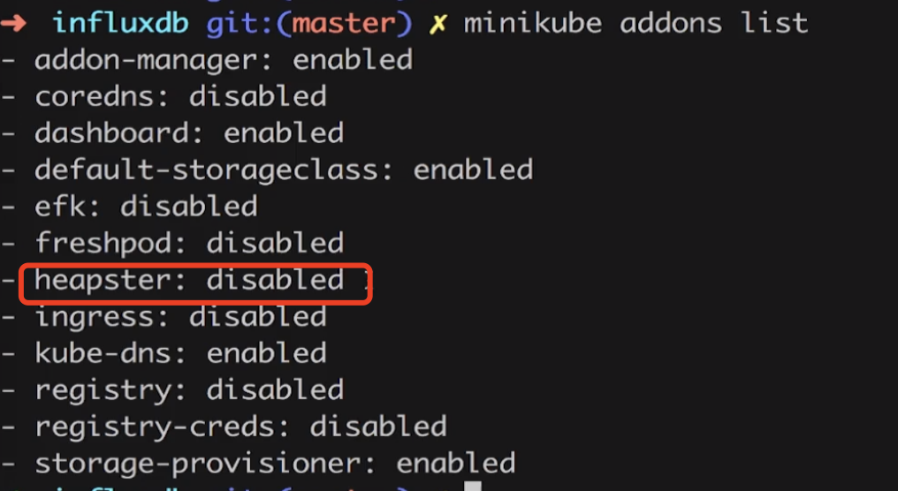
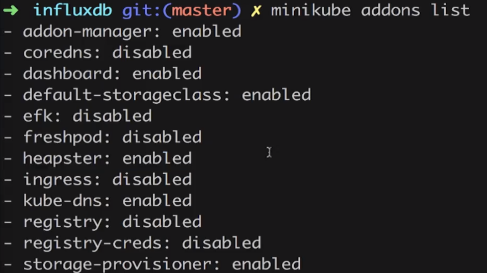
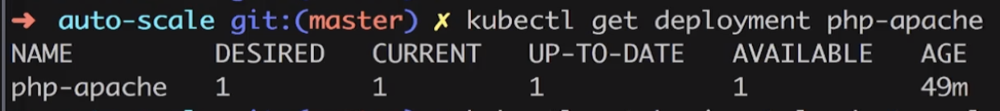
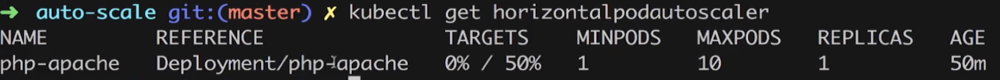
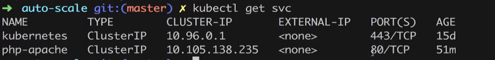
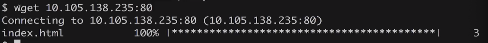
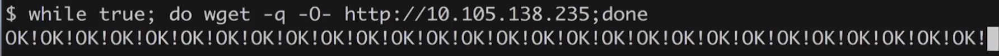
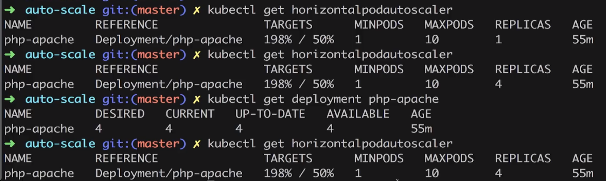
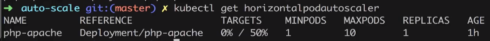

### 1. 摘要
  上一节我们讲解了对系统资源的一些监控，现在的话我们讲解下，对这些系统资源的监控有什么用呢？我们这一节主要讲解下如下的：水平的自动伸缩功能。  
  
  自动伸缩:他主要是跟我我们pod的占用系统资源的情况进行伸缩的。我们其实可以对每一个pod占用的资源进行限制。我们现在的需求是：
###### 自动扩展
   如上，我们启动一个pod服务，其cpu的资源占用不能高于50%,一旦高于50%的话我们就会自动创建另一个pod来分担压力，以此类推。直到启动到
第N个pod之后，其服务的cpu使用率不高于50%了。我们系统做扩展的化，我们需要知道每一个系统的资源利用情况，让后利用我们的水平自动扩展：Horizontal Pod Autoscaler
来调用RC/Deployment来进行扩展。

###### 自动压缩
  比如我们的cpu资源使用率非常低,我们可以减少pod
  
### 2.Autoscaler(自动水平扩展)  
    
  如上图所示:
1、手动扩展的功能可以通过:RC/Deployment----Replica Controller或者是Deployment去做手动的scale。
2、自动扩展:我们的自动扩展是我们创建了一个Horizontal Pod Autoscaler进行，它能够根据pod的资源情况去调用RC/Deployment去做自动的
资源扩展。把我们之前手动实现的过程变成了自动化。Horizontal Pod Autoscaler要进行扩展，他必须知道每一个Pod的资源利用情况。所以说他需要这个数据，
这个数据怎么来呢？这个数据可以通过heapster来。如果我们的有一个pod的资源利用率超过50%的时候，我可以自动地为其扩容。
3、自动压缩：比如我们的系统资源利用率比较低下，这个时候我们每一个pod的资源不用那么多，这个时候我们可以压缩我们的资源。

   我们进入:heapster-master/deploy/kube-config/influxdb;
   我们删除之前的pods,

查看安装的插件：  

```renderscript
minikube addons list
```  
  

 我们发现我们的heapster是禁用的，这个时候我们需要启用：
 
```renderscript
minikube addons enable heapster
``` 

然后我们查看addons列表,发现其用经enable了。  
  

然后我们停止掉minikube  

```renderscript
minikube stop
```

重启minikube添加额外参数：  
```renderscript
minikube start --extra-config=controller-manager.HorizontalPodAutoscalerUseRESTClients=false
```

  然后我们按照k8s的官方文档，去使用我们的水平扩展功能。  
地址参考:https://kubernetes.io/docs/tasks/run-application/horizontal-pod-autoscale-walkthrough/
按照以下步骤进行:

###### 1、Run and expose php-apache server
```renderscript
kubectl apply -f https://k8s.io/examples/application/php-apache.yaml
```

对应的配置为:

```renderscript
apiVersion: apps/v1
kind: Deployment
metadata:
  name: php-apache
spec:
  selector:
    matchLabels:
      run: php-apache
  replicas: 1
  template:
    metadata:
      labels:
        run: php-apache
    spec:
      containers:
      - name: php-apache
        image: registry.k8s.io/hpa-example
        ports:
        - containerPort: 80
        resources:
          limits:
            cpu: 500m
          requests:
            cpu: 200m
---
apiVersion: v1
kind: Service
metadata:
  name: php-apache
  labels:
    run: php-apache
spec:
  ports:
  - port: 80
  selector:
    run: php-apache
```

###### 2、Create the HorizontalPodAutoscaler
```renderscript
kubectl autoscale deployment php-apache --cpu-percent=50 --min=1 --max=10
```

   
  我们通过kubectl设置了我们的php-apache的cpu为:50%;Replica最小是1，最大是10；意思就是当我们的pod的
cpu达到50%的时候，我们就需要进行扩容了，扩容的最小副本是1 最大副本是10。

   我们可以查看我们的水平扩展能力:
```renderscript
kubectl get horizontalpodautoscaler
```
  

我们得到如上结果:php-apache的，目前cpu使用率是0，最大是50%，   副本为:1。

###### 3、测试增加php-apache的负载  

  我们先通过如下命令去查看我们的service:
```renderscript
kubectl get svc
```
  

然后我们进入minikube里面:

```renderscript
minikube ssh
```

然后我们通过wget访问上面的服务。  

  

我们写一个shell脚本，一直去访问我们的php-apache服务。


然后我们通过另一个终端去获取伸缩情况：


我们发现副本一直在涨。

我们在minikube里面停止掉我们的shell脚本，然后我们可以知道： 



  


