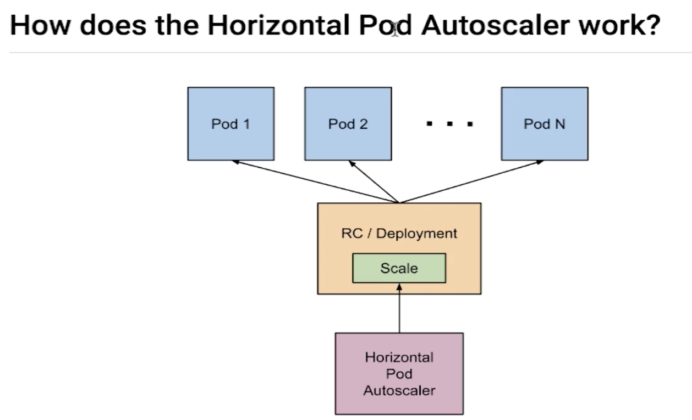

### 1. 摘要
  上一节我们讲解了对系统资源的一些监控，现在的话我们讲解下，对这些系统资源的监控有什么用呢？我们这一节主要讲解下如下的：水平的自动伸缩功能。  
  
  自动伸缩:他主要是跟我我们pod的占用系统资源的情况进行伸缩的。我们其实可以对每一个pod占用的资源进行限制。我们现在的需求是：
###### 自动扩展
   如上，我们启动一个pod服务，其cpu的资源占用不能高于50%,一旦高于50%的话我们就会自动创建另一个pod来分担压力，以此类推。直到启动到
第N个pod之后，其服务的cpu使用率不高于50%了。

###### 自动压缩
  比如我们的cpu资源使用率非常低,我们可以减少pod
  
### 2.Autoscaler(自动水平扩展)  
    
  如上图所示:
1、手动扩展的功能可以通过:RC/Deployment----Replica Controller或者是Deployment去做手动的scale。
2、自动扩展:我们的自动扩展是我们创建了一个Horizontal Pod Autoscaler进行，它能够根据pod的资源情况去调用RC/Deployment去做自动的
资源扩展。把我们之前手动实现的过程变成了自动化。Horizontal Pod Autoscaler要进行扩展，他必须知道每一个Pod的资源利用情况。所以说他需要这个数据，
这个数据怎么来呢？这个数据可以通过heapster来。

