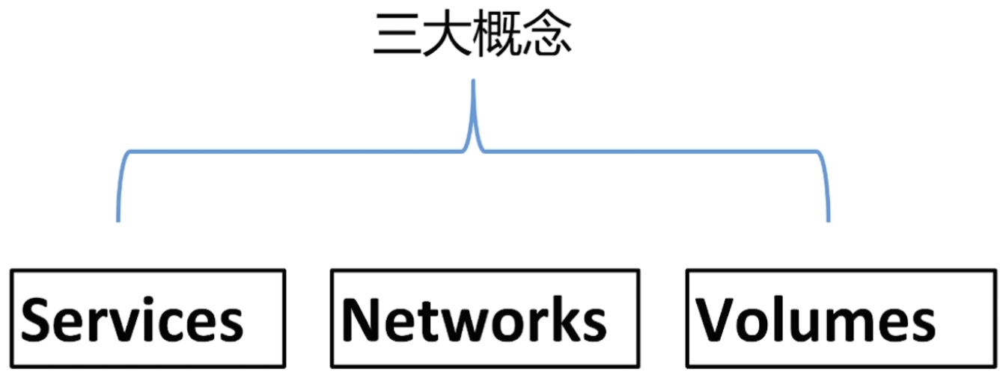
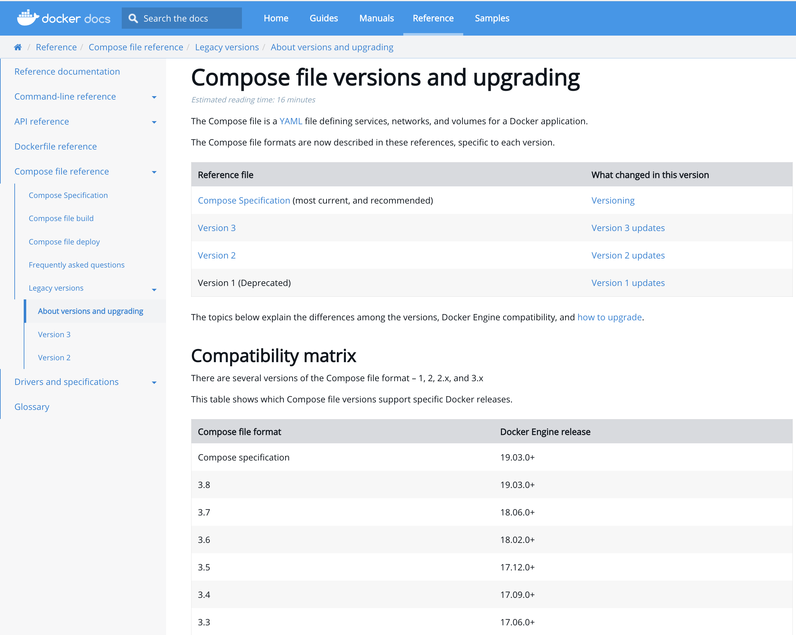
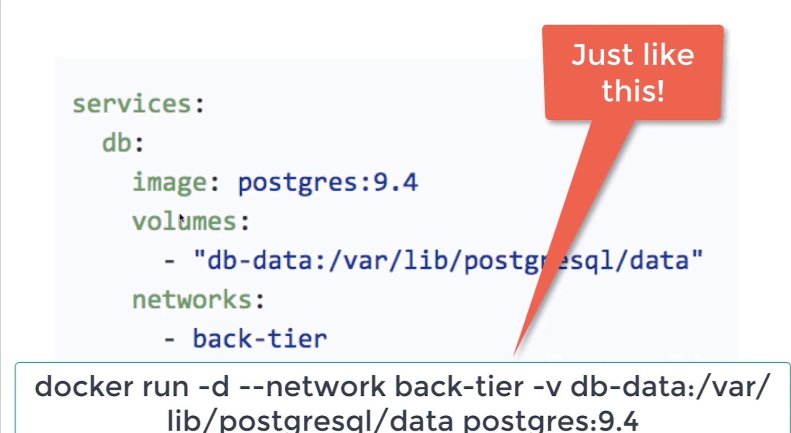
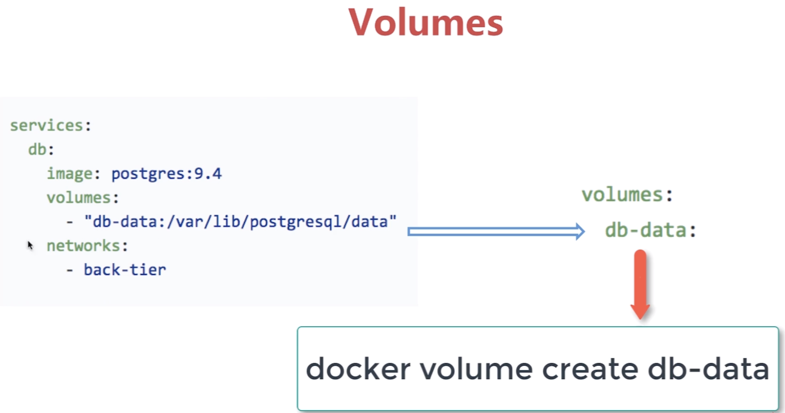
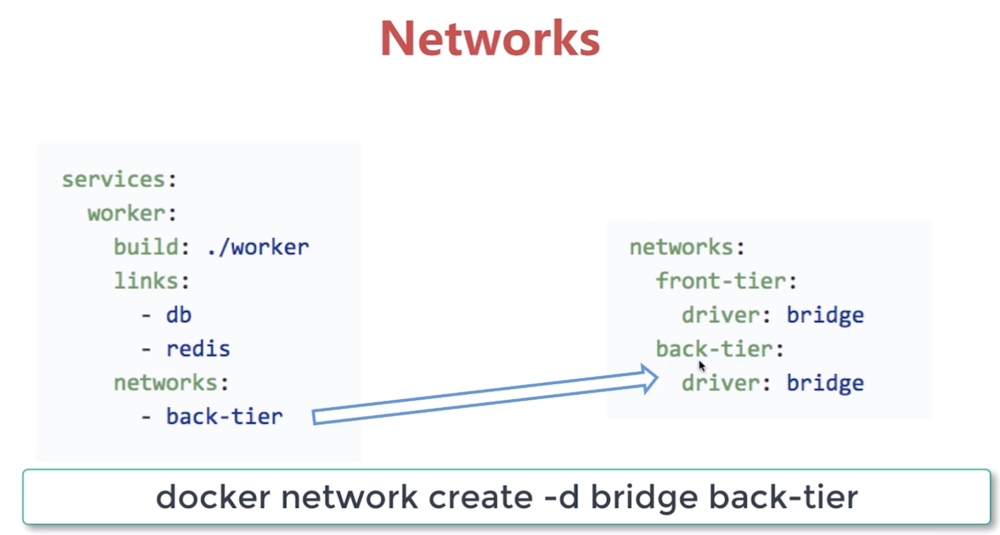

### 1、多容器的App的问题
  当我们需要创建一个多容器的app的时候，我们需要经历下面的步骤：
1、要从Dockerfile build image或者Dockerhub拉取image镜像。
2、要创建多个container
3、要管理者和谐container(启动、停止、删除)当我们创建了多个docker容器之后，当我们需要删除多个app的时候，需要全部删除跟停止，这样的话会很恶心。  

有没有一种批处理创建容器并且启动容器了，这个时候docker compose出现了，docker compose就是我们的"批处理"
### 2、docker compose批处理

   如上所示,我们只需要定义好一个text file文件 然后通过一条命令就可以搞定多个应用程序的启动/删除/停止。

### 3、什么是docker composse?
1、docker compose是一个基于docker的工具。
2、这个工具可以通过一个yml文件定义多容器的docker应用。
3、通过一条命令就可以根据yml文件的定义去创建或者管理这多个容器。  

### 4、docker-composse.yml
  这个yml文件有一个默认的名字:docker-compose.yml。当然我们也可以根据我们自己的诉求改一个名字。
在这个yml文件里面定义了3个重要的概念。如下:

Services、Networks、Volumes。
在讲解docker-compose之前我们首先讲解下docker-compose的version  
https://docs.docker.com/compose/compose-file/compose-versioning/  
  
   我们可以看到对应的版本分别是：version的1、2、3；但是version1已经过时了，不建议再用了，一般用
 version3。当然version2也是可以的。  
 
  Compatibility matrix中我们可以看到我们的docker file的版本跟我们的docker的引擎的版本。
我们可以看到我们的docker引擎版本一般都是19年3月之后的。  
  version2跟version3没有太大的区别，唯一的区别局势version2只能用于单机，version3可以用于多机。  
什么意思呢？意思就是，如果我们通过version2去定义的app；我们通过docker compose去启动app的话。这个app所包含的多个容器
是只能运行在本机上的，version3默认也是运行在我们的本机上的，

### 5、docker compose里面的核心概念

#### 5.1、services  
1、一个service代表一个container,这个container可以从dockerhub的image来创建，或者从本地的
Dockerfile build出来的image来创建。
2、Service的启动类似于docker run,我们可以给其制定network和volume,所以可以给service制定network和Volume的引用。


比如说：我们的一个如上所示docker-compose file文件。
我们定义了一个service名字叫做:db  
其对应的镜像是：postgres:9.4  
对应的volumes为:在本地映射了一个db-data。  
然后我们定义了一个：back-tier的网络。  


以上是第二种：定义了一个worker的容器，他不是从远程去拉取的，而是从本地去build的。其对应的dockerfile的location在
worker下面。其对应的网络也是:back-tier。links:指代我们的work会跟容器:db、redis做links。其实这个links都是不必要的
因为我们会通过networks来创建一个bridge；如果我们的多个容器都在这个bridge上，那么我们都是不需要links的。  

#### 5.2、Volumes  
  
同理,volumes中,我们会定义一个volume，叫做db-data；


#### 5.3、Networks  
  
  同理我们的volumes也会定义一个back-tier的东西，其是在我们的networks上定义的。在networks中会创建一个:

#### 5.4 完整的docker-compose示例

```renderscript
version: '3'

services:

  wordpress:
    image: wordpress
    ports:
      - 8080:80
    environment:
      WORDPRESS_DB_HOST: mysql
      WORDPRESS_DB_PASSWORD: root
    networks:
      - my-bridge

  mysql:
    image: mysql
    environment:
      MYSQL_ROOT_PASSWORD: root
      MYSQL_DATABASE: wordpress
    volumes:
      - mysql-data:/var/lib/mysql
    networks:
      - my-bridge

volumes:
  mysql-data:

networks:
  my-bridge:
    driver: bridge
```
  我们通过docker compose去定义了wordpress的services、volumes、networks；
version: '3'----指代我们的docker compose的api是第三个版本。  
services->wordpress ---- 定义了我们的image为wordpress；其端口是:我们把本地的8080映射到wordpress的80端口；environment：相当于通过-e传递环境变量
传递mysql的host跟mysql的password。networks制定了我们是my-bridge。  

 mysql中的volumes跟wordpress里面的networks都是在我们的volumes跟networks下面有定义。
 


 

 

