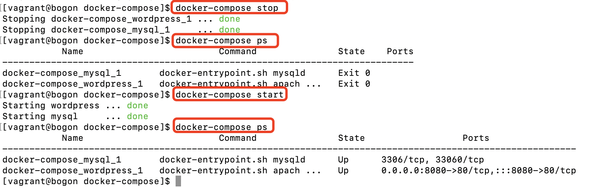

### 1、多容器的App的问题
  因为docker compose是docker的命令行工具；我们是需要安装的，
在桌面操作系统：比如：mac、window上的机器，我们的docker-compose是默认自动安装好的。  
  

```renderscript
docker-compose --version
docker-compose version 1.29.2, build 5becea4c
```

我们的docker compose是参考如下:https://docs.docker.com/compose/  
我们参考如下:https://docs.docker.com/compose/install/compose-plugin/ 安装docker-compose；  

###### 1、To download and install the Compose CLI plugin, run:
```renderscript
 DOCKER_CONFIG=${DOCKER_CONFIG:-$HOME/.docker}
 mkdir -p $DOCKER_CONFIG/cli-plugins
 curl -SL https://github.com/docker/compose/releases/download/v2.7.0/docker-compose-linux-x86_64 -o $DOCKER_CONFIG/cli-plugins/docker-compose
```

### 2、通过docker-compose启动一个word-press
  安装完之后，我们发现docker-compose支持的command是非常多的，有如下种类：
   

一般我们使用docker-compose都是结合我们的yml文件来进行的。  

我们先看下如下的配置文件:

```renderscript
version: '3'

services:

  wordpress:
    image: wordpress
    ports:
      - 8080:80
    environment:
      WORDPRESS_DB_HOST: mysql
      WORDPRESS_DB_PASSWORD: root
    networks:
      - my-bridge

  mysql:
    image: mysql
    environment:
      MYSQL_ROOT_PASSWORD: root
      MYSQL_DATABASE: wordpress
    volumes:
      - mysql-data:/var/lib/mysql
    networks:
      - my-bridge

volumes:
  mysql-data:

networks:
  my-bridge:
    driver: bridge
```

#### 1、docker-compose up
   docker-compose up是将我们的yml文件里面的容器启动起来。
   默认情况下我们敲命令:docker-compose up 是直接寻找我们当前目录下的docker-compose.yml文件，他的作用等同于:
```renderscript
docker-compose -f docker-compose.yml up
```
 我们使用上面的docker-compose.yml启动容器的时候，我们发现了如下的信息。  
  
 
 我们通过docker ps可以看到对应的日志信息:
     
  我们的docker-compose已经起来了。

我们通过docker-compose ps可以看到我们的docker-compose启动的两个service有2个：
     
   
 我们现在可以通过docker-compose指导docker的启动 停止情况。  
 我们可以通过以下指令查看容器的情况：
     
 
 我们刚开始通过docker-compose启动容器的时候，我们可以通过docker-compose up来启动
 一批容器,这种方式可以看到容器启动的日志，所以多用于debug的情况。当然我们也可以通过：
 
 ```renderscript
docker-compose up -d
```
  
上面这种方式来启动多个容器，这种方式是不打印日志的，多用于平时服务启动。  

###### 列觉出docker-compose里面定义的container。  
   
   
###### 进入docker-compose里面定义的service

```renderscript
docker-compose exec container-id
```

     
   

### 3、通过docker-compose启动一个flask
   我们通过dockerfile来build一个web,通过image创建一个redis容器  

```renderscript
version: "3"

services:

  redis:
    image: redis

  web:
    build:
      context: .
      dockerfile: Dockerfile
    ports:
      - 8080:5000
    environment:
      REDIS_HOST: redis
```

  我们通过一个dockerfile来构建一个service容器。通过docker-compose up可以看到我们
启动的容器的日志；通过docker-compose up -d 我们后台启动一个容器。然后我们通过
docker-compose down来消除一个容器。  
  
  


 
  


