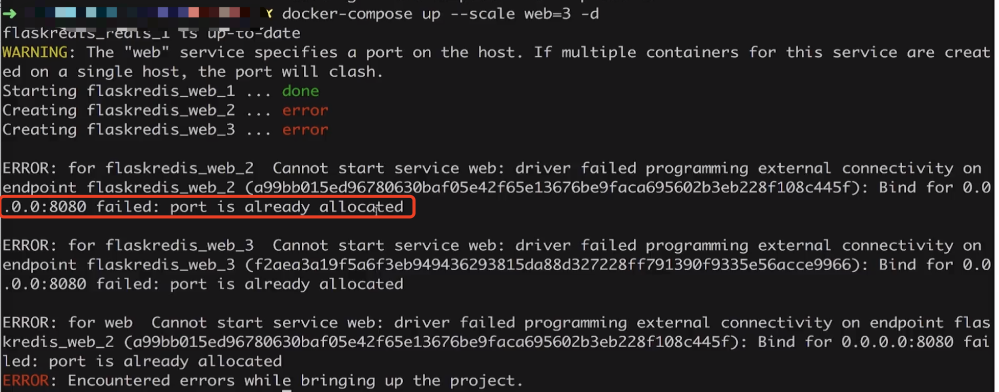

### 1、多容器的scale问题

我们通过如下：docker-compose来启动一个容器。

```renderscript
version: "3"
services:
  redis:
    image: redis
  web:
    build:
      context: .
      dockerfile: Dockerfile
    ports:
      - 8080:5000
    environment:
      REDIS_HOST: redis
```

Dockerfile如下:

```renderscript
FROM python:2.7
LABEL maintaner="startshineye@gmail.com"
COPY . /app
WORKDIR /app
RUN pip install flask redis
EXPOSE 5000
CMD [ "python", "app.py" ]
```

app.py如下:

```renderscript
from flask import Flask
from redis import Redis
import os
import socket

app = Flask(__name__)
redis = Redis(host=os.environ.get('REDIS_HOST', '127.0.0.1'), port=6379)


@app.route('/')
def hello():
    redis.incr('hits')
    return 'Hello Container World! I have been seen %s times and my hostname is %s.\n' % (redis.get('hits'),socket.gethostname())


if __name__ == "__main__":
    app.run(host="0.0.0.0", port=5000, debug=True)
```

   然后我们通过docker-compose up -d 后台启动此容器：
   
   
   
   最后通过docker-compose ps 查看我们启动的容器：
   
   
   
   现在我们的web跟redis应用都只有一个。我们通过scale可以去扩展。我们通过：

```renderscript
docker-compose up --help
```

   可以看到我们的启动程序指令。  

我们通过:

```renderscript
docker-compose up --scale web=3 -d
```

   来启动我们的web服务，其数量为3；但是我们启动的时候会报一个错误：如下：  
      
  
  原因是我们端口冲突之后导致了，我们看到web端口是将容器内部的5000端口映射到我们的8080端口。
  
```renderscript
version: "3"
services:
  redis:
    image: redis
  web:
    build:
      context: .
      dockerfile: Dockerfile
    ports:
      - 8080:5000
    environment:
      REDIS_HOST: redis
```
   我们多个容器启动的进程不可能是绑定到我们的一个8080端口上，所以是:
  ports:
       - 8080:5000
   导致了我们启动容器时候的错误。  
   
   我们删除以上内容，然后先通过:docker-compose up -d启动一个服务，然后通过docker-compose ps查看我们启动的服务。
   
   再次我们通过docker-compose up --scale web=3 -d启动服务，再次通过docker-compose ps查看我们的服务，我们发现
   我们的服务web启动了3个。  
   
   
      
   我们按照以上图示：通过负载均衡将请求同时请求到我们的web1 ... webn;然后在请求访问到redis；实现了请求同一个端口的负载均衡。

### 2、多容器下实现HAProxy的路由转发
   我们使用如下方式实现我们的flask的路由转发。  

app.py:对应的端口改为80
```renderscript
from flask import Flask
from redis import Redis
import os
import socket

app = Flask(__name__)
redis = Redis(host=os.environ.get('REDIS_HOST', '127.0.0.1'), port=6379)


@app.route('/')
def hello():
    redis.incr('hits')
    return 'Hello Container World! I have been seen %s times and my hostname is %s.\n' % (redis.get('hits'),socket.gethostname())


if __name__ == "__main__":
    app.run(host="0.0.0.0", port=80, debug=True)
```  

Dockerfile:变成了expose：

```renderscript
FROM python:2.7
LABEL maintaner="Peng Xiao xiaoquwl@gmail.com"
COPY . /app
WORKDIR /app
RUN pip install flask redis
EXPOSE 80
CMD [ "python", "app.py" ]
```

docker-compose.yml文件:我们添加上lb模块，web模块的ports我们也去掉了；我们把80内部端口映射到我们的8080主机端口。

```renderscript
version: "3"

services:

  redis:
    image: redis

  web:
    build:
      context: .
      dockerfile: Dockerfile
    environment:
      REDIS_HOST: redis

  lb:
    image: dockercloud/haproxy
    links:
      - web
    ports:
      - 8080:80
    volumes:
      - /var/run/docker.sock:/var/run/docker.sock 
```
   
最终我们会实现如下效果：
 

 我们先启动一个容器：
 
 ```renderscript
docker-compose up -d
```

然后我们访问我们的容器：
然后我们通过curl访问我们的机器：

```renderscript
curl 127.0.0.1:8080
```

然后我们的hostname就是xxx;

接着我们通过scale开启5个端口。
```renderscript
docker-compose up --scale=5 -d
```

我们再次通过脚本:for i in 'seq 10';do curl 127.0.0.1:8080;done
我们可以查看到我们的效果。  

当然我们也可以通过减小我们的scale方式来将压缩我们的服务个数，主要是在我们的访问高峰之后。  

### 3、展望
   上面是只有一台机器，我们后面会在多台机器组成的cluster下的集群下做scale.swarm


