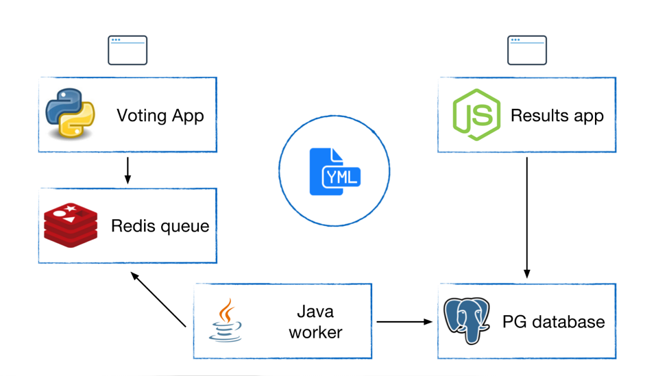

### 1、投票系统介绍

#### 1.1、系统架构  
    
 我们首先可以看到我们的系统架构如上:
 系统分为5个模块:
 Voting App:（是一个python的flask项目）有一个web页面，提供外部app去访问的。有投票候选人的情况。
 Results app:(是一个angular项目)有一个web页面，会实时显示我们的投票信息。
 Redis  Queue:Voting App会连接一个Redis缓存，投票量比较大，所以先把他存放到我们的redis里面去。
 Java Worker:(是一个java项目) 然后我们的Java应用程序会从redis里面读取投票信息，然后写入到我们的PG数据库中，最后我们的Results app
 从我们的PG数据库中查询最新结果。  
 
 对应的某一个模块都有一个Dockerfile的文件。我们需要根据源码来编译我们的image。  
我们看下我们的docker-compose.yml文件:  

```renderscript
version: "3"

services:
  voting-app:
    build: ./voting-app/.
    volumes:
     - ./voting-app:/app
    ports:
      - "5000:80"
    links:
      - redis
    networks:
      - front-tier
      - back-tier

  result-app:
    build: ./result-app/.
    volumes:
      - ./result-app:/app
    ports:
      - "5001:80"
    links:
      - db
    networks:
      - front-tier
      - back-tier

  worker:
    build: ./worker
    links:
      - db
      - redis
    networks:
      - back-tier

  redis:
    image: redis
    ports: ["6379"]
    networks:
      - back-tier

  db:
    image: postgres:9.4
    volumes:
      - "db-data:/var/lib/postgresql/data"
    networks:
      - back-tier

volumes:
  db-data:

networks:
  front-tier:
  back-tier:
```

  我们可以看到，我们的services有:voting-app、result-app、worker、redis、db这5个service。
voting-app、result-app、worker都是从本地的Dockerfile中去build的，而redis、db是从image中获取的。  
我们定义了2个networks，一个是:front-tier,另一个是:back-tier;我们并没有指明我们network的driver,所以默认是:bridge。
voting-app：连接到2个network，
result-app：也是连接到2个network
worker、redis、db：都是连接到1个network。
voting-app、result-app因为要对外部提供访问的，所以都连接：front-tier；但是又要跟后面的redis、db等访问，所以🈶️需要公用事业一个:back-tier


#### 1.2、系统部署
   咱们通过docker-compose up首次构建的话 比较慢，大概有10分钟，原因是因为：需要从远程的镜像库中去下载这些。baseImage刚开始本地都没有。
所以会从远程下载。

   结果:我们可以从docker-compose可以知道：voting-app将80映射到本地的5000端口，而result-app是将80端口映射到本地的5001端口，
我们可以启动服务后，浏览器访问我们的页面：通过voting投票，然后result-app去查看投票结果。  

###### docker-compose build
   如果我们通过docker-compose build时候我们会build镜像，然后docker-compose up的时候会快很多，如果我们直接docker-compose up，其实其
   做了两步事情，如果我们的app等发生变化，我们通过docker-compose build重新构建镜像。
   
######  注意
   docker-compose是用于本地开发的一个工具，所以不是一个部署生产app的一个工具，只是问了方便大家本地做开发，看一个部署的结果。
   
