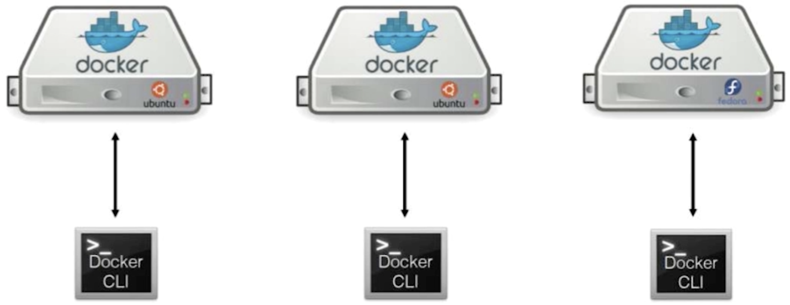
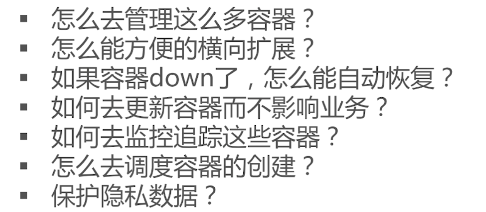
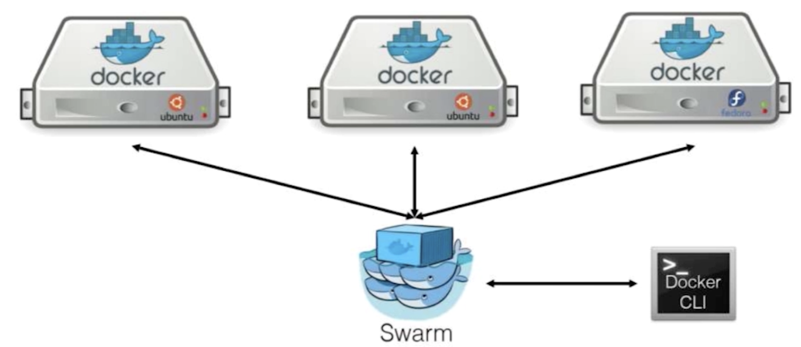
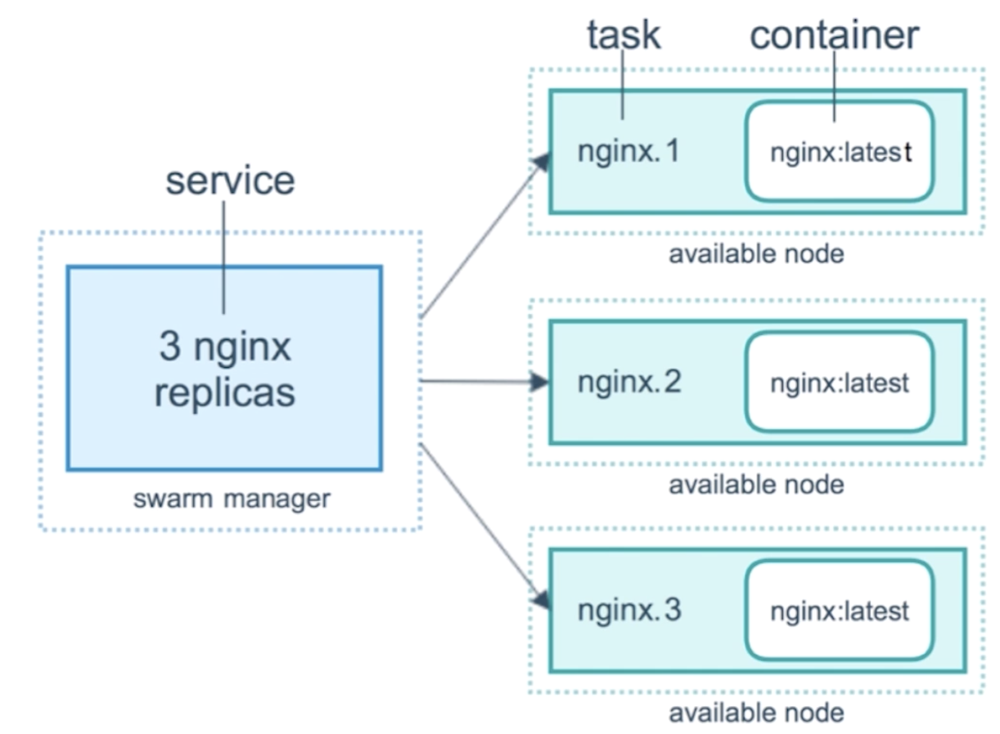
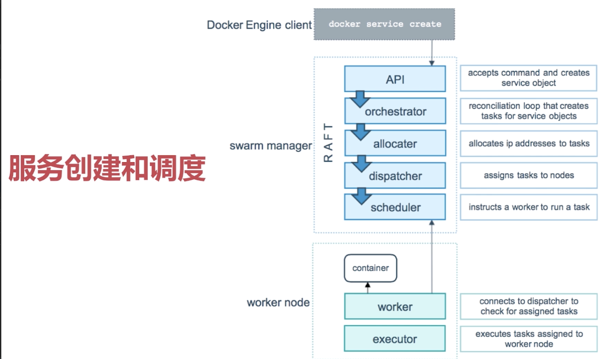

### 1、简介
   在我们学习这个之前，我们的所有技术都是停留在以下图示：
   
   我们的所有操作都是在本地进行的：我们有一个Docker CLI,Docker CLI连接的docker无非是一台docker server.
不管我们使用docker run还是docker-compose，我们操作的都是一台机器，我们部署的所有容器都是在一台机器上。但是
实际情况是，我们的应用比较复杂，部署在一台机器上无法满足我们的需求，他包含的容器比较多，所以我们需要在一个集群中部署我们的
应用，然后会设计到非常多的容器，但是这个时候就会出现很多问题，如下所示:
    
  所以这个时候Docker Swarm出现了。Docker Swarm并非是唯一一个可以进行容器编排的工具，容器编排的工具有很多，只是Docker Swarm
是集成到Docker里面的自由的工具。也就是我们使用swarm的时候，并不需要安装任何东西，只不过我们一般没有运行在swarm的模式下，我们一般是
运行在单机模式下，所以说，swarm一般就是初学者接触容器编排的第一个工具。
       
     
  
      
我们现在讲解，如何设置swarm的模式，如何建立swarm的集群。

### 2、swarm架构
 
 讲解swarm架构的话，首先他是一个集群架构，他就会有多个节点,有节点的话 他就会有角色，角色有2种；manager跟worker；
 manager:是swarm集群的大脑，生产环境，为了避免宕机，我们的大脑有2个。这个时候就会牵涉到状态的同步，一个节点manager上产生的数据
如何同步到另一个manager上，这里面就会用到一个分布式存储的数据库，通过raft协议去做的同步（最上面一部分）。
raft协议确保了manager之间的数据同步、不会出现脑裂的情况。worker实际上是我们干活的一个节点。我们大部分容器部署在cluster然后运行的时候
都会运行在worker节点上面。manager也是可以运行的，但是主要还是worker,因为worker的节点会比较多一些。然后worker节点之间也有一些数据需要同步
他会通过一个gossip的网络去做同步，这个是docker swarm底层架构。

### 3、Service和Replicas
     
 docker swarm下的service跟我们docker-compose下的service基本上是一致的。一个
service其实就代表了一个容器。但是我们在replicas的模式下我们需要去做扩展。其实一个replicas其实就是一个容器。
比如我们部署一个nginx的话，需要启动3个replicas的时候，他其实会scheduler的调度算法去将我们的3个nginx服务运行在不同的三个机器上。

### 4、swarm的调度过程
     
