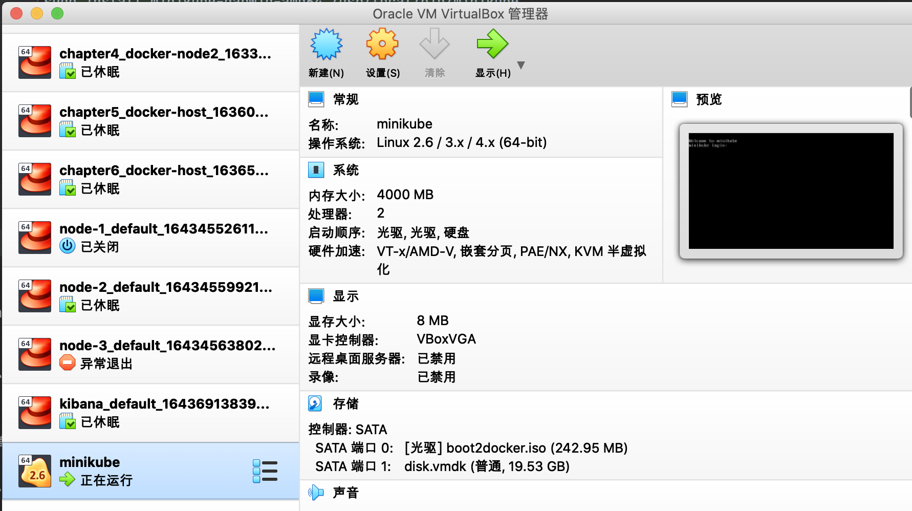
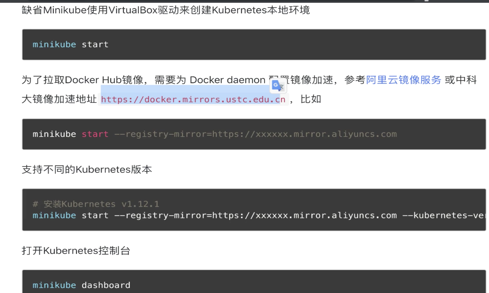
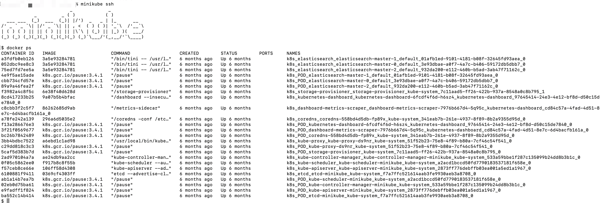
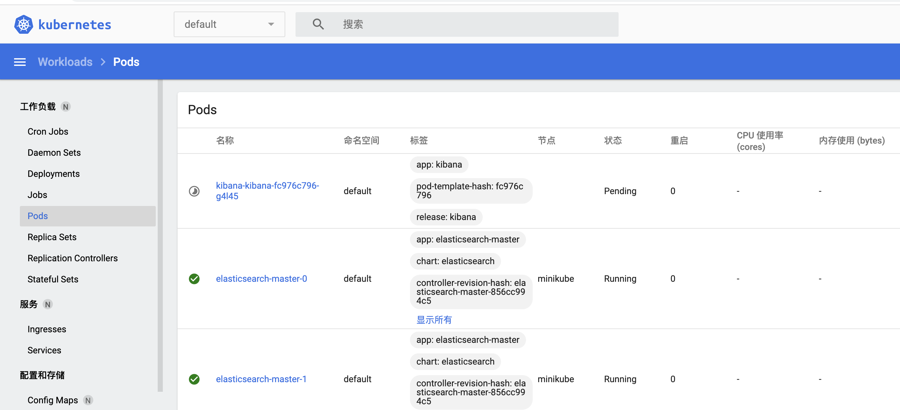

### 1、简介
  对应的网址为:https://minikube.sigs.k8s.io/docs/  
  安装说明:https://minikube.sigs.k8s.io/docs/start/  

### 2、安装
  我们安装的时候参考如下:

#### 1、install
 安装

```renderscript
curl -LO https://storage.googleapis.com/minikube/releases/latest/minikube-darwin-amd64
sudo install minikube-darwin-amd64 /usr/local/bin/minikube
```

#### 2、Start your cluster
```renderscript
minikube start
```

 我们在start之前需要安装好virtualBox；
    
 我们从上面可以看到，我们的minikube已经运行起来了。
 
 从日志中我们可以看到里面有相关的docker以及k8s的下载说明:
 ```renderscript
😄  Darwin 10.15.7 上的 minikube v1.22.0
🎉  minikube 1.26.1 is available! Download it: https://github.com/kubernetes/minikube/releases/tag/v1.26.1
💡  To disable this notice, run: 'minikube config set WantUpdateNotification false'

✨  根据现有的配置文件使用 virtualbox 驱动程序
👍  Starting control plane node minikube in cluster minikube
🔄  Restarting existing virtualbox VM for "minikube" ...
❗  This VM is having trouble accessing https://k8s.gcr.io
💡  To pull new external images, you may need to configure a proxy: https://minikube.sigs.k8s.io/docs/reference/networking/proxy/
🐳  正在 Docker 20.10.6 中准备 Kubernetes v1.21.2…
🔎  Verifying Kubernetes components...
    ▪ Using image gcr.io/k8s-minikube/storage-provisioner:v5
    ▪ Using image kubernetesui/dashboard:v2.1.0
    ▪ Using image kubernetesui/metrics-scraper:v1.0.4
🌟  Enabled addons: storage-provisioner, default-storageclass, dashboard
🏄  Done! kubectl is now configured to use "minikube" cluster and "default" namespace by default
```
 
 有时候 如果我们使用的curl 是国内的镜像的话，启动的时候可能会失败，这个时候需要我们在minikube 启动的时候，添加
 注册地址。
   
 
#### 3、进入minikube服务里面
 我们通过以下指令进行minikube里面:
 
```renderscript
minikube ssh
```

  
 
通过docker ps 我们可以看到我们启动了很多容器，这些容器就是组成我们k8s的组建。  
比如说:  
apiserver:

```renderscript
 k8s_kube-apiserver_kube-apiserver-minikube_kube-system_2873ff776debffb03ea001a5ed1a1967_0
```
scheduler:

```renderscript
 k8s_kube-scheduler_kube-scheduler-minikube_kube-system_a2acd1bccd50fd7790183537181f658e_0
```

proxy

```renderscript
 k8s_kube-proxy_kube-proxy-ds9nr_kube-system_51f52b23-75e8-4f89-b80a-7cf46c54f541_0
```


    
#### 4、通过kubectl连接k8s集群
  之前我们已经通过minikube 安装好了k8s集群，现在我们需要通过k8s的客户端操作工具来连接我们的k8s集群。
  
参考:https://kubernetes.io/docs/tasks/tools/install-kubectl-macos/
我们通过如下指令,可以知道我们的安装情况:

```renderscript
xiexinming@bogon ssh_login % kubectl get pod --all-namespaces
NAMESPACE              NAME                                         READY   STATUS    RESTARTS   AGE
default                elasticsearch-master-0                       1/1     Running   0          182d
default                elasticsearch-master-1                       1/1     Running   0          182d
default                elasticsearch-master-2                       1/1     Running   0          182d
default                kibana-kibana-fc976c796-g4l45                0/1     Pending   0          182d
kube-system            coredns-558bd4d5db-fp89x                     1/1     Running   0          182d
kube-system            etcd-minikube                                1/1     Running   0          182d
kube-system            kube-apiserver-minikube                      1/1     Running   0          182d
kube-system            kube-controller-manager-minikube             1/1     Running   0          182d
kube-system            kube-proxy-ds9nr                             1/1     Running   0          182d
kube-system            kube-scheduler-minikube                      1/1     Running   0          182d
kube-system            storage-provisioner                          1/1     Running   1          182d
kubernetes-dashboard   dashboard-metrics-scraper-7976b667d4-5q95c   1/1     Running   0          182d
kubernetes-dashboard   kubernetes-dashboard-6fcdf4f6d-h6sz4         1/1     Running   0          182d
```
 
我们获取到k8s的所有pod,正是由于这些pod的运行才会导致我们的整个k8s的运行。  上面的组件:kube-apiserver-minikube、kube-scheduler-minikube、

停止的话，我们可以使用:

```renderscript
minikube stop
```

#### 4、访问我们的页面

```renderscript
xiexinming@bogon ssh_login % minikube dashboard
🤔  正在验证 dashboard 运行情况 ...
🚀  Launching proxy ...
🤔  正在验证 proxy 运行状况 ...
🎉  Opening http://127.0.0.1:64930/api/v1/namespaces/kubernetes-dashboard/services/http:kubernetes-dashboard:/proxy/ in your default browser...

```

然后我们可以看到具体的情况:
 


 
