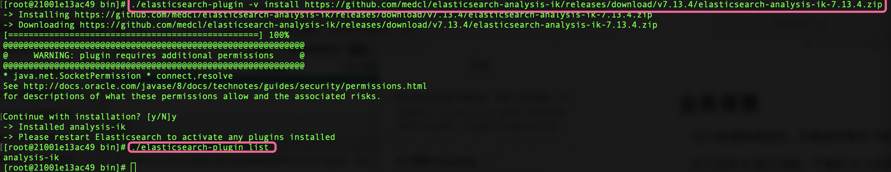
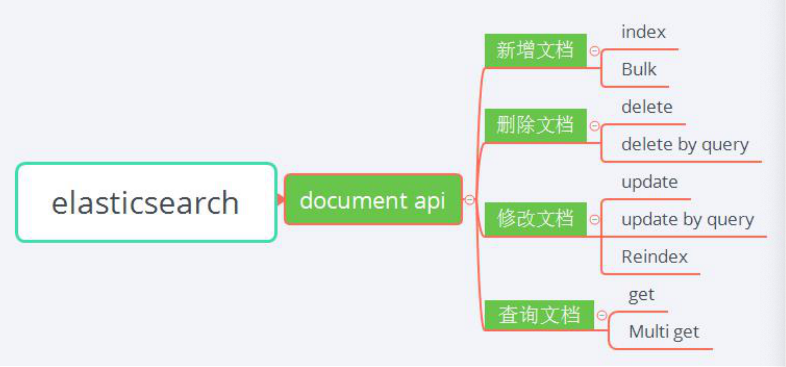

## 业务背景

​     在大数据舆情监控。采集器采集各个新闻网站上的数据，然后这些数据经过治理之后会存储在ES中。

​    本文采用 IK 做分词器，下载的 IK 分词器版本必须和 Elasticsearch 版本一致 IK 下载地址：https://github.com/medcl/elasticsearch-analysis-ik/releases


- 在 Elasticsearch 的安装目录的 Plugins 目录下新建 IK 文件夹，然后将下载的IK 安装包解压到此目录下。 
- 重启 Elasticsearch 即可。
- 或者我们直接进入es的bin目录下，使用:

```shell
cd /bin
# 下载插件
./elasticsearch-plugin -v install https://github.com/medcl/elasticsearch-analysis-ik/releases/download/v7.13.4/elasticsearch-analysis-ik-7.13.4.zip
# 查看插件是否下载成功
./elasticsearch-plugin list 
```

 下载插件安装：
 


## 定义 Mapping

   商品字段描述如下：

- goodsName: 商品名称 
- skuCode：商品 sku 编码 
- brandName：商品品牌名称 
- channelType：渠道类型 
- shopCode： 店铺编码 
- publicPrice：售卖价格（基础价，对所有人开放价格） 
- closeUserCode：封闭会员编码 
- groupPrice：分组价格，其中使用嵌套类型存储，包括： 分组价格、 分组级别


## 定义商品 Mapping

   

```shell
PUT my_goods
{
  "mappings": {
    "properties": {
      "goodsName":{
        "type": "text",
        "analyzer": "ik_smart"
      },
      "skuCode":{
        "type": "keyword"
      },
      "brandName":{
        "type": "keyword"
      },
      "channelType":{
        "type": "keyword"
      },
      "shopCode":{
        "type": "keyword"
      },
      "publicPrice":{
        "type": "float"
      },
      "closeUserCode":{
        "type": "text",
        "analyzer": "standard"
      },
      "boostValue":{
        "type": "keyword"
      },
      "groupPrice":{
        "type": "nested",
        "properties": {
          "boxLevelPrice":{
            "type":"float"
          },
          "level":{
            "type":"text"
          }
        }
      }
    }
  }
}
```


## Document APIs

​     主要涉及以下几个核心功能：
   


### Index

​    对文档的新增操作支持以下类型：

```shell
PUT  /<target>/_doc/<_id>
POST /<target>/_doc/
PUT /<target>/_create/<_id>
POST /<target>/_create/<_id>
```

​    以 POST /_create/<_id>为例，以下将创建文档 ID 为 1 的商品信息：

```shell
POST  /my_goods/_create/1
{
  "goodsName":"苹果 51 英寸 4K 超高清", 
  "skuCode":"skuCode1",
  "brandName":"苹果",
  "closeUserCode":[ "0" ],
  "channelType":"cloudPlatform",
  "shopCode":"sc00001",
  "publicPrice":"8188.88",
  "groupPrice":null,
  "boxPrice":null,
  "boostValue":1.8
}
```


### Bulk

   Elasticsearch 支持批量插入，_bulk 批量导入：

```shell
POST my_goods/_bulk
{"index":{"_id":1}}
{"goodsName":"苹果 51英寸 4K超高清","skuCode":"skuCode1","brandName":"苹果","closeUserCode":["0"],"channelType":"cloudPlatform","shopCode":"sc00001","publicPrice":"8188.88","groupPrice":null,"boxPrice":null,"boostValue":1.8}
{"index":{"_id":2}}
{"goodsName":"苹果 55英寸 3K超高清","skuCode":"skuCode2","brandName":"苹果","closeUserCode":["0"],"channelType":"cloudPlatform","shopCode":"sc00002","publicPrice":"6188.88","groupPrice":null,"boxPrice":null,"boostValue":1.0}
{"index":{"_id":3}}
{"goodsName":"苹果 UA55RU7520JXXZ 53 英寸 4K 高清","skuCode":"skuCode3","brandName": "美国苹果","closeUserCode":["0"],"channelType":"cloudPlatform","shopCode":"sc00001","publicPrice":"8388.88","groupPrice":null,"boxPrice":[{"boxType":"box1","boxUserCode":["htd003","uc004"], "boxPriceDetail":4388.88},{"boxType":"box2","boxUserCode":["uc005","uc0010"],"boxPriceDetail":5 388.88}],"boostValue":1.2}
{"index":{"_id":4}}
{"goodsName":"山东苹果 UA55RU7520JXXZ 苹果 54 英寸 5K 超高清","skuCode":"skuCode4"," brandName":"山东苹果","closeUserCode":["uc001","uc002","uc003"],"channelType":"cloudPlatfor m","shopCode":"sc00001","publicPrice":"8488.88","groupPrice":[{"level":"level1","boxLevelPrice":" 2488.88"},{"level":"level2","boxLevelPrice":"3488.88"}],"boxPrice":[{"boxType":"box1","boxUserCod e":["uc004","uc005","uc006","uc001"],"boxPriceDetail":4488.88},{"boxType":"box2","boxUserCode": ["htd007","htd008","htd009","uc0010"],"boxPriceDetail":5488.88}],"boostValue":1.2}
{"index":{"_id":5}}
{"goodsName":"苹果 UA55R 苹果 U7 苹果 520JXXZ 55 英寸 5K 超高清","skuCode":"skuCode5", "brandName":"三星苹果","closeUserCode":["uc001","uc002","uc003"],"channelType":"cloudPlatfor m","shopCode":"sc00001","publicPrice":"8488.88","groupPrice":[{"level":"level1","boxLevelPrice":" 2500"},{"level":"level2","boxLevelPrice":"3500"}],"boxPrice":[{"boxType":"box1","boxUserCode":["uc 004","uc005","uc006","uc001"],"boxPriceDetail":3588.88},{"boxType":"box2","boxUserCode":["htd007","htd008","htd009","uc0010"],"boxPriceDetail":5588.88}],"boostValue":1.2}
{"index":{"_id":6}}
{"goodsName":"三星UA55RU7520JXXZ 51英寸 4K超高清","skuCode":"skuCode1","brandName":"三星","closeUserCode":["0"],"channelType":"cmccPlatform","shopCode":"sc00001","publicPric e":"8188.88","groupPrice":null,"boxPrice":null,"boostValue":1.2}
{"index":{"_id":7}}
{"goodsName":"三星UA55RU7520JXXZ 52英寸 4K超高清","skuCode":"skuCode2","brandName":"三星","closeUserCode":["0"],"channelType":"cmccPlatform","shopCode":"sc00001","publicPric e":"8288.88","groupPrice":null,"boxPrice":[{"boxType":"box1","boxUserCode":["htd002"],"boxPrice Detail":4288.88}],"boostValue":1.2}
{"index":{"_id":8}}
{"goodsName":"三星UA55RU7520JXXZ 52英寸 4K超高清","skuCode":"skuCode2","brandName":"三星","closeUserCode":["uc0022"],"channelType":"cloudPlatform","shopCode":"sc00001","publ icPrice":"8288.88","groupPrice":null,"boxPrice":[{"boxType":"box1","boxUserCode":["uc0022"],"box PriceDetail":4288.88}],"boostValue":1.2}
{"index":{"_id":9}}
{"goodsName":"三星UA55RU7520JXXZ 52英寸 4K超高清","skuCode":"skuCode2","brandName":"三星","closeUserCode":["uc0022"],"channelType":"cloudPlatform","shopCode":"sc00001","publ icPrice":"8288.88","groupPrice":null,"boxPrice":[{"boxType":"box1","boxUserCode":["uc0022"],"box PriceDetail":4288.88}],"boostValue":1.2}
{"index":{"_id":10}}
{"goodsName":"三星UA55RU7520JXXZ 52英寸 4K超高清","skuCode":"skuCode2","brandName":"三星","closeUserCode":["uc0022"],"channelType":"cloudPlatform","shopCode":"sc00001","publ icPrice":"8288.88","groupPrice":null,"boxPrice":[{"boxType":"box1","boxUserCode":["uc0022"],"box PriceDetail":4288.88}],"boostValue":1.8}
```

### Delete

​    对文档的删除操作支持以下类型：

```
DELETE /<index>/_doc/<_id>
```

​    删除文档 ID 为 3 的数据：

```
DELETE /my_goods/_doc/3
```

### Delete by query

​    另外，删除操作支持带多种条件的删除，可以使用 _delete_by_query。

   如下操纵，将删除店铺编码为 sc00002 的所有商品。

```shell
POST /my_goods/_delete_by_query
{
  "query": {
    "match": {
      "shopCode": "sc00002"
    }
  }
}
```

### Update

​    对文档的修改操作支持以下类型：

```shell
POST /<index>/_update/<_id>
```

​    修改文档 ID 为 1 的文档信息：

   新增字段：shopName

```shell
POST my_goods/_update/1
{
  "doc":{
    "shopName": "小王店铺"
  }
}
```

​    修改店铺名称为：“张三店铺”：

```shell
POST my_goods/_update/1
{
  "doc":{
    "shopName": "张三店铺"
  }
}
```


另外还可以使用 PUT 进行修改，只不过需要罗列所有字段： 

PUT /<index>/_doc/<id>

```shell
# 修改文档1的shopName为:张三店铺
PUT my_goods/_doc/1
{
  "shopName": "张三店铺"
}

# 修改之后查询文档1的结果
GET my_goods/_doc/1
返回:
{
  "_index" : "my_goods",
  "_type" : "_doc",
  "_id" : "1",
  "_version" : 12,
  "_seq_no" : 57,
  "_primary_term" : 1,
  "found" : true,
  "_source" : {
    "shopName" : "张三店铺"
  }
}
```


用脚本同样能实现更新操作：

```
POST my_goods/_update/1
{
  "script": {
  "source": "ctx._source.city=params.channelType",
  "lang": "painless", 
   "params": { "channelType": "cloudPlatform1" }
  }
}

返回结果:
GET my_goods/_doc/1
{
  "_index" : "my_goods",
  "_type" : "_doc",
  "_id" : "1",
  "_version" : 13,
  "_seq_no" : 58,
  "_primary_term" : 1,
  "found" : true,
  "_source" : {
    "shopName" : "张三店铺",
    "city" : "cloudPlatform1"
  }
}
```

###  Update by query

​    更新操作还可以使用 _update_by_query API，当店铺编码为 sc00002 时修改publicPrice 为 5888.00 元。  

   插入文档 ID 为 2 的店铺商品信息：

```shell
#插入文档2数据
POST /my_goods/_create/2
{
  "goodsName": "苹果 55 英寸 3K 超高清",
  "skuCode": "skuCode2",
  "brandName": "苹果",
  "closeUserCode": [ "0" ],
  "channelType": "cloudPlatform",
  "shopCode": "sc00002",
  "publicPrice": "6188.88",
  "groupPrice": null,
  "boxPrice": null,
  "boostValue": 1
}
```

 查询处结果:

```shell
GET my_goods/_doc/2
返回:
{
  "_index" : "my_goods",
  "_type" : "_doc",
  "_id" : "2",
  "_version" : 1,
  "_seq_no" : 59,
  "_primary_term" : 1,
  "found" : true,
  "_source" : {
    "goodsName" : "苹果 55 英寸 3K 超高清",
    "skuCode" : "skuCode2",
    "brandName" : "苹果",
    "closeUserCode" : [
      "0"
    ],
    "channelType" : "cloudPlatform",
    "shopCode" : "sc00002",
    "publicPrice" : "6188.88",
    "groupPrice" : null,
    "boxPrice" : null,
    "boostValue" : 1
  }
}
```

   更新当店铺编码为 sc00002 时修改 publicPrice 为 5888.00 元：

```shell
POST my_goods/_update_by_query
{
  "script": {
    "source": "ctx._source.publicPrice=5888.00",
    "lang": "painless"
  }, 
  "query": {
    "term": {
      "shopCode": {
        "value": "sc00002"
      }
    }
  }
}

查询返回结果为:
{
  "took" : 16,
  "timed_out" : false,
  "_shards" : {
    "total" : 1,
    "successful" : 1,
    "skipped" : 0,
    "failed" : 0
  },
  "hits" : {
    "total" : {
      "value" : 1,
      "relation" : "eq"
    },
    "max_score" : 1.6486585,
    "hits" : [
      {
        "_index" : "my_goods",
        "_type" : "_doc",
        "_id" : "2",
        "_score" : 1.6486585,
        "_source" : {
          "shopCode" : "sc00002",
          "brandName" : "苹果",
          "closeUserCode" : [
            "0"
          ],
          "groupPrice" : null,
          "boxPrice" : null,
          "channelType" : "cloudPlatform",
          "boostValue" : 1,
          "publicPrice" : 5888.0,
          "goodsName" : "苹果 55 英寸 3K 超高清",
          "skuCode" : "skuCode2"
        }
      }
    ]
  }
}
```

### Reindex

​    当有业务需要重建索引时需要用到 _reindex API。

​    索引的来源和目的地，必须是已经存在的 index、index alias 或者 data stream。

​    你可以简单的将索引 A reindex 到索引 B，当然也可以带条件的 reindex 到索引 

B。 如下所示，将 skuCode=skuCode2 的商品信息 reindex 到索引 my_goods_new 

中：

```shell
# reindex
POST _reindex
{
  "source": {
    "index": "my_goods",
     "query": {
       "term": {
         "skuCode": {
           "value": "skuCode2"
         }
       }
     }
  },
  "dest": {
    "index": "my_goods_new"
  }
}
```

​     查询返回的结果为:

```shell
GET my_goods_new/_search/

返回结果:
{
  "took" : 56,
  "timed_out" : false,
  "_shards" : {
    "total" : 1,
    "successful" : 1,
    "skipped" : 0,
    "failed" : 0
  },
  "hits" : {
    "total" : {
      "value" : 5,
      "relation" : "eq"
    },
    "max_score" : 1.0,
    "hits" : [
      {
        "_index" : "my_goods_new",
        "_type" : "_doc",
        "_id" : "7",
        "_score" : 1.0,
        "_source" : {
          "goodsName" : "三星UA55RU7520JXXZ 52英寸 4K超高清",
          "skuCode" : "skuCode2",
          "brandNam e" : "三星",
          "closeUserCode" : [
            "0"
          ],
          "channelType" : "cmccPlatform",
          "shopCode" : "sc00001",
          "publicPric e" : "8288.88",
          "groupPrice" : null,
          "boxPrice" : [
            {
              "boxType" : "box1",
              "boxUserCode" : [
                "htd002"
              ],
              "boxPrice Detail" : 4288.88
            }
          ],
          "boostValue" : 1.2
        }
      },
      {
        "_index" : "my_goods_new",
        "_type" : "_doc",
        "_id" : "8",
        "_score" : 1.0,
        "_source" : {
          "goodsName" : "三星UA55RU7520JXXZ 52英寸 4K超高清",
          "skuCode" : "skuCode2",
          "brandNam e" : "三星",
          "closeUserCode" : [
            "uc0022"
          ],
          "channelType" : "cloudPlatform",
          "shopCode" : "sc00001",
          "publ icPrice" : "8288.88",
          "groupPrice" : null,
          "boxPrice" : [
            {
              "boxType" : "box1",
              "boxUserCode" : [
                "uc0022"
              ],
              "box PriceDetail" : 4288.88
            }
          ],
          "boostValue" : 1.2
        }
      },
      {
        "_index" : "my_goods_new",
        "_type" : "_doc",
        "_id" : "9",
        "_score" : 1.0,
        "_source" : {
          "goodsName" : "三星UA55RU7520JXXZ 52英寸 4K超高清",
          "skuCode" : "skuCode2",
          "brandNam e" : "三星",
          "closeUserCode" : [
            "uc0022"
          ],
          "channelType" : "cloudPlatform",
          "shopCode" : "sc00001",
          "publ icPrice" : "8288.88",
          "groupPrice" : null,
          "boxPrice" : [
            {
              "boxType" : "box1",
              "boxUserCode" : [
                "uc0022"
              ],
              "box PriceDetail" : 4288.88
            }
          ],
          "boostValue" : 1.2
        }
      },
      {
        "_index" : "my_goods_new",
        "_type" : "_doc",
        "_id" : "10",
        "_score" : 1.0,
        "_source" : {
          "goodsName" : "三星UA55RU7520JXXZ 52英寸 4K超高清",
          "skuCode" : "skuCode2",
          "brandNam e" : "三星",
          "closeUserCode" : [
            "uc0022"
          ],
          "channelType" : "cloudPlatform",
          "shopCode" : "sc00001",
          "publ icPrice" : "8288.88",
          "groupPrice" : null,
          "boxPrice" : [
            {
              "boxType" : "box1",
              "boxUserCode" : [
                "uc0022"
              ],
              "box PriceDetail" : 4288.88
            }
          ],
          "boostValue" : 1.8
        }
      },
      {
        "_index" : "my_goods_new",
        "_type" : "_doc",
        "_id" : "2",
        "_score" : 1.0,
        "_source" : {
          "shopCode" : "sc00002",
          "brandName" : "苹果",
          "closeUserCode" : [
            "0"
          ],
          "groupPrice" : null,
          "boxPrice" : null,
          "channelType" : "cloudPlatform",
          "boostValue" : 1,
          "publicPrice" : 5888.0,
          "goodsName" : "苹果 55 英寸 3K 超高清",
          "skuCode" : "skuCode2"
        }
      }
    ]
  }
}
```

​    

### GET

   对文档的查询操作支持以下类型：

```
GET <index>/_doc/<_id> 
HEAD <index>/_doc/<_id> 
GET <index>/_source/<_id> 
HEAD <index>/_source/<_id>
```

   查询文档 ID 为 1 的文档信息：

```
GET /my_goods/_doc/1
```

​    返回的文档信息为:

```shell
{
  "_index" : "my_goods",
  "_type" : "_doc",
  "_id" : "1",
  "_version" : 14,
  "_seq_no" : 61,
  "_primary_term" : 1,
  "found" : true,
  "_source" : {
    "goodsName" : "苹果 51英寸 4K超高清",
    "skuCode" : "skuCode1",
    "brandName" : "苹果",
    "closeUserCode" : [
      "0"
    ],
    "channelType" : "cloudPlatform",
    "shopCode" : "sc00001",
    "publicPrice" : "8188.88",
    "groupPrice" : null,
    "boxPrice" : null,
    "boostValue" : 1.8
  }
}
```

​    

查询文档 ID 为 1 的文档是否存在，只判断文档是否存在，head 返回的信息更少、 

性能更高，满足特殊业务场景使用：

```
HEAD /my_goods/_doc/1
```

返回

```
200 - OK
```

只返回文档信息:


查询时只返回 _source 信息:

```
GET /my_goods/_source/1
```

返回的原始文档信息为：

```shell
{
  "goodsName" : "苹果 51英寸 4K超高清",
  "skuCode" : "skuCode1",
  "brandName" : "苹果",
  "closeUserCode" : [
    "0"
  ],
  "channelType" : "cloudPlatform",
  "shopCode" : "sc00001",
  "publicPrice" : "8188.88",
  "groupPrice" : null,
  "boxPrice" : null,
  "boostValue" : 1.8
}
```


定制化返回参数:  

​     只获取 _source 部分参数，类似数据库查询中的指定字段，而不是 select * 返回 

所有字段:

```
GET my_goods/_source/1?_source_includes=brandName,goodsName
```

POST body 请求模式 

```shell
POST my_goods/_search
{
  "query": {
    "match_all": {
      
    }
  },
  "fields": ["brandName", "goodsName"],
  "_source": false
}

返回:
{
  "took" : 381,
  "timed_out" : false,
  "_shards" : {
    "total" : 1,
    "successful" : 1,
    "skipped" : 0,
    "failed" : 0
  },
  "hits" : {
    "total" : {
      "value" : 10,
      "relation" : "eq"
    },
    "max_score" : 1.0,
    "hits" : [
      {
        "_index" : "my_goods",
        "_type" : "_doc",
        "_id" : "11",
        "_score" : 1.0,
        "fields" : {
          "brandName" : [
            "美国苹果"
          ],
          "goodsName" : [
            "苹果 UA55RU7520JXXZ 53 英寸 4K 高清"
          ]
        }
      },
      {
        "_index" : "my_goods",
        "_type" : "_doc",
        "_id" : "1",
        "_score" : 1.0,
        "fields" : {
          "brandName" : [
            "苹果"
          ],
          "goodsName" : [
            "苹果 51英寸 4K超高清"
          ]
        }
      },
      {
        "_index" : "my_goods",
        "_type" : "_doc",
        "_id" : "2",
        "_score" : 1.0,
        "fields" : {
          "brandName" : [
            "苹果"
          ],
          "goodsName" : [
            "苹果 55英寸 3K超高清"
          ]
        }
      },
      {
        "_index" : "my_goods",
        "_type" : "_doc",
        "_id" : "4",
        "_score" : 1.0,
        "fields" : {
          "brandName" : [
            "山东苹果"
          ],
          "goodsName" : [
            "山东苹果 UA55RU7520JXXZ 苹果 54 英寸 5K 超高清"
          ]
        }
      },
      {
        "_index" : "my_goods",
        "_type" : "_doc",
        "_id" : "5",
        "_score" : 1.0,
        "fields" : {
          "brandName" : [
            "三星苹果"
          ],
          "goodsName" : [
            "苹果 UA55R 苹果 U7 苹果 520JXXZ 55 英寸 5K 超高清"
          ]
        }
      },
      {
        "_index" : "my_goods",
        "_type" : "_doc",
        "_id" : "6",
        "_score" : 1.0,
        "fields" : {
          "brandName" : [
            "三星"
          ],
          "goodsName" : [
            "三星UA55RU7520JXXZ 51英寸 4K超高清"
          ]
        }
      },
      {
        "_index" : "my_goods",
        "_type" : "_doc",
        "_id" : "7",
        "_score" : 1.0,
        "fields" : {
          "brandName" : [
            "三星"
          ],
          "goodsName" : [
            "三星UA55RU7520JXXZ 52英寸 4K超高清"
          ]
        }
      },
      {
        "_index" : "my_goods",
        "_type" : "_doc",
        "_id" : "8",
        "_score" : 1.0,
        "fields" : {
          "brandName" : [
            "三星"
          ],
          "goodsName" : [
            "三星UA55RU7520JXXZ 52英寸 4K超高清"
          ]
        }
      },
      {
        "_index" : "my_goods",
        "_type" : "_doc",
        "_id" : "9",
        "_score" : 1.0,
        "fields" : {
          "brandName" : [
            "三星"
          ],
          "goodsName" : [
            "三星UA55RU7520JXXZ 52英寸 4K超高清"
          ]
        }
      },
      {
        "_index" : "my_goods",
        "_type" : "_doc",
        "_id" : "10",
        "_score" : 1.0,
        "fields" : {
          "brandName" : [
            "三星"
          ],
          "goodsName" : [
            "三星UA55RU7520JXXZ 52英寸 4K超高清"
          ]
        }
      }
    ]
  }
}
```

​    查询文档 ID 为 1 的文档是否存在。

   只判断文档是否存在 ，Head 返回的信息更少、性能更高，满足特殊业务场景使用:

```
HEAD /my_goods/_doc/1
```

返回:

```
200 - OK
```

比如:

```
HEAD /my_goods/_doc/100
```

返回:

```
{"statusCode":404,"error":"Not Found","message":"404 - Not Found"}
```

