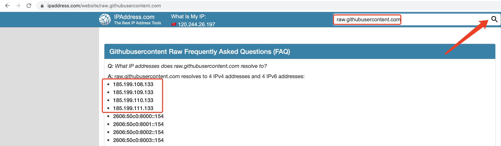
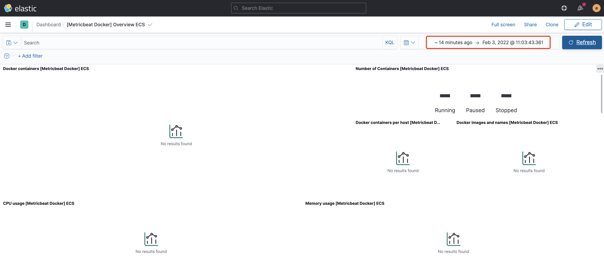

    Beats 是轻量级（资源高效，无依赖性，小型）和开放源代码日志发送程序的集合，这些日志发送程序充当安装在基础结构中不同服务器上的代理，用于收集日志或指标（Metrics）。这些可以是日志文件（Filebeat），网络数据（Packetbeat），服务器指标（Metricbeat）或 Elastic 和社区开发的越来越多的 Beats 可以收集的任何其他类型的数据。收集后，数据将直接发送到 Elasticsearch 或 Logstash 中进行其他处理。Beats建立在名为 libbeat 的 Go 框架之上，该框架用于数据转发，这意味着社区一直在开发和贡献新的 Beats。


## **环境准备**

​     作为 Elastic Stack 的补充，在使用 Beats 之前，需要已安装好 Elasticearch 和Kibana。Elasticsearch 用来存储，分析和检索数据，而 Kibana 作为可视化，监控和管理端。接下来将基于 Elastic Stack 7.13.4 版本为基础，以 Metricbeat 组件为例，其他Beats 组件使用方法类似。在安装 Beats 时，需要注意的一点是 Beats 的版本要和Elasticsearch 及 Kibana 的版本一致，或至少是大版本是一致的。


## **Beats 组件的下载和安装**

### tar包方式安装    

 我们这里以linux的为例子：其他的类似：

- 创建文件目录

  ```shell
  mkdir -p /usr/local/beats
  ```

- 下载解压包:

```shell
curl -L -O https://artifacts.elastic.co/downloads/beats/metricbeat/metricbeat-7.13.4-linux-x8 6_64.tar.gz tar xzvf metricbeat-7.13.4-linux-x86_64.tar.gz
```

  如果我们的网络比较慢的话，我们可以采用国内镜像下载：  

- 解压

```shell
tar xzvf metricbeat-7.13.4-linux-x86_64.tar.gz
```


**基础配置**

​    进入解压后的 Metricbeat 目录可以看到，安装目录的根目录下如下文件及文件夹：

```shell
$ ls -l 
fields.yml 
kibana 
LICENSE.txt 
metricbeat# 完整的配置文件模板 
metricbeat.reference.yml# 默认的配置文件 
metricbeat.yml
Module
modules.d 
NOTICE.txt 
README.md
```

我们只修改使用 metricbeat.yml 这个配置文件。

​     如果你的 Elasticsearch 和 Kibana 都安装在同一台主机上，并配置了默认的端口， 

可以跳过此步骤不修改配置，Metricbeat 默认指定了 localhost。

```shell
output.elasticsearch: 
  hosts: ["localhost:9200"] 
  # 如果 ElasticSearch 启用了认证需要配置账号密码 
  username: "YOUR_ACCOUNT" 
  password: "YOUR_PASSWORD"setup.kibana: 
  host: "localhost:5601" 
  # 如果 kibana 启用了认证需要配置账号密码 
  username: "YOUR_ACCOUNT" 
  password: "YOUR_PASSWORD"
```


​    配置 Metricbeat，指定运行的模块。

```shell
# 查看所有支持的模块 
./metricbeat modules list # 打开 system 模块 
./metricbeat modules enable system
```

设置初始化环境，在此之前确保 Elasticsearch 和 Kibana 已经正常运行：

```shell
./metricbeat setup -e
```

   上面的命令输出为：

```shell
./metricbeat setup 
Overwriting ILM policy is disabled. Set `setup.ilm.overwrite: true` for enabling. 

Index setup finished. 
Loading dashboards (Kibana must be running and reachable)
```

如上所示。

   在 setup 这个过程中，它将为 Beat 生成相应的 Dashboard，Index patterns，Index template, 索引生命周期管理策略以及相应的 Ingest pipeline。这个命令的运行时间比较长。需要耐心等待。上面的命令针对一个 Beat 来说，只需要运行一次就可以了。

### **Docker 方式安装**

  我们在机器：192.168.2.14上的虚拟机linux的centos/7下安装。

#### 拉取镜像

```shell
docker pull docker.elastic.co/beats/metricbeat:7.13.4
```


#### **启动 Docker 版 Metricbeat**

**下载镜像**

我们也可以先启动docker容器，然后再次设置es或者kibana的地址：

```shell
docker run -d --name=metricbeat docker.elastic.co/beats/metricbeat:7.13.4
```

**下载 metricbeat.docker.yml 模板文件**

```
curl -L -O https://raw.githubusercontent.com/elastic/beats/7.13/deploy/docker/metricbeat.docker.yml
```


如果出现以下问题:

```shell
[vagrant@loaclhost /]$ curl -L -O https://raw.githubusercontent.com/elastic/beats/7.13/deploy/docker/metricbeat.docker.yml

  % Total    % Received % Xferd  Average Speed   Time    Time     Time  Current
                                 Dload  Upload   Total   Spent    Left  Speed
  0     0    0     0    0     0      0      0 --:--:-- --:--:-- --:--:--     0curl: (7) Failed connect to raw.githubusercontent.com:443; Connection refused
```

说明我们不能访问上面的githubusercontent网络，参考:https://github.com/hawtim/blog/issues/10

在ip地址查询地方输入:raw.githubusercontent.com得出如下结果：  



此时我们需要把对应的raw.githubusercontent.com涉及到的地址添加到linux下的hosts文件：  

```shell
185.199.108.133 raw.githubusercontent.com
185.199.108.133 user-images.githubusercontent.com
185.199.108.133 avatars2.githubusercontent.com
185.199.108.133avatars1.githubusercontent.com
```


在添加es跟kibana信息：

```shell
output.elasticsearch:
  hosts: '192.168.2.11:9200'
  username: 'elastic'
  password: 'elastic'
setup.kibana:
  host: 192.168.2.14:5601
```


**启动 metricbeat 容器**

```shell
docker run -d \
  --name=metricbeat \
  --user=root \
  --volume="$(pwd)/metricbeat.docker.yml:/usr/share/metricbeat/metricbeat.yml:ro" \
  --volume="/var/run/docker.sock:/var/run/docker.sock:ro" \
  --volume="/sys/fs/cgroup:/hostfs/sys/fs/cgroup:ro" \
  --volume="/proc:/hostfs/proc:ro" \
  --volume="/:/hostfs:ro" \
  docker.elastic.co/beats/metricbeat:7.13.4
```


### metricbeat 配置 集成kibana、 elasticsearch

**进入容器**

```shell
 docker exec -it metricbeat bash
```

**启动 system 和 容器 监控 modules:**

```shell
metricbeat modules enable system
metricbeat modules enable docker
```


## **启动 Beats**

​    Metricbeat 启动后会发送 system metrics 数据到 Elasticsearch。

```shell
./metricbeat -e
```

   是不是觉得记忆上面的安装步骤很麻烦啊？在 Kibana 中，Elastic 已经为我们如何添加数据做了详细的描述，而且安装后的版本一定是和你安装的 Elasticsearch 及Kibana 的版本是一样的。

具体的操作步骤如下：

###### Add data(添加数据)


###### Metrics


​    在上面显示了如下安装各种 Metrics 的具体步骤。以 System metrics 为例，在上面的页面中向下滚动：


​    在上面，我们选择所需要的操作系统。再接着按照上面的安装步骤一步一步向下走。 

我们就可以完成所需要的 Beat 的安装。


## **检查收集到的数据**

  我们首先打开 Kibana，并启动 Dashboard：


​    在上面，我们搜索 metricbeat system，我们就可以发现已经预置的 Dashboard。我们选择 [Metricbeat System] Overview ECS：

  


## 常见问题

###### kibana的metricbeat上的Dashboard不展示系统监控信息

访问:http://192.168.2.14:5601/api/fleet/settings出现:

```shell
{"statusCode":403,"error":"Forbidden","message":"Access to Fleet API require the superuser role, and for stack security features to be enabled."}
```

解决方案：

参考：https://www.elastic.co/guide/en/kibana/current/using-kibana-with-security.html

需要配置kibana的安全访问密码。  

ES设置密码:

https://blog.csdn.net/qq_31239495/article/details/111207794


###### Exiting: data path already locked by another beat. Please make sure that multiple beats are not sharing the same data path (path.data).

进入docker运行的metricbeat容器中之后出现上面问题，

需要重新启动


###### kibana的dashboard中无法看到metricbeat部分system数据

   原因是我们查询监控的时候,选择的是14分钟，时钟不一致导致了我们查询不到最新的展示信息

# 

## 参考

https://blog.csdn.net/u011337602/article/details/104541261/

https://blog.csdn.net/weixin_41806245/article/details/102950969

######  Failed to connect to raw.githubusercontent.com port 443: Connection refused 的问题

https://github.com/hawtim/blog/issues/10

###### 官网：

https://www.elastic.co/guide/en/beats/metricbeat/7.13/running-on-docker.html

