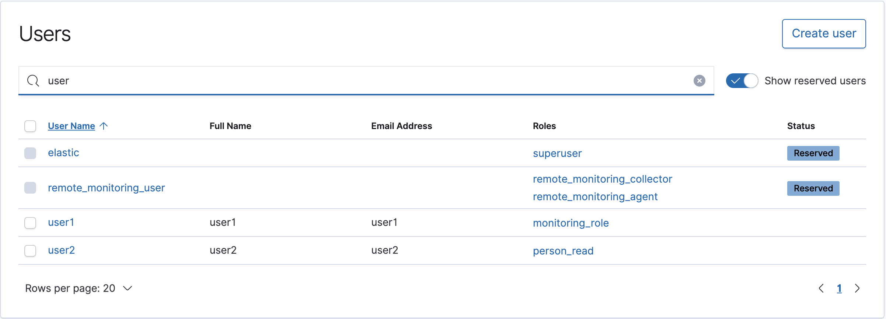

    Elastic Stack 的组件是不安全的，因为它没有内置的固有安全性。 这意味着任何人都可以访问它。 在生产环境中运行 Elastic Stack 时，这会带来安全风险。 为了防止生产中未经授权的访问，采用了不同的机制来施加安全性，例如在防火墙后运行Elastic Stack 并通过反向代理（例如 nginx，HAProxy 等）进行保护。 Elastic 提供商业产品来保护 Elastic Stack。 此产品是 X-Pack 的一部分，模块称为安全性。

​    本节如何为我们的 Elastic 索引设置字段级的安全。这样有的字段对有些用户是可见的，而对另外一些用户是不可见的。我们也可以通过对用户安全的设置，使得不同的用户有不同的权限。  

## User authentication

​     在 X-Pack 安全性中，安全资源是基于用户的安全性的基础。 安全资源是需要访问以执行 Elasticsearch 集群操作的资源，例如索引，文档或字段。 X-Pack 安全性通过分配给用户的角色的权限来实现。 权限是针对受保护资源的一项或多项特权。 特权是一个命名的组，代表用户可以针对安全资源执行的一个或多个操作。 用户可以具有一个或多个角色，并且用户拥有的总权限集定义为其所有角色的权限的并集。

  

​       图上可以看出来：一个用户可以用多个 role，而每个 role 可以对应多个permission (权限）。在接下来的练习中，我们来展示如何创建用户，role（角色）以及把 permission 分配到每个 role。通过这样的组合，我们可以实现对字段级的安全控制。


## Elastic 设置安全及创建用户

​     当我们设置完我们的安全账户后，最开始我们使用最原始的 Elastic 的账号进行登录。
  

登录进去之后，现在我们去 Manage/Sercurity/Users 页面：
 
 进入安全模块
 

我们来创建一个新的账号。针对我的情况，我想创建一个叫做 startshineye的用户名。点击当前页面的 Create User 按钮：
     

​      点击 Create User 按钮，这样我们就创建了我们的用户
     

​    按照同样的步骤，我们来创建另外一个叫做 user2 的用户。  
     

 

## 准备实验数据

​      在我们还没退出 elastic 用户的情况下，我们使用 bulk API 来把如下的文档输入到 Elasticsearch 中。

```shell
POST person/_bulk
{"index":{"_index":"person"}}
{"name":"user1","age":23}
{"index":{"_index":"person"}}
{"name":"user2","age":24}
{"index":{"_index":"person"}}
{"name":"user3","age":25}
```

 我们创建了3条记录如下可查看

```shell
GET person/_count
```

返回结果:

```shell
{
  "count" : 3,
  "_shards" : {
    "total" : 1,
    "successful" : 1,
    "skipped" : 0,
    "failed" : 0
  }
}
```


## 创建新的 role

​     字段级安全是白金版特有的功能，在一下的字段级安全配置中，我们需要启动白金版试用。更多有关关于订阅的信息，请参阅链接 https://www.elastic.co/cn/subscriptions. 对于不想使用字段级安全的用户来说，请忽略下面启动白金版试用的步骤。下面展示如何启动白金版试用：
    

​     进入license授权
    

  开启试用
    

    

​    我们开始创建角色：
   

  我们点击 Create role 按钮。
    

​     然后点击"Create role"；在这里，我们定义了一个叫做 monitor_role，它具有 monitor 的权限。


## role 赋予给用户

​    打开我们的用户列表。针对我的情况，我们打开 user1 用户： 
    

 

​      我们修改 user1 账号的 Roles。把刚才创建的 monitor_role 赋予给 user1 用户。点击 Update User 按钮。这样我们的设定就好了。设定好的账号是这样的：
    

​     从上面，我们可以看出来 user1 账号是有 monitor_role 的，而 user2 账号是没有的.下面我们来做一些基本的测试。我们在一个 terminal 中打入如下的命令：

```shell
curl -u user1:elastic "http://192.168.2.11:9200/_cluster/health?pretty"
```
    

   

   我们显然看到了结果。那么我们同样地对 User2 账号来进行实验：

```shell
curl -u user2:elastic "http://192.168.2.11:9200/_cluster/health?pretty"
```

   

​      显然，user2账号没有得到任何结果。这个根本的原因是因为这个账号没有相应的 

权限。


## 文档级或字段级安全

###   字段查询

​     我们知道如何创建新用户，创建新角色以及将角色分配给用户，让我们探讨如何针对给定的索引/文档对文档和字段施加安全性。接下来，我们使用我之前给大家输入进的 person 索引来展示。

   当用户搜索person详细信息时，该用户不允许包含在属于员工索引的文档中的年龄详细信息。这就是我们所说的字段级安全。首先，让我们来创建一个叫做 person_read 的 role。这个 role 只具有 person 索引的 read 权限。为了限制字段，我们可以在设置里做相应的配置：
   

​      我们只允许这个 person_read 的role 访问 name 字段，而且只有 read 权限。

​     运用我们刚才设置的 person_read role，我们赋予给我们的 user2 用户：
   
​     

在我们的一个 terminal 里打入如下的命令：

```shell
curl -u user2:elastic "http://192.168.2.11:9200/person/_search?pretty"
```
  我们得到最终结果如下：
      
     

### 特定文档筛选

​     我们想定义一个 role。这个 role 具有 read 的权限，并且只能访问 name 为 user1的那些文档。我们做一下的设置：

    

  我们接着把这个 role 赋予给 user2 用户
   

​    我们在终端输入：

```shell
curl -u user2:elastic "http://192.168.2.11:9200/person/_search?pretty"
```

  效果如下：

  

