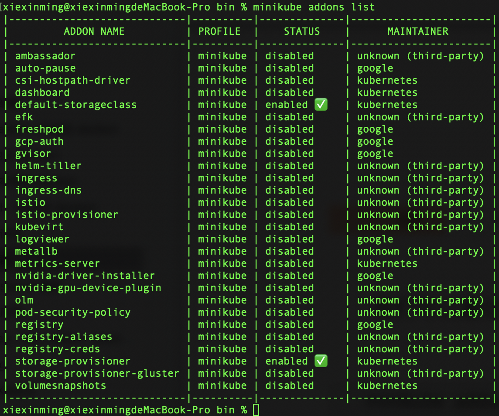
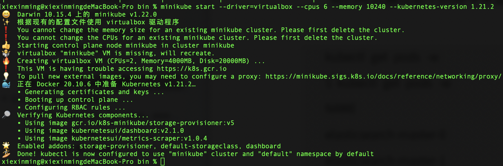
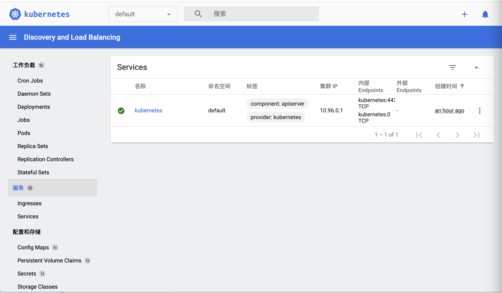
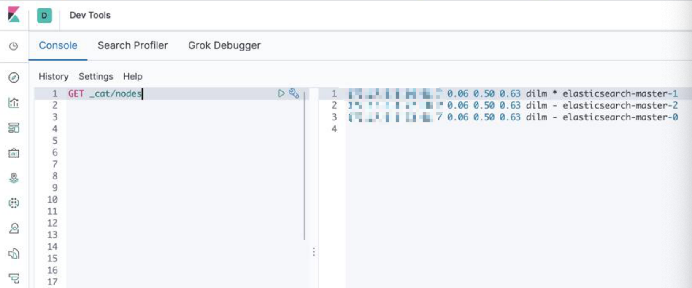
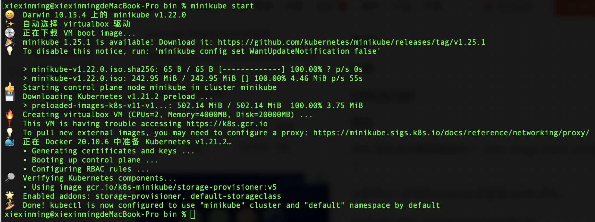

   

借助Kubernetes上的Elastic Cloud（ECK），您可以扩展基本的Kubernetes编排功能，以轻松地部署，保护，升级Elasticsearch集群等。在今天的文章中，我们简单地介绍如何在我们自己的电脑上部署你的ECK。如果有条件的开发者，你可以到AWS，GCP等云端去部署你自己的ECK。但是这一章节我们讲解如何使用 Elastic Helm Chart 来部署一个多节点的 Elasticsearch 集群。

   Elastic Helm Chart:**https://github.com/elastic/helm-charts/**


## 安装

#### 安装 VM

   在今天的安装中，我选择使用 virtualbox 来部署我们的 ECK。我们也可以选择 Docker 及其它的容器来进行。关于如何在 Mac 上安装 Virtualbox，在今天的教程中，我不再累述。你可以参考网站 https://www.virtualbox.org/ 来进行安装。你可以使用如下的命令：

```shell
brew install virtualbox
```

#### **安装 Minikube 及 kubectl**

​    针对不同版本的 MasOS，安装的方法可能不能。对于有些版本的 MacOS 来说，你需要打入如下的命令：

```shell
brew cask install minikube
```

或者：

```shell
brew install minikube
```

​    一般来说在安装 minikube 的过程中，它也会同时帮我们安装 kubectl。如果kubectl 命令不能正常被执行，那么你可以尝试使用如下的命令来进行安装：

```shell
brew install kubernetes-cli
```

​    当我们把 minikube 及 kubectl 完全进行安装后，我们可以通过打入如下的命令来检查安装是否已经完成：

```shell
$ minikube version     
minikube version: v1.22.0
commit: a03fbcf166e6f74ef224d4a63be4277d017bb62e
```

​    如果你能看到上面的信息，则表明我们的 minikube 的安装时正确的。同样：

```shell
$  kubectl version 
Client Version: version.Info{Major:"1", Minor:"21", GitVersion:"v1.21.4", GitCommit:"3cce4a82b44f032d0cd1a1790e6d2f5a55d20aae", GitTreeState:"clean", BuildDate:"2021-08-11T18:16:05Z", GoVersion:"go1.16.7", Compiler:"gc", Platform:"darwin/amd64"}
Server Version: version.Info{Major:"1", Minor:"21", GitVersion:"v1.21.2", GitCommit:"092fbfbf53427de67cac1e9fa54aaa09a28371d7", GitTreeState:"clean", BuildDate:"2021-06-16T12:53:14Z", GoVersion:"go1.16.5", Compiler:"gc", Platform:"linux/amd64"}
```

   我们可以打入上面的命令来检查 kubectl 的版本信息。

  目前 ECK 对于 kubernetes 的要求是：

```shell
kubectl 1.11+ 
Kubernetes 1.12+ or OpenShift 3.11+ 
Elastic Stack: 6.8+, 7.1+
```

​    一旦 minikube 安装好后，我可以通过如下的命令来检查哪些 plugin 已经被加载。

```shell
minikube addons list
```



   我们可以通过如下的命令来 enable 一个 plugin:

```shell
minikube addons disable dashboard
```

#### **安装 Helm**

​    我们可以使用如下的命令来安装 Helm:

```shell
brew install helm
```

  针对其它的操作系统，请参照链接：https://helm.sh/docs/intro/install/。 

  一旦完成我们们上面的安装后，我们也就可以开始来部署我们的 ECK 了。


## 使用 Elastic Helm Chart 安装 Elasticsearch 集群

​     首先我们启动 minikube。在启动 minikube 之前，我们需要对 minikube 的启动参数来进行配置。我是这样来启动我的 minikube 的：    

```shell
minikube start --driver=virtualbox --cpus 6 --memory 10240 --kubernetes-version 1.21.2
```

​    在上面，我使用 virtualbox 来作为驱动。你也可以使用 docker 来启动。在这里我 配置了 cpu 的个数是6，内存是 10G。同时由于一个一致的 bug，目前 minikube 不能和最新的 kubernetes 一起进行安装工作。在上面我特别指出了 kubernetes 的版本信息为 1.21.2。

​    上面的命令的输出为：



   对于中国的开发者来说，由于网路的限制，那么在使用上面的命令时，可能会出现k8s.gcr.io 网址不能被访问的情况。那么我们怎么解决这个问题呢？答案是我们可以使用使用阿里云服务器。我们可以尝试使用如下的命令：

```shell
$ minikube start --help |grep repo 
--image-repository='': Alternative image repository to pull docker images from. Thi s can be used when you have limited access to gcr.io. Set it to "auto" to let minikube de cide one for you. For Chinese mainland users, you may use local gcr.io mirrors such as re gistry.cn-hangzhou.aliyuncs.com/google_containers
```

​    根据上面的提示，我们可以修改我们上面的命令为：

```shell
$ minikube start --driver=virtualbox --cpus 6 --memory 10240 --kubernetes-version 1.21.2 --image-repository='registry.cn-hangzhou.aliyuncs.com/google_containers'
```

​    一旦 minikube 被成功启动起来，我们可以使用如下的命令：

```shell
$ ./minikube dashboard
```

  当上面的命令执行后，它就会启动一个 web 的接口让我们来对 kubernetes 监控和管理：




   等我们上面的 Minikube 已经被启动后，我们使用如下的命令：

```shell
$ helm repo add elastic https://helm.elastic.co
```

   返回结果：

```shell
$ helm repo add elastic https://helm.elastic.co
"elastic" has been added to your repositories
```

​    接着我们使用如下的命令：

```shell
$ curl -O https://raw.githubusercontent.com/elastic/helm-charts/master/elasticsearch/examples/minikube/values.yaml
```

  返回结果:

```shell
$ curl -O https://raw.githubusercontent.com/elastic/helm-charts/master/elasticsearch/examples/minikube/values.yaml

  % Total    % Received % Xferd  Average Speed   Time    Time     Time  Current
                                 Dload  Upload   Total   Spent    Left  Speed
100   478  100   478    0     0    829      0 --:--:-- --:--:-- --:--:--   828
```

   下载下来3个文件：

```
minikube	
nohup.out	
values.yaml
```

上面的 values.yaml 的内容如下：

```shell
--- 
# Permit co-located instances for solitary minikube virtual machines. 
antiAffinity: "soft" 
# Shrink default JVM heap. 
esJavaOpts: "-Xmx128m -Xms128m" 
# Allocate smaller chunks of memory per pod. 
resources: 
   requests: 
      cpu: "100m" 
      memory: "512M" 
   limits: 
      cpu: "1000m" 
      memory: "512M" 
   # Request smaller persistent volumes. 
  volumeClaimTemplate:
     accessModes: [ "ReadWriteOnce" ] 
     storageClassName: "standard" 
     resources: 
        requests: 
          storage: 100M
```

​     我们使用 helm 来对我们的 Elasticsearch 进行安装：

```shell
$ helm install elasticsearch elastic/elasticsearch -f ./values.yaml
```

​    我们使用上面显示的命令来进行监控：

```shell
$ kubectl get pods --namespace=default -l app=elasticsearch-master -w
NAME                     READY   STATUS     RESTARTS   AGE
elasticsearch-master-0   0/1     Init:0/1   0          30s
elasticsearch-master-1   0/1     Init:0/1   0          30s
elasticsearch-master-2   0/1     Init:0/1   0          30s
elasticsearch-master-2   0/1     PodInitializing   0          85s
elasticsearch-master-2   0/1     Running           0          86s
elasticsearch-master-0   0/1     PodInitializing   0          89s
elasticsearch-master-0   0/1     Running           0          90s
elasticsearch-master-1   0/1     PodInitializing   0          93s
elasticsearch-master-1   0/1     Running           0          94s
elasticsearch-master-2   1/1     Running           0          2m32s
elasticsearch-master-0   1/1     Running           0          2m32s
elasticsearch-master-1   1/1     Running           0          2m42s
```

   上面显示我们的 Elasticseach 已经被成功地部署好了。

   接下来，我们来部署我们的 Kibana：

```shell
$ helm install kibana elastic/kibana
NAME: kibana
LAST DEPLOYED: Thu Feb  3 11:19:25 2022
NAMESPACE: default
STATUS: deployed
REVISION: 1
TEST SUITE: None
```

   我们可以通过如下的命令来监控 Kibana 的创建过程：

```shell
$ kubectl get pods -w
NAME                            READY   STATUS    RESTARTS   AGE
elasticsearch-master-0          1/1     Running   0          14m
elasticsearch-master-1          1/1     Running   0          14m
elasticsearch-master-2          1/1     Running   0          14m
kibana-kibana-fc976c796-hccwm   0/1     Pending   0          3m46s
```

   如果我们看到 Kibana 的状态已经变为 Running，则表明我们的 Kibana 的创建是成功的。

  最后，我们需要把 Kibana 的 5601 口进行 port forward：

```shell
kubectl port-forward deployment/kibana-kibana 5601
```

上面命令的运行结果为：

```shell
$ kubectl port-forward deployment/kibana-kibana 5601 
Forwarding from 127.0.0.1:5601 -> 5601 
Forwarding from [::1]:5601 -> 5601 
Handling connection for 5601
```


这样我们的 Elasticsearch 已经被成功部署了。我们启动浏览器，并输入地址 

localhost:5601


​    上面显示我们的 Elasticsearch 已经被成功部署了。

我们使用 Dev tools：
  

​    从上面我们可以看出来，我们已经成功地部署了 3 个 Elasticsearch 节点的集群。 

​     如果你想了解 helm 更多，你可以使用如下的命令：

```
helm --help
```

​    我们可以通过命令：

```
helm list
```

   来显示已经发布了的。

我们也可以使用如下的命令来卸载已经发布了的：

```
helm uninstall
```

比如：

```shell
$ helm uninstall kibana 
release "kibana" uninsta
```


## 常见问题及解决

###### kubectl The connection to the server localhost:8080 was refused -did you specify

​     我们先通过minikube start,启动minikebu。



   然后minikube version 就可以了。


###### mac brew安装的文件放在哪里的  

一般情况是这么操作的：

1、通过brew install安装应用最先是放在/usr/local/Cellar/目录下。

2、有些应用会自动创建软链接放在/usr/bin或者/usr/sbin，同时也会将整个文件夹放在/usr/local

3、可以使用brew list 软件名确定安装位置。

比如查找安装minikube 在那个位置

可以在mac终端直接输入 brew list minikube


