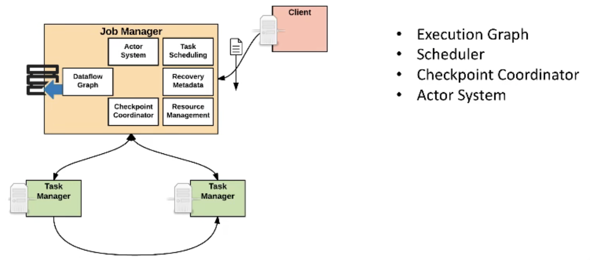
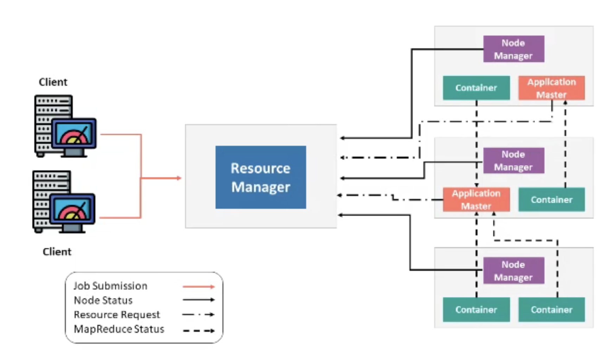

## Flink on Yarn/K8S原理
知识点
1. Flink 架构概览
2. Flink的几个基本概念
3. Flink基本部署方式
4. Flink运行时相关组件

### 1. Flink 架构概览

1. 程序员通过 DataStream API、DataSet API、SQL 和 Table API 编写 Flink 任务，它会生成一个JobGraph。
2. JobGraph 是由 source、map()、keyBy()/window()/apply() 和 Sink 等算子组成的。
3. 当 JobGraph 提交给 Flink 集群后，能够以 Local、Standalone、Yarn 和 Kubernetes 四种模式运行。

### 2. Flink的几个基本概念  
1. JobManager
2. TaskManager

#### 2.1 JobManager
  
JobManager的功能主要有：
* 将JobGraph 转换成 Execution Graph，最终将 Execution Graph 拿来运行；
* Scheduler 组件负责 Task 的调度；
* Checkpoint Coordinator 组件负责协调整个任务的 Checkpoint，包括 Checkpoint 的开始和完成；
* 通过 Actor System 与 TaskManager 进行通信；
* 其它的一些功能，例如 Recovery Metadata，用于进行故障恢复时，可以从 Metadata 里面读取数据。

#### 2.2 TaskManager
  TaskManager负责具体任务的执行  
  

   TaskManager 是负责具体任务的执行过程，在 JobManager 申请到资源之后开始启动。TaskManager 里面的主要组件有：
* Memory & I/O Manager，即内存 I/O 的管理；
* Network Manager，用来对网络方面进行管理；
* Actor system，用来负责网络的通信；

TaskManager 被分成很多个 TaskSlot，每个任务都要运行在一个 TaskSlot 里面，TaskSlot 是调度资源里的最小单位。

### 3. Flink的基本部署方式
  Flink的部署方式分为:local、standalone、yarn跟k8s。  
#### 3.1 standalone
   
  在standalone模式下,整个调度过程是Flink自己实现的，
1. **在Standalone模式下**，Master 和 TaskManager 是不同的进程， 可以运行在同一台机器上，也可以运行在不同的机器上。
2. 在**Master进程**中，Standalone ResourceManager 的作用是对资源进行管理。当用户通过Flink Cluster Client将JobGraph提交给Master时，JobGraph先经过Dispatcher。
3. 当Dispatcher收到客户端的请求之后，生成一个 JobManager。接着JobManager进程向Standalone ResourceManager申请资源，最终再启动TaskManager。
4. **TaskManager启动之后**，会有一个向ResourceManager注册的过程，注册之后JobManager再将具体的Task任务分发给这个TaskManager去执行。

#### 3.2 Yarn 架构原理

##### 3.2.1 Yarn的架构原理
  Yarn 模式在国内使用比较广泛，基本上大多数公司在生产环境中都使用过 Yarn 模式。只有足够了解 Yarn 的架构原理，才能更好的知道 Flink 是如何在 Yarn 上运行的。

  
  Yarn的架构原理如上图所示，最重要的角色是 ResourceManager，主要用来负责整个资源的管理，Client 端是负责向ResourceManager提交任务。  
用户在 Client 端提交任务后会先给到 Resource Manager。Resource Manager会首先启动第一个Container，接着在第一个Container里面会进一步启动 Application Master(当我们提交的任务是:Flink任务，那么 这个Application Master就是Flink Master,
如果我们启动的是MapReduce的任务的时候,那么我们这个Application Master就是MapReduce Master)，当Master节点启动之后，会根据任务的要求会向Resource Manager再重新申请资源，当Resource Manager 将资源分配给 Application Master之后，
Application Master 再根据资源要求创建对应的Container,然后在具体的Container里面运行Task；所有的Container都是通过Node Manager去管理的。

  所以我们根据上面的总结出Yarn的常用组件有如下:  
* ResourceManager(RM)：  
   ResourceManager (RM)负责处理客户端请求、启动/监控ApplicationMaster、监控 NodeManager、资源的分配与调度，包含 Scheduler 和 Applications Manager。
   
* ApplicationMaster(AM)：    
   运行在第一个Container上，ApplicationMaster(AM)运行在 Slave 上，负责数据切分、申请资源和分配、任务监控和容错。
   
* NodeManager (NM-单节点资源管理)：  
   NodeManager (NM)运行在 Slave 上，用于单节点资源管理(一个NodeManager上可以运行多个Task)、AM/RM通信以及汇报状态。

* Container(资源的抽象)：  
   Container 负责对资源进行抽象，包括内存、CPU、磁盘，网络等资源；AM/VM都是运行在Container里面的。

##### 3.2.2 Yarn的交互原理

  
 以在 Yarn 上运行 MapReduce 任务为例来讲解下 Yarn 架构的交互原理：
* 首先，用户编写MapReduce代码后，通过Client端进行任务提交。
* ResourceManager在接收到客户端的请求后，会分配第一个Container；这个第一个Container会启动ApplicationMaster，并通知 NodeManager 在这个 Container 下启动 ApplicationMaster。
* ApplicationMaster 启动后，向 ResourceManager 发起注册请求。接着 ApplicationMaster 向 ResourceManager 申请资源。根据获取到的资源，和相关的 NodeManager 通信，要求其启动程序。
* 一个或者多个 NodeManager 启动 Map/Reduce Task。
* NodeManager 不断汇报 Map/Reduce Task 状态和进展给 ApplicationMaster。
* 当所有 Map/Reduce Task 都完成时，ApplicationMaster 向 ResourceManager 汇报任务完成，并注销自己。

##### 3.2.3 Flink On Yarn per-job模式
Flink On Yarn有2种模式,一种是per-job模式，一种是session模式。 
per-job模式是我每一次提交一个任务，任务完成之后，我们的资源就被释放了
  

Per Job 的流程也就比较容易理解了，具体如下：
* 首先Client提交Yarn App给YARN ResourceManager，这个Yarn APP就是比如:JobGraph 或者 JARs。
* 接下来 Yarn 的 ResourceManager 会申请第一个 Container。这个 Container 通过 Application Master 启动进程，Application Master 里面运行的是 Flink 程序，并且里面也会启动一个Job Manager，Job Manager会根据JobGraph的信息去Flink-YARN ResourceManager去申请(发送Request slots请求)比如需要多少个Task。即 Flink-Yarn ResourceManager和JobManager。
* 最后Flink-Yarn ResourceManager接受到请求之后，Flink-Yarn ResourceManager向Yarn ResourceManager申请资源。当分配到资源后，启动 TaskManager。TaskManager 启动后向 Flink-Yarn ResourceManager 进行注册，注册成功后 JobManager 就会分配具体的任务给 TaskManager 开始执行。
 
##### 3.2.4 Flink On Yarn session模式
  
在Per Job模式中，执行完任务后整个资源就会释放，包括 JobManager、TaskManager 都全部退出。而 Session 模式则不一样，它的 Dispatcher 和 ResourceManager 是可以复用的。Session 模式下，当 Dispatcher 在收到请求之后，会启动 JobManager(A)，让 JobManager(A) 来完成启动 TaskManager，接着会启动 JobManager(B) 和对应的 TaskManager 的运行。当 A、B 任务运行完成后，资源并不会释放。Session 模式也称为多线程模式，其特点是资源会一直存在不会释放，多个 JobManager 共享一个 Dispatcher，而且还共享 Flink-YARN ResourceManager。

Session 模式和 Per Job 模式的应用场景不一样。Per Job 模式比较适合那种对启动时间不敏感，运行时间较长的任务。Seesion 模式适合短时间运行的任务，一般是批处理任务。若用 Per Job 模式去运行短时间的任务，那就需要频繁的申请资源，运行结束后，还需要资源释放，下次还需再重新申请资源才能运行。显然，这种任务会频繁启停的情况不适用于Per Job模式，更适合用Session模式。

##### 3.2.5 Yarn 模式特点
Yarn 模式的优点有：
* **资源按需使用，提高集群的资源利用率**   
    YARN ResourceManager做资源的统一管理和调度；Yarn集群中所有节点的资源（内存、CPU、磁盘、网络等）被抽象为 Container。计算框架需要资源进行运算任务时需要向 Resource Manager 申请 Container，Yarn 按照特定的策略对资源进行调度和进行 Container 的分配。Yarn 模式能通过多种任务调度策略来利用提高集群资源利用率。例如 FIFO Scheduler、Capacity Scheduler、Fair Scheduler，并能设置任务优先级。
    资源隔离。Yarn 使用了轻量级资源隔离机制 Cgroups 进行资源隔离以避免相互干扰，一旦 Container 使用的资源量超过事先定义的上限值，就将其杀死。

* **多种任务调度策略**  
  * FIFO Scheduler  
  * Capacity Scheduler
  * Fair Scheduler
  * 任务优先级
    
* **通过yarn进行自动failover处理**  
  * Yarn NodeManager监控
  * Yarn ApplicationManager异常恢复。

### 4. Flink运行时相关组件
   Flink 的基本架构和它在运行时的一些组件,具体如下:  
* **Client**：用户通过 SQL 或者 API 的方式进行任务的提交，提交后会生成一个 JobGraph。
* **JobManager**：JobManager接受到用户的请求之后,会对任务进行调度，并且申请资源启动TaskManager。
* **TaskManager**：它负责一个具体 Task 的执行。TaskManager 向 JobManager 进行注册，当 TaskManager 接收到 JobManager 分配的任务之后，开始执行具体的任务。

附件:
参考:
1、https://www.bilibili.com/video/BV174411W7oC/?spm_id_from=333.337.search-card.all.click&vd_source=eb0724224a16290e6f19a50796e32edb  
2、https://blog.csdn.net/weixin_44904816/article/details/102578146  
3、https://www.bilibili.com/video/BV1FU4y1Y7nM/?spm_id_from=333.337.search-card.all.click&vd_source=eb0724224a16290e6f19a50796e32edb
4、大数据hadoop篇:https://www.bilibili.com/video/BV1k64y1r7As/?spm_id_from=333.788&vd_source=eb0724224a16290e6f19a50796e32edb
  
