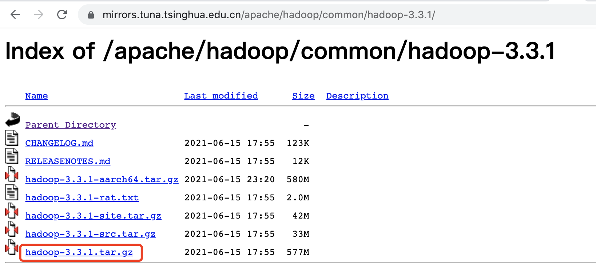

## hadoop集群准备前工作  

  hadoop下载地址:https://mirrors.tuna.tsinghua.edu.cn/apache/hadoop/common/
目前我们使用hadoop3.3.1来实施。  
  

  下载地址: wget https://mirrors.tuna.tsinghua.edu.cn/apache/hadoop/common/hadoop-3.3.1/hadoop-3.3.1.tar.gz

  jdk下载地址:国内镜像源

https://repo.huaweicloud.com/java/jdk/8u192-b12/jdk-8u192-linux-x64.tar.gz

 

### 1、集群规划
  安装3台机器
| 主机名 | IP        | 用户 | HDFS                        | YARN                         |
| ------ | --------- | ---- | --------------------------- | ---------------------------- |
| node1  | 10.0.2.15 |      | NameNode、DataNode          | NodeManager、ResourceManager |
| Node2  |           |      | DataNode、SecondaryNameNode | NodeManager                  |
| node3  |           |      | DataNode                    | NodeManager                  |


### 2、虚拟机创建

   首先我们需要安装vagrant跟我们的VirtualBox

   我们在本地机器对应目录下创建3个文件夹:hadoop01	hadoop02	hadoop03。然后我们选择hadoop01上进行操作。

1. 初始化镜像：

   ```shell
   vagrant init centos/07
   ```

   其中centos/07代表我们需要安装的系统是centos，对应的版本是7；此时会生成一个Vagrantfile文件。文件描述了我们需要创建的虚拟机的模式。

2. 启动vagrant:

   ```
   vagrant up
   ```

   首先他会去找base image镜像。如果本地有镜像的话,会从本地直接加载过来了，如果没有的话，会从网上下载，需要的时间可能长一点。然后一步一步的会去创建一个虚拟机。
    

3. 进入我们的虚拟机中

   ```
   vagrant ssh
   ```

   默认是以vagrant用户进入，如果想要进入root用户下，输入su root
   接着会让输入密码 ，密码默认的是vagrant。

我们在其他2台机器上执行相同的操作，然后我们形成3台集群机器。

### 3、hadoop安装(模版V3.0)

####  软件安装

##### 1.安装源

```
dnf install -y epel-release
```

##### 2.解压jdk跟hadoop

我们下载完jdk跟hadoop之后，我们将其解压到/usr/local。

```
tar -zxvf jdk-8u192-linux-x64.tar.gz -C /usr/local
tar -zxvf hadoop-3.3.1.tar.gz -C /usr/local/
```

##### 3.同步复制工具

```
dnf install sync -y
```

##### 4.创建数据目录

```
mkdir /opt/module
```

#### 环境变量配置

vim /etc/profile

输入以下内容:

```
export JAVA_HOME=/usr/local/jdk1.8.0_192
export CLASSPATH=$CLASSPATH$JAVA_HOME/lib:$JAVA_HOME/jre/lib
export PATH=$PATH:$JAVA_HOME/bin:$JAVA_HOME/jre/bin

export HADOOP_HOME=/usr/local/hadoop-3.3.1
export PATH=$PATH:$HADOOP_HOME/bin:$HADOOP_HOME/sbin

export HDFS_NAMENODE_USER=root
export HDFS_DATANODE_USER=root
export HDFS_SECONDARYNAMENODE_USER=root

export YARN_RESOURCEMANAGER_USER=root
export YARN_NODEMANAGER_USER=root
```


生效

```
source /etc/profile
```


配置ip:

```
 vi /etc/sysconfig/network-scripts/ifcfg-eth0 
```

配置主机域名映射:

```
 vi /etc/hosts
 hadoop01 xxxx
 hadoop02 xxxx
 hadoop03 xxxx
```


#### 一个例子测试hadoop

```
 mkdir /tmp/wcinput
 echo "aaa bbb aaa ccc" >> /tmp/wcinput/aaa.txt
 echo "aaa bbb ccc ddd" >> /tmp/wcinput/aaa.txt
 cat /tmp/wcinput/aaa.txt 
 cd $HADOOP_HOME/share/hadoop/mapreduce
 
  hadoop jar hadoop-mapreduce-examples-3.3.1.jar wordcount /tmp/wcinput/ /tmp/wcoutput
 
```

然后进入: cd /tmp/wcoutput 

我们可以看到：_SUCCESS	part-r-00000 其中part-r-00000是我们的生成文件：

```
cat part-r-00000 
输出:
aaa	3
bbb	2
ccc	2
ddd	1
```


## 附件
Hadoop集群搭建:
https://zhuanlan.zhihu.com/p/524144786

