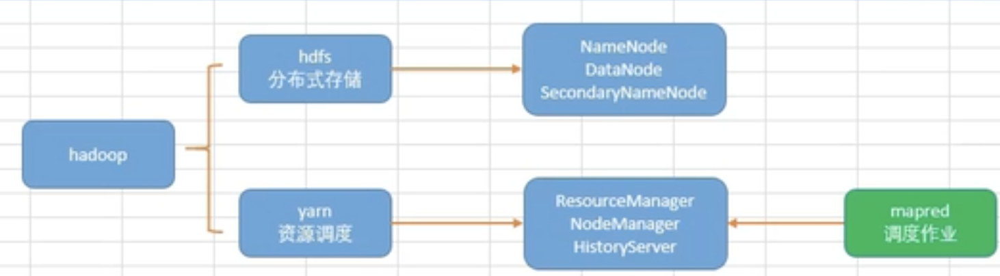
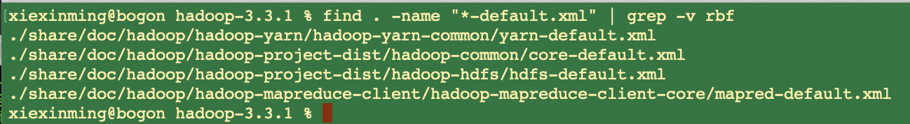

## hadoop集群配置 

### 集群配置

 
 hadoop集群分为如上部分：

 * hadoop分为了hdfs跟yarn两部分。
 * hdfs：是分布式文件存储系统，里面的进程包括了3部分；NameNode、DataNode、SecondaryNameNode。DataNode是存储数据的，DataNode数据的索引是存放在NameNode的
   SecondaryNameNode是NameNode元数据的备份。  
 * yarn:是资源调度，里面的进程分为了3部分：ResourceManager、NodeManager、HistoryServer;ResourceManager是一个主进程，用来管理其他进程的；NodeManager是每一个节点上都会存在的，ResourceManager
   只有一个节点上有。HistoryServer用于管理yarn运行的历史记录的。比如上面我们的mapred任务需要执行，他会通过ResourceManager去到NodeManager里面分配资源给mapred运行，执行过成中的记录会被记录在
   HistoryServer中。  


查找对应配置文件

```
# 查找4个核心配置文件：刚开始是空的
find . -name "*.xml" | grep etc | grep -E 'yarn|hdfs-site|mapred|core'
# 查找4个核心配置文件的默认配置文件：其实就是模版
find . -name "*-default.xml" | grep -v rbf
# 分别编辑各配置文件
vim
```

  
 对应的默认配置文件如下:  
 

##### hdfs配置

  进入hadoop的默认根目录下： vim ./etc/hadoop/hdfs-site.xml

```
<configuration>
<property>
 <!--nn web 端访问地址-->
  <name>dfs.namenode.http-address</name>
  <value>0.0.0.0:9870</value>
  <description>
    The address and the base port where the dfs namenode web ui will listen on.
  </description>
</property>
<property>
  <!--2nn web 端访问地址-->
  <name>dfs.namenode.secondary.https-address</name>
  <value>0.0.0.0:9869</value>
  <description>
    The secondary namenode HTTPS server address and port.
  </description>
</property>
</configuration>
```

##### yarn设置

  进入hadoop的默认根目录下： vim ./etc/hadoop/yarn-site.xml

```shell
<configuration>
   <!--指定MR走shuffle-->
   <property>
        <name>yarn.nodemanager.aux-services</name>
        <value>mapreduce_shuffle</value>
    </property>
    <!--指定ResourceManager地址-->
   <property>
        <name>yarn.resourcemanager.hostname</name>
        <!--<value>hadoop162</value>-->
        <value>localhost</value>
    </property>
     <!--环境变量的集成-->
     <property>
    <name>yarn.nodemanager.env-whitelist</name>
<value>JAVA_HOME,HADOOP_COMMON_HOME,HADOOP_HDFS_HOME,HADOOP_CONF_DIR,CLASSPATH_PREPEND_DISTCACHE,HADOOP_YARN_HOME,HADOOP_HOME,PATH,LANG,TZ</value>
  </property>
</configuration>
```

##### core设置

  进入hadoop的默认根目录下： vim ./etc/hadoop/core-site.xml

```
<configuration>
<!--指定NameNode的地址-->
<property>
  <name>fs.defaultFS</name>
  <!--<value>hdfs://hadoop161:8020</value>-->
  <value>hdfs://localhost:8020</value>
</property>
<!--指定hadoop数据存储目录-->
<property>
  <name>hadoop.tmp.dir</name>
  <value>/opt/module/hadoop-3.3.1/data</value>
</property>
<!--配置HDFS网页登录使用的静态用户-->
<property>
  <name>hadoop.http.staticuser.user</name>
  <value>root</value>
</property>
</configuration>
```

##### mapreduce配置运行在yarn上

```
<configuration>
<property>
<!--指定MapReduce程序运行在Yarn上-->
  <name>mapreduce.framework.name</name>
  <value>yarn</value>
</property>
</configuration>
```

##### 配置workers

vim ./etc/hadoop/workers 添加如下节点:

```
hadoop161
hadoop162
hadoop163
```

##### 配置hadoop环境变量

  编辑: vim ./etc/hadoop/hadoop-env.sh 

```
export JAVA_HOME=/
```


### 开始初始化和启动

##### 格式化NameNode

格式化NameNode，在NameNode所在的节点161上执行

```
hdfs namenode-format
```

##### 启动hfs

在NameNode所在节点161上执行

```
# 启动跟停止
start-dfs.sh
stop-dfs.sh
```

##### 启动yarn

在ResourceManager所在节点162上执行

```
# 启动 停止
start-yarn.sh
stop-yarn.sh
```


### 服务进程及访问

|          | Hadoop161             | Hadoop162             | Hadoop163             |
| -------- | --------------------- | --------------------- | --------------------- |
| HDFS     | NameNode              |                       | SecondaryNameNode     |
|          | DataNode              | DataNode              | DataNode              |
| YARN     |                       | ResourceManager       |                       |
|          | NodeManager           | NodeManager           | NodeManager           |
| 访问地址 | http://hadoop161:9870 | http://hadoop162:8088 | http://hadoop163:9868 |
|          | http://hadoop161:9864 | http://hadoop162:9864 | http://hadoop163:9864 |

   如上图所示：3台机器的服务进程我们可以通过jps可以看到，我们访问下我们的hdfs可以知道，目前如下:


