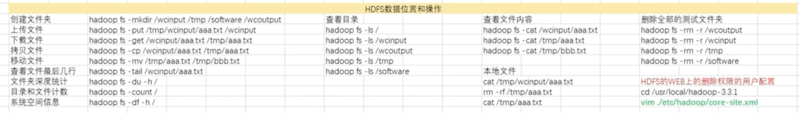
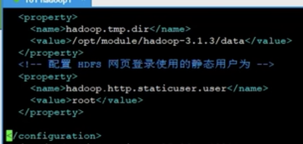
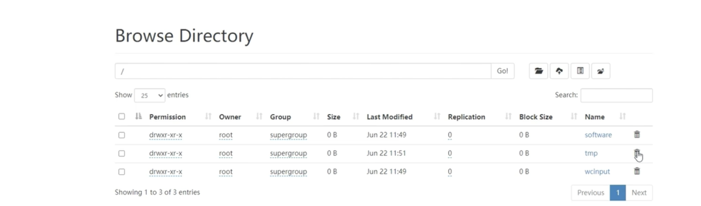
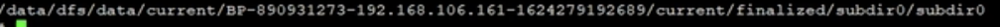
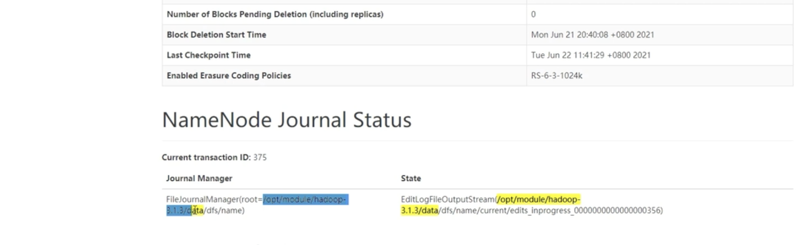

## hdfs的基本操作和数据位置
  

​    hdfs的基本操作类似于linux指令，主要包括如上的：

1、创建文件夹  2、上传文件  3、下载文件 4、拷贝文件  5、移动文件 6、查看文件最后几行 

7、文件夹深度统计  8、目录和文件计数  9、系统空间信息


有的时候我们在web界面删除数据的时候 可能会报：权限错误。这个权限错误在：core-site.xml文件中
  
 如上所示，默认情况下是hadoop用户,我们假如是配置了hadoop用户，但是我们在web页面，操作如下root用户的文件的时候
 会报错。



我们查看:core-site.xml中如下配置:
```renderscript
<!--指定hadoop数据存储目录-->
<property>
  <name>hadoop.tmp.dir</name>
  <value>/opt/module/hadoop-3.3.1/data</value>
</property>
```

 我们知道:/opt/module/hadoop-3.3.1/data为数据存储的路径。我们再查看对应的最深的路径的时候：
  
  我们在web界面上可以看到文件的具体位置:
  

