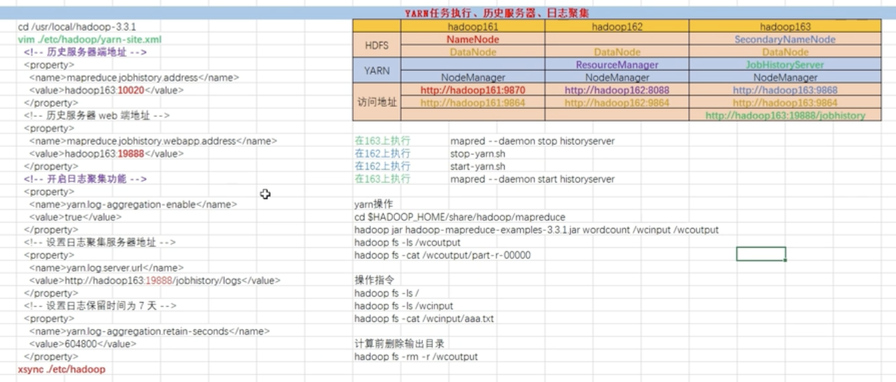
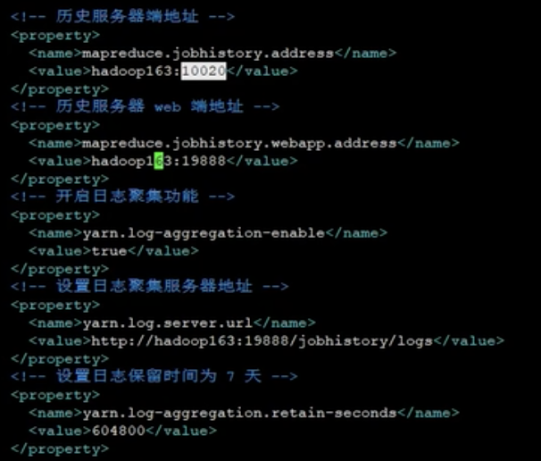

## hadoop的yarn任务执行、历史服务器、日志收集
  
  yarn的历史服务器

  我们已经启动了yarn的服务，如下所示：
 
  然后我们找到历史，然后尝试打开我们的历史服务器：
 
  刚开始历史服务器会出现404，因为我么的历史服务器是没有打开的，

  我们在yarn-site.xml文件中添加如下信息：（打开历史服务）
 
  然后我们执行如下操作:
  
  操作执行之后，我们可以看到我们的jps的进程：
  
  
  然后我们执行yarn操作：
  
