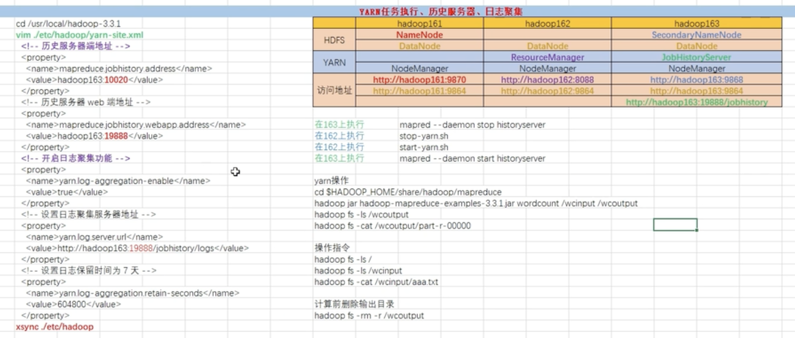
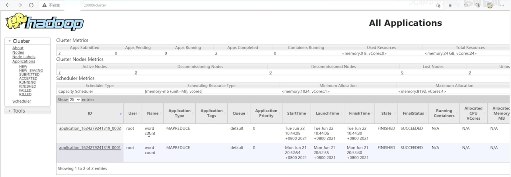
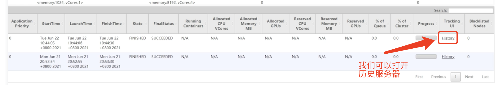
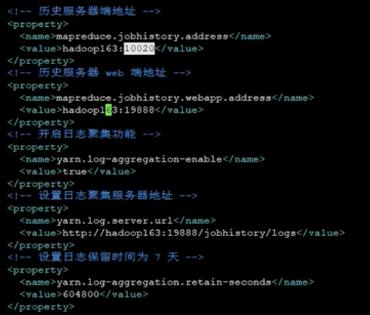
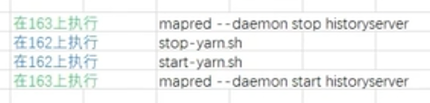
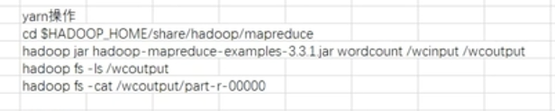
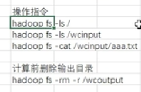
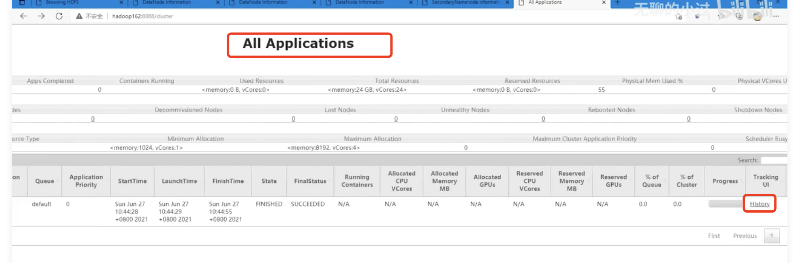

## hadoop的yarn任务执行、历史服务器、日志收集
  
  yarn的历史服务器

  我们已经启动了yarn的服务，如下所示：
 
  然后我们找到历史，然后尝试打开我们的历史服务器：
 
  刚开始历史服务器会出现404，因为我么的历史服务器是没有打开的，

  我们在主节点161上修改配置文件，然后将配置文件同步到其他节点上去，yarn-site.xml文件中添加如下信息：（打开历史服务）
 
  我们把历史服务器部署在163机器上，对应的端口是:19888；10020是历史服务与yarn进行通信的地址。
  开启日志聚集功能之后，其下的两个配置文件才会生效。 
  前面：历史服务器的2个配置是1组；后面设置日志的3个服务器是1组。
  
   
  然后我们执行如下操作:
   我们需要启动历史服务器，在执行启动历史服务器之前，我们需要在162的yarn所在的服务器上先停止关闭调yarn（因为我们修改了yarn-site.xml配置文件）
  
  然后我们在163的历史节点服务器上执行启动操作，操作执行之后，我们可以看到我们的jps的进程：
  
  
  重启之后我们发现我们的yarn上没有记录了，这个时候我们需要运行yarn程序，然后才会出现1条数据。
  然后我们在161的主节点上执行操作：
     
  然后我们通过如下命令查看文件信息：  
     
  然后我们可以看到我们的yarn上面已经有历史服务器相关的日志文件
     
   
  
   
   
  
  
  
