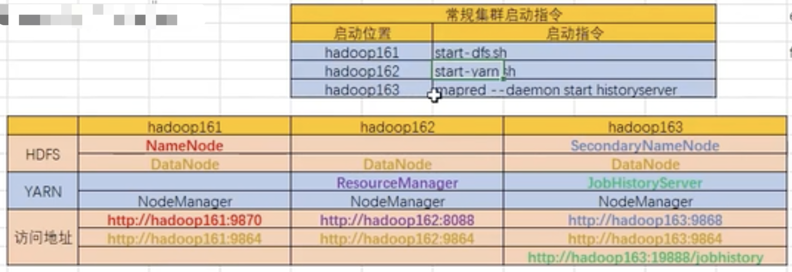
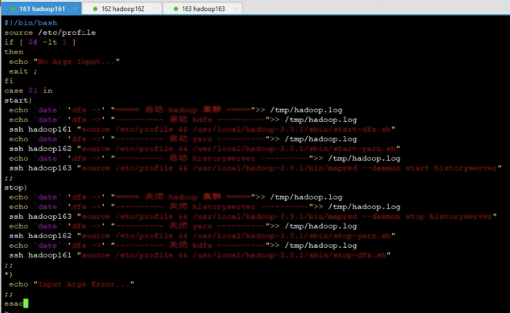
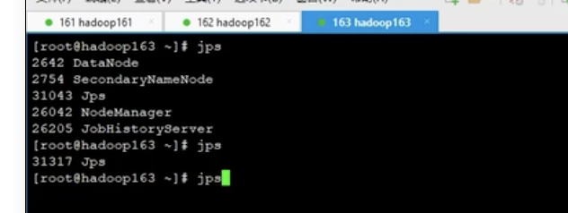
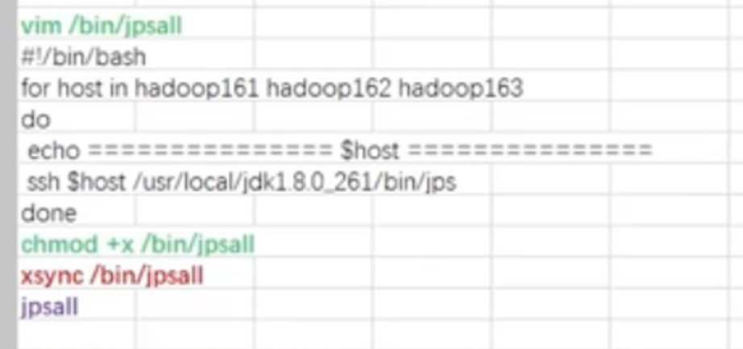
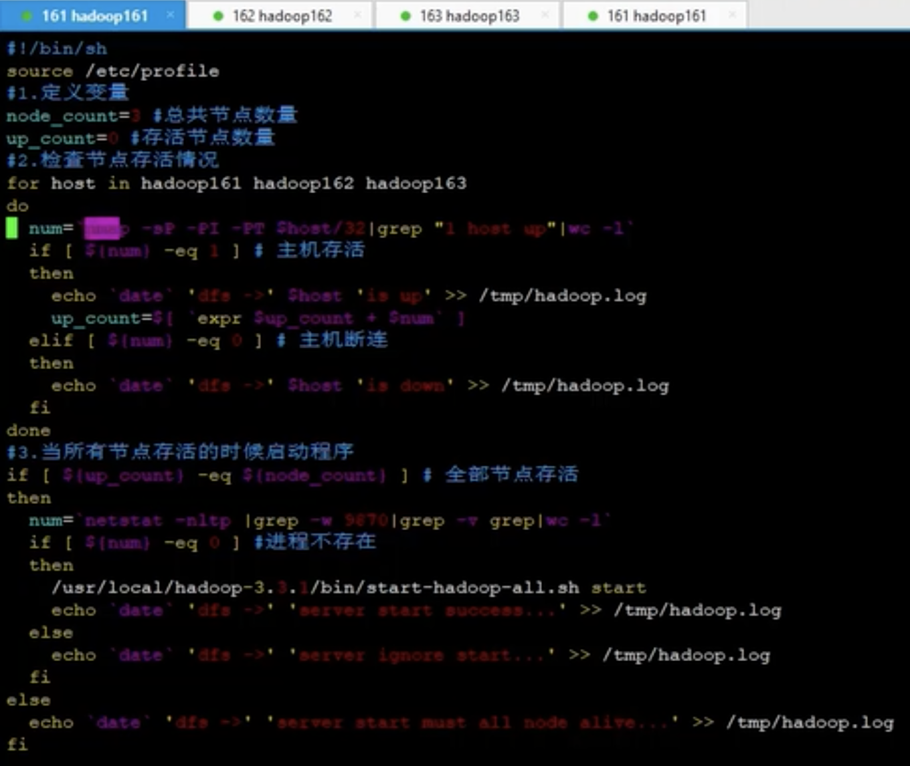
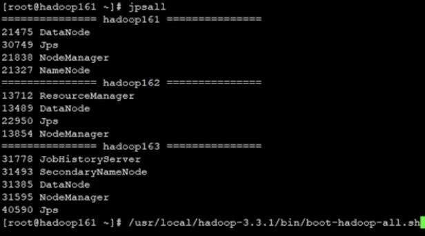
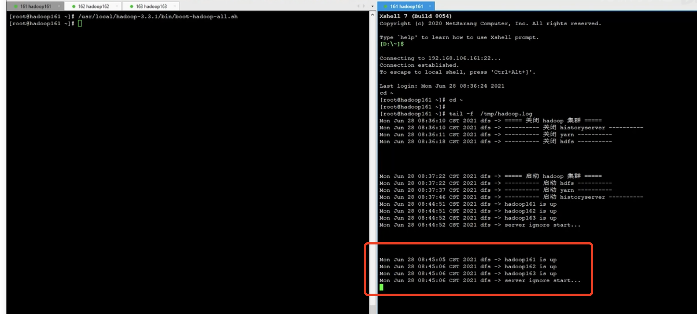

## hadoop-集群启动脚本
   
  我们从如上图可以知道，我们的hadoop集群有3个节点；情况如上图下面第二个图，描述如下:
    1. 第一个节点hadoop161上有:hdfs。
    2. 第二个节点hadoop162上有:yarn。
    3. 第三个节点hadoop163上有:history-server。  
   
   对应的启动脚本如上图所示的第一个小图。
   1. hdfs的启动脚本：start-dfs.sh
   2. yarn的启动脚本：start-yarn.sh
   3. history-server的启动脚本: mapred --daemon start historyserver。

#### 1. hadoop启动脚本
   但是这样一个一个启动比较麻烦，有没有一种方式：可以让这些脚本自动启动呢？  
   步骤如下:
     
   1. 我们在第一台机器:161上制作一个启动脚本文件：start-hadoop-all.sh文件；内容如下：
     
   
   2. 然后授权:chmod +x /usr/local/hadoop-3.3.1/bin/start-hadoop-all.sh。  
   3. 然后将脚本分发到其他节点:xsync /usr/local/hadoop-3.3.1/bin/start-hadoop-all.sh。
   4. 然后我们启动/停止服务
   start-hadoop-all.sh start
   start-hadoop-all.sh  stop
   
   我们启动完之后，需要去每一个节点查看进程jps -l如下:
     

#### 2.hadoop节点查看所有进程
   所以我们需要编写一个脚本，让他在一个节点上就可以看到所有jps的进程。如下:vim /bin/jpsall
      
   然后我们输入jpsall，就可以看到其他节点的脚本运行情况。
    
#### 3.开机重启脚本
      
   如上，我们首先编辑：boot-hadoop-all.sh脚本。然后编辑脚本，如下：
     
   我们的hadoop在开机重启之后，所有的服务可能就已经挂了，所以我们需要编写开机重启的脚本。 
   指定脚本: 
      
     
   其中9870是namenode节点，我们需要先判断我们的namenode是否存活？
   编辑完毕之后，我们通过：
   ```renderscript
    chmod +x /usr/local/hadoop-3.3.1/bin/boot-hadoop-all.sh 
   ```
   来设置我们启动脚本权限；
   然后将脚本发送到其他机器节点：
   ```renderscript
     xsync /usr/local/hadoop-3.3.1/bin/boot-hadoop-all.sh 
   ```
   将脚本下发到其他节点之上。
   然后我们运行下我们的脚本，看下实际情况。
   首先我们查看下进程的情况：
      
   
   发现我们的节点都已经启动了，这个时候我们再次运行启动脚本：
   ```renderscript
    /usr/local/hadoop-3.3.1/bin/boot-hadoop-all.sh 
   ```
   
   发现我们的节点是已经启动着的，所以我们发现其对应的日志如下所示:  
     
   
   
   
   
#### 4.将我们的启动脚本添加到我们的linux定时器
   将我们的启动脚本添加到我们的linux定时器，可以定时去查看我们的脚本运行的情况，如下图所示：
       
   
   
   
    
   
   
   
