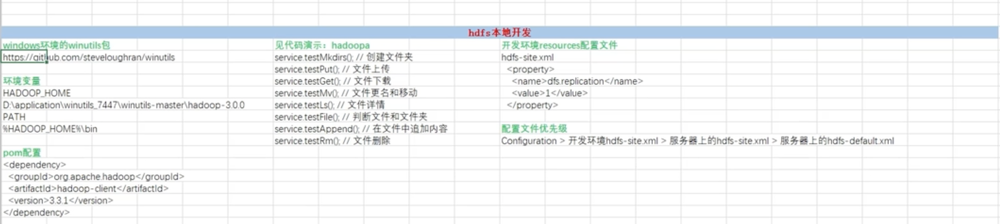
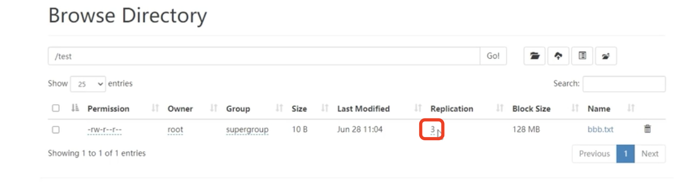
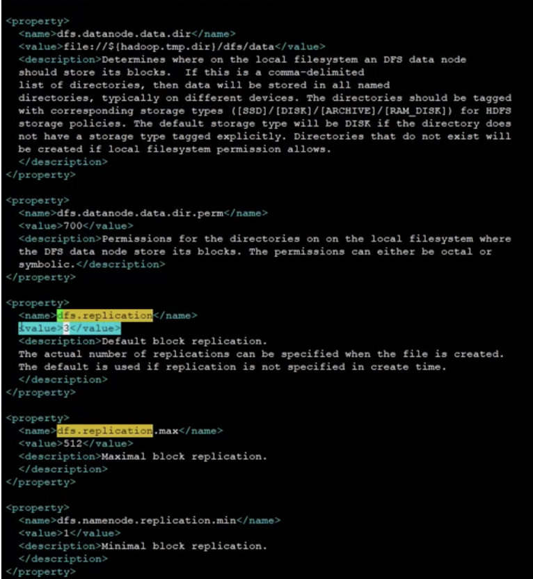
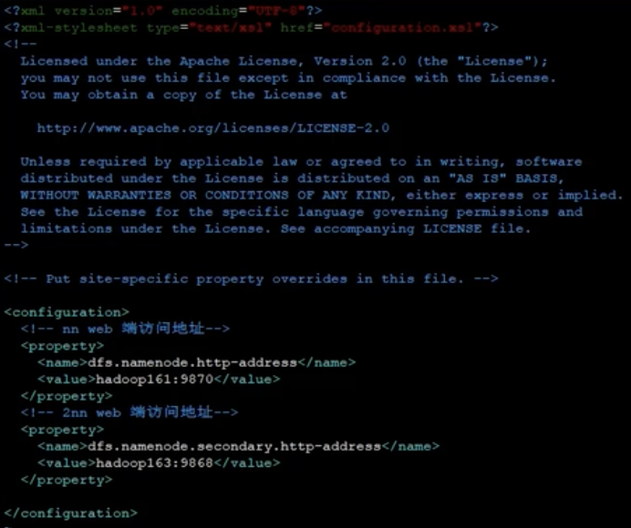
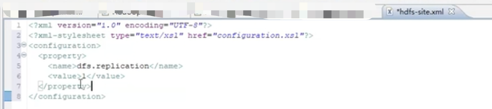
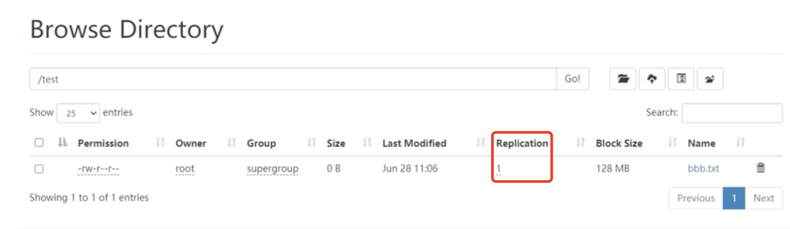

## hadoop-hdfs本地api  
   主要内容如下:  
       
   
### 1.window下下载winutils
   window下下载winutils，由于我们使用的hadoop是3.3.1；所以我们需要去github上下载对应的window下的
工具包,地址:
   ```renderscript
   https://github.com/steveloughran/winutils/tree/master/hadoop-3.0.0/bin
   ```

### 2.配置环境变量
  在window下，我们配置HADOOP_HOME,然后配置PATH。  

### 3.开发

#### 3.1 引入依赖  
  在我们的maven项目的pom.xml文件中引入如下依赖:
  ```renderscript
   <dependency>
       <groupId>org.apache.hadoop</groupId>
       <artifactId>hadoop-client</artifactId>
       <version>3.3.1</version>
   </dependency>
  ```

#### 3.2 配置类
  配置注入bean

```renderscript
@Configuration
public class FileSystemConfig {

    private FileSystem fs;

    @Bean
    public FileSystem fileSystem() throws Exception{
        URI uri = new URI("hdfs://hadoop161:8020");
        org.apache.hadoop.conf.Configuration configuration = new org.apache.hadoop.conf.Configuration();
        String user = "root";
        fs = FileSystem.get(uri, configuration, user);
        return fs;
    }

    // 当spring项目关闭前的时候，我们关闭掉fs
    @PreDestroy
    public void preDestroy() throws IOException{
        fs.close();
    }
}
```

#### 3.3 业务操作

  定义service:
  ```renderscript
  @Service
  public class HDFSService {
  
      @Autowired
      private FileSystem fs;
  
      /**
       * 创建文件夹
       * @throws Exception
       */
      public void mkdir() throws Exception{
          // 创建文件夹
        fs.mkdirs(new Path("/test"));
      }
  
      /**
       * 文件拷贝
       * @throws Exception
       */
      public void put() throws Exception{
          File tmpFile = new File(System.getProperty("java.io.tmpdir" + "bbb.txt"));
          FileUtil.writeUtf8String(RandomUtil.randomString(10), tmpFile);
          Path src = new Path(tmpFile.getPath());
          Path desc = new Path("/test");
          // 文件上传，并删除本地文件，覆盖服务器上的文件
          fs.copyFromLocalFile(true,true,src,desc);
      }
  
  }
  ```

  定义controller调用service，然后使用:我们直接在系统启动类中使用:
  ```renderscript
public class SystemApplication
{
    public static void main(String[] args) throws Exception
    {
        ConfigurableApplicationContext context = SpringApplication.run(SystemApplication.class, args);
        HDFSService hdfs = context.getBean(HDFSService.class);
        hdfs.mkdir();// 文件创建
        hdfs.put();// 文件拷贝
    }
}
  ```
  
  其他定义的方法类似。  
  
#### 3.4 hdfs本地开发的配置
   我们上传一个文件之后，我们发现我们的文件副本数是:3,如下所示:
     
   我们去查看下hdfs的默认配置文件，hdfs-default.xml.我们发现如下:
    
   其对应的配置副本数默认就是3。  
   
   然后我们去看下hdfs-site.xml的配置文件如下：
     
    发现其下的配置文件中并没有设置其对应的配置文件内容。  
    
   那如果我们想要改这个配置的话，我们要怎么样呢？我们可以在我们的开发环境下创建这个配置文件。  
   我们在我们的项目的resource文件下创建hdfs-site.xml文件，然后配置添加如下内容：
     
   
   我们的副本参数如上所示，设置的为1，我们再次运行我们的参数，发现其副本数变成了1:  
      
    说明我们本地的hdfs-site.xml文件是起作用的。
    
   如果我们再次把配置文件的副本数目设置为2：
   
   ```renderscript
    @Configuration
    public class FileSystemConfig {
    
        private FileSystem fs;
    
        @Bean
        public FileSystem fileSystem() throws Exception{
            URI uri = new URI("hdfs://hadoop161:8020");
            org.apache.hadoop.conf.Configuration configuration = new org.apache.hadoop.conf.Configuration();
            configuration.set("dfs.replication","2");
            String user = "root";
            fs = FileSystem.get(uri, configuration, user);
            return fs;
        }
    
        // 当spring项目关闭前的时候，我们关闭掉fs
        @PreDestroy
        public void preDestroy() throws IOException{
            fs.close();
        }
    }
   ```

   然后再次运行我们的程序，我们会发现:  
   创建文件的时候副本数目为2。
   
   配置文件优先级：
   Configuration > 开发环境hdfs-site.xml > 服务器上的hdfs-site.xml > 服务器上的hdfs-default.xml
     
  
   


   
   
   
   
    
   
   
   
